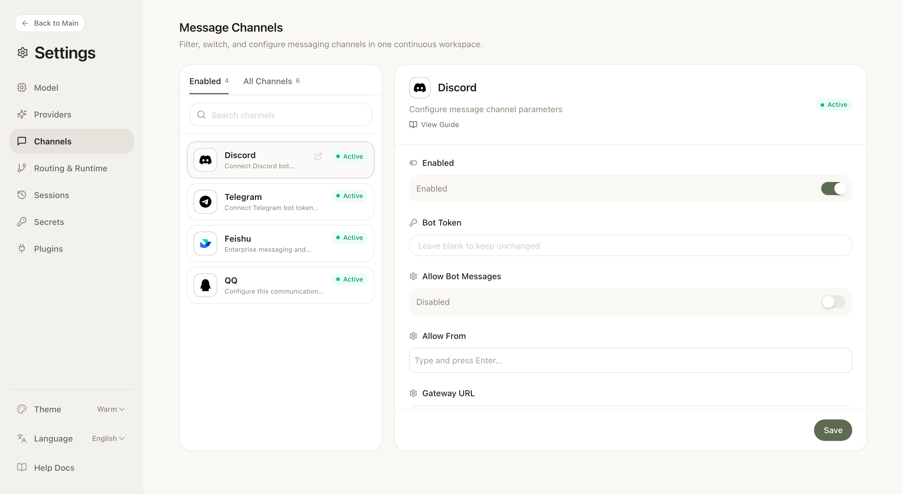

<div align="center">

# NextClaw

**UI-first, lightweight personal AI assistant.**

[](https://www.npmjs.com/package/nextclaw)
[](https://nodejs.org)
[](LICENSE)

[Why NextClaw?](#why-nextclaw) · [Quick Start](#-quick-start) · [Features](#-features) · [Screenshots](#-screenshots) · [Commands](#-commands) · [Channels](#-channels) · [Docs](docs/USAGE.md)

</div>

---

Inspired by [OpenClaw](https://github.com/openclaw/openclaw) & [nanobot](https://github.com/HKUDS/nanobot), **NextClaw** is a **lighter, UI-first** personal AI gateway: install once, run `nextclaw start`, then configure providers and channels in the browser. No onboarding wizard, no daemon setup — just one command and you're in.

**Best for:** quick trials, secondary machines, or anyone who wants multi-channel + multi-provider with low maintenance overhead.

### Why NextClaw?

| Advantage | Description |
|-----------|-------------|
| **Easier to use** | No complex CLI workflows — one command (`nextclaw start`), then configure everything in the built-in UI. |
| **Maintainable by design** | Keep runtime capabilities focused on built-ins, reducing hidden coupling and long-term maintenance cost. |
| **Lightweight** | Evolved from [nanobot](https://github.com/HKUDS/nanobot); minimal codebase, fast to run and maintain. |

---

## ✨ Features

| Feature | Description |
|---------|-------------|
| **One-command start** | `nextclaw start` — background gateway + config UI, no extra steps |
| **Built-in config UI** | Models, providers, and channels in one place; config in `~/.nextclaw/config.json` |
| **Multi-provider** | OpenRouter, OpenAI, MiniMax, Moonshot, Gemini, DeepSeek, DashScope, Zhipu, Groq, vLLM, and more (OpenAI-compatible) |
| **Multi-channel** | Telegram, Discord, WhatsApp, Feishu, DingTalk, Slack, Email, QQ, Mochat — enable and configure from the UI |
| **Automation** | Cron + Heartbeat for scheduled tasks |
| **Local tools** | Web search, command execution |

---

## 🚀 Quick Start

```bash
npm i -g nextclaw
nextclaw start
```

Open **http://127.0.0.1:18791** → set your provider (e.g. OpenRouter) and model in the UI. You're done.

NextClaw now binds UI on `0.0.0.0` by default for `start/restart/serve/ui/gateway` UI mode; startup logs print detected public URLs.

```bash
nextclaw stop   # stop the service
```

---

## 📸 Screenshots

**Config UI** — providers, models, and defaults in one screen:


**Message Channels** — enable and configure Discord, Feishu, QQ, and more:



---

## 🔌 Provider examples

<details>
<summary>OpenRouter (recommended)</summary>

```json
{
  "providers": { "openrouter": { "apiKey": "sk-or-v1-xxx" } },
  "agents": { "defaults": { "model": "minimax/MiniMax-M2.5" } }
}
```

</details>

<details>
<summary>MiniMax (Mainland China)</summary>

```json
{
  "providers": {
    "minimax": { "apiKey": "sk-api-xxx", "apiBase": "https://api.minimaxi.com/v1" }
  },
  "agents": { "defaults": { "model": "minimax/MiniMax-M2.5" } }
}
```

</details>

<details>
<summary>Local vLLM</summary>

```json
{
  "providers": {
    "vllm": { "apiKey": "dummy", "apiBase": "http://localhost:8000/v1" }
  },
  "agents": { "defaults": { "model": "meta-llama/Llama-3.1-8B-Instruct" } }
}
```

</details>

---

## 📋 Commands

| Command | Description |
|---------|-------------|
| `nextclaw start` | Start background service (gateway + UI, public by default) |
| `nextclaw restart` | Restart background service without manual stop/start |
| `nextclaw stop` | Stop background service |
| `nextclaw ui` | Start UI backend + gateway (foreground) |
| `nextclaw gateway` | Start gateway only (for channels) |
| `nextclaw agent -m "hello"` | Chat in CLI |
| `nextclaw status` | Show runtime process/health/config status (`--json`, `--verbose`, `--fix`) |
| `nextclaw update` | Self-update the CLI |
| `nextclaw channels status` | Show enabled channels |
| `nextclaw doctor` | Run runtime diagnostics (health, state coherence, port checks) |
| `nextclaw channels login` | QR login for supported channels |
| `nextclaw config get <path>` | Get config value by path (`--json` for structured output) |
| `nextclaw config set <path> <value>` | Set config value by path (`--json` to parse value as JSON) |
| `nextclaw config unset <path>` | Remove config value by path |

---

## 💬 Channels

| Channel | Setup |
|---------|-------|
| Telegram | Easy (bot token) |
| Discord | Easy (bot token + intents) |
| WhatsApp | Medium (QR login) |
| Feishu | Medium (app credentials) |
| Mochat | Medium (claw token + websocket) |
| DingTalk | Medium (app credentials) |
| Slack | Medium (bot + app tokens) |
| Email | Medium (IMAP/SMTP) |
| QQ | Easy (app credentials) |

---

## 📚 Docs

- [Configuration, providers, channels, cron](docs/USAGE.md)
- [RFC: Action Schema v1](docs/rfcs/action-schema-v1.md)
- [Code volume monitoring workflow](docs/workflows/code-volume-monitoring.md)

---

<div align="center">

[](https://star-history.com/#Peiiii/nextclaw&Date)

**License** [MIT](LICENSE)

</div>
