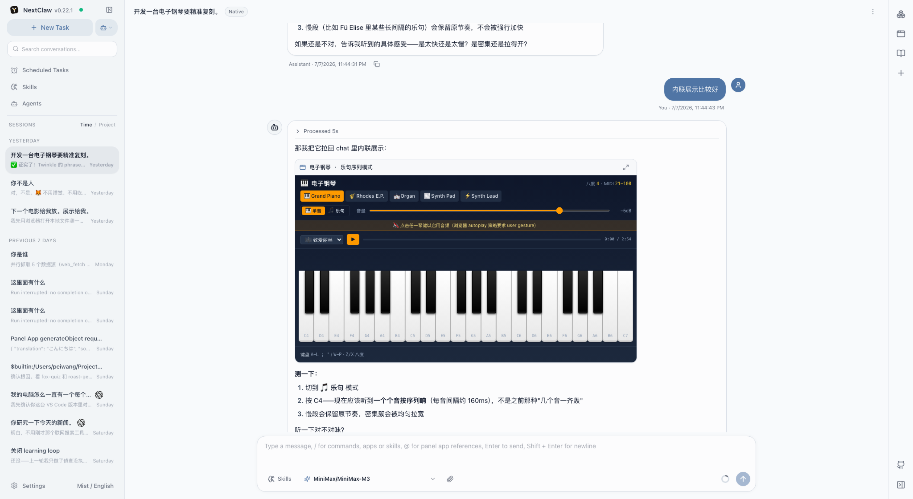
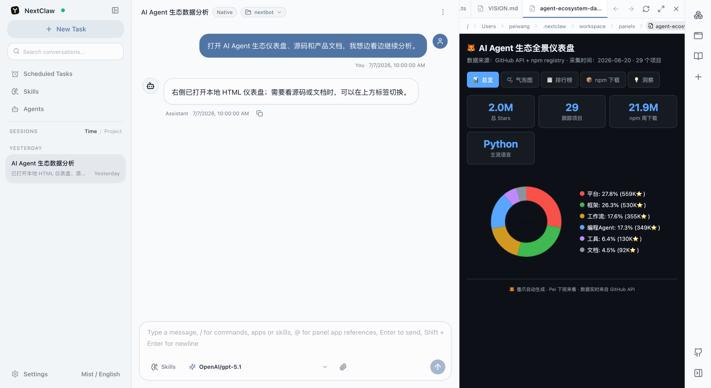
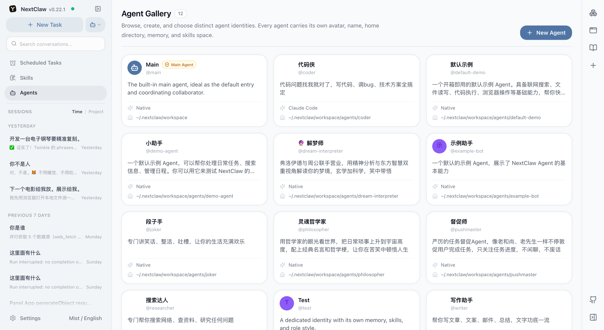
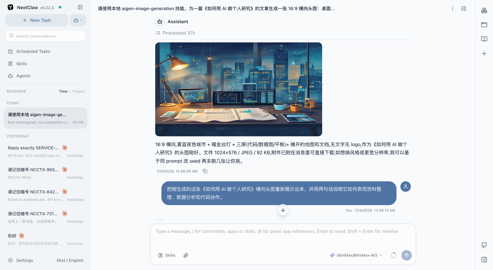
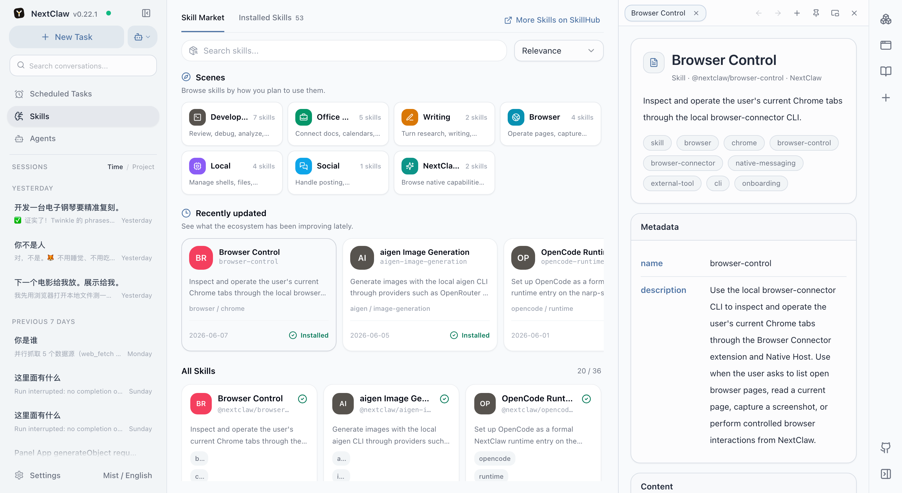
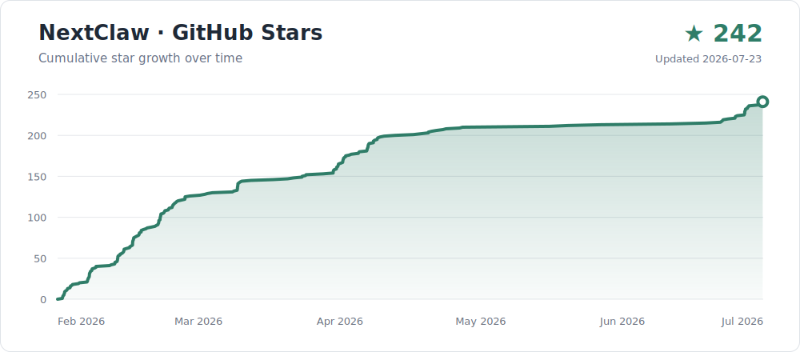

<p align="right">
  <a href="./README.zh-CN.md">简体中文</a>
</p>

<div align="center">

# NextClaw

**Get real work done with AI on the computer you control.**

Tell NextClaw what you want done. It brings files, models, agents, skills, browser tools, local apps, automations, and messaging channels into one task, then keeps working toward a usable result.

[](https://www.npmjs.com/package/nextclaw)
[](https://github.com/Peiiii/nextclaw/releases)
[](LICENSE)
[](https://nodejs.org/)
[](https://discord.gg/j4Skbgye)

[Website](https://nextclaw.io/en/) · [Download](https://nextclaw.io/en/download/) · [Install](https://nextclaw.io/en/install/) · [Documentation](https://docs.nextclaw.io/en/) · [Releases](https://github.com/Peiiii/nextclaw/releases)

<p>
  
  
  
  
  
</p>

</div>



NextClaw is a local-first AI workspace for tasks that need more than a single answer. A conversation can keep its files, references, tools, generated results, and follow-up work together instead of making you restart in separate apps.

## What You Can Do

- **Research and compare** — collect pages, notes, and references, then turn them into a brief, source list, or comparison table.
- **Analyze and visualize data** — gather data from websites, CSV files, or spreadsheets, clean it, draw charts, and write the conclusion.
- **Draft useful documents** — shape source material and rough notes into reports, articles, proposals, release notes, or weekly updates.
- **Process local files** — inspect, rename, extract, classify, and summarize documents without losing the task context.
- **Build small tools for yourself** — turn a repeated job into a script, local app, dashboard, or reusable workflow.
- **Keep recurring work moving** — receive requests from chat apps, run scheduled briefs or checks, and send results back to the right channel.

[Explore more use cases](https://nextclaw.io/en/use-cases/)

## Install NextClaw

### Desktop App

The desktop app is the easiest way to start on macOS, Windows, or Linux.

[Download the latest stable desktop release](https://nextclaw.io/en/download/)

### npm

Install Node.js LTS first, then run:

```bash
npm install -g nextclaw
nextclaw start
```

Open [http://127.0.0.1:55667](http://127.0.0.1:55667), choose a model provider, and start a task.

If `npm` is unavailable, install or reinstall Node.js LTS and reopen the terminal. On a remote host, port `55667` serves plain HTTP. Use it directly only for a quick check; terminate HTTPS with Nginx or Caddy for regular access.

```bash
nextclaw stop
```

### Docker

For a long-running server or cloud VM deployment:

```bash
curl -fsSL https://nextclaw.io/install-docker.sh | bash
```

See the [Docker deployment guide](https://docs.nextclaw.io/en/guide/tutorials/docker-one-click) for reverse proxy, domain, and remote access setup. You can compare every supported path on the [install options page](https://nextclaw.io/en/install/).

## Product Tour

### Keep files, source, and HTML beside the task

Open local HTML, code, Markdown, and project files in the right-side workspace while the conversation remains available.



### Give different agents their own working context

Create agents with separate roles, memory, skills, runtimes, and workspaces, then start the right one from the same interface.



### Generate an image and keep the local file

Create visuals for articles, product drafts, or source material, then continue using the result in the same task.



### Add skills and keep references open

Browse and install skills from the workspace. Skill details, docs, and other references can stay open in the global side browser while you work.



## Models, Channels, and Tools

- **Models** — OpenRouter, OpenAI, Anthropic, Gemini, DeepSeek, MiniMax, Moonshot, DashScope, Zhipu, AiHubMix, vLLM, and custom OpenAI-compatible endpoints.
- **Messaging channels** — Weixin, Feishu/Lark, QQ, DingTalk, WeCom, Telegram, Discord, Slack, WhatsApp, and email.
- **Capabilities** — skills, MCP servers, CLI tools, browser control, local files, Panel Apps, and scheduled tasks.
- **Local control** — configuration, conversations, and credentials stay in the environment you control. Connected providers and channels receive the data you send through them.

[See all integrations](https://nextclaw.io/en/integrations/)

## Develop From Source

From the repository root:

```bash
pnpm install
pnpm dev start
```

The development stack prints its local URLs in the terminal and uses `~/.nextclaw` by default. Set `NEXTCLAW_HOME=/path/to/home` to use an isolated data directory.

To run only one side:

```bash
pnpm dev:backend
pnpm dev:frontend
```

See the [developer command reference](docs/workflows/developer-commands.md) for local source-runtime checks, the manual runtime-update harness, platform stacks, Docker, and validation commands.

To refresh the repository and website screenshot set:

```bash
pnpm run screenshots:refresh
```

## Documentation

- [Getting Started](https://docs.nextclaw.io/en/guide/getting-started)
- [Configuration](https://docs.nextclaw.io/en/guide/configuration)
- [Model Selection](https://docs.nextclaw.io/en/guide/model-selection)
- [Commands](https://docs.nextclaw.io/en/guide/commands)
- [Feishu Setup](https://docs.nextclaw.io/en/guide/tutorials/feishu)
- [Vision](https://docs.nextclaw.io/en/guide/vision)
- [Roadmap](https://docs.nextclaw.io/en/guide/roadmap)
- [Product Updates](https://nextclaw.io/en/releases/)

Repository planning: [Roadmap](docs/ROADMAP.md) · [TODO](docs/TODO.md)

## Community

- [Discord](https://discord.gg/j4Skbgye)
- [GitHub Issues](https://github.com/Peiiii/nextclaw/issues)
- WeChat group: scan the QR code below.


## Contributing

Contributions are welcome. Open an issue to discuss a bug or proposal, or submit a pull request with a focused change and its relevant verification.

## Acknowledgements

NextClaw was inspired by these projects:

- [OpenClaw](https://github.com/openclaw/openclaw) — inspired NextClaw's early exploration of a full-stack AI assistant.
- [NanoBot](https://github.com/nicepkg/gpt-runner) — demonstrated how a small agent framework can remain useful and extensible.

## License

[MIT](LICENSE)

---

<div align="center">

[](https://github.com/Peiiii/nextclaw/stargazers)

</div>
