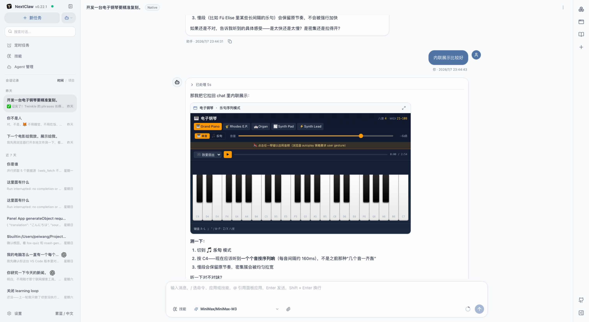
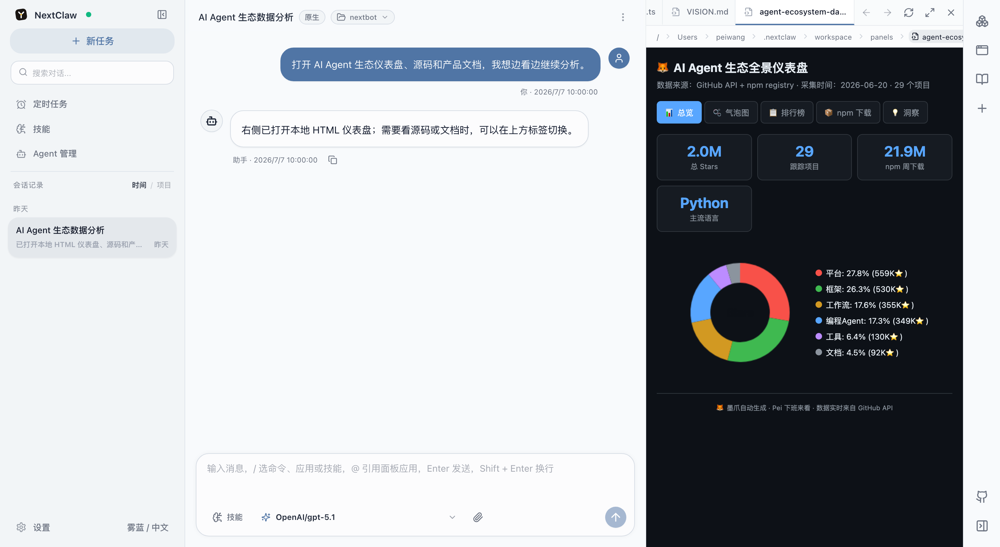
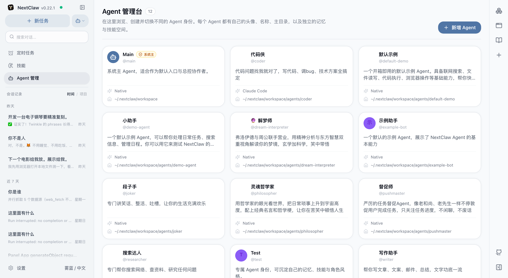
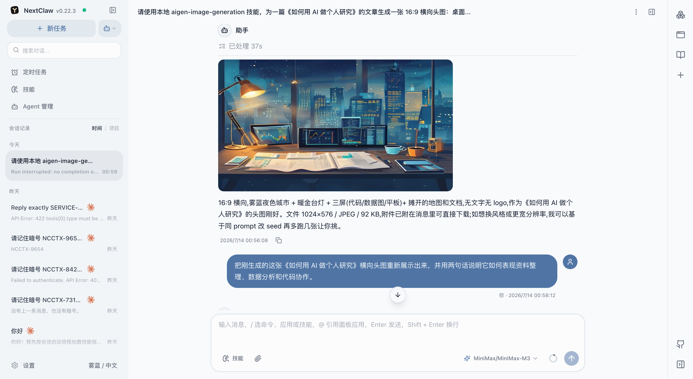
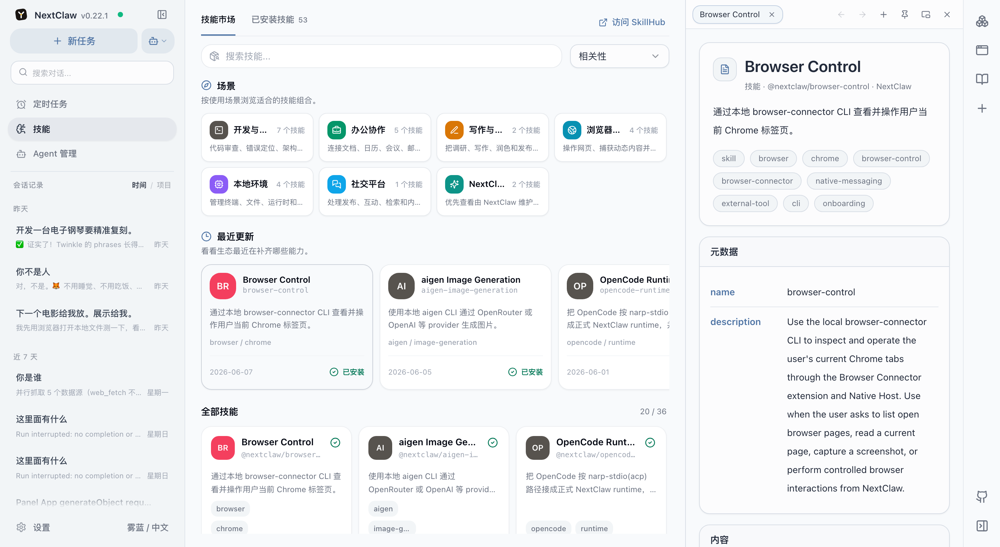
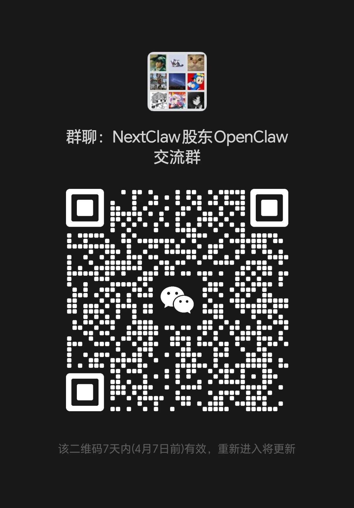

<p align="right">
  <a href="./README.md">English</a>
</p>

<div align="center">

# NextClaw

**让 AI 在你自己的电脑上，真正把事情做完。**

说出你要做什么。NextClaw 会把资料、模型、Agent、技能、浏览器、本机应用、自动化和聊天入口放进同一个任务里，一路推进到可用结果。

[](https://www.npmjs.com/package/nextclaw)
[](https://github.com/Peiiii/nextclaw/releases)
[](LICENSE)
[](https://nodejs.org/)
[](https://discord.gg/j4Skbgye)

[官网](https://nextclaw.io/zh/) · [下载](https://nextclaw.io/zh/download/) · [安装方式](https://nextclaw.io/zh/install/) · [文档](https://docs.nextclaw.io/zh/) · [版本发布](https://github.com/Peiiii/nextclaw/releases)

<p>
  
  
  
  
  
</p>

</div>



NextClaw 是一个本地优先的 AI 工作台，适合处理那些不只是“问一句、答一句”的任务。对话、资料、工具、生成结果和后续操作可以留在一起，不用每换一个软件就重新开始。

## 可以用它做什么

- **调研和对比** — 收集网页、笔记和参考资料，整理成简报、来源列表或对比表。
- **数据分析和可视化** — 从网页、CSV 或表格里整理数据，清洗、统计、画图，再写出结论。
- **写文章和报告** — 把资料、旧文档和零散想法组织成周报、文章、提案、发布说明或可继续修改的初稿。
- **处理本地文件** — 查看、重命名、抽取、归类和总结文档，处理过程和结果仍留在当前任务里。
- **给自己做小工具** — 把重复工作做成脚本、本地应用、仪表盘或可复用的工作流。
- **让日常任务持续运行** — 从聊天工具接收请求，定时生成简报或巡检结果，再发回指定渠道。

[查看更多使用场景](https://nextclaw.io/zh/use-cases/)

## 安装 NextClaw

### 桌面版

普通用户建议直接下载桌面版，支持 macOS、Windows 和 Linux。

[下载最新稳定版](https://nextclaw.io/zh/download/)

### npm

先安装 Node.js LTS，然后执行：

```bash
npm install -g nextclaw
nextclaw start
```

打开 [http://127.0.0.1:55667](http://127.0.0.1:55667)，选择模型提供商后即可开始任务。

如果系统找不到 `npm`，请安装或重新安装 Node.js LTS，再重开终端。远程主机的 `55667` 端口提供纯 HTTP 服务，只适合临时验证；日常访问请用 Nginx 或 Caddy 终止 HTTPS。

```bash
nextclaw stop
```

### Docker

需要在服务器或云主机上长期运行时，可以使用：

```bash
curl -fsSL https://nextclaw.io/install-docker.sh | bash
```

反向代理、域名和远程访问设置请查看 [Docker 部署文档](https://docs.nextclaw.io/zh/guide/tutorials/docker-one-click)。所有支持的方式都可以在[安装方式页面](https://nextclaw.io/zh/install/)中对比。

## 界面与能力

### 文件、源码和 HTML 可以放在任务旁边

本地 HTML、代码、Markdown 和项目文件可以在右侧工作区打开，对话仍然留在当前页面。



### 不同 Agent 可以有自己的工作上下文

为不同 Agent 设置角色、记忆、技能、运行时和主目录，再从同一个界面启动适合当前任务的协作者。



### 生成图片后直接得到本地文件

生成文章配图、产品草稿或视觉素材后，可以在同一个任务里继续整理和使用结果。



### 安装技能时，资料也可以一直放在旁边

从工作台浏览和安装技能。技能详情、文档和参考资料可以留在全局右侧浏览器里，边看边继续操作。



## 模型、渠道与工具

- **模型** — OpenRouter、OpenAI、Anthropic、Gemini、DeepSeek、MiniMax、Moonshot、通义千问、智谱、AiHubMix、vLLM，以及自定义 OpenAI 兼容接口。
- **聊天渠道** — 微信、飞书/Lark、QQ、钉钉、企业微信、Telegram、Discord、Slack、WhatsApp 和邮箱。
- **可扩展能力** — 技能、MCP、CLI 工具、浏览器操作、本地文件、面板应用和定时任务。
- **本地可控** — 配置、会话和密钥保存在你控制的环境中。接入的模型和渠道会收到你通过它们发送的数据。

[查看完整集成能力](https://nextclaw.io/zh/integrations/)

## 从源码运行

在仓库根目录执行：

```bash
pnpm install
pnpm dev start
```

开发环境会在终端打印本地地址，默认使用 `~/.nextclaw`。如需使用隔离的数据目录，可设置 `NEXTCLAW_HOME=/path/to/home`。

只启动其中一端：

```bash
pnpm dev:backend
pnpm dev:frontend
```

刷新 GitHub 与官网使用的产品截图：

```bash
pnpm run screenshots:refresh
```

## 文档

- [快速开始](https://docs.nextclaw.io/zh/guide/getting-started)
- [配置说明](https://docs.nextclaw.io/zh/guide/configuration)
- [模型选择](https://docs.nextclaw.io/zh/guide/model-selection)
- [命令参考](https://docs.nextclaw.io/zh/guide/commands)
- [飞书接入](https://docs.nextclaw.io/zh/guide/tutorials/feishu)
- [产品愿景](https://docs.nextclaw.io/zh/guide/vision)
- [路线图](https://docs.nextclaw.io/zh/guide/roadmap)
- [版本更新](https://nextclaw.io/zh/releases/)

仓库内规划：[Roadmap](docs/ROADMAP.md) · [TODO](docs/TODO.md)

## 社群

- **微信群** — 扫描下方二维码。
- **Discord** — [NextClaw / OpenClaw](https://discord.gg/j4Skbgye)
- **问题反馈** — [GitHub Issues](https://github.com/Peiiii/nextclaw/issues)



## 参与贡献

欢迎参与贡献。你可以先通过 Issue 讨论问题或提案，也可以提交范围清晰、包含相关验证的 Pull Request。

## 致谢

NextClaw 的早期探索受到这些项目启发：

- [OpenClaw](https://github.com/openclaw/openclaw) — 启发了 NextClaw 对全栈 AI 助手的早期探索。
- [NanoBot](https://github.com/nicepkg/gpt-runner) — 展示了小型 Agent 框架也可以保持实用和可扩展。

## 许可证

[MIT](LICENSE)

---

<div align="center">

[](https://star-history.com/#Peiiii/nextclaw&Date)

</div>
