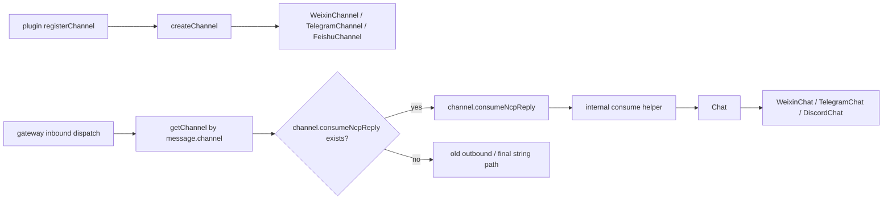

# Channel `consumeNcpReply` Midstate Design

相关文档：

- [Directed NCP Event Channel Protocol Design](./2026-04-16-directed-ncp-event-channel-protocol-design.md)
- [Interaction Transport Simplification Plan](../plans/2026-04-15-channel-reply-runtime-simplification-plan.md)

若上述文档与本文冲突，以本文为准。本文记录的是本轮讨论后收敛出的**更简洁的中态方案**。

## 实现更新

同批次后续实现里，这份中态又进一步收紧了一步：

- `Channel.consumeNcpReply(...)` 这个接缝保持不变
- 共享层输入类型收敛为 `NcpReplyInput`
- 共享层公开形态从 `consumeNcpReply(...)` helper 进一步收敛为 `NcpReplyConsumer` class
- `Channel` 初始化时可以持有一个长期存活的 `NcpReplyConsumer`
- 每次 `consume` 时，由 `NcpReplyConsumer` 内部创建一个 reply session state owner 来维护文本块、flush 和 final-tail 逻辑

也就是说，这份文档描述的总体协议方向仍然成立，但下面若出现 `ConsumeNcpReplyInput` / `consumeNcpReply(...)` 这类较早的中态写法，应以当前代码里的 `NcpReplyInput` / `NcpReplyConsumer` 为准。

## 背景

前一轮讨论虽然已经把方向收敛到：

- `NcpEventStream` 是 reply 主链唯一上游真相源
- 平台负责定向路由
- channel 插件直接消费属于自己的那条回复事件流

但在进一步看代码和命名后，发现还有两个明显问题：

1. 顶层抽象仍然太多，读代码时看不到“最本质的几个对象”
2. 中态如果再引入新的注册机制，很容易把新链和旧链重新耦合在一起

尤其是下面这些东西，在顶层出现后会让结构显得绕：

- `registerReplyConsumer(...)`
- `registerMessageChannel(...)`
- `orchestrator`
- `translator`
- `resolver`
- `MessageChannelEndpoint`

这些名字并不直接对应插件作者的真实心智模型，也不符合“大道至简”的目标。

本轮进一步收敛后的判断是：

**中态不再引入新的插件注册协议。**
**继续复用现有 `registerChannel(...) -> createChannel(...) -> Channel instance` 生命周期。**
**新链只通过给现有 `Channel` 实例增加一个可选的 `consumeNcpReply(...)` 能力来接入。**

## 最终结论

### 1. 插件注册入口保持不变

插件仍然只注册 channel：

```ts
register(api) {
  api.registerChannel({
    plugin: {
      id: "weixin",
      nextclaw: {
        createChannel: (ctx) => new WeixinChannel(...),
      },
    },
  });
}
```

不新增：

- `registerReplyConsumer(...)`
- `registerMessageChannel(...)`
- `registerChannelRuntime(...)`

### 2. 新链能力挂在现有 `Channel` 实例上

平台拿到 channel instance 后，如果它实现了：

```ts
consumeNcpReply(...)
```

则本次 reply 走新链；否则继续走旧链。

也就是说：

- 旧插件完全不需要改
- 新插件不需要注册第二个对象
- 新旧链可以在迁移期并存
- 但插件注册协议本身不分叉

### 3. 顶层公开模型只保留极少数对象

本轮推荐的顶层公开模型只有：

- `Channel`
- `NcpReplyConsumer`
- `Chat`
- `ChatTarget`

其中：

- `Channel` 是现有插件生命周期里的对象
- `NcpReplyConsumer` 是 `Channel` 内部长期持有的 reply 消费对象
- `Chat` 是 `Channel` 内部用于“把消息发到聊天世界”的通用抽象
- `ChatTarget` 是“这次回复要发到哪里”的目标对象

### 4. `Chat` 是内部核心抽象，不再叫 `MessageChannel`

这里不再使用 `MessageChannelEndpoint` 这类命名。

原因：

- `Endpoint` 太像 SDK / class / infra 对象，不直观
- `MessageChannel` 很容易和现有 `Channel` 插件抽象混淆
- 我们当前要解决的是微信、Telegram、Discord、飞书这类聊天式通信面，`Chat` 更自然

因此，本轮推荐：

- 用 `Chat` 表示“一个可发送回复的聊天世界适配器”
- 用 `ChatTarget` 表示“本次回复的目标位置”

## 中态总模型



这个模型里：

- 现有插件生命周期完全保留
- 新链只是 channel instance 的一项可选能力
- `Chat` 是 channel 内部组合出来的发送抽象
- 共享层不再要求插件注册第二套对象

## 顶层协议草案

### `ChatTarget`

`ChatTarget` 表达的是“这次回复要回到哪个聊天位置”。

```ts
export type ChatTarget = {
  conversationId: string;
  participantId: string;
  messageId?: string;
  threadId?: string;
  accountId?: string;
  metadata?: Record<string, unknown>;
};
```

字段语义：

- `conversationId`：外部聊天会话 ID，例如用户、群、线程、issue comment thread
- `participantId`：触发输入的人或实体
- `messageId`：可选的上游消息 ID，用于需要 reply-to / 去重 / 平台侧关联的渠道
- `threadId`：可选的 topic / thread / reply-to 上下文
- `accountId`：可选账号标识
- `metadata`：只放 channel 私有但必要的最小上下文

这里刻意不再携带：

- `channelType`
- `channelInstanceId`

因为在中态下，平台已经通过 `getChannel(message.channel)` 拿到了正确的 channel instance，`channel` 身份已经由外层路由解决；`ChatTarget` 只保留真正和“发到哪里”有关的局部目标信息。

### `NcpReplyInput`

```ts
export type NcpReplyInput = {
  target: ChatTarget;
  eventStream: AsyncIterable<NcpEndpointEvent>;
};
```

### `Channel.consumeNcpReply(...)`

```ts
class SomeChannel extends BaseChannel<Record<string, unknown>> {
  consumeNcpReply(input: ConsumeNcpReplyInput): Promise<void>;
}
```

协议层只要求一件事：

- 现有 `Channel` instance 可以选择实现 `consumeNcpReply(...)`

平台侧继续做 duck typing：

```ts
typeof channel.consumeNcpReply === "function"
```

### `Chat`

`Chat` 是共享 reply 消费逻辑最核心的内部抽象。

```ts
export interface Chat {
  startTyping(target: ChatTarget): Promise<void>;
  sendBlock(
    target: ChatTarget,
    blockId: string,
    text: string,
  ): Promise<void>;
  sendFinal(target: ChatTarget, text: string): Promise<void>;
  sendError(target: ChatTarget, message: string): Promise<void>;
  stopTyping(target: ChatTarget): Promise<void>;
}
```

这里的设计意图非常简单：

- `Channel` 负责“作为插件生命周期对象存在”
- `Chat` 负责“作为聊天发送抽象存在”

这样同一个 channel class 内可以继续保留：

- 登录
- 启动
- 入站轮询
- 旧链发送

但 reply 新链的内部发送逻辑，可以组合给一个更纯粹的 `Chat` 对象。

## 共享实现建议

### 不公开一堆顶层 service 名字

本轮明确拒绝把下面这些名字做成顶层公共协议的一部分：

- `orchestrator`
- `translator`
- `delivery service`
- `port resolver`

这些东西如果需要存在，也只能作为 `consumeNcpReply(...)` 内部的 helper，不应进入插件作者的主要心智模型。

### 共享层只提供一个核心 consumer

共享层最应该公开的对象就一个：

```ts
export class NcpReplyConsumer {
  constructor(chat: Chat);

  consume(input: NcpReplyInput): Promise<void>;
}
```

它的职责是：

- 消费 `NcpEventStream`
- 维护最小 reply 状态
- 在 `text-end` / `reasoning-start` / `tool-call-start` / `completed` 等时机 flush
- 调用 `chat.startTyping / sendBlock / sendFinal / sendError / stopTyping`
- `message.completed` 只补发尚未输出的最终尾巴，不把已发送 block 整条重发

它内部可以继续使用：

- flush state helper
- block aggregation helper
- final dedupe helper
- typing lifecycle helper

但这些都只是实现细节，不必抬成顶层契约。

## 插件与运行时中态设计

### 插件侧保持不变

插件仍然只返回一个 `Channel`。

```ts
register(api) {
  api.registerChannel({
    plugin: {
      id: "weixin",
      nextclaw: {
        createChannel: ({ config, bus }) =>
          new WeixinChannel(
            readWeixinPluginConfigFromConfig(config, pluginId),
            bus,
          ),
      },
    },
  });
}
```

### `Channel` 侧新增可选能力

```ts
class WeixinChannel extends BaseChannel<Record<string, unknown>> {
  private readonly chat: WeixinChat;
  private readonly replyConsumer: NcpReplyConsumer;

  constructor(config: Record<string, unknown>, bus: MessageBus) {
    super(config, bus);
    this.chat = new WeixinChat(...);
    this.replyConsumer = new NcpReplyConsumer(this.chat);
  }

  consumeNcpReply = async (
    input: NcpReplyInput,
  ): Promise<void> => {
    await this.replyConsumer.consume(input);
  };
}
```

这里的重点是：

- 不是新注册一个 `WeixinMessageChannel`
- 不是再给插件系统新增一套注册协议
- 就是在现有 `WeixinChannel` 上增加一个可选方法
- 具体聊天发送细节则内聚给 `WeixinChat`

### 平台侧中态判断

平台运行时只做很小的变化：

```ts
const channel = getChannels().getChannel(message.channel);

if (channel && typeof channel.consumeNcpReply === "function") {
  await channel.consumeNcpReply({
    target,
    eventStream,
  });
  return;
}

// fallback to old path
```

也就是说：

- 不需要新的 registry
- 不需要新的 route table
- 不需要新的 plugin lifecycle
- 只是在已有 `Channel` instance 上探测一项能力

## 代码组织建议

为了让中态代码结构也尽量接近这个心智模型，建议把文件收敛为下面几类：

### 共享层

- `chat.types.ts`
- `consume-ncp-reply.ts`

可选的内部工具文件：

- `consume-ncp-reply-state.ts`
- `consume-ncp-reply-blocks.ts`

但这些应保持为实现细节文件，不应在对外文档里被强调成顶层架构角色。

### 渠道层

- `weixin-channel.ts`
- `weixin-chat.ts`

类似地，Telegram、Discord、飞书都可以各自有：

- `telegram-channel.ts`
- `telegram-chat.ts`

这样一眼就能看出：

- `Channel` 是插件生命周期对象
- `Chat` 是聊天发送抽象

## 显式拒绝的方案

本轮明确不采用下面这些方案：

### 1. 单独注册 reply consumer

不采用：

- `registerReplyConsumer(...)`
- `registerMessageChannel(...)`

原因：

- 会把插件生命周期再裂成第二套
- 会增加新的顶层对象数量
- 会让中态看起来比最终态更复杂

### 2. 再造一套厚重 public runtime

不采用：

- `NcpInteractionProjectorService`
- `OutboundInteractionOrchestratorService`
- `MessageChannelDeliveryService`

作为顶层公开主抽象。

原因：

- 这些名字描述的是实现步骤，不是插件作者真正关心的协议对象
- 会让人觉得必须理解一堆 service 才能接一个 channel

### 3. 继续使用 `MessageChannelEndpoint`

不采用这个命名。

原因：

- `Endpoint` 过于 infra 化
- `MessageChannel` 容易和现有 `Channel` 抽象混淆
- 不利于形成“Channel + Chat”这套更干净的分层

## 迁移策略

本轮中态的迁移方式应非常保守、非常直接：

1. 保持现有 `registerChannel(...)` 不变。
2. 保持现有 `createChannel(...)` 不变。
3. 先在微信 `Channel` 上补 `consumeNcpReply(...)`。
4. 平台优先检测 `channel.consumeNcpReply`。
5. 检测到则走新链；否则继续旧链。
6. 微信跑稳后，再逐个迁移其它聊天 channel。
7. 所有聊天 channel 迁完后，再整体删除旧 reply 主链。

这里最重要的不是“尽快统一所有插件接口”，而是：

**让中态本身就尽量接近最终态，而不是为了迁移临时再长一层。**

## 最小示例

### 共享层

```ts
export type ChatTarget = {
  conversationId: string;
  participantId: string;
  messageId?: string;
  threadId?: string;
  accountId?: string;
  metadata?: Record<string, unknown>;
};

export interface Chat {
  startTyping(target: ChatTarget): Promise<void>;
  sendBlock(target: ChatTarget, blockId: string, text: string): Promise<void>;
  sendFinal(target: ChatTarget, text: string): Promise<void>;
  sendError(target: ChatTarget, message: string): Promise<void>;
  stopTyping(target: ChatTarget): Promise<void>;
}

export type ConsumeNcpReplyInput = {
  target: ChatTarget;
  eventStream: AsyncIterable<NcpEndpointEvent>;
};

export async function consumeNcpReply(params: {
  eventStream: AsyncIterable<NcpEndpointEvent>;
  target: ChatTarget;
  chat: Chat;
}): Promise<void> {
  // internal flush + typing + final logic
}
```

### 微信 channel

```ts
class WeixinChannel extends BaseChannel<Record<string, unknown>> {
  private readonly chat: WeixinChat;

  constructor(config: Record<string, unknown>, bus: MessageBus) {
    super(config, bus);
    this.chat = new WeixinChat(config);
  }

  consumeNcpReply = async (
    input: ConsumeNcpReplyInput,
  ): Promise<void> => {
    await consumeNcpReply({
      eventStream: input.eventStream,
      target: input.target,
      chat: this.chat,
    });
  };
}
```

### 运行时调用

```ts
const channel = channelManager.getChannel(message.channel);

if (channel && typeof channel.consumeNcpReply === "function") {
  await channel.consumeNcpReply({
    target,
    eventStream,
  });
  return;
}

// old path fallback
```

## 结论

本轮讨论后，最合适的中态不是：

- 继续在共享层暴露一堆 service 名字
- 重新发明一套 reply consumer 注册协议
- 再造一个和 `Channel` 平行的顶层 `MessageChannel` 注册对象

而是：

**继续沿用现有 `Channel` 插件生命周期；**
**让 `Channel` 实例可选实现 `consumeNcpReply(...)`；**
**共享层内部用 `Chat` 作为聊天发送抽象；**
**共享层只公开一个尽量简单的 `consumeNcpReply(...)` helper。**

这样做的好处是：

- 顶层对象更少
- 插件作者心智模型更简单
- 中态更接近最终态
- 旧链兼容成本最低
- 后续删除旧链时不会再拆第二次架构
