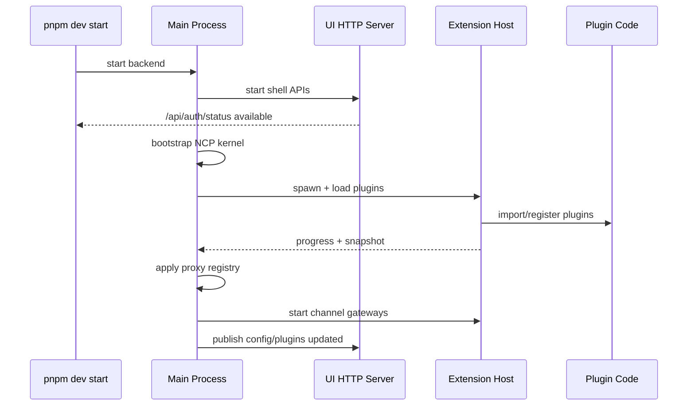

# 2026-04-23 Extension Host Startup Isolation Design

## 背景

`pnpm dev start` 当前已经采用 shell-first：UI HTTP server 会先启动，gateway core 使用空 plugin registry 建立最小运行时，然后在 deferred startup 中执行 capability hydration。

但真实体验仍然会出现 `/api/auth/status`、`/api/runtime/bootstrap-status` 长时间飘红，根因不是这些接口依赖插件，而是插件 hydration 仍在同一个 Node.js 主进程执行。只要某个插件的 import、top-level 初始化、register、SDK 探测或 gateway 装配占用 CPU，Node.js 事件循环就不能处理 HTTP 请求。`async` 只能把 IO 等待让出去，不能让同步 JS 计算自动并行。

所以同进程的 `setImmediate`、progressive loader 或“后台 hydrate”只能减少单块阻塞，不能给 `/api/auth/status` 提供强隔离。更不能通过跳过插件加载来伪装变快，因为那会破坏插件功能。

## 目标

1. `/api/auth/status` 和 `/api/runtime/bootstrap-status` 不再被插件 import/register/gateway 启动阻塞。
2. 插件仍然会加载并生效，不允许用禁用插件或跳过 capabilities 作为优化手段。
3. 启动性能必须可量化，验证脚本要输出瀑布流和排序，而不是靠体感判断。
4. 架构方向对齐 Chrome / VS Code：主进程先可用，插件在 Extension Host 中热插拔加载，主进程通过 IPC 代理插件能力。
5. 本轮优先解决最大的启动阻塞面：插件 hydration 与插件 channel gateway 不得在主进程执行。
6. 若验证发现新的更大阻塞点，继续按瀑布流优先级处理，而不是停留在原先假设。

## 非目标

- 不在本轮重写插件 SDK 的公开 API。
- 不要求一开始就拥有完整静态 manifest/discovery。配置里已经知道哪些插件启用，主进程启动阶段不需要知道 channelId、tool name 或 runtime kind。
- 不把插件能力假装为 ready。插件 host 未完成前，UI 可以显示“插件能力加载中”，但 core/status 必须稳定可用。

## 设计决策

采用独立 Extension Host 子进程，替换同进程 capability hydration。

主进程职责：

- 启动 UI shell、auth/status/bootstrap-status、config、session、provider、NCP kernel。
- 不在启动链路 import 插件模块。
- 持有可序列化的插件 snapshot。
- 对外暴露 proxy registry：tool、channel outbound、runtime session type 由主进程对象代理到 Extension Host。
- 即使 Extension Host 慢、崩溃或重载，主进程 HTTP 接口也继续可用。

Extension Host 职责：

- 执行真实插件 discovery/import/register。
- 维护真实 plugin registry 和所有插件函数对象。
- 启动/停止 plugin channel gateways。
- 执行插件 tool、channel outbound、channel auth、NCP runtime run。
- 将可序列化 snapshot 推给主进程。

## 为什么一开始不需要 channelId

主进程启动阶段只需要知道一件事：哪些插件在配置中启用，以及需要启动 Extension Host。它不需要提前知道插件会注册哪些 channelId。

channelId、tool name、runtime kind 属于插件能力结果，应该在 Extension Host 加载完成后通过 snapshot 热接入。和 Chrome 一样，浏览器可以先启动，扩展菜单、命令、content script 后续生效；和 VS Code 一样，Workbench 可以先打开，extension contribution 后续激活。

因此，本轮设计不做“静态 manifest 必须先发现 channelId”的前置条件。

## IPC 合同

Extension Host 与主进程只传可序列化数据：

- `snapshot.loaded`：插件列表、诊断、tool descriptors、channel descriptors、runtime descriptors。
- `snapshot.progress`：已处理插件数、总插件数、当前插件 id。
- `tool.execute`：主进程传 tool alias、tool context、params、toolCallId；Host 在真实 registry 中执行。
- `channel.startGateways`：Host 根据真实 channel registration 与当前 config 启动 gateway。
- `channel.stopGateways`：Host 停止已启动 gateway。
- `channel.outbound`：主进程的 ExtensionChannelAdapter 发送 outbound 时转发给 Host。
- `runtime.describe`：主进程请求某个 runtime kind 的 session type 描述。
- `runtime.run`：主进程创建 proxy runtime，Host 运行真实 runtime 并将 NCP events 流式发回。

本轮落地优先级：

1. Host 进程加载插件并发 snapshot，主进程不再同进程 hydrate。
2. Host 进程启动 plugin channel gateways，主进程不再执行真实 gateway 函数。
3. 主进程生成 proxy tools/channels/runtimes，保留功能入口。
4. 启动探针脚本持续压测 `/api/auth/status` 与 `/api/runtime/bootstrap-status`，输出瀑布流。
5. `NCP derived capabilities warmup` 不再作为 service 启动必跑步骤；MCP/server prewarm 与 session-search warmup 不能阻塞 status/front 可用路径。

## 启动瀑布流



主路径是 `Main -> UI available`。插件路径是 `Host -> Plugin -> snapshot`，不允许反向阻塞主路径。

## 验收指标

必须用脚本验证，而不是只看终端日志。

核心指标：

- `backend_listening_ms`：dev runner 看到 backend port 可连接的时间。
- `frontend_ready_ms`：frontend port 可连接的时间。
- `auth_status_first_200_ms`：`/api/auth/status` 首次返回 200 的时间。
- `bootstrap_status_first_200_ms`：`/api/runtime/bootstrap-status` 首次返回 200 的时间。
- `auth_status_max_latency_ms`：启动后持续探测窗口内 `/api/auth/status` 最大延迟。
- `bootstrap_status_max_latency_ms`：启动后持续探测窗口内 `/api/runtime/bootstrap-status` 最大延迟。
- `plugin_snapshot_ready_ms`：Extension Host snapshot ready 的时间。
- `plugin_gateway_ready_ms`：plugin channel gateways settle 的时间。

目标：

- 前端与 status 进入 2s 级可用。
- 插件未 ready 不影响 status 接口。
- 持续探测期间 status 接口不能出现 5s 超时。

## 风险与约束

风险 1：插件 runtime 的 `RuntimeFactoryParams` 含函数对象，不能直接跨进程复制。

控制：主进程提供 proxy runtime；Host 内部运行真实 runtime，并通过 IPC stream NCP events。metadata 更新通过专门消息回传。

风险 2：channel config adapter 中存在同步函数。

控制：channel gateway 的 account 解析与启动放在 Host 内执行，主进程不复制这些函数。

风险 3：Extension Host 崩溃。

控制：bootstrap-status 暴露 plugin host error；主进程 core/status 保持可用；后续可做自动重启与 backoff。

## 本轮交付

- 新增 Extension Host client/child/process 协议。
- 替换同进程 `hydrateServiceCapabilities` 的插件加载路径。
- 替换同进程 `startPluginChannelGateways` 的真实 gateway 启动路径。
- 新增 startup waterfall probe 脚本，直接服务后续常态化监测。
- 补充单元测试和真实 `pnpm dev start` 冒烟验证。

## 本轮验证命令

常态化瀑布流命令：

```bash
node scripts/smoke/startup-waterfall.mjs --duration-ms 20000
```

隔离环境对照命令：

```bash
node scripts/smoke/startup-waterfall.mjs --duration-ms 7000 --isolated-home
```

输出中的 `sortedWaterfall` 用于判断下一轮最大头；本轮真实用户环境验收关注：

- `auth_status_first_200_ms`
- `bootstrap_status_first_200_ms`
- `frontend_first_200_ms`
- `auth_status_max_latency_ms`
- `bootstrap_status_max_latency_ms`
- `auth_status_timeout_count`
- `bootstrap_status_timeout_count`
