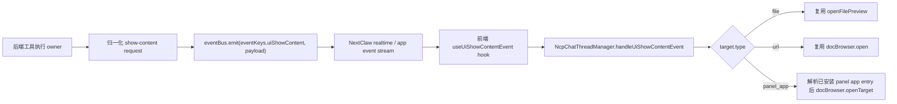

# Chat UI Content 展示合同

## 背景

NextClaw 的目标不是把所有功能硬塞进产品，而是成为 AI 时代的个人操作层：用户从 NextClaw 表达意图，Agent 调度工具、互联网、本地文件、服务与插件，再把结果交付给用户。

在“让 AI 找到小说并在产品里阅读”的讨论中，我们先排除了过重的 Artifact / Library 体系。当前更合理的方向是：文件仍然是一等承载，但不是唯一承载；Agent 有时需要打开本地文件，有时需要打开 URL、Markdown、HTML、图片、数据预览或 panel app；有时只是消息内卡片，不需要打开任何侧边栏或独立界面。

因此这里设计的不是“文件展示工具”，也不是“新资产系统”，而是一个轻量的 chat UI content 展示合同。

## 设计原则

- `simple-structure-first`：先复用现有 chat message、workspace file preview、doc browser、panel app surface，不新增 Artifact 对象模型。
- `abstraction-calibration`：只抽象“打开到合适承接空间”这一个真实变化点，不把 inline 卡片、持久资产、版本管理、收藏分享都塞进来。
- `information-expert`：模型或工具链只表达要打开什么内容；具体用哪个 UI 承接，由拥有 UI 状态和路由信息的宿主决定。
- `single-domain-owner`：本地文件打开继续归现有 `openFilePreview` 链路；新合同不能复制一套文件读取/预览实现。

## 产品目标

1. 模型或工具链能请求 chat UI 展示一段内容，而不是只能输出 Markdown 链接等用户点击。
2. 内容可以是文件，但不限于文件。
3. inline 卡片仍走消息或工具结果渲染，不通过这个合同。
4. 展示形态由宿主选择，Agent 不需要知道具体 UI 组件。
5. 第一阶段保持轻量，不引入资产库、版本、收藏、分享、导入来源追踪等长期对象能力。

## 非目标

- 不设计 Artifact / Personal Library / Asset Registry。
- 不规定文件落点、命名、目录归属。
- 不接管普通 Markdown 文件链接点击；现有本地文件链接合同继续有效。
- 不把搜索结果、进度、确认按钮等 inline card 强行改造成 `showContent`。
- 不要求第一阶段支持复杂交互式 widgets。

## 合同命名

推荐方法名使用：

```text
showContent
```

原因：

- `content` 是最普通的业务词，避免把内容误建模成 result / artifact / surface。
- `show` 比 `open` 更贴近意图：模型只表达“把内容呈现给用户”，不关心底层是打开文件预览、浏览器、panel app，还是未来的其它承接面。
- `surface` 可作为内部架构词，但不一定适合模型可见工具名。
- `present` / `display` 过泛，容易把 inline card、artifact、资产沉淀重新混到一起。

第一阶段 `showContent` 仍只接入需要离开聊天气泡的内容承接；inline card 继续走消息/工具结果渲染，不被这个合同接管。

## 参数草案

第一阶段参数应保持小而稳定：

```ts
type ChatUiShowContentRequest = {
  target: ChatUiShowContentTarget;
  purpose?: ChatUiShowContentPurpose;
  title?: string;
};

type ChatUiShowContentTarget =
  | { type: "file"; payload: { path: string; line?: number; column?: number } }
  | { type: "url"; payload: { url: string } }
  | { type: "panel_app"; payload: { appId: string } }
  | { type: "markdown"; payload: { content: string } }
  | { type: "html"; payload: { content: string } }
  | { type: "image"; payload: { url: string; alt?: string } }
  | { type: "data"; payload: { data: unknown; format?: "json" | "table" } }
  | { type: "app"; payload: { appId: string; route?: string; params?: Record<string, unknown> } };

type ChatUiShowContentPurpose = "read" | "preview" | "edit" | "interact";
```

第一阶段实现 `file` / `url` / `panel_app`。`markdown` 等内容类型先作为设计边界，不一定同时上线。

## 行为规则

### 什么时候用 `showContent`

- 已经写出或找到一段适合用户进一步阅读、预览、编辑或交互的内容。
- 这段内容放在聊天气泡里不够好，需要更大的承接空间。
- 用户明确要求“打开”“预览”“阅读”“展示给我看”，且目标不是纯 inline card。

### 什么时候不用

- 普通回答、摘要、列表、搜索结果卡片。
- 工具执行进度、确认按钮、错误提示。
- 已经在回复里给出可点击 Markdown 链接，且不需要自动打开。
- 需要长期沉淀、收藏、版本、复用的资产对象。那是后续 Library / Artifact 方向，不属于当前合同。

## 推荐链路



这里的核心是：请求展示内容不是由前端从消息渲染结果里猜出来，而是后端在工具执行时通过现有 typed app event bus 发出 `ui.show-content` 事件。前端只把事件接入真正的会话 workspace owner `NcpChatThreadManager`。

tool result / tool card 可以继续保留为聊天里的可见记录和手动兜底，但自动展示不依赖 React render 后扫描消息，也不通过 markdown 链接间接触发。

## 当前能力复用

已有能力可以直接复用：

- Chat Markdown 本地文件链接已经可以触发 `onFileOpen`。
- 现有 `NcpChatThreadManager.openFilePreview` 已经能打开会话级 workspace file tab；它是可复用实现，不是 `showContent` 的长期 owner。
- `ChatSessionWorkspaceFilePreview` 已经能读取并渲染 Markdown / 文本 / 二进制错误状态。
- `docBrowser.open` 已经承接 docs / marketplace 等全局浏览入口。
- Panel app 已经有独立应用面板基础。

因此第一阶段不需要新建 Workspace Browser，也不需要新建全局资产浏览器。

## 事件总线合同

本设计不新增 command bus，也不引入 NCP endpoint event。它只是现有 app event bus 上的一个 typed event key：

```ts
eventKeys.uiShowContent
```

事件 type 由 `EventBus.emit(key, payload)` 自动写入 envelope：

```ts
{
  type: "ui.show-content",
  payload
}
```

payload 类型放在 shared 层，供后端 emit 和前端消费共享：

```ts
export type UiShowContentEventPayload = {
  id: string;
  toolCallId: string | undefined;
  title: string | undefined;
  purpose: "read" | "preview" | "edit" | "interact" | undefined;
  target:
    | {
        type: "file";
        payload: {
          path: string;
          line?: number;
          column?: number;
        };
      }
    | {
        type: "url";
        payload: {
          url: string;
        };
      }
    | {
        type: "panel_app";
        payload: {
          appId: string;
        };
      };
};
```

`eventKeys` 增加：

```ts
uiShowContent: createAppEventKey<UiShowContentEventPayload>(
  "ui.show-content",
),
```

`id` 是幂等键，前端必须用它去重。推荐由后端按当前上下文生成：

```ts
`tool:${toolCallId}:show-content`
```

如果没有 `toolCallId`，可以用后端生成的稳定 request id。不要用随机 id 触发可重放事件，否则 reconnect / replay 时会重复打开 UI。

## 后端部分

后端部分只需要做三件事。

### 1. 定义事件 payload 类型和 key

位置：

```text
packages/nextclaw-shared/src/types/ui-show-content.types.ts
packages/nextclaw-shared/src/configs/event-keys.config.ts
```

shared 是合适 owner，因为：

- 后端需要类型来 emit。
- 前端需要类型来消费。
- event bus 和 `eventKeys` 本来就在 shared。
- 这不是 UI package 私有类型，也不是 NCP endpoint 协议类型。

### 2. 在工具执行 owner 里 emit

工具执行完成、并且已经确定产生了适合打开的内容时，由执行 owner 发事件：

```ts
this.eventBus.emit(eventKeys.uiShowContent, {
  id: `tool:${toolCallId}:show-content`,
  toolCallId,
  target: {
    type: "file",
    payload: {
      path,
    },
  },
  title,
  purpose: "read",
}, {
  source: "kernel",
});
```

这里的后端职责是表达 UI 意图：展示这份内容。它不决定右侧栏、workspace tab、doc browser 或 panel app target 的具体打开方式。

如果 `show_content` 是一个 class tool，`eventBus` 应作为稳定依赖通过 constructor 注入，而不是放进每次执行的 context：

```ts
export class ShowContentTool implements NcpTool {
  constructor(
    private readonly eventBus: Pick<EventBus, "emit">,
  ) {}

  execute = async (
    args: unknown,
    context: ToolExecutionContext,
  ): Promise<unknown> => {
    const request = normalizeShowContentArgs(args);
    this.eventBus.emit(
      eventKeys.uiShowContent,
      createShowContentEventPayload(request, context),
      { source: "kernel" },
    );
    return {
      ok: true,
      action: "showContent",
      request,
    };
  };
}
```

边界：

- `eventBus` 是稳定协作者，constructor 注入。
- `toolCallId` 是本次工具调用事实，从 execution context 取。
- `args` 是模型传入参数。
- context 不承载稳定基础设施依赖，避免变成杂物袋。

Provider / 创建 owner 对应变成：

```ts
export class ShowContentToolProvider implements ToolProvider {
  constructor(
    private readonly eventBus: Pick<EventBus, "emit">,
  ) {}

  provide = (): readonly NcpTool[] => [
    new ShowContentTool(this.eventBus),
  ];
}
```

如果实际工具实例由更上层 registry 创建，同样由那个创建 owner 注入 `eventBus`，不要在 execute 时临时从 context 取。

### 3. 保留工具结果为事实记录

事件用于驱动 UI，tool result 仍然用于：

- 给模型继续推理。
- 给聊天记录保留可见事实。
- 给用户知道工具做了什么。
- 在前端事件丢失或用户手动需要时，保留 tool card action 兜底。

因此推荐工具结果仍返回结构化结果：

```ts
return {
  ok: true,
  action: "showContent",
  request,
};
```

但自动打开由 `eventKeys.uiShowContent` 负责，不由 tool card render 负责。

### 后端不做什么

- 不调用前端函数。
- 不知道右侧栏或 workspace 的具体实现。
- 不新增 command bus / control plane / command router。
- 不往 payload 里加 `command` 字段。
- 不把这个事件塞进 NCP endpoint event 类型。
- 不在每个工具里复制校验和 emit 逻辑；若多个工具需要复用，提取一个很小的 `emitUiShowContent(...)` helper 即可。

可选 helper 形状：

```ts
export function emitUiShowContent(params: {
  eventBus: Pick<EventBus, "emit">;
  toolCallId?: string;
  request: ChatUiShowContentRequest;
  source?: string;
}) {
  const id = [
    params.toolCallId?.trim() || "tool",
    "show-content",
  ].join(":");
  params.eventBus.emit(eventKeys.uiShowContent, {
    id,
    toolCallId: params.toolCallId,
    title: params.request.title,
    purpose: params.request.purpose,
    target: params.request.target,
  }, {
    source: params.source ?? "kernel",
  });
}
```

这个 helper 只有在第二个 emit 点出现时再加；第一处可以直接 emit，避免提前抽象。

## 事件如何传到前端

现有链路已经具备从后端 app event bus 到前端 `nextclawClient.eventBus` 的传输能力，不需要新建传输层。

实际路径：

```mermaid
flowchart LR
  A["后端 owner 调用 gateway.appEventBus.emit(eventKeys.uiShowContent, payload)"]
  B["EventBus 生成 AppEventEnvelope: { type, payload, emittedAt, source }"]
  C["server start 时 subscribeAll(eventStreamClients.publish)"]
  D["EventStreamClientRegistry.publish"]
  E["canStreamAppEventToPrincipal 权限过滤"]
  F["/ws WebSocket send(JSON.stringify(event))"]
  G["NextClawClient RealtimeService 收到 websocket message"]
  H["client.eventBus.emitEnvelope(event)"]
  I["useUiShowContentEvent 订阅 eventKeys.uiShowContent"]
  J["NcpChatThreadManager.handleUiShowContentEvent"]

  A --> B --> C --> D --> E --> F --> G --> H --> I --> J
```



对应现有代码 owner：

- server 侧 `startUiServer` 创建 `EventStreamClientRegistry`，并执行 `gateway.appEventBus.subscribeAll(eventStreamClients.publish)`。
- `/ws` 连接由 `attachUiSocketServer` 接入，连接通过 `EventStreamAuthService` 认证后加入 `EventStreamClientRegistry`。
- `EventStreamClientRegistry.publish(event)` 将 app event envelope JSON 序列化后推送到已连接 websocket client。
- `canStreamAppEventToPrincipal(...)` 做事件权限过滤；`ui.show-content` 这类普通 app UI 事件默认要求 principal 具备 `event-stream:ui-events` grant。
- 前端 `NextClawClient` 的 `RealtimeService` 订阅 `/ws`，收到消息后交给 `nextclawClient.eventBus.emitEnvelope(...)`。
- chat feature 的 `useUiShowContentEvent()` 只订阅 `eventKeys.uiShowContent` 并交给 `NcpChatThreadManager`。

因此实现时要注意：

- 后端必须 emit 到 UI server 使用的同一个 `gateway.appEventBus`。
- 新事件 type 不需要额外 websocket route；只要 `eventKeys.uiShowContent` 的 type 是 `ui.show-content` 即可。
- 如果将来需要给 extension / channel principal 也看见类似事件，必须显式调整 `canStreamAppEventToPrincipal`；本设计当前只面向 UI。
- payload 不应包含敏感文件内容，只传路径、URL、panel app id 等展示目标。

## 代码组织草案

### kernel 侧

如果保留 `show_content` 作为 agent 可调用工具，建议它仍是一个极小工具和 provider：

```text
packages/nextclaw-kernel/src/tools/show-content.tools.ts
packages/nextclaw-kernel/src/contributions/tool-provider/providers/show-content-tool.provider.ts
```

职责：

- 暴露 `showContent` 工具 schema。
- 校验参数。
- 原样返回结构化结果，例如 `{ action: "showContent", request }`。
- 在工具执行 owner 能拿到 app event bus 和 session/tool 上下文时，额外 emit `eventKeys.uiShowContent`。
- 不读取文件、不打开浏览器、不决定 UI surface。

如果运行时工具名需要 snake_case，可以使用 `show_content` 作为实际 tool name，并在说明中表达为 `showContent`。

第一阶段实际 tool args 保持一层 `payload`，把通用展示字段和类型专属字段拆开：

```ts
type ShowContentToolArgs =
  | {
      type: "file";
      title?: string;
      purpose?: "read" | "preview" | "edit" | "interact";
      payload: {
        path: string;
        line?: number;
        column?: number;
      };
    }
  | {
      type: "url";
      title?: string;
      purpose?: "read" | "preview" | "edit" | "interact";
      payload: {
        url: string;
      };
    }
  | {
      type: "panel_app";
      title?: string;
      purpose?: "read" | "preview" | "edit" | "interact";
      payload: {
        appId: string;
      };
    };
```

这里不继续拆更深的对象，也不引入 `options` / `metadata` / `display` 多层配置。`payload` 的唯一职责是承载当前 `type` 专属参数；`title` / `purpose` 这种跨类型展示意图留在外层。这样比完全扁平多一层，但职责更清楚，也避免后续新增类型时顶层字段越来越像一个杂物袋。

工具执行返回归一化后的请求，并通过 constructor 注入的事件总线发出 UI 事件：

```ts
export const SHOW_CONTENT_TOOL_NAME = "show_content";

export class ShowContentTool implements NcpTool {
  constructor(
    private readonly eventBus: Pick<EventBus, "emit">,
  ) {}

  readonly name = SHOW_CONTENT_TOOL_NAME;
  readonly description = "Show file, URL, or panel app content in the current chat UI.";
  readonly parameters = {
    type: "object",
    properties: {
      type: { type: "string", enum: ["file", "url", "panel_app"] },
      title: { type: "string" },
      purpose: { type: "string", enum: ["read", "preview", "edit", "interact"] },
      payload: {
        type: "object",
        description: "Type-specific fields: file={path,line,column}; url={url}; panel_app={appId}.",
      },
    },
    required: ["type", "payload"],
  };

  execute = async (args: unknown, context: ToolExecutionContext): Promise<unknown> => {
    const request = normalizeShowContentArgs(args);
    this.eventBus.emit(
      eventKeys.uiShowContent,
      createShowContentEventPayload(request, context),
      { source: "kernel" },
    );
    return {
      ok: true,
      action: "showContent",
      request,
    };
  };
}
```

`ToolExecutionContext` 使用仓库现有工具执行上下文。当前它只提供 `toolCallId` 等本次调用事实；不要把 `eventBus` 这类稳定协作者塞进 context。

`normalizeShowContentArgs` 只做边界校验：

- `type === "file"` 时要求 `payload.path` 是非空字符串。
- `type === "url"` 时要求 `payload.url` 是 `http:` 或 `https:`。
- `type === "panel_app"` 时要求 `payload.appId` 是非空字符串。
- `payload.line` / `payload.column` 只接受正整数。
- 不检查文件是否存在；文件读取失败交给现有文件预览链路展示。
- 不抓取 URL；URL 是否能打开交给前端 browser/doc browser 链路。

Provider 只负责把工具挂到现有工具体系：

```ts
export class ShowContentToolProvider implements ToolProvider {
  constructor(
    private readonly eventBus: Pick<EventBus, "emit">,
  ) {}

  provide = (): readonly NcpTool[] => [
    new ShowContentTool(this.eventBus),
  ];
}
```

然后在 `ToolProviderContribution.createToolProviders()` 里注册：

```ts
new ShowContentToolProvider(appEventBus),
```

放在 `CoreToolProvider` 附近即可。它不是 core 文件读写能力，也不是 MCP 工具，只是 NextClaw 宿主 UI 能力。

### UI 侧

第一阶段不新增 manager，也不把 `showContent` 塞进当前职责很窄的 `ChatUiManager`，更不通过 presenter 做一层能力转发。按 MVP / kernel branch 思路，能力应落到真正 owner；presenter 只负责装配稳定依赖。

- 在 chat tool result adapter 中识别 `showContent` 结果，生成 tool-card action。
- tool-card 点击 action 后调用 `NcpChatThreadManager.showContent`。
- `file` 调用现有 `openFilePreview` 链路。
- `url` 调用现有 `docBrowser.open` 链路。
- `panel_app` 调用现有 `docBrowser.open(createPanelAppResourceUri(appId))` 链路。
- `markdown` 先不作为 MVP 必选项；如果需要，优先让 Agent 写成 `.md` 文件再走 `file` 链路。

只有当同类打开目标明显增多、现有调用点开始重复，或出现稳定的跨界面状态不变量时，再讨论是否提取新的 owner。

#### 前端类型

扩展 `ChatToolActionViewModel`，让工具卡片能表达展示内容动作：

```ts
export type ChatToolActionViewModel =
  | {
      kind: "open-session";
      sessionId: string;
      sessionKind: "child" | "session";
      agentId?: string;
      label?: string;
      parentSessionId?: string;
    }
  | {
      kind: "show-content";
      label?: string;
      request: ChatUiShowContentRequest;
    };
```

`ChatUiShowContentRequest` 可以先放在 `@nextclaw/agent-chat-ui` 的 view-model types 中，因为 tool-card action 和 `NcpChatThreadManager.showContent` 都要消费同一合同。

#### chat message adapter

在 `packages/nextclaw-ui/src/features/chat/utils/chat-message-part.utils.ts` 的 tool invocation 适配里增加一个很小的识别分支：

```ts
const showContentCard = buildShowContentToolCard({
  invocation,
  texts,
});
if (showContentCard) {
  return {
    type: "tool-card",
    card: buildToolCard(showContentCard, texts),
  };
}
```

识别条件：

- `invocation.toolName === "show_content"`。
- `invocation.result` 是对象。
- `invocation.result.action === "showContent"`。
- `invocation.result.request` 能解析成 `file`、`url` 或 `panel_app`。

生成的 card 只需要普通 generic tool card：

```ts
{
  kind: "result",
  name: "show_content",
  detail: getShowContentSummary(request),
  text: undefined,
  outputData: invocation.result,
  hasResult: true,
  statusTone: "success",
  action: {
    kind: "show-content",
    label: "Show",
    request,
  },
}
```

tool card 上可以保留 `Show` action 作为手动兜底；自动展示由 `eventKeys.uiShowContent` 事件驱动。前端不能用组件 render 后扫描消息来补业务动作，也不能在消息组件里直接打开 UI。

#### NcpChatThreadManager

`NcpChatThreadManager` 已经是会话 workspace、file preview、child session tool action 的 owner。`showContent` 默认展示在会话级，因此应落到这个现有 owner，而不是通过 presenter 做转发。

它需要稳定依赖 `DocBrowserManager` 来打开 URL / panel app，由 `NcpChatPresenter` 在构造时装配：

```ts
export class NcpChatPresenter {
  readonly chatUiManager: ChatUiManager;
  readonly chatStreamActionsManager: ChatStreamActionsManager;
  readonly chatSessionListManager: ChatSessionListManager;
  readonly chatInputManager: NcpChatInputManager;
  readonly chatThreadManager: NcpChatThreadManager;

  constructor(appPresenter: AppPresenter) {
    this.chatUiManager = new ChatUiManager();
    this.chatStreamActionsManager = new ChatStreamActionsManager();
    this.chatSessionListManager = new ChatSessionListManager(this.chatUiManager, this.chatStreamActionsManager);
    this.chatInputManager = new NcpChatInputManager(
      this.chatUiManager,
      this.chatStreamActionsManager,
      this.chatSessionListManager,
    );
    this.chatThreadManager = new NcpChatThreadManager(
      this.chatUiManager,
      this.chatSessionListManager,
      this.chatStreamActionsManager,
      appPresenter.docBrowserManager,
    );
  }
}
```

`NcpChatThreadManager` 内部方法：

```ts
export class NcpChatThreadManager {
  constructor(
    private uiManager: ChatUiManager,
    private sessionListManager: ChatSessionListManager,
    private streamActionsManager: ChatStreamActionsManager,
    private docBrowserManager: DocBrowserManager,
  ) {}

  private handledUiShowContentEventIds = new Set<string>();

  handleUiShowContentEvent = async (payload: UiShowContentEventPayload): Promise<void> => {
    const id = payload.id.trim();
    if (!id || this.handledUiShowContentEventIds.has(id)) {
      return;
    }
    this.handledUiShowContentEventIds.add(id);
    await this.showContent({
      target: payload.target,
      title: payload.title,
      purpose: payload.purpose,
    });
  };

  private showContent = async (request: ChatUiShowContentRequest): Promise<void> => {
    if (request.target.type === "file") {
      this.openFilePreview({
        path: request.target.payload.path,
        label: request.title,
        viewMode: "preview",
        line: request.target.payload.line,
        column: request.target.payload.column,
      });
      return;
    }

    if (request.target.type === "url") {
      this.docBrowserManager.open(request.target.payload.url, { title: request.title });
      return;
    }

    if (request.target.type === "panel_app") {
      await this.showPanelAppContent(request);
    }
  };
}
```

`NcpChatPage` 从 app presenter context 读取稳定依赖并创建 chat presenter：

```ts
const appPresenter = useAppPresenter();
const [presenter] = useState(() => new NcpChatPresenter(appPresenter));
```

这样 `showContent` 的方法签名保持最小：

```ts
showContent(request)
```

只传本次调用独有的信息，不传 `openFilePreview` / `openUrl` 这种稳定协作者。
Presenter 只负责装配依赖，不暴露一层 `presenter.showContent(...)` 普通能力转发。

#### 前端事件 hook

订阅 app event bus 的 React 外部系统同步，应放到专门 hook，而不是散在 page 里：

```text
packages/nextclaw-ui/src/features/chat/hooks/use-ui-show-content-event.ts
```

hook 不接收 presenter / manager 参数。它属于 chat feature 的业务 hook，应自己从 feature context 读取 owner：

```ts
export function useUiShowContentEvent(): void {
  const presenter = usePresenter();

  useEffect(() => {
    return nextclawClient.eventBus.on(eventKeys.uiShowContent, (payload) => {
      void presenter.chatThreadManager.handleUiShowContentEvent(payload);
    });
  }, [presenter]);
}
```

`usePresenter()` 必须在 `ChatPresenterProvider` 下调用，所以 `NcpChatPage` 通过一个极小的 provider 子组件装配事件订阅：

```ts
function NcpChatEventBindings() {
  useUiShowContentEvent();
  return null;
}

<ChatPresenterProvider presenter={presenter}>
  <NcpChatEventBindings />
  <ChatPageLayout view={view} confirmDialog={<state.ConfirmDialog />} />
</ChatPresenterProvider>
```

page 不传 manager，不写 event bus 细节，也不做 payload 判断。

#### 消息列表入口

`ChatConversationPanel` 不再把 `onToolAction` 直接绑死到 `openSessionFromToolAction`。改成：

```ts
onToolAction={handleToolAction}
```

其中：

```ts
const handleToolAction = (action: ChatToolActionViewModel) => {
  if (action.kind === "show-content") {
    presenter.chatThreadManager.handleToolAction(action);
    return;
  }
  presenter.chatThreadManager.handleToolAction(action);
};
```

实际实现中 `ChatMessageListContainer` 应直接传 `presenter.chatThreadManager.handleToolAction`，避免组件里展开 `show-content` / `open-session` 分支。这样 `open-session` 和 `show-content` 都是 chat UI action，但具体执行仍复用现有 owner。

`ChatConversationPanel` 不读取 `docBrowser`，不传 `handlers`，也不通过 presenter 转发普通能力；它只调用真正 owner 的业务动作。这样符合 MVP：业务组件连接 presenter/manager，稳定依赖由 presenter 装配到 manager。

### chat renderer 侧

需要在现有工具卡片 / tool result adapter 里识别 `showContent` 结果，并转成 UI action。它不应该绕开消息事件流，也不应该让 markdown renderer 猜测隐藏语义。

## MVP 范围

第一阶段建议只做：

1. `showContent` 工具 schema：先只支持 `file`、`url`、`panel_app`。
2. `file` 复用现有文件预览实现。
3. `url` 复用已有 doc/browser 打开能力。
4. 后端在工具执行时 emit `eventKeys.uiShowContent`，前端收到后自动展示。
5. tool card 上保留 `Open` action 作为手动兜底。
6. 工具结果在 chat 中保留可见记录，让用户知道模型或工具链发起过展示内容请求。

## 验收场景

1. 写出一个 Markdown 文件后，后端 emit `ui.show-content` file payload，右侧自动打开文件预览。
2. 找到一个网页资源后，后端 emit `ui.show-content` url payload，宿主自动打开合适浏览承接空间。
3. 搜索结果卡片、工具进度、确认按钮不触发 `showContent`，仍保持 inline 渲染。
4. `showContent` 调用失败时，聊天里有明确失败反馈，不静默吞掉。
5. 历史消息重渲染不会触发自动打开副作用；realtime 重连或事件重放依赖 `id` 去重。

## 后续扩展条件

只有当以下需求真实出现，再考虑升级：

- 多种 target 都需要统一 tab 管理、恢复、历史、关闭状态。
- 用户需要收藏、复用、版本、分享或跨会话资产浏览。
- panel app / widgets 成为高频承接结果。
- inline card 和 opened preview 之间需要稳定关联。

届时再讨论是否需要 `SurfaceManager`、`ResultViewRegistry` 或更大的资产模型。当前阶段不做。
