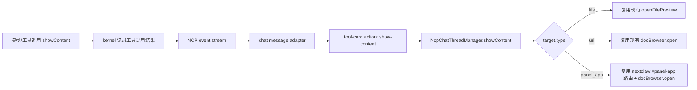

# Chat UI Content 展示合同

## 背景

NextClaw 的目标不是把所有功能硬塞进产品，而是成为 AI 时代的个人操作层：用户从 NextClaw 表达意图，Agent 调度工具、互联网、本地文件、服务与插件，再把结果交付给用户。

在“让 AI 找到小说并在产品里阅读”的讨论中，我们先排除了过重的 Artifact / Library 体系。当前更合理的方向是：文件仍然是一等承载，但不是唯一承载；Agent 有时需要打开本地文件，有时需要打开 URL、Markdown、HTML、图片、数据预览或 panel app；有时只是消息内卡片，不需要打开任何侧边栏或独立界面。

因此这里设计的不是“文件展示工具”，也不是“新资产系统”，而是一个轻量的 chat UI content 展示合同。

## 设计原则

- `simple-structure-first`：先复用现有 chat message、workspace file preview、doc browser、panel app surface，不新增 Artifact 对象模型。
- `abstraction-calibration`：只抽象“打开到合适承接空间”这一个真实变化点，不把 inline 卡片、持久资产、版本管理、收藏分享都塞进来。
- `information-expert`：模型或工具链只表达要打开什么内容；具体用哪个 UI 承接，由拥有 UI 状态和路由信息的宿主决定。
- `single-domain-owner`：本地文件打开继续归现有 `openFilePreview` 链路；新合同不能复制一套文件读取/预览实现。

## 产品目标

1. 模型或工具链能请求 chat UI 展示一段内容，而不是只能输出 Markdown 链接等用户点击。
2. 内容可以是文件，但不限于文件。
3. inline 卡片仍走消息或工具结果渲染，不通过这个合同。
4. 展示形态由宿主选择，Agent 不需要知道具体 UI 组件。
5. 第一阶段保持轻量，不引入资产库、版本、收藏、分享、导入来源追踪等长期对象能力。

## 非目标

- 不设计 Artifact / Personal Library / Asset Registry。
- 不规定文件落点、命名、目录归属。
- 不接管普通 Markdown 文件链接点击；现有本地文件链接合同继续有效。
- 不把搜索结果、进度、确认按钮等 inline card 强行改造成 `showContent`。
- 不要求第一阶段支持复杂交互式 widgets。

## 合同命名

推荐方法名使用：

```text
showContent
```

原因：

- `content` 是最普通的业务词，避免把内容误建模成 result / artifact / surface。
- `show` 比 `open` 更贴近意图：模型只表达“把内容呈现给用户”，不关心底层是打开文件预览、浏览器、panel app，还是未来的其它承接面。
- `surface` 可作为内部架构词，但不一定适合模型可见工具名。
- `present` / `display` 过泛，容易把 inline card、artifact、资产沉淀重新混到一起。

第一阶段 `showContent` 仍只接入需要离开聊天气泡的内容承接；inline card 继续走消息/工具结果渲染，不被这个合同接管。

## 参数草案

第一阶段参数应保持小而稳定：

```ts
type ChatUiShowContentRequest = {
  target: ChatUiShowContentTarget;
  purpose?: ChatUiShowContentPurpose;
  title?: string;
};

type ChatUiShowContentTarget =
  | { type: "file"; payload: { path: string; line?: number; column?: number } }
  | { type: "url"; payload: { url: string } }
  | { type: "panel_app"; payload: { appId: string } }
  | { type: "markdown"; payload: { content: string } }
  | { type: "html"; payload: { content: string } }
  | { type: "image"; payload: { url: string; alt?: string } }
  | { type: "data"; payload: { data: unknown; format?: "json" | "table" } }
  | { type: "app"; payload: { appId: string; route?: string; params?: Record<string, unknown> } };

type ChatUiShowContentPurpose = "read" | "preview" | "edit" | "interact";
```

第一阶段实现 `file` / `url` / `panel_app`。`markdown` 等内容类型先作为设计边界，不一定同时上线。

## 行为规则

### 什么时候用 `showContent`

- 已经写出或找到一段适合用户进一步阅读、预览、编辑或交互的内容。
- 这段内容放在聊天气泡里不够好，需要更大的承接空间。
- 用户明确要求“打开”“预览”“阅读”“展示给我看”，且目标不是纯 inline card。

### 什么时候不用

- 普通回答、摘要、列表、搜索结果卡片。
- 工具执行进度、确认按钮、错误提示。
- 已经在回复里给出可点击 Markdown 链接，且不需要自动打开。
- 需要长期沉淀、收藏、版本、复用的资产对象。那是后续 Library / Artifact 方向，不属于当前合同。

## 推荐链路



这里的核心是“请求展示内容”通过 tool result 或事件流进入 UI，由真正的会话 workspace owner `NcpChatThreadManager` 承接。调用参数只传 `request`，稳定依赖由 presenter 装配到 owner，不做 per-call handler 传参。第一阶段不新增 manager、不新增 preview 面板。

## 当前能力复用

已有能力可以直接复用：

- Chat Markdown 本地文件链接已经可以触发 `onFileOpen`。
- 现有 `NcpChatThreadManager.openFilePreview` 已经能打开会话级 workspace file tab；它是可复用实现，不是 `showContent` 的长期 owner。
- `ChatSessionWorkspaceFilePreview` 已经能读取并渲染 Markdown / 文本 / 二进制错误状态。
- `docBrowser.open` 已经承接 docs / marketplace 等全局浏览入口。
- Panel app 已经有独立应用面板基础。

因此第一阶段不需要新建 Workspace Browser，也不需要新建全局资产浏览器。

## 代码组织草案

### kernel 侧

建议新增一个极小工具和一个 provider：

```text
packages/nextclaw-kernel/src/tools/show-content.tools.ts
packages/nextclaw-kernel/src/contributions/tool-provider/providers/show-content-tool.provider.ts
```

职责：

- 暴露 `showContent` 工具 schema。
- 校验参数。
- 原样返回结构化结果，例如 `{ action: "showContent", request }`。
- 不读取文件、不打开浏览器、不决定 UI surface。

如果运行时工具名需要 snake_case，可以使用 `show_content` 作为实际 tool name，并在说明中表达为 `showContent`。

第一阶段实际 tool args 保持一层 `payload`，把通用展示字段和类型专属字段拆开：

```ts
type ShowContentToolArgs =
  | {
      type: "file";
      title?: string;
      purpose?: "read" | "preview" | "edit" | "interact";
      payload: {
        path: string;
        line?: number;
        column?: number;
      };
    }
  | {
      type: "url";
      title?: string;
      purpose?: "read" | "preview" | "edit" | "interact";
      payload: {
        url: string;
      };
    }
  | {
      type: "panel_app";
      title?: string;
      purpose?: "read" | "preview" | "edit" | "interact";
      payload: {
        appId: string;
      };
    };
```

这里不继续拆更深的对象，也不引入 `options` / `metadata` / `display` 多层配置。`payload` 的唯一职责是承载当前 `type` 专属参数；`title` / `purpose` 这种跨类型展示意图留在外层。这样比完全扁平多一层，但职责更清楚，也避免后续新增类型时顶层字段越来越像一个杂物袋。

工具执行只返回归一化后的请求，不产生 UI 副作用：

```ts
export const SHOW_CONTENT_TOOL_NAME = "show_content";

export class ShowContentTool implements NcpTool {
  readonly name = SHOW_CONTENT_TOOL_NAME;
  readonly description = "Show file, URL, or panel app content in the current chat UI.";
  readonly parameters = {
    type: "object",
    properties: {
      type: { type: "string", enum: ["file", "url", "panel_app"] },
      title: { type: "string" },
      purpose: { type: "string", enum: ["read", "preview", "edit", "interact"] },
      payload: {
        type: "object",
        description: "Type-specific fields: file={path,line,column}; url={url}; panel_app={appId}.",
      },
    },
    required: ["type", "payload"],
  };

  execute = async (args: unknown): Promise<unknown> => {
    const request = normalizeShowContentArgs(args);
    return {
      ok: true,
      action: "showContent",
      request,
    };
  };
}
```

`normalizeShowContentArgs` 只做边界校验：

- `type === "file"` 时要求 `payload.path` 是非空字符串。
- `type === "url"` 时要求 `payload.url` 是 `http:` 或 `https:`。
- `type === "panel_app"` 时要求 `payload.appId` 是非空字符串。
- `payload.line` / `payload.column` 只接受正整数。
- 不检查文件是否存在；文件读取失败交给现有文件预览链路展示。
- 不抓取 URL；URL 是否能打开交给前端 browser/doc browser 链路。

Provider 只负责把工具挂到现有工具体系：

```ts
export class ShowContentToolProvider implements ToolProvider {
  provide = (): readonly NcpTool[] => [new ShowContentTool()];
}
```

然后在 `ToolProviderContribution.createToolProviders()` 里注册：

```ts
new ShowContentToolProvider(),
```

放在 `CoreToolProvider` 附近即可。它不是 core 文件读写能力，也不是 MCP 工具，只是 NextClaw 宿主 UI 能力。

### UI 侧

第一阶段不新增 manager，也不把 `showContent` 塞进当前职责很窄的 `ChatUiManager`，更不通过 presenter 做一层能力转发。按 MVP / kernel branch 思路，能力应落到真正 owner；presenter 只负责装配稳定依赖。

- 在 chat tool result adapter 中识别 `showContent` 结果，生成 tool-card action。
- tool-card 点击 action 后调用 `NcpChatThreadManager.showContent`。
- `file` 调用现有 `openFilePreview` 链路。
- `url` 调用现有 `docBrowser.open` 链路。
- `panel_app` 调用现有 `docBrowser.open(createPanelAppResourceUri(appId))` 链路。
- `markdown` 先不作为 MVP 必选项；如果需要，优先让 Agent 写成 `.md` 文件再走 `file` 链路。

只有当同类打开目标明显增多、现有调用点开始重复，或出现稳定的跨界面状态不变量时，再讨论是否提取新的 owner。

#### 前端类型

扩展 `ChatToolActionViewModel`，让工具卡片能表达展示内容动作：

```ts
export type ChatToolActionViewModel =
  | {
      kind: "open-session";
      sessionId: string;
      sessionKind: "child" | "session";
      agentId?: string;
      label?: string;
      parentSessionId?: string;
    }
  | {
      kind: "show-content";
      label?: string;
      request: ChatUiShowContentRequest;
    };
```

`ChatUiShowContentRequest` 可以先放在 `@nextclaw/agent-chat-ui` 的 view-model types 中，因为 tool-card action 和 `NcpChatThreadManager.showContent` 都要消费同一合同。

#### chat message adapter

在 `packages/nextclaw-ui/src/features/chat/utils/chat-message-part.utils.ts` 的 tool invocation 适配里增加一个很小的识别分支：

```ts
const showContentCard = buildShowContentToolCard({
  invocation,
  texts,
});
if (showContentCard) {
  return {
    type: "tool-card",
    card: buildToolCard(showContentCard, texts),
  };
}
```

识别条件：

- `invocation.toolName === "show_content"`。
- `invocation.result` 是对象。
- `invocation.result.action === "showContent"`。
- `invocation.result.request` 能解析成 `file`、`url` 或 `panel_app`。

生成的 card 只需要普通 generic tool card：

```ts
{
  kind: "result",
  name: "show_content",
  detail: getShowContentSummary(request),
  text: undefined,
  outputData: invocation.result,
  hasResult: true,
  statusTone: "success",
  action: {
    kind: "show-content",
    label: "Show",
    request,
  },
}
```

第一阶段先保留 tool card 上的 `Show` action，不做自动展示。若后续产品确认“模型调用 showContent 后必须自动展示”，触发点应进入消息/stream ingestion owner，并用 `toolCallId` 幂等去重；不要用组件 `useEffect` 在渲染后补业务动作。

#### NcpChatThreadManager

`NcpChatThreadManager` 已经是会话 workspace、file preview、child session tool action 的 owner。`showContent` 默认展示在会话级，因此应落到这个现有 owner，而不是通过 presenter 做转发。

它需要稳定依赖 `DocBrowserManager` 来打开 URL / panel app，由 `NcpChatPresenter` 在构造时装配：

```ts
export class NcpChatPresenter {
  readonly chatUiManager: ChatUiManager;
  readonly chatStreamActionsManager: ChatStreamActionsManager;
  readonly chatSessionListManager: ChatSessionListManager;
  readonly chatInputManager: NcpChatInputManager;
  readonly chatThreadManager: NcpChatThreadManager;

  constructor(appPresenter: AppPresenter) {
    this.chatUiManager = new ChatUiManager();
    this.chatStreamActionsManager = new ChatStreamActionsManager();
    this.chatSessionListManager = new ChatSessionListManager(this.chatUiManager, this.chatStreamActionsManager);
    this.chatInputManager = new NcpChatInputManager(
      this.chatUiManager,
      this.chatStreamActionsManager,
      this.chatSessionListManager,
    );
    this.chatThreadManager = new NcpChatThreadManager(
      this.chatUiManager,
      this.chatSessionListManager,
      this.chatStreamActionsManager,
      appPresenter.docBrowserManager,
    );
  }
}
```

`NcpChatThreadManager` 内部方法：

```ts
export class NcpChatThreadManager {
  constructor(
    private uiManager: ChatUiManager,
    private sessionListManager: ChatSessionListManager,
    private streamActionsManager: ChatStreamActionsManager,
    private docBrowserManager: DocBrowserManager,
  ) {}

  showContent = (request: ChatUiShowContentRequest): void => {
    if (request.target.type === "file") {
      this.openFilePreview({
        path: request.target.payload.path,
        label: request.title,
        viewMode: "preview",
        line: request.target.payload.line,
        column: request.target.payload.column,
      });
      return;
    }

    if (request.target.type === "url") {
      this.docBrowserManager.open(request.target.payload.url, { title: request.title });
      return;
    }

    if (request.target.type === "panel_app") {
      this.docBrowserManager.open(createPanelAppResourceUri(request.target.payload.appId), {
        title: request.title,
      });
    }
  };
}
```

`NcpChatPage` 从 app presenter context 读取稳定依赖并创建 chat presenter：

```ts
const appPresenter = useAppPresenter();
const [presenter] = useState(() => new NcpChatPresenter(appPresenter));
```

这样 `showContent` 的方法签名保持最小：

```ts
showContent(request)
```

只传本次调用独有的信息，不传 `openFilePreview` / `openUrl` 这种稳定协作者。
Presenter 只负责装配依赖，不暴露一层 `presenter.showContent(...)` 普通能力转发。

#### 消息列表入口

`ChatConversationPanel` 不再把 `onToolAction` 直接绑死到 `openSessionFromToolAction`。改成：

```ts
onToolAction={handleToolAction}
```

其中：

```ts
const handleToolAction = (action: ChatToolActionViewModel) => {
  if (action.kind === "show-content") {
    presenter.chatThreadManager.showContent(action.request);
    return;
  }
  presenter.chatThreadManager.openSessionFromToolAction(action);
};
```

这样 `open-session` 和 `show-content` 都是 chat UI action，但具体执行仍复用现有 owner。

`ChatConversationPanel` 不读取 `docBrowser`，不传 `handlers`，也不通过 presenter 转发普通能力；它只调用真正 owner 的业务动作。这样符合 MVP：业务组件连接 presenter/manager，稳定依赖由 presenter 装配到 manager。

### chat renderer 侧

需要在现有工具卡片 / tool result adapter 里识别 `showContent` 结果，并转成 UI action。它不应该绕开消息事件流，也不应该让 markdown renderer 猜测隐藏语义。

## MVP 范围

第一阶段建议只做：

1. `showContent` 工具 schema：先只支持 `file`、`url`、`panel_app`。
2. `file` 复用现有文件预览实现。
3. `url` 复用已有 doc/browser 打开能力。
4. tool card 上保留 `Open` action，用户点击后打开。
5. 工具结果在 chat 中保留可见记录，让用户知道模型或工具链发起过展示内容请求。

## 验收场景

1. 写出一个 Markdown 文件后调用 `showContent({ target: { type: "file", path } })`，右侧打开文件预览。
2. 找到一个网页资源后调用 `showContent({ target: { type: "url", url } })`，宿主打开合适浏览承接空间。
3. 搜索结果卡片、工具进度、确认按钮不触发 `showContent`，仍保持 inline 渲染。
4. `showContent` 调用失败时，聊天里有明确失败反馈，不静默吞掉。
5. 历史消息重渲染不会触发自动打开副作用。

## 后续扩展条件

只有当以下需求真实出现，再考虑升级：

- 多种 target 都需要统一 tab 管理、恢复、历史、关闭状态。
- 用户需要收藏、复用、版本、分享或跨会话资产浏览。
- panel app / widgets 成为高频承接结果。
- inline card 和 opened preview 之间需要稳定关联。

届时再讨论是否需要 `SurfaceManager`、`ResultViewRegistry` 或更大的资产模型。当前阶段不做。
