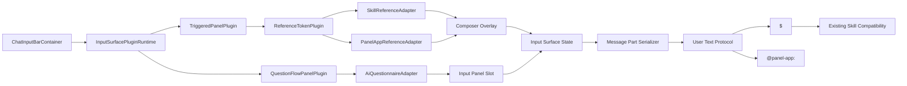

# Chat 输入面板扩展插件化设计

## 背景

Chat 输入面板当前已经支持输入 `/` 选择 skill。这个能力本质上不是“skill 专属功能”，而是输入区域把用户意图转换成结构化交互，再把交互结果带入后续运行上下文。

输入区域未来不只会有文本触发能力。除了 `/command`、`@Panel App`、`#file` 这类 composer 内联能力，还可能出现 AI 主动向用户追问时展示在输入框上方的选择题、确认面板、短表单或多步补全流程。

如果继续把 `/ skill` 当成局部特例，后续每种能力都会增加平行分支：

- 每个触发符自己检测输入。
- 每类候选自己做搜索、排序、最近项和 loading。
- 每类 token 自己插入、删除、序列化和回显。
- 每种输入框上方面板自己管理展示、提交、取消和发送结果。
- 发送链路需要反复为每类功能补 metadata。
- AI 上下文需要为每类功能临时补 prompt。

这会让输入面板从统一入口变成功能拼盘，违背 NextClaw “统一入口、能力编排、生态扩展”的产品方向。

本设计目标是把输入面板中的高级输入能力抽成通用、解耦、可插拔的 input surface plugin 机制。这里的“插件化”不是每个功能都复制一套完整插件框架，而是先定义少数足够稳定的基础插件原语，再让领域插件基于这些原语组合出更高级的能力。第一期先迁移现有 `/ skill`，再新增 `@ Panel App` 引用能力，用一个真实的新触发符验证内联插件；同时把 AI 追问面板纳入同一套机制的设计边界，避免后续另起炉灶。

## 现状依据

当前链路已经查到这些事实：

- `packages/nextclaw-ui/src/features/chat/features/input/components/chat-input-bar.container.tsx` 直接持有 `slashQuery`，并用 `buildChatSlashItems(skillRecords, slashQuery, ...)` 只构造 skill 候选。
- `packages/nextclaw-ui/src/features/chat/features/input/utils/chat-input-bar.utils.ts` 的 slash 搜索、排序、recent 优先级和菜单 item 模型全部以 `ChatSkillRecord` 为中心。
- `packages/nextclaw-agent-chat-ui/src/components/chat/view-models/chat-ui.types.ts` 中 `ChatComposerTokenKind` 只有 `"skill" | "file"`，`ChatSlashItem` 也是 slash 专用模型。
- `packages/nextclaw-agent-chat-ui/src/components/chat/ui/chat-input-bar/chat-composer.utils.ts` 只实现 `resolveChatComposerSlashTrigger`，触发符正则写死 `/`。
- `packages/nextclaw-agent-chat-ui/src/components/chat/ui/chat-input-bar/lexical/chat-composer-lexical-operations.ts` 里有 `insertSkillTokenIntoChatComposer` 和 `insertFileTokenIntoChatComposer`，token 插入不是通用能力。
- `packages/nextclaw-ui/src/features/chat/features/input/utils/chat-composer-state.utils.ts` 会把 skill token 序列化成 `$<skill-ref>` 文本，并把 `selectedSkills` 从 composer node 中派生出来。
- `packages/nextclaw-ui/src/features/chat/features/session/utils/chat-run-metadata.utils.ts` 只把 skill token 写入 `requested_skill_refs` 和 `ui_inline_tokens`。
- `packages/nextclaw-kernel/src/contributions/context-provider/providers/native-static-context.provider.ts` 已有 Chat Composer Tokens 静态上下文，但只解释 `$<skill-spec>`。
- `packages/nextclaw-core/src/features/agent/utils/skill-context.utils.ts` 和 `SkillsContextProvider` 只读取 skill metadata 来激活 skill context。
- Panel App 已有可复用事实源：`usePanelApps()` 调用 `nextclawClient.panelApps.listPanelApps()`，后端 `PanelAppManager.listPanelApps()` 返回 `id`、`appId`、`title`、`description`、`contentPath`、`favorite`、`lastOpenedAt` 等候选信息。

核心结论：这次不能只把 `slashItems` 改成数组拼接；通用层必须抽象触发检测、候选面板、token 插入、composer state 和 panel flow；产品层 adapter 负责接入候选事实源，并把 token 序列化成稳定文本协议。

## 设计原则

- `single-fact-owner`：composer node 是输入内容中 inline token 的唯一事实源；`selectedSkills` 这类字段只能作为兼容派生，不应继续扩成多套平行选中状态。
- `zero-business-core`：通用 input surface core 只认识编辑器状态、触发、overlay、panel、token draft、键盘交互和 UI action；不能认识 skill、Panel App、command、AI 追问、metadata 字段或任何 NextClaw 业务对象。
- `information-expert`：Panel App 候选信息由 Panel App owner 提供，skill 候选信息由 session skills owner 提供；产品侧插件可以闭包捕获这些事实源，但通用插件 runtime 不能感知这些事实源。
- `protected-variations`：触发符、候选搜索、token 形态和 panel flow 是编辑器层稳定变化点，应放到 input surface contribution contract 后面；业务对象解析和上下文注入若未来需要，应独立于输入插件设计。
- `abstraction-calibration`：插件化只抽真实变化点，不把输入面板升级成任意运行时插件系统。第一期的“插件”是前端内部 typed contribution，不是外部 marketplace 插件执行环境。
- `boundary-only-defense`：解析用户输入的容错在 editor/input surface 边界做；解析业务事实、API 数据和文本协议的容错在对应业务 owner 边界做。
- `tell-dont-ask`：产品发送链路告诉序列化 owner “把 token 转成文本/message part”，而不是让通用 editor core 知道每个领域的运行细节。
- `composition-over-inheritance`：高级插件可以基于基础插件实现，但优先通过组合、配置和装饰复用基础能力，不用 class 继承链隐藏控制流。
- `small-core-open-edges`：核心协议越小越好，只稳定事件匹配、贡献 UI、处理用户动作和返回 generic action/event；搜索权重、领域事实、文本协议和未来上下文解析全部留给产品侧 owner。

## 核心判断

推荐把这套能力命名为 `Chat Input Surface Plugins`，而不是继续叫 `slash menu`、`skill picker` 或 `composer extensions`。

输入面板不是一个单一 textarea，而是一个 input surface。它至少包含三个可扩展区域：

1. **Composer**：用户输入自然语言、inline token、附件等内容。
2. **Composer Overlay**：基于光标和文本触发的候选菜单，例如 `/ skill`、`@ Panel App`。
3. **Input Panel Slot**：输入框上方的临时交互面板，例如 AI 追问选择题、确认、短表单。

因此，`/ skill`、`@ Panel App` 只是 input surface plugin 的一种：`composer reference plugin`。AI 向用户提问的选择题面板是产品侧基于 `question-flow-panel plugin` 的一种 adapter。

这套机制在通用 core 里只包含四个更稳定的概念：

1. **Surface Event**：输入面板里发生了什么，例如 composer text changed、selection changed、panel action submitted。
2. **Contribution**：插件要贡献什么展示层 UI，例如候选菜单、inline token draft、输入框上方面板、toolbar accessory。
3. **Action Handler**：用户做出选择、提交表单或取消时，插件如何把动作转成 editor patch、panel state patch 或 host event。
4. **Host Event**：通用 core 不理解的业务事件，只按 `pluginKey + eventName + payload` 交还给产品层 owner。

发送 metadata 和 AI 上下文不属于通用插件 core。第一期新增的 `@ Panel App` 也不新增运行 metadata；它像 skill 选择一样，只是把用户选择转成稳定的文本协议。已有 `/ skill` 继续兼容历史 `requested_skill_refs`，但这属于 skill 既有运行合同，不是 input surface core 的通用要求。

composer trigger 和 provider 仍然是多对多关系：

- `/` 触发符第一期先挂 skill provider，未来可挂 command provider。
- `@` 触发符第一期挂 Panel App provider，未来可挂 people、agent、session 等 provider。
- 同一个 trigger 下可以分组展示多个 provider 的候选。

token 和文本协议不是一回事：

- `skill` token 第一阶段继续序列化为 `$<skill-ref>`，并保留既有 `requested_skill_refs` 兼容合同。
- `panel_app` token 第一阶段只序列化为 `@panel-app:<appId>` 文本，不自动生成运行 metadata，不自动打开、不自动授权、不自动调用 Service App。
- `file` token 仍表示附件，不进入这个触发菜单机制，除非未来设计 `#file` 时再接入同一套 token contract。

更重要的是，插件模型应分成四层：

1. **最小插件协议**：只定义 `ctx -> contribution -> action/host event` 的函数式合同，不知道任何业务和运行语义。
2. **基础触发面板插件**：只负责“输入某个 trigger 后，在 input surface 上贡献一个面板”。它不认识 token、skill、Panel App 或 command。
3. **通用组合插件**：基于触发面板插件封装更具体但仍业务无关的骨架，例如 `reference-token`、`command-action`、`question-flow-panel`。它们只认识“引用对象”“动作项”“多步表单/选择题”这类展示/编辑器抽象。
4. **产品侧插件 adapter**：把 NextClaw 的事实源或业务语义接入通用组合插件，例如 `skill-reference` 基于 `reference-token`，`panel-app-reference` 基于 `reference-token`，未来 `slash-command` 基于 `command-action`，`ai-questionnaire` 基于 `question-flow-panel`。这些 adapter 不进入通用 core。

这样“插件可以基于另一个插件实现”，但依赖关系是显式组合关系，不是隐式继承关系。

## 第一期新增功能推荐

第一期新增 `@ Panel App`，不新增 `/command`。

原因：

- `@ Panel App` 能验证真正的新触发符、新 token kind、新候选事实源和纯文本协议输出，能证明插件机制不是只把 skill 代码换个名字。
- Panel App 已有列表 API 和前端 hook，第一期不用先发明后端数据源。
- 用户价值明确：用户可以在输入里引用某个 Panel App，让 AI 围绕它讨论、解释、完善或修改。
- 风险可控：引用 Panel App 不等于执行 Panel App，不触发授权、不创建 bridge session、不调用 service action。
- 它强化 NextClaw 作为统一入口的地位：用户不用先打开 Panel Apps 页面找名字，再回到 chat 描述；直接在 chat 中引用应用对象。

暂不选择 `/command` 的原因：

- `/command` 和现有 `/skill` 共用触发符，第一期不容易验证多 trigger 能力。
- command 语义天然接近执行，容易提前卷入权限、确认、可撤销、运行状态、历史命令、CLI/self-management 边界。
- NextClaw 已有命令、skill、自管理指令和工具调用多套语义，贸然做 command 可能先扩大产品概念负担。
- `/command` 更适合作为第二期，在 `/` trigger 支持多 provider 分组后接入。

## 第一期实现范围

第一期目标不是“把所有 input surface 能力一次做完”，而是交付一个最小但真实的插件机制闭环：

1. **通用机制改造**：把现有 `/ skill` 的 slash 专用链路迁到业务无关的 input surface plugin core。
2. **现有能力迁移**：`/ skill` 行为保持不变，但内部改成 `skill-reference adapter -> reference-token plugin -> triggered-panel plugin`。
3. **新增真实能力**：实现 `@ Panel App` 引用，作为第一期验证插件机制的产品侧 adapter。
4. **文本协议落地**：`@ Panel App` 选择后发送为普通文本 `@panel-app:<appId>`，不新增 metadata、kernel provider 或运行时 side channel。
5. **未来能力预留**：在通用 core 保留 `panel` placement 和 `question-flow-panel` 最小合同，但第一期不实现完整 AI 多步追问协议。

第一期明确交付：

- `/ skill` 迁移到通用插件机制，用户体验不变。
- 输入 `@` 能搜索并选择 Panel App。
- 选择后插入 `panel_app` token/chip。
- 发送后消息正文保留 `@panel-app:<appId>` 纯文本协议，同时消息展示层可以从该文本协议重新渲染为 inline token。
- AI 只能从用户消息文本看到该引用；若后续需要自动解析为上下文，应做独立文本协议解析能力，而不是让输入插件写 metadata。
- `agent-chat-ui` 不知道 skill、Panel App、command、AI input request 和 metadata。
- 高阶产品 adapter 直接 `return createReferenceTokenPlugin({...})`，不 patch 低阶插件 result。

第一期只预留，不完整实现：

- `/command`。
- AI 多步追问真实运行协议。
- `#file`、`@agent`、`@user`、`@session`。
- 第三方外部插件 SDK、权限、沙箱、版本协商。

第一期选择 `@ Panel App` 而不是 AI 多步追问作为新增能力，是因为 `@ Panel App` 能验证新 trigger、新 token、新产品 source 和纯文本协议输出，且不要求同时改 run/inbox 协议。AI 多步追问仍然是设计必须覆盖的用例，但更适合作为第二阶段真实产品能力。

## 产品体验

### `/ skill`

现有用户体验应保持不变：

1. 用户输入 `/` 或 `/query`。
2. 弹出候选菜单。
3. 候选列表展示 skill 名称、scope、description、ref。
4. Enter/Tab/点击选择后插入 skill chip。
5. 发送时仍激活对应 skill。

迁移完成后，用户不应感知 `/ skill` 行为变化。

### `@ Panel App`

新增体验：

1. 用户输入 `@` 或 `@query`。
2. 弹出 Panel App 候选菜单。
3. 候选按 smart 排序：favorite、最近打开/更新、名称匹配。
4. 候选展示 title、appId、description、最近打开/更新或 fileName。
5. 用户选择后插入 `panel_app` chip，例如 `@ 数据判断器`。
6. 用户继续输入：“帮我完善这个交互”。
7. 发送后消息文本包含 `@panel-app:<appId>`，和用户手写该协议文本等价。

第一期选择 `@Panel App` 只做引用，不做：

- 自动打开 Panel App。
- 自动记录 open count。
- 自动 grant client。
- 自动创建 bridge session。
- 自动调用 service action。
- 自动读取完整 HTML 内容。

如果用户明确要求“打开这个 App”，仍走已有 Panel App 打开链路；如果用户要求“修改这个 App”，后续应由文本协议解析或已有产品能力把 `@panel-app:<appId>` 解析到真实 Panel App，而不是由输入插件直接注入运行上下文。

## 架构总览



分层目标：

- `agent-chat-ui` 只提供通用 input surface primitive：composer、overlay、panel slot、token node、键盘交互。
- `nextclaw-ui chat input feature` 负责把 NextClaw 产品事实源包装成产品侧 plugin adapter。
- `ChatInputManager` 负责 input surface state 与发送前快照，不知道每个插件的搜索、表单或问题细节。
- `ChatRunManager` 负责发送 envelope，不知道 Panel App 如何查询。
- `kernel` 第一阶段不感知 `@ Panel App` 输入插件；它看到的只是用户消息文本。
- `PanelAppManager` 继续是 Panel App 事实 owner。

## 合同设计

### 极简插件模型

推荐把通用 core 能力压到三个边；运行时采用函数式 plugin：

```ts
type InputSurfacePlugin = (
  ctx: InputSurfacePluginContext,
  next: InputSurfaceNext,
) => Promise<InputSurfacePluginResult> | InputSurfacePluginResult;
```

这三个边分别回答：

- `ctx`：读取编辑器和展示层状态，例如 composer nodes、selection、composition state、panel state。
- `contribution`：插件要贡献什么展示层 UI，例如 overlay items、输入框上方面板、token draft。
- `action`：用户对插件 UI 做动作后如何改变 editor/panel state，或者向宿主发出 generic host event。

通用 core 明确不提供这些能力：

- 不提供 `ctx.facts.skills`、`ctx.facts.panelApps`、`ctx.facts.commands`。
- 不提供 presenter、manager、client、kernel API。
- 不提供运行 metadata builder。
- 不提供 AI input request 这类业务对象。

业务事实源只能由产品侧 adapter 通过闭包传给产品插件。也就是说，core 插件只知道“有一个 source 函数”，不知道这个 source 背后是 skill、Panel App、command 还是别的东西。

高阶插件基于低阶插件时，推荐函数体直接返回低阶插件调用：

```ts
function createSomeProductPlugin(deps: ProductDeps): InputSurfacePlugin {
  return createSomeGenericPlugin({
    key: "some-product-plugin",
    source: (query) => deps.someOwner.search(query),
    toItem: productItemToGenericItem,
    onSelect: productItemToGenericAction,
  });
}
```

不推荐高阶插件先调用低阶插件，再修改低阶插件返回值：

```ts
function createSomeProductPlugin(deps: ProductDeps): InputSurfacePlugin {
  const base = createSomeGenericPlugin(...);

  return async (ctx, next) => {
    const result = await base(ctx, next);
    return patchResultWithProductBehavior(result);
  };
}
```

如果高阶插件必须 patch 低阶返回值，通常说明低阶插件缺少一个清晰配置点。正确做法是把这个变化点提升为低阶插件参数，而不是堆一层 wrapper。

不推荐：

- 用 class inheritance 表达 `PanelAppMentionExtension extends MentionExtension`。继承会让控制流、默认行为和覆盖点变隐蔽。
- 为每个领域插件复制完整 trigger/menu/token 逻辑。
- 让基础插件知道 skill、Panel App、command 等领域名。
- 把所有能力塞进一个巨大的 `ChatInputSurfacePluginManager` 再用 `switch(kind)` 分发。
- 把 `ctx` 做成全能 service locator，让插件越过 editor/display 边界直接读写业务系统。

### 示例代码框架

下面是一份用于 review 设计形状的示例代码，不是最终命名承诺。重点是看“基础插件如何被更高级插件组合”，以及插件拿到的 `ctx` 是受限能力，不是整个 presenter。

```ts
type InputSurfacePlugin = (
  ctx: InputSurfacePluginContext,
  next: InputSurfaceNext,
) => Promise<InputSurfacePluginResult>;

type InputSurfacePluginContext = {
  readonly event: InputSurfaceEvent;
  readonly composer: {
    getNodes: () => InputComposerNode[];
    getSelection: () => InputComposerSelection | null;
    resolveTrigger: (trigger: InputTriggerSpec) => InputTriggerMatch | null;
  };
  readonly panel: {
    getState: (panelId: string) => unknown;
  };
};

type InputSurfacePluginResult = {
  readonly contributions: InputSurfaceContribution[];
  readonly handlers: Record<string, InputSurfaceActionHandler>;
};

type InputSurfaceAction =
  | { type: "composer.replaceRangeWithToken"; range: InputTextRange; token: InputTokenDraft }
  | { type: "panel.setState"; panelId: string; state: unknown }
  | { type: "host.event"; pluginKey: string; eventName: string; payload: unknown }
  | { type: "noop" };
```

最底层的 trigger 面板插件只负责把“输入命中”变成“面板 contribution”：

```ts
type TriggeredPanelPluginConfig<TItem> = {
  key: string;
  trigger: InputTriggerSpec;
  loadItems: (query: string, ctx: InputSurfacePluginContext) => Promise<TItem[]> | TItem[];
  toPanelItem: (item: TItem) => InputPanelItem;
  onSelect: (item: TItem, ctx: InputSurfaceActionContext) => InputSurfaceAction;
};

function createTriggeredPanelPlugin<TItem>(
  config: TriggeredPanelPluginConfig<TItem>,
): InputSurfacePlugin {
  return async (ctx, next) => {
    const base = await next(ctx);
    const match = ctx.composer.resolveTrigger(config.trigger);

    if (!match) {
      return base;
    }

    const items = await config.loadItems(match.query, ctx);
    const panelItems = items.map((item) => ({
      item,
      panelItem: config.toPanelItem(item),
    }));
    const panelId = `${config.key}:${match.range.start}`;

    return mergeInputSurfaceResults(base, {
      contributions: [
        {
          id: panelId,
          pluginKey: config.key,
          placement: "composer-overlay",
          anchorRange: match.range,
          items: panelItems.map(({ panelItem }) => panelItem),
        },
      ],
      handlers: {
        [`${panelId}:select`]: (actionCtx) => {
          const selectedItem = panelItems.find(({ panelItem }) => {
            return panelItem.key === actionCtx.itemKey;
          })?.item;

          return selectedItem
            ? config.onSelect(selectedItem, actionCtx)
            : { type: "noop" };
        },
      },
    });
  };
}
```

`reference-token` 不重新写一套插件，而是基于 `createTriggeredPanelPlugin` 封装：

```ts
type ReferenceTokenPluginConfig<TItem> = {
  key: string;
  trigger: InputTriggerSpec;
  source: (query: string) => Promise<TItem[]> | TItem[];
  toSuggestion: (item: TItem) => InputPanelItem;
  toToken: (item: TItem) => InputTokenDraft;
};

function createReferenceTokenPlugin<TItem>(
  config: ReferenceTokenPluginConfig<TItem>,
): InputSurfacePlugin {
  return createTriggeredPanelPlugin<TItem>({
    key: config.key,
    trigger: config.trigger,
    loadItems: (query) => config.source(query),
    toPanelItem: config.toSuggestion,
    onSelect: (item, actionCtx) => ({
      type: "composer.replaceRangeWithToken",
      range: actionCtx.triggerRange,
      token: config.toToken(item),
    }),
  });
}
```

然后产品领域插件就会非常薄：

```ts
function createSkillReferencePlugin(deps: {
  readonly skills: SkillSuggestionSource;
}): InputSurfacePlugin {
  return createReferenceTokenPlugin<SkillSuggestion>({
    key: "skills",
    trigger: { key: "slash", marker: "/", boundary: "start-or-whitespace" },
    source: (query) => deps.skills.search(query),
    toSuggestion: skillToSuggestionItem,
    toToken: (skill) => ({
      tokenKind: "skill",
      providerKey: "skills",
      tokenKey: skill.ref,
      label: skill.name,
      rawText: `$<${skill.ref}>`,
    }),
  });
}

function createPanelAppReferencePlugin(deps: {
  readonly panelApps: PanelAppSuggestionSource;
}): InputSurfacePlugin {
  return createReferenceTokenPlugin<PanelAppSuggestion>({
    key: "panel-apps",
    trigger: { key: "mention", marker: "@", boundary: "start-or-whitespace" },
    source: (query) => deps.panelApps.search(query),
    toSuggestion: panelAppToSuggestionItem,
    toToken: (app) => ({
      tokenKind: "panel_app",
      providerKey: "panel-apps",
      tokenKey: app.appId,
      label: app.title,
    }),
  });
}
```

`requested_skill_refs`、`referenced_panel_apps` 不在通用插件里生成。第一期只有 skill 继续走既有 `requested_skill_refs` 兼容合同，Panel App 只由消息序列化逻辑转成文本：

```ts
serializeTokenToText({ tokenKind: "panel_app", tokenKey: "task-board" });
// => "@panel-app:task-board"
```

未来 `/command` 也不需要复制 trigger 面板逻辑，只要换掉 select 行为：

```ts
function createSlashCommandPlugin(deps: {
  readonly commands: SlashCommandSuggestionSource;
}): InputSurfacePlugin {
  return createTriggeredPanelPlugin<SlashCommand>({
    key: "slash-commands",
    trigger: { key: "slash", marker: "/", boundary: "start-or-whitespace" },
    loadItems: (query) => deps.commands.search(query),
    toPanelItem: commandToSuggestionItem,
    onSelect: (command) => ({
      type: "host.event",
      pluginKey: "slash-commands",
      eventName: "commandSelected",
      payload: { commandKey: command.key },
    }),
  });
}
```

AI 多题追问面板不由 composer trigger 触发，但仍然返回同一种 panel contribution。通用 core 不知道这是 AI，只知道它是一个多步 question flow：

```ts
type QuestionFlowPluginConfig<TFlow> = {
  key: string;
  source: () => TFlow | null;
  getCurrentStep: (flow: TFlow) => QuestionFlowStep;
  getProgress: (flow: TFlow) => { current: number; total: number };
  onAnswer: (flow: TFlow, answer: QuestionFlowAnswer) => InputSurfaceAction;
  onBack?: (flow: TFlow) => InputSurfaceAction;
  onCancel?: (flow: TFlow) => InputSurfaceAction;
};

function createQuestionFlowPanelPlugin<TFlow>(
  config: QuestionFlowPluginConfig<TFlow>,
): InputSurfacePlugin {
  return createPanelContributionPlugin<TFlow>({
    key: config.key,
    placement: "above-composer",
    source: config.source,
    toPanel: (flow) => {
      const step = config.getCurrentStep(flow);

      return {
        title: step.title,
        description: step.description,
        progress: config.getProgress(flow),
        controls: questionStepToControls(step),
        actions: questionStepToActions(step),
      };
    },
    onAction: (flow, action) => {
      if (action.name === "answer") {
        return config.onAnswer(flow, action.answer);
      }

      if (action.name === "back") {
        return config.onBack?.(flow) ?? { type: "noop" };
      }

      if (action.name === "cancel") {
        return config.onCancel?.(flow) ?? { type: "noop" };
      }

      return { type: "noop" };
    },
  });
}

function createAiQuestionnairePlugin(deps: {
  readonly questionnaire: ActiveQuestionnaireSource;
}): InputSurfacePlugin {
  return createQuestionFlowPanelPlugin<ActiveQuestionnaire>({
    key: "ai-questionnaire",
    source: () => deps.questionnaire.getActive(),
    getCurrentStep: (flow) => flow.steps[flow.currentStepIndex],
    getProgress: (flow) => ({
      current: flow.currentStepIndex + 1,
      total: flow.steps.length,
    }),
    onAnswer: (flow, answer) => ({
      type: "host.event",
      pluginKey: "ai-questionnaire",
      eventName: "answerSubmitted",
      payload: { flowId: flow.id, stepId: flow.steps[flow.currentStepIndex]?.id, answer },
    }),
    onBack: (flow) => ({
      type: "host.event",
      pluginKey: "ai-questionnaire",
      eventName: "backRequested",
      payload: { flowId: flow.id },
    }),
    onCancel: (flow) => ({
      type: "host.event",
      pluginKey: "ai-questionnaire",
      eventName: "cancelRequested",
      payload: { flowId: flow.id },
    }),
  });
}
```

这就是期望效果：高阶插件函数直接 `return createLowerLevelPlugin({...})`，业务差异通过参数传入低阶插件；如果低阶插件不够表达，就补低阶插件参数，而不是 patch 它的返回值。

### 基础插件原语

第一期建议只设计四个基础插件原语，先不要扩成完整 UI plugin SDK：

```text
triggered-panel plugin
  用于“输入某个 trigger 后打开一个 contribution 面板”。它是 / skill、/ command、@ Panel App 的共同底座。

reference-token plugin
  基于 triggered-panel plugin，用于 / skill、@ Panel App、未来 @ Agent、# File 等“引用某个对象”的能力。

question-flow-panel plugin
  用于在输入框上方展示单步或多步选择题、确认、短表单。它不一定由文本 trigger 触发，但复用同一套 panel contribution 和 action contract；AI 追问只是一个产品侧 adapter。

command-action plugin
  基于 triggered-panel plugin，预留给未来 /command 这类会触发动作的能力，第一期不实现。
```

`reference-token plugin` 贡献 composer overlay 和 inline token。

`triggered-panel plugin` 是更底层的“输入触发面板”原语。它只关心四件事：

1. 当前 composer selection 是否命中某个 trigger。
2. 命中后如何加载候选或面板模型。
3. 如何把模型转换成一个 overlay/panel contribution。
4. 用户选择、提交或取消时，如何返回 input surface action。

因此，`/ skill`、未来 `/command` 和 `@ Panel App` 不应该各自实现 trigger 检测、面板打开、键盘选择、取消关闭。它们应该基于同一个 `triggered-panel plugin` 封装。

`question-flow-panel plugin` 贡献 input panel slot。它的输入来自外层 source，可以是 AI 追问、系统确认、安装向导或其它产品流程；通用插件不知道 source 的业务含义。例如产品侧可以把 AI 的结构化 input request 适配成下面这种 flow：

```ts
type QuestionFlowRequest = {
  id: string;
  currentStepIndex: number;
  steps: Array<{
    id: string;
    kind: "single_choice" | "multi_choice" | "form" | "confirm";
    title: string;
    description?: string;
    options?: Array<{ key: string; label: string; description?: string }>;
    fields?: Array<{ key: string; label: string; type: "text" | "textarea" | "select" }>;
  }>;
};
```

`question-flow-panel plugin` 不负责决定问题来自哪里、下一步业务状态如何更新，也不负责把答案发给运行时。它只负责把当前 step 渲染成输入面板交互，并把用户的 answer/back/cancel 变成 generic host event。产品侧 adapter 再决定是进入下一题、全部完成、发送 follow-up，还是写入 active run inbox。

### Composer Reference Contribution

`/ skill`、`@ Panel App` 这种能力不应直接实现完整插件，而应作为 `reference-token plugin` 的专用配置：

```ts
type ReferenceTokenPluginConfig<TItem> = {
  key: string;
  trigger: InputTriggerSpec;
  source: (query: string) => TItem[] | Promise<TItem[]>;
  toSuggestion: (item: TItem) => InputSuggestionItem;
  toToken: (item: TItem) => InputTokenDraft;
};
```

关键约束：

- `key` 是 contribution 身份，例如 `skills`、`panel-apps`。
- `trigger` 描述触发符，不直接写正则到 composer。
- `source` 是产品侧传入的闭包；通用插件只调用它，不知道它背后的业务 owner。
- `toToken` 只返回 token draft，不直接修改 editor。
- 运行 metadata 不进入 reference-token 插件；Panel App 第一阶段也不新增运行 metadata。
- contribution 不持有业务生命周期，不直接调用 presenter。

### Trigger Spec

```ts
type InputTriggerSpec = {
  key: string;
  marker: "/" | "@" | (string & {});
  boundary: "start-or-whitespace";
  minQueryLength?: number;
};
```

第一期只支持单字符 marker 与 `start-or-whitespace` 边界。不要一开始支持复杂语法、嵌套 trigger 或多字符 command prefix；这些可以等真实需求出现后扩展。

### Suggestion Item

```ts
type InputSuggestionItem = {
  key: string;
  providerKey: string;
  tokenKey: string;
  title: string;
  subtitle?: string;
  description?: string;
  detailLines?: string[];
  keywords?: string[];
  score?: number;
  disabled?: boolean;
  disabledReason?: string;
};
```

菜单组件只认识通用 item，不认识 skill 或 Panel App。领域字段保留在产品侧 provider 内部，必要时由产品侧 adapter 通过 `tokenKey` 再解析。

### Token Node

当前 token node 需要从 `"skill" | "file"` 升级为稳定开放的内联 token：

```ts
type InputTokenKind =
  | "skill"
  | "file"
  | "panel_app"
  | (string & {});

type InputTokenNode = {
  id: string;
  type: "token";
  tokenKind: InputTokenKind;
  tokenKey: string;
  label: string;
};
```

token node 不存完整 Panel App entry，也不必保存业务 rawText，避免 composer state 变成领域数据缓存。发送阶段由产品侧消息序列化规则把 token 转成普通文本协议：

- skill：`$<skill-ref>`，保持现状。
- panel_app：`@panel-app:<appId>`。
- file：附件不一定需要 rawText，继续由 file part 表达。

### Inline Token Metadata

现有 `ui_inline_tokens` 第一阶段保持 skill 回显兼容用途，不升级为 Panel App 运行语义通道：

```ts
type ChatInlineTokenSource = {
  kind: string;
  key: string;
  label: string;
  rawText: string;
};
```

`@ Panel App` 不写入 `ui_inline_tokens` 或 `referenced_panel_apps`。它只出现在用户消息文本里，即 `@panel-app:<appId>`。消息展示层如需回显 chip，必须从这段文本协议派生 `panel_app` inline token；这仍然是纯展示解析，不是输入插件 metadata，也不是 kernel context。

### Question Flow Panel Contribution

多步追问面板不复用 token contract，也不走 slash menu。它应基于同一个 input surface plugin runtime，贡献 `panel` 类型 UI：

```ts
type InputPanelContribution = {
  id: string;
  pluginKey: string;
  placement: "above-composer";
  title: string;
  description?: string;
  controls: InputPanelControl[];
  actions: InputPanelAction[];
};

type InputPanelControl =
  | { kind: "single_choice"; key: string; options: InputPanelOption[] }
  | { kind: "multi_choice"; key: string; options: InputPanelOption[] }
  | { kind: "text"; key: string; label: string; multiline?: boolean };
```

这个 panel contribution 和 composer overlay contribution 是平级能力：

- overlay 负责“用户正在输入时的候选补全”。
- panel 负责“系统已经需要用户补充结构化信息”。

二者共享同一个插件 runtime 和 action handler，但不强行共享 UI 组件，也不共享业务提交逻辑。

第一期实现可以只把 panel contribution 作为合同边界预留，不必马上实现完整 AI 追问协议；但 input surface 的状态模型和插件结果类型不能写死成 `slashItems` 或 `composerOnly`。

## Owner 与落点

### `agent-chat-ui`

职责：

- 提供通用 input surface primitive。
- 提供通用 trigger 检测和 suggestion menu。
- 提供输入框上方 panel slot 的宿主能力。
- 提供通用 token 插入、删除、导航、选择、键盘交互。
- 提供 token chip 基础渲染能力。

建议重命名或新增：

- `ChatSlashMenu` -> `ChatComposerSuggestionMenu`。
- `ChatSlashItem` -> `ChatComposerSuggestionItem`。
- `resolveChatComposerSlashTrigger` -> `resolveChatComposerTrigger`。
- `insertSkillTokenIntoChatComposer` -> `insertTokenIntoChatComposer`。
- `syncSelectedSkillsIntoChatComposer` -> 保留为 skill toolbar adapter，但内部调用通用 token API。
- 新增 `ChatInputPanelSlot` 作为输入框上方可插拔 panel 宿主。
- 新增通用 input surface plugin 类型、runtime、`triggered-panel`、`reference-token`、`question-flow-panel`、`command-action`。

不负责：

- 不查询 skill。
- 不查询 Panel App。
- 不知道 `requested_skill_refs`。
- 不读 NextClaw API。

### 目录组织设计

目录组织按 `nextclaw-solution-design`、`collapsible-feature-root-architecture`、`role-first-file-organization` 和 `file-naming-convention` 的规则切分：

1. **跨项目可复用协议与函数式插件原语进入 `agent-chat-ui/src/lib/input-surface/`**。
   - `lib/` 是模块容器，不直接放文件；`input-surface/index.ts` 是该模块唯一公共出口。
   - 这里放 `input-surface.types.ts` 和 `input-surface-plugin.utils.ts`，只表达 trigger、item、panel、plugin、resolve state 等通用编辑器/展示层合同。
   - 这里不导入 NextClaw UI API、skill、Panel App、i18n、presenter、manager、kernel 或 runtime。
2. **带 NextClaw 默认皮肤的可复用 UI 组件进入 `agent-chat-ui/src/components/chat/ui/input-surface/`**。
   - `ChatInputSurfaceMenu` 依赖 `ChatUiPrimitives` 和 chat default skin，因此不放进纯 `lib`。
   - 它仍然是业务无关组件，只认识 `ChatInputSurfaceMenuProps`。
3. **chat input bar 只作为消费者**。
   - `components/chat/ui/chat-input-bar/` 保留 composer、Lexical adapter、toolbar、兼容 `ChatSlashMenu` wrapper。
   - 不再把 input surface core 私藏在 `chat-input-bar/input-surface/`。
4. **NextClaw 产品 adapter 留在 `nextclaw-ui` 的 chat feature 内部**。
   - `packages/nextclaw-ui/src/features/chat/features/input/input-surface-plugins/` 放 `skill-reference`、`panel-app-reference`、搜索排序和产品数据类型。
   - 这些文件可以闭包捕获 session skills、Panel App list、i18n 文案，但不进入共享 UI 包。
5. **业务 hook 保持 feature owner**。
   - `use-chat-input-surface-state.ts` 位于 `features/chat/features/input/hooks/`，负责把产品数据、i18n、插件数组和当前 trigger 组装起来。
   - 它不是通用组件，不放入 `shared/lib` 或 `agent-chat-ui/lib`。

本次为 `packages/nextclaw-agent-chat-ui` 的 `module-structure.config.json` 显式允许 `src/lib/`，原因是该包本身是跨项目 UI primitives 包，input surface core 需要作为模拟独立包的小模块暴露，而不是作为某个 chat input bar 私有实现。这个调整不新增结构协议，只是对该 workspace contract 增加明确白名单。

### `nextclaw-ui` Chat Input Feature

职责：

- 组装 NextClaw 产品内的 input surface plugin adapters。
- 把 session skill records 转成 skill suggestion provider。
- 把 Panel App list 转成 Panel App suggestion provider。
- 将未来 AI input request 转成 question-flow provider。
- 把 i18n 文案传入 provider/menu/panel。
- 把通用 plugin action / host event 结果交给 `ChatInputManager` 或对应产品 owner。

建议落点：

```text
packages/nextclaw-ui/src/features/chat/features/input/input-surface-plugins/
  chat-input-product-plugin-adapters.types.ts
  skill-reference-plugin.utils.ts
  panel-app-reference-plugin.utils.ts
  ai-questionnaire-plugin.ts
  input-surface-search.utils.ts
```

第一期实际落地：

```text
packages/nextclaw-agent-chat-ui/src/lib/input-surface/
  index.ts
  input-surface.types.ts
  input-surface-plugin.utils.ts

packages/nextclaw-agent-chat-ui/src/components/chat/ui/input-surface/
  chat-input-surface-menu.tsx

packages/nextclaw-agent-chat-ui/module-structure.config.json
  allowedRootDirectories: ["lib"]

packages/nextclaw-ui/src/features/chat/features/input/input-surface-plugins/
  chat-input-product-plugin-adapters.types.ts
  input-surface-search.utils.ts
  panel-app-reference-plugin.utils.ts
  skill-reference-plugin.utils.ts

packages/nextclaw-ui/src/features/chat/features/input/hooks/
  use-chat-input-surface-state.ts
```

`agent-chat-ui` 第一阶段保留 `ChatSlashMenu`、`ChatSlashItem`、`resolveChatComposerSlashTrigger` 等兼容别名，但新增主合同已经是 `ChatInputSurfaceTriggerSpec`、`ChatInputSurfaceItem`、`ChatInputSurfaceMenuProps`、`createInputSurfaceTriggeredPanelPlugin`、`createInputSurfaceReferenceTokenPlugin` 和 `resolveChatInputSurfaceState`。后续可以逐步把内部变量名从 slash 迁到 input surface，但不需要为了命名一次性扩大 diff。

如果实现时发现 product adapter list 只是静态数组，可以先保持为纯函数，不急着创建 manager class。只有当它开始持有生命周期、缓存、订阅或跨模块协作时，再升级为产品侧 manager 并由 `ChatPresenter` 装配。

### `ChatInputManager`

职责：

- 继续拥有 composer node snapshot，并逐步成为 input surface state 的 owner。
- 由 composer nodes 派生 draft、attachments、selected skill refs。
- 持有或接收 input panel 的当前回答状态。
- 发送时把 composer nodes 交给消息序列化逻辑，输出普通 text/file message parts。
- toolbar skill picker 通过通用 token API 同步 skill token。

调整方向：

- `selectedSkills` 保留兼容，但视为 `composerNodes` 的派生字段。
- 不新增 `selectedPanelApps` 平行状态。
- 不给每个 question-flow panel 新增独立 store；question answer 应属于 input surface state 或当前 run input request state。
- 不把 Panel App 查询逻辑放进 manager。

### `ChatRunManager`

职责：

- 继续只构建 metadata 和 envelope。
- 不查询 Panel App。
- 不知道 suggestion provider。

调整方向：

- `buildChatRunMetadata` 保持现有 metadata 合同，不因为 `@ Panel App` 新增字段。
- 保持 `requested_skill_refs` 现有合同。
- 未来 AI 追问面板提交后，可以把回答作为下一次 message parts / metadata，或发送到 active run inbox；具体采用哪条链路由 run/input request owner 决定，不由 panel UI 自己调用 runtime。

### Kernel Context Provider

职责：

- `SkillsContextProvider` 继续读取 `requested_skill_refs`，不感知 Panel App。
- 第一阶段不新增 Panel App context provider。kernel 看到的是普通用户文本，后续若要支持 `@panel-app:<appId>` 解析，应作为独立文本协议解析能力设计。

### Panel App Owner

`PanelAppManager` 继续是事实 owner。`@ Panel App` 只读 `listPanelApps()` 的结果，不新增新的 Panel App 状态 owner。

如果第一期需要后端补一个轻量 detail API，应优先复用 `listPanelApps()` 的 entry shape；不要新增第二套 Panel App summary 类型。

## 数据流

### `/ skill`

```text
session skills query
  -> skill reference plugin
  -> reference-token base plugin
  -> "/" trigger suggestions
  -> skill token
  -> composerNodes
  -> selectedSkills derived from composerNodes
  -> requested_skill_refs
  -> SkillsContextProvider
```

### `@ Panel App`

```text
PanelAppManager.listPanelApps()
  -> /api/panel-apps
  -> usePanelApps()
  -> panel app reference plugin
  -> reference-token base plugin
  -> "@" trigger suggestions
  -> panel_app token
  -> composerNodes
  -> message text "@panel-app:<appId>"
  -> AI sees the same text the user could have typed manually
```

### AI 多步追问面板

```text
Agent/runtime emits structured input request
  -> chat run/input request owner writes active input request state
  -> ai questionnaire adapter maps request to question-flow source
  -> question-flow-panel plugin renders current step above composer
  -> user answers / back / cancel
  -> plugin handle returns generic host event
  -> product owner updates currentStepIndex and answer state
  -> when complete, product owner sends follow-up through run owner or inbox
  -> metadata/message carries question_answers
```

关键点：question-flow panel 和 composer reference 共享 plugin runtime，但它们不是同一个 UI 组件，也不是同一种 token。通用 core 不知道这是 AI 追问，也不知道答案最终进入 message、metadata 还是 active run inbox。

## 搜索与排序

搜索排序应抽成通用 scorer，但保留领域权重入口：

- 通用匹配：exact、prefix、token prefix、contains、description contains、subsequence。
- 通用排序：match tier > provider priority > recent/favorite > score > label。
- skill provider 可以继续用 recent skills 提升。
- Panel App provider 可以使用 favorite、lastOpenedAt、updatedAt、title/appId/description 匹配。

不要把 Panel App 的 favorite/recent 规则塞进通用 scorer；通用 scorer 只定义匹配结构，领域 provider 贡献额外 priority。

## 兼容与迁移

兼容目标：

- `/ skill` 行为不变。
- `$<skill-ref>` 纯文本序列化不变。
- `requested_skill_refs` metadata 不变。
- 现有 skill picker toolbar 不消失。
- 旧消息里的 `ui_inline_tokens` 仍能读取。
- 没有 active input request 时，input panel slot 不渲染任何内容，不影响现有输入体验。

迁移策略：

1. 先在 `agent-chat-ui` 增加 input surface contribution 形状，包含 overlay 和 panel 两类 placement。
2. 在 overlay 内增加通用 trigger/token API，同时保留 slash/skill adapter。
3. 在 `nextclaw-ui` 中用 `reference-token plugin` 复刻现有 `/ skill` 行为。
4. 删除 `ChatInputBarContainer` 中直接构造 `slashItems` 的 skill 专属逻辑。
5. 再接入 `@ Panel App` provider。
6. 验证 `@` token 发送后只变成 `@panel-app:<appId>` 普通文本。

不建议长期保留两套入口：

- 不保留 `slashMenu` 和 `suggestionMenu` 两套 props。
- 不保留 `insertSlashItem` 和 `insertSuggestionItem` 两套 handle。
- 不把 `buildInlineSkillTokensFromComposer` 扩成 Panel App metadata 主入口；Panel App 第一阶段走消息文本序列化。

## 非目标

- 不做外部插件 SDK。
- 不允许第三方运行时 JS 动态注入输入面板。
- 不实现 `/command`。
- 不实现 `#file`。
- 不实现 `@user`、`@agent`、`@session`。
- 不在第一期实现完整 AI 追问运行协议；但 input surface plugin 合同必须能承接 input panel slot。
- 不自动打开、运行、授权或调用 Panel App。
- 不把 Panel App 和 Service App 合并成同一概念。
- 不在第一期重做整个 chat input 视觉设计。
- 不把所有 toolbar 控件都迁入 extension 系统；本设计覆盖输入面板交互 surface，不接管模型选择、附件按钮等稳定 toolbar 控件。

## 方案自审与业界对比

这套设计不是凭空发明。它更接近成熟编辑器和状态系统里常见的“小核心 + contribution points + typed actions”模型，但刻意没有照搬完整外部插件系统。

### 对比 CodeMirror 6

CodeMirror 6 的 extension/facet 体系是最值得借鉴的方案之一。它把编辑器能力拆成可组合 extension，extension 可以嵌套，最终被 flatten；facet 则允许多个 extension 向同一个扩展点贡献输入，再组合成一个输出。

可借鉴点：

- contribution point 比 callback props 更稳定。
- 多个插件对同一 surface 的贡献应有明确合并规则。
- 状态字段和 UI 扩展应区分，不把所有能力塞进组件本地状态。

不直接照搬的原因：

- NextClaw 现在不是要重写一个完整 editor core。
- 我们的整体链路跨 composer、overlay、input panel、产品 metadata adapter 和 kernel context；其中通用 core 只覆盖 editor/display surface。
- 第一阶段没有第三方动态插件、安全沙箱、版本兼容需求。

结论：借 CodeMirror 的“贡献点 + 合并规则”，不借它完整的 editor extension runtime。

### 对比 ProseMirror

ProseMirror 的 plugin 能提供 state field、transaction filter、view props 和 plugin view；它非常强调 transaction 驱动的 state 更新，以及 state 和 view 的协作边界。

可借鉴点：

- 用户动作应变成明确 transaction/action，而不是直接让 UI 插件到处改状态。
- view 层插件和 state 层插件需要分开看待。
- 多个 plugin 提供同类 props 时必须有优先级、短路或合并规则。

不直接照搬的原因：

- 现有 composer 基于 Lexical，不应在产品层再模拟一套 ProseMirror transaction。
- 我们要解决的是 Chat input surface，不是富文本编辑器 schema/plugin 全栈。

结论：借它的 action/state 边界，不借它的 schema-heavy 插件模型。

### 对比 Lexical

Lexical 自己有 React plugin 和现代 Lexical Extension 机制。因为当前 composer 已经用 Lexical，编辑器内部的 token node、selection、keyboard command 应尽量通过 `agent-chat-ui` 的 Lexical primitive 实现。

可借鉴点：

- 编辑器内部行为保持在 editor primitive 层，不让产品领域插件直接操作 editor instance。
- 产品插件只返回 token draft / surface action，再由 editor owner 执行实际 mutation。

不直接照搬的原因：

- Lexical plugin 主要解决 editor 内部能力；我们的 input surface plugin 还要统一 overlay、panel、token 和产品侧 adapter 组合。
- 如果把 NextClaw 领域插件写成 Lexical plugin，会把 product domain 和 editor runtime 耦合得太深。

结论：Lexical 是底层编辑器实现，不是 NextClaw input surface plugin 的最终抽象边界。

### 对比 Redux middleware

Redux middleware 的 `storeAPI => next => action` 管道很适合表达“插件可以处理自己关心的 action，否则传给下一个插件”。这和本方案里的 `ctx + next()` 是同一类思想。

可借鉴点：

- 插件链路应显式、可排序、可测试。
- 插件不关心的事件必须交给 `next()`，不要阻断主流程。
- `ctx` 应该是受限 API，而不是整个系统对象。

不直接照搬的原因：

- middleware 只管 action flow，不直接表达 overlay、panel、token、metadata 这些 UI contribution。
- 如果只用 middleware，会让 UI 贡献结果缺少结构化合并规则。

结论：借 `next()` 管道，不把整个机制降级成 action middleware。

### 自审结论

当前推荐方案是：`triggered-panel` 作为最小 UI 触发底座，`reference-token` / `command-action` / `question-flow-panel` 作为通用组合插件，`skill-reference` / `panel-app-reference` / `ai-questionnaire` 等作为产品侧 adapter。

我认为这个方案足够通用，也足够简洁，原因是：

- 它抽的是编辑器/展示层稳定变化点：trigger、surface contribution、action、host event。
- 它没有把插件做成外部 SDK、动态执行环境或权限系统。
- 它允许插件基于插件组合，并且高阶插件可以直接 `return createLowerLevelPlugin({...})`。
- 它能覆盖三类已知需求：`/ skill`、`@ Panel App`、AI 多步追问面板。
- 它不会把 Panel App、Skill、Command、AI input request 或运行 metadata 塞进 `agent-chat-ui`。

需要防止的过度设计点：

- 不要第一期引入注册生命周期、动态加载、权限声明和版本协商。
- 不要做 class inheritance 插件体系。
- 不要让高阶插件 patch 低阶插件的返回结果；缺扩展点时补低阶配置参数。
- 不要为了“万物皆插件”把模型选择、附件按钮、发送按钮也迁进去。
- 不要让 `ctx.facts` 无限扩张成 service locator；通用 core 的 `ctx` 不允许出现业务 facts。
- 不要提前把 `/command` 做成执行系统；第一期先用 `@ Panel App` 验证引用型插件。

如果未来要支持真正第三方插件，这份方案可以升级，但升级方向应是增加 contribution manifest、权限声明、沙箱和版本合同，而不是推翻当前 input surface 基础合同。

## 风险与取舍

### 风险：抽象过大

如果一开始做成完整 plugin runtime，会引入注册生命周期、权限、动态加载、沙箱和版本兼容问题。第一期只做内部 typed function plugin pipeline，先验证真实变化点。

### 风险：过早抽运行语义

如果第一期为了让 `@ Panel App` “更智能”而新增 metadata、context provider 或 kernel 解析，会让输入插件机制过早耦合业务运行语义。第一期先保持纯文本协议；后续确实需要 AI 自动解析时，再把文本协议解析设计成独立能力。

### 风险：只抽 composer，不抽 input surface

如果核心类型仍然写死为 slash/composer/token，未来 AI 多步追问面板一定会另起一套机制。第一期即使不实现完整追问功能，也要让 plugin result 支持 `overlay` 和 `panel` 两种 placement。

### 风险：业务 facts 泄漏到 core

不能在 `InputSurfacePluginContext` 里增加 `skills`、`panelApps`、`commands`、`activeInputRequest` 之类字段。产品侧插件 adapter 可以闭包捕获这些 source，但通用 runtime 只能看到 editor/display state。

### 风险：高阶插件变成 wrapper patch

高阶插件应优先直接 `return createLowerLevelPlugin({...})`。如果必须读取低阶 result 后再追加、删除或改写 contribution，通常说明低阶插件缺少配置点，应补低阶插件参数，而不是让 wrapper 链变长。

### 风险：token 状态双写

不能新增 `selectedPanelApps` 与 composer nodes 双写。Panel App 引用必须从 composer nodes 派生；需要显示 selected state 时现场派生。

### 风险：`@ Panel App` 被误解成执行

UI 文案必须强调它是“引用”，不是打开或执行。执行仍要走已有授权和 service action 流程。

### 风险：Panel App 内容上下文过大

第一期不注入 Panel App summary、contentPath 或完整 HTML。用户明确要求审阅或修改时，再由独立能力解析文本引用并按既有文件/Panel App owner 读取。

## 验收标准

产品验收：

1. `/ skill` 迁移后行为、键盘操作、recent 排序、发送 metadata 与现状一致。
2. 输入 `@` 能出现 Panel App 候选列表。
3. 选择 Panel App 后 composer 中出现 `panel_app` chip。
4. 发送后的用户消息文本包含 `@panel-app:<appId>`，和用户手写该协议文本等价；消息展示层能把该协议文本识别并渲染为 `panel_app` inline token。
5. 发送 metadata 不包含 `referenced_panel_apps`，也不为 Panel App 新增 `ui_inline_tokens`。
6. AI 不依赖输入插件 metadata 理解 Panel App；后续自动解析应作为独立文本协议能力。
7. 选择 `@ Panel App` 不会打开 App、增加 open count、grant client 或创建 bridge session。
8. input surface plugin contract 能表达输入框上方 question-flow panel contribution，不需要新增第二套机制来支持未来 AI 多步追问。
9. AI 多步追问可以展示第 N / total 题，支持单选、多选、下一题、返回、取消和完成，且通用 core 不知道问题来自 AI。

技术验收：

1. `agent-chat-ui` 不导入 NextClaw UI API、Panel App 类型或 skill query。
2. `InputSurfacePluginContext` 不包含业务 facts，不暴露 presenter、manager、client、kernel API。
3. `agent-chat-ui/src/lib/input-surface/` 是业务无关模块，只有 `index.ts` 公共出口；chat 默认皮肤组件位于 `components/chat/ui/input-surface/`。
4. `ChatInputBarContainer` 不再直接构造 skill-only slash items，也不直接承载 question-flow 业务逻辑。
5. trigger 检测支持 `/` 和 `@`，并正确处理文本开头、空白后、token placeholder 后、中文输入法 composition。
6. token 插入、删除、Backspace/Delete、Enter/Tab、Escape 对 skill 和 panel_app 都一致。
7. 高阶插件 factory 直接返回低阶插件调用，不通过 patch result 追加行为。
8. `buildChatRunMetadata` 不依赖通用 plugin runtime，也不因为 `@ Panel App` 新增字段。
9. `SkillsContextProvider` 不感知 Panel App。
10. 没有新增 Panel App / Service App 混用合同。
11. input panel slot 在无 active contribution 时不影响布局；有 contribution 时由插件 action handler 统一提交结果。

测试建议：

- `chat-composer.utils.test.ts`：通用 trigger 检测覆盖 `/`、`@`、边界、空查询、token placeholder。
- `chat-composer-lexical-operations.test.ts`：通用 token 插入、重复 skill 去重、panel_app token 插入。
- `chat-input-bar.utils.test.ts` 或 extension tests：skill provider 搜索排序保持现状。
- `panel-app-composer-extension.test.ts`：Panel App 搜索、favorite/recent 排序、item 到 token 转换。
- `chat-composer-state.utils.test.ts`：Panel App token 序列化为 `@panel-app:<appId>` text part。
- `chat-run-metadata.utils.test.ts`：`requested_skill_refs` 保持现状，Panel App 不新增 metadata。
- `ChatInputBar` 组件测试：`@` 菜单 keyboard/mouse selection。
- `input-surface-plugin-runtime.test.ts`：同一 runtime 能同时收集 overlay contribution 和 panel contribution。
- `question-flow-panel-plugin.test.ts`：多步 flow 到 panel contribution、answer/back/cancel 到 host event。
- `input-surface-plugin-boundary.test.ts`：runtime ctx 不暴露业务 facts，高阶插件不需要 patch 低阶 result。

## 后续实现顺序

1. 在 `agent-chat-ui` 抽 input surface contribution 基础形状：`overlay` 与 `panel`。
2. 在 `agent-chat-ui` 抽通用 composer trigger、suggestion item、token 插入 API，保留 slash adapter 保证行为不变。
3. 在 `nextclaw-ui` 增加产品侧 input surface plugin adapters，注册到通用 runtime。
4. 用 `reference-token plugin` 复刻 `/ skill`。
5. 把 `ChatInputBarContainer` 从 skill-only slash model 迁移到 plugin runtime。
6. 增加 Panel App reference plugin，接入 `usePanelApps()`。
7. 验证 Panel App token 发送后只生成 `@panel-app:<appId>` 文本，不新增 metadata。
8. 为 `question-flow-panel plugin` 保留最小 contract 和空 panel slot；完整 AI 多步追问协议进入后续设计。
9. 补齐单元测试和组件测试。
10. 最后做一次可维护性复核：删除旧 slash/skill 专用 helper，避免新旧两套长期并存。

## Review 重点

需要重点确认的问题：

1. 第一期是否确定选择 `@ Panel App`，而不是 `/command`。
2. Panel App token 的稳定 key 用 `id`、`appId`，还是同时存二者。
3. `panel_app` token 的 rawText 使用 `@panel-app:<appId>` 还是其它用户可读格式。
4. input surface core 是否第一期就保留 `panel` placement，还是只在类型层预留。
5. AI 追问答案未来应该作为下一次 user message、run inbox 追加消息，还是独立 metadata patch。
7. toolbar skill picker 是否在第一期同步迁移到通用 token API，还是先保留 adapter 包装。

## 参考资料

- [CodeMirror System Guide](https://codemirror.net/docs/guide/)
- [CodeMirror Reference Manual](https://codemirror.net/docs/ref/)
- [ProseMirror Guide](https://prosemirror.net/docs/guide/)
- [ProseMirror Reference Manual](https://prosemirror.net/docs/ref/)
- [Lexical Plugins](https://lexical.dev/docs/react/plugins)
- [Redux middleware guide](https://redux.js.org/tutorials/fundamentals/part-4-store)
