# Chat Resource URI 预览协议设计

## 背景

当前 `show_content` 已经支持 `file`、`url`、`panel_app` 三类目标。它解决的是 Agent 主动请求 UI 展示内容的问题：工具执行时发出 `ui.show-content` 事件，前端自动打开对应内容。

但这和用户在 Markdown 回复里看到一个可点击、可预览的资源引用不是同一层问题。Markdown 引用更像 Notion、VS Code、浏览器内部页里的资源链接：AI 输出一个稳定 URI，UI 渲染层识别它，给出更好的可点击状态和轻量预览提示；用户点击后，右侧面板自动打开对应资源。

因此这里设计的不是继续扩展 `show_content` 参数，而是补齐一层声明式资源 URI 合同。

## 现状依据

已有基础：

- `show_content` 的 shared contract 已有 `file`、`url`、`panel_app`，说明内容展示不是 panel app 专属能力。
- `ChatThreadManager.showContent` 当前把 `file` 交给 `openFilePreview`，把 `url/panel_app` 交给 `ChatUiManager` 与 DocBrowser。
- `ChatMessageMarkdown` 目前只识别 http/https/mail/tel、本地绝对路径、相对路径和项目相对路径；不识别 `nextclaw://...`。
- `ChatMessageMarkdown` 对本地文件链接的点击只发 `onFileOpen(action)`，当前 action 只能表达文件 preview/diff，不能表达通用 right-panel resource。
- `RightPanelResourceRouteResolver` 已经把 `nextclaw://docs/...`、`nextclaw://apps`、`nextclaw://panel-app/<id>` 解析成右侧面板 target。
- `DocBrowserManager` 已经保存 `resourceUri`、`dedupeKey`、tab history 和 active history。
- `server-path-read` 已能读取文本、Markdown、二进制元信息；`.html` 当前归为 text，因此只能源码预览，不能 rendered preview。
- `ReplyFormatContextProvider` 已经是 AI 回复格式常驻规则 owner，用短 contract 约束模型把本地文件输出成 Markdown link；资源 URI 输出规则应复用这个 owner，而不是散落到普通文档或某个 UI 组件里。

已有相关设计：

- `docs/designs/2026-06-01-unified-navigation-uri-design.md`：定义右侧栏资源 URI 的范围和 owner。
- `docs/designs/2026-06-06-chat-local-file-link-contract.design.md`：定义 Markdown 本地文件链接如何打开 workspace 文件预览。
- `docs/designs/2026-06-09-chat-ui-show-content.design.md`：定义命令式 `showContent` 展示合同。
- `docs/designs/2026-04-18-resource-uri-conventions.md`：定义 `app://`、`home://`、`asset://store/...` 等资源 URI 约定。

参考设计：

- VS Code Virtual Documents：通过 URI scheme 和 provider 提供只读文档内容。
- VS Code Custom Editor：把资源 document model 与 webview/editor view 分开。
- VS Code Webview：对本地资源、脚本能力和 CSP 做默认收紧。

## 核心判断

推荐先设计并落地 Markdown 可识别的 `nextclaw://...` 资源 URI，而不是继续把所有展示能力塞进 `show_content`。

原因：

- `show_content` 是命令式动作；Markdown URI 是声明式引用。两者互补，但不应互相替代。
- `nextclaw://...` 已经是右侧面板资源身份协议，继续扩展它比新增 `showcontent://` 或 Markdown-only 语法更简单。
- 文件、docs、panel app、未来图片/PDF/CSV/HTML preview 都可以统一成“资源身份 -> preview target”的问题。
- 资源 URI 让 AI 输出更稳定：同一条链接既能在聊天里显示，也能用于右侧面板打开、去重、恢复、收藏或 pin。
- 文件链接采用“完整 URI + workspace 相对路径身份”：Markdown `href` 是完整 `nextclaw://file/workspace/...`，但不在协议里默认暴露本机绝对路径。

本设计命中的原则：

- `single-domain-owner`：资源 URI 解析、Markdown 渲染、右侧面板状态、文件读取分别归已有 owner，不新增平行 owner。
- `information-expert`：Markdown 只识别链接；右侧资源 resolver 决定如何打开；文件 preview owner 决定如何读取和渲染。
- `abstraction-calibration`：只抽象“可预览资源引用”这一稳定变化点，不提前做完整 asset library、artifact 或虚拟文件系统。
- `protocol-event-purity`：URI 只表达资源身份和少量展示 hint，不混入运行时路由上下文、权限状态或 UI 组件名。

## 用户体验目标

资源 URI 在 Markdown 中不应只是普通文本链接。它应该被渲染成“语义化资源链接”：

- 左侧有类型图标，让用户一眼知道它是文件、文档、Panel App、Apps 页面还是外部内容。
- 文案仍是普通可读 label，不用代码样式包起来。
- hover/focus 时明确表达“可点击并在右侧预览”。
- 点击后进入右侧面板，保留当前 chat 上下文。
- 不支持或危险的链接不能伪装成可预览资源。

这接近 Notion 的资源 mention / page link 体验：用户看到的不是裸 URL，而是带语义的对象入口。

第一阶段就应具备图标和可点击状态；后续再做更重的 metadata unfurl。

## 协议设计

### 第一阶段支持的 URI

```text
nextclaw://file/workspace/<encoded-project-relative-path>?view=auto|source|rendered&line=<n>&column=<n>
nextclaw://docs/<path>
nextclaw://panel-app/<app-id>
nextclaw://apps
nextclaw://apps?tab=service-apps
```

示例：

```md
[预览 HTML](nextclaw://file/workspace/docs/demo.html?view=rendered)
[查看源码](nextclaw://file/workspace/docs/demo.html?view=source)
[打开第 12 行](nextclaw://file/workspace/packages/nextclaw-ui/src/app.tsx?line=12&column=4)
[打开 Panel App](nextclaw://panel-app/timer)
[打开文档](nextclaw://docs/guide/getting-started)
```

### 完整 URI 与路径作用域

推荐结论：Markdown `href` 必须是完整资源 URI；URI 内部承载的文件路径默认是带作用域的项目相对路径。

也就是 AI 不输出裸相对链接：

```md
[demo.html](docs/demo.html)
```

而输出完整的 NextClaw 资源 URI：

```md
[demo.html](nextclaw://file/workspace/docs/demo.html?view=rendered)
```

这里的完整 URI 解决“Markdown renderer 识别什么协议”的问题；`workspace/docs/demo.html` 解决“文件路径相对谁”的问题。

为什么不让 `href` 本身是普通相对路径：

- 普通相对路径只能表达文件打开，不能表达 `view=rendered`、右侧资源去重、tab 恢复或未来 metadata unfurl。
- Markdown renderer 需要一个稳定协议判断是否渲染为带图标的语义资源链接。
- 纯相对路径容易和现有 Markdown 本地文件链接合同混在一起，导致 UI owner 不知道该走文件 action 还是 right-panel resource action。

为什么 URI 内部不默认使用绝对路径：

- 绝对路径会暴露 `/Users/...` 等本机隐私。
- 绝对路径在项目移动、远程 workspace、容器、跨设备恢复时不稳定。
- 现有 Markdown 本地文件链接已经支持绝对路径；新协议第一阶段应优先服务 AI 常见的项目内资源引用。

### `nextclaw://file/workspace/...`

`nextclaw://file/workspace/...` 表达“当前会话 workspace 里的文件资源”。

规则：

- `workspace` 是路径作用域，不是实际目录名。
- 后续 path 使用 URI path segments 表达项目相对路径。
- 绝对路径第一阶段不进入 `nextclaw://file` 主协议，继续由现有 Markdown 本地文件链接支持。
- 相对路径的解析基准仍是当前会话的 `sessionWorkingDir`，由文件读取 owner 使用 `basePath=sessionWorkingDir` 解析。
- resolver 必须拒绝空路径、`..` 越界、不可归一化路径和无法落在 workspace 内的路径。
- `line`、`column` 是定位 hint。
- `view` 是展示 hint，不是强制命令：
  - `auto`：默认，由 viewer owner 按文件类型选择。
  - `source`：源码/文本预览。
  - `rendered`：渲染预览；仅对安全可渲染类型生效。

不推荐把 `nextclaw://file/<path>` 作为 canonical form。

如果为了早期兼容实现了无作用域短写，resolver 也应该立刻归一化为 `nextclaw://file/workspace/<path>`。AI 输出规范只教 canonical form，避免模型继续放大模糊格式。

### URI 与 preview 能力的关系

URI 只表达资源，不保证一定能 rendered preview。

例如：

- `nextclaw://file/workspace/README.md` 可以渲染 Markdown。
- `nextclaw://file/workspace/src/app.tsx` 默认源码预览。
- `nextclaw://file/workspace/demo.html?view=rendered` 可以尝试 sandbox HTML 预览。
- `nextclaw://file/workspace/demo.html?view=source` 明确源码预览。
- 文件不存在、二进制不支持、workspace 缺失时，右侧面板展示可理解错误。

## 核心抽象与职责分配

### `ChatMessageMarkdown`

职责：

- 识别安全 href。
- 对 `nextclaw://...` 生成带图标的语义化资源链接。
- 保留修饰键点击默认行为。
- 不读取文件，不打开 DocBrowser，不解析业务资源细节。

建议扩展：

```ts
type ChatResourceOpenActionViewModel = {
  uri: string;
  label?: string;
};

type ChatMessageMarkdownProps = {
  onFileOpen?: (action: ChatFileOpenActionViewModel) => void;
  onResourceOpen?: (action: ChatResourceOpenActionViewModel) => void;
};
```

保留 `onFileOpen` 是为了兼容已有本地文件链接；新增 `onResourceOpen` 只承接 `nextclaw://...` 这类资源 URI。

不推荐把 `nextclaw://file/workspace/...` 转成 `ChatFileOpenActionViewModel` 后直接走 `onFileOpen`，因为那会把“资源 URI 协议”降级回“文件 action”，后续 docs/panel app/image/pdf/csv 都要继续补特殊分支。

### `ChatResourceLink`

职责：

- 作为 `ChatMessageMarkdown` 内部使用的纯展示组件。
- 根据解析出的资源类型显示图标、label、hover/focus/disabled 状态。
- 不调用 presenter/manager，不读取业务数据，不发请求。

建议 view model：

```ts
type ChatResourceLinkViewModel = {
  uri: string;
  label: string;
  kind: 'file' | 'docs' | 'panel_app' | 'apps' | 'content';
  icon: ChatResourceLinkIcon;
  title?: string;
  previewHint?: string;
};

type ChatResourceLinkIcon =
  | { type: 'lucide'; name: 'file-text' | 'book-open' | 'panel-top' | 'grid-2x2' | 'link' }
  | { type: 'text'; value: string }
  | { type: 'url'; url: string };
```

图标映射第一阶段必须是本地同步推导：

- `nextclaw://file/workspace/...`：文件图标；可按扩展名区分 Markdown、HTML、代码、图片等。
- `nextclaw://docs/...`：文档图标。
- `nextclaw://panel-app/...`：应用/面板图标；第一阶段使用通用图标，不加载 panel app 列表。
- `nextclaw://apps`：应用网格图标。
- 未识别但安全的右侧资源：普通链接图标。

如果后续要显示 Panel App 真实 icon/title，应由上层业务 container 按需提供 metadata，不应让 `ChatResourceLink` 自己访问 API。

### `ChatMessageListContainer`

职责：

- 作为 chat feature 的业务 adapter/container，把 markdown 的 resource open action 连接到 chat owner。
- 继续把 file open action 连接到 `chatThreadManager.openFilePreview`。

建议：

```tsx
<ChatMessageList
  onFileOpen={presenter.chatThreadManager.openFilePreview}
  onResourceOpen={presenter.chatThreadManager.openResourcePreview}
/>
```

这里不应在 container 内解析 `nextclaw://file` 细节。

### `ChatThreadManager`

职责：

- 接收聊天上下文中的“打开资源预览”意图。
- 区分 workspace file preview 和 right-panel resource preview 的目标 owner。
- 对 `nextclaw://file/workspace/...` 可以选择进入 workspace file panel，或转发给 right-panel resolver；第一阶段推荐转发给右侧资源 resolver，因为协议目标是“右侧可预览资源”。

建议新增意图方法：

```ts
openResourcePreview = async (action: ChatResourceOpenActionViewModel): Promise<void> => {
  await this.uiManager.openRightPanelResource(action.uri, {
    title: action.label,
  });
};
```

如果需要保持 file preview 仍在 workspace panel，则由 `RightPanelResourceRouteResolver` 或 `ChatUiManager` 将 `nextclaw://file/workspace/...` 解析成 workspace file action。不要让 Markdown 层做这个决定。

### `ChatUiManager`

职责：

- 提供 chat 到全局 UI owner 的意图级入口。
- 调用 `DocBrowserManager.open(uri, options)` 或 `openTarget(...)`。

建议：

```ts
openRightPanelResource = async (uri: string, options?: { title?: string }) => {
  this.docBrowserManager.open(uri, options);
};
```

如果只是简单转发，可以暂时直接在 `ChatThreadManager` 调用现有 `uiManager.showContent` 或 `docBrowserManager.open` 入口；但长期为了语义清晰，推荐显式命名为 `openRightPanelResource`。

### `ReplyFormatContextProvider`

职责：

- 告诉 AI 在用户可见 Markdown 回复中如何输出可预览资源 URI。
- 保持常驻规则短、小、可执行。
- 只写“什么时候用”和“格式是什么”，不写完整协议手册。

推荐把当前本地文件 Markdown link contract 扩展为更通用的 reply resource contract：

```text
Resource links: when referring to files in the active project that the user may open or preview, prefer Markdown links with nextclaw://file/workspace/<project-relative-path>?view=auto. Use ?view=rendered for HTML/page previews and ?view=source for source. Keep link labels plain text. Do not output bare local file names when an openable link is possible.
```

更完整的格式说明仍留在设计文档或 skill 中；常驻 context 只保留最小决策规则和 2-3 个例子。

建议常驻上下文例子：

```text
Good: [demo.html](nextclaw://file/workspace/docs/demo.html?view=rendered)
Good: [README.md](nextclaw://file/workspace/README.md?view=auto)
Good: [Timer](nextclaw://panel-app/timer)
Bad: `docs/demo.html`
```

不建议：

- 把所有支持的 URI、viewer、安全策略完整塞进 prompt。
- 让 AI 输出内部 API URL，例如 `/api/server-paths/read?...`。
- 让 AI 为普通 HTML 文件输出 `nextclaw://panel-app/...`。

### `RightPanelResourceRouteResolver`

职责：

- 扩展现有 `RIGHT_PANEL_RESOURCE_ROUTE_DEFINITIONS`，新增 `nextclaw-file` route。
- 把 `nextclaw://file/workspace/...` 解析成 `RightPanelResourceTarget`。
- 决定 dedupeKey、historyPolicy、title、kind、resourceUri、url。

建议新增 kind：

```ts
export const RIGHT_PANEL_FILE_TAB_KIND = 'file-preview';
```

建议 target：

```ts
{
  kind: 'file-preview',
  resourceUri: normalizedFileResourceUri,
  url: normalizedFileResourceUri,
  title: fileName,
  dedupeKey: `file:${normalizedWorkspaceRelativePath}:${view}:${line ?? ''}:${column ?? ''}`,
  historyPolicy: 'managed',
}
```

这里 `url` 可以继续使用 `nextclaw://file/workspace/...`，由 renderer 根据 tab kind 渲染，而不是把它转成 `/api/server-paths/read?...`。这样可以避免把 API URL 暴露成长期资源身份。

### File Preview Renderer

职责：

- 在 DocBrowser 的 `file-preview` tab kind 下渲染文件。
- 调用 `server-path-read` 读取内容。
- 按 `view` 和文件类型选择源码/Markdown/rendered/sandbox/unsupported 状态。

第一阶段 viewer：

- Markdown：复用 `ChatMessageMarkdown` 渲染。
- 代码/文本：复用 `FileOperationCodeSurface` 或现有 workspace file preview 的 code surface。
- HTML rendered：新增 sandbox iframe viewer，默认禁脚本。
- 二进制：展示 unsupported 状态和文件元信息。

### Server Path Read

职责：

- 保持文件读取 owner，不做 UI 决策。
- 第一阶段可继续返回 `kind: "text" | "markdown" | "binary"`。
- 若要更好支持 rendered preview，可以补充 `mediaType` 或 `languageHint`，但不要把 `view=rendered` 的 UI 决策放到 server。

建议后续扩展：

```ts
type ServerPathReadView = {
  requestedPath: string;
  resolvedPath: string;
  kind: 'text' | 'markdown' | 'binary';
  mediaType?: string;
  languageHint?: string | null;
  sizeBytes: number;
  truncated: boolean;
  text?: string;
};
```

## 数据流

```mermaid
flowchart LR
  A["AI Markdown 输出 nextclaw://file/workspace/..."] --> B["ChatMessageMarkdown 识别安全资源 URI"]
  B --> C["onResourceOpen({ uri, label })"]
  C --> D["ChatMessageListContainer"]
  D --> E["ChatThreadManager.openResourcePreview"]
  E --> F["ChatUiManager.openRightPanelResource"]
  F --> G["DocBrowserManager.open(uri)"]
  G --> H["RightPanelResourceRouteResolver.resolve(uri)"]
  H --> I["DocBrowser file-preview tab"]
  I --> J["FilePreviewRenderer"]
  J --> K["server-path-read"]
  K --> L["source / markdown / sandbox html / unsupported"]
```



## 目录组织

### `@nextclaw/agent-chat-ui`

Markdown 解析、语义化资源链接展示和通用 view model 位于可复用 chat UI 包。

```text
packages/nextclaw-agent-chat-ui/src/components/chat/
  view-models/
    chat-ui.types.ts
  ui/chat-message-list/
    chat-message-markdown.tsx
    chat-resource-link.tsx
    chat-resource-link.utils.ts
    __tests__/chat-message-markdown.test.tsx
    __tests__/chat-resource-link.utils.test.ts
```

变更：

- 在 `chat-ui.types.ts` 增加 `ChatResourceOpenActionViewModel`。
- 在 `chat-message-markdown.tsx` 增加 `nextclaw://` 安全协议识别、语义化资源链接渲染和 `onResourceOpen`。
- 增加 `ChatResourceLink` 纯展示组件，承接图标、label、tooltip、focus-visible 和禁用状态。
- 测试覆盖 `nextclaw://file`、`nextclaw://panel-app`、危险协议、修饰键点击。

### `packages/nextclaw-kernel/src/contributions/context-provider`

AI 常驻回复格式规则位于 context provider。

```text
packages/nextclaw-kernel/src/contributions/context-provider/providers/
  reply-format-context.provider.ts
  reply-format-context.provider.test.ts
```

变更：

- 在 `ReplyFormatContextProvider` 中追加极短资源 URI 输出规则。
- 测试覆盖 `nextclaw://file`、`view=rendered`、`plain text label`、禁止裸文件名。
- 不在这里写完整 viewer/security 说明，避免常驻上下文膨胀。

### `packages/nextclaw-ui/src/features/chat`

Chat feature 只连接 owner，不持有 URI route 细节。

```text
packages/nextclaw-ui/src/features/chat/features/message/components/
  chat-message-list.container.tsx

packages/nextclaw-ui/src/features/chat/managers/
  chat-thread.manager.ts
  chat-ui.manager.ts
```

变更：

- `ChatMessageListContainer` 传入 `onResourceOpen`。
- `ChatThreadManager` 增加 `openResourcePreview`。
- `ChatUiManager` 增加 `openRightPanelResource` 或复用现有 DocBrowser 打开入口。

### `packages/nextclaw-ui/src/features/right-panel-resources`

右侧资源 route 是 `nextclaw://...` 的业务 owner。

```text
packages/nextclaw-ui/src/features/right-panel-resources/
  configs/
    right-panel-resource-routes.config.ts
  utils/
    right-panel-resource-uri.utils.ts
    right-panel-resource-route-resolver.utils.ts
    __tests__/
      right-panel-resource-route-resolver.utils.test.ts
```

变更：

- 增加 `nextclaw://file` route。
- 增加 `RIGHT_PANEL_FILE_TAB_KIND`。
- 增加 URI 归一化、等价判断和 dedupeKey 规则。

### `packages/nextclaw-ui/src/features/file-preview`

建议新增一个独立 feature root，承接右侧文件预览 renderer。

```text
packages/nextclaw-ui/src/features/file-preview/
  components/
    file-preview-panel.tsx
    file-preview-html-sandbox.tsx
    file-preview-status.tsx
  utils/
    file-preview-uri.utils.ts
    file-preview-view.utils.ts
    __tests__/
      file-preview-uri.utils.test.ts
      file-preview-view.utils.test.ts
  index.ts
```

理由：

- 文件预览不是 chat 独有能力。它可以从 Markdown 链接、DocBrowser、SideDock、未来文件搜索等入口进入。
- 不应继续把新 viewer 塞进 `features/chat/features/workspace/components`，否则会把 chat workspace panel 变成全局 file preview owner。
- 也不应放入 `shared/components`，因为它依赖 server path、session working dir、NextClaw resource URI 和右侧面板业务语义。

### `packages/nextclaw-server/src/features/server-path`

第一阶段可不改；如需 HTML rendered preview 更稳定，再补 `mediaType`。

```text
packages/nextclaw-server/src/features/server-path/utils/
  server-path-read.utils.ts
```

## HTML rendered preview 安全边界

HTML 预览默认不是 Panel App。

第一阶段策略：

- `view=source`：源码预览。
- `view=rendered`：受限 sandbox iframe。
- `view=auto`：`.html` 可以默认 rendered，但必须提供源码切换入口。

sandbox 默认：

```html
<iframe sandbox="" />
```

不允许：

- 默认执行脚本。
- 默认访问任意本地资源。
- 默认注入 `window.nextclaw` / Client SDK / service action bridge。
- 把普通 HTML 文件当作 Panel App 授权运行。

如后续需要本地 CSS/图片：

- 只允许解析同目录或 workspace 内受控资源。
- 参考 VS Code `localResourceRoots` 思路，在 server 侧提供 tokenized/受控资源 URL。
- 必须有 CSP，默认 `default-src 'none'`，逐项放开 `img-src` / `style-src`。

如需要 JS、NextClaw SDK、service action、agent bridge：

- 不再属于普通 file preview。
- 应引导转换为 Panel App，并走 panel app manifest、sandbox、capability grant 和 bridge 合同。

## Markdown 展示优化

第一阶段先做“带图标的语义化可点击状态”，不做复杂 Notion block embed。

推荐最小 UI：

- `nextclaw://...` link 仍渲染为 anchor，但内部显示资源图标 + label。
- 鼠标 hover/focus 时显示明确的资源链接样式。
- tooltip 提示“在右侧预览”或对应资源类型。
- 键盘 focus-visible 与 hover 具有同等可理解性。
- link 文案缺失时，用 URI 推导出可读 label。

图标规则：

- 图标属于展示语义，不属于 URI 本体。
- 第一阶段用本地同步映射，不读取大文件、不请求 panel app 列表。
- 图标选择应稳定、低噪音：文件、docs、panel app、apps、fallback link 五类先够用。
- icon-only 状态必须有 `aria-label` 或可访问名称；资源链接整体应有可理解 tooltip。

第二阶段再做 lightweight metadata unfurl：

- 文件：图标、文件名、相对路径、view hint。
- docs：文档图标和标题。
- panel app：app icon/title；若已安装，可显示更准确标题。
- 不在消息 render 阶段读取大文件或全量 app list。

注意：

- Markdown render 不应为了 unfurl 触发重 IO 或全量列表加载。
- 对大规模文件引用，预览 metadata 应按需加载、可取消、可缓存。

## AI 上下文注入合同

协议落地后，AI 必须知道何时输出它。否则 UI 支持了 URI，模型仍会继续输出裸文件名或普通路径。

推荐 owner：`ReplyFormatContextProvider`。

理由：

- 这是“用户可见回复格式”规则，不是工具使用规则。
- 它需要常驻，但必须短。
- 现有本地文件 Markdown link 规则已经在此处，资源 URI 是同一类输出合同的升级。

常驻规则形态：

- `Goal`：让可打开/可预览资源在回复中可点击。
- `Allowed form`：Markdown link + plain label + `nextclaw://...` href。
- `Path choice`：项目内文件优先 `nextclaw://file/workspace/<project-relative-path>?view=auto`；需要网页渲染的 HTML 用 `view=rendered`；源码用 `view=source`。
- `Forbidden forms`：裸文件名、inline-code 文件名、内部 API URL、本机绝对路径资源 URI、把普通 HTML 当 panel app。
- `Examples`：只保留 2-3 个正反例。
- `Self-check`：发送前扫一遍具体文件名和资源名，能链接就链接，不能链接就少列具体名。

建议常驻片段控制在约 120-180 英文词以内。完整协议、图标规则、安全边界和目录组织只保留在本设计文档或后续 skill，不进入每轮 prompt。

示例常驻片段草案：

```text
Resource link contract: when a user-visible reply names an openable project file or previewable NextClaw resource, make it a Markdown link with a plain label. Prefer nextclaw://file/workspace/<project-relative-path>?view=auto for active-project files; use view=rendered for HTML/page previews and view=source for source. Use nextclaw://panel-app/<id> only for installed Panel Apps, not ordinary HTML files. Do not output internal API URLs or local absolute paths as resource URIs. Bad: `docs/demo.html`. Good: [demo.html](nextclaw://file/workspace/docs/demo.html?view=rendered), [README.md](nextclaw://file/workspace/README.md?view=auto), [Timer](nextclaw://panel-app/timer). Self-check: if every concrete file/resource cannot be linked, summarize instead of listing bare names.
```

后续如果这段继续变长，应拆到专门的 `reply-resource-link-contract` skill 或 prompt reference，但 `ReplyFormatContextProvider` 中仍只保留精简摘要和少量例子。

## 与 `show_content` 的关系

两者并存：

- `show_content`：Agent 明确要立刻展示内容，适合工具结果和自动打开。
- Markdown Resource URI：Agent 在回答中留下可点击资源引用，适合用户自行打开、复查、分享和历史恢复。

后续 `show_content` 可以接受 `resourceUri`：

```ts
type UiShowContentTarget =
  | { type: 'resource'; payload: { uri: string } }
  | { type: 'file'; payload: { path: string; line?: number; column?: number } }
  | { type: 'url'; payload: { url: string } }
  | { type: 'panel_app'; payload: { appId: string } };
```

但第一阶段不必急着改 `show_content`。先让 Markdown URI 跑通，避免同时改两条入口导致职责扩散。

## 兼容与迁移

保留：

- 现有 Markdown 本地文件链接，如 `[README](README.md)`。
- 现有绝对路径链接，如 `[README](/Users/demo/project/README.md:12)`。
- 现有 `show_content` 的 `file/url/panel_app`。
- 现有 `nextclaw://docs`、`nextclaw://apps`、`nextclaw://panel-app`。

新增：

- `ChatMessageMarkdown` 允许 `nextclaw://` 作为安全内部协议。
- `nextclaw://file/workspace/...` 作为推荐的新 AI 输出格式。

不迁移：

- 不要求现有 AI 回复全部改成 `nextclaw://file/workspace/...`。
- 不删除本地文件链接合同。
- 不把现有普通相对 Markdown 链接强行解释成资源 URI；只有完整 `nextclaw://...` 进入语义资源链接路径。
- 不把 panel app content URL 作为长期 Markdown 输出格式。

## 非目标

- 不做 Artifact / Library / Asset Registry。
- 不做完整虚拟文件系统。
- 不做文件搜索、文件 picker 或文件索引。
- 不做所有主工作区页面的全局 URI 化。
- 不让普通 HTML 文件获得 Panel App 能力。
- 不在第一阶段实现 PDF/image/CSV 全套 viewer，只保留协议可扩展位。

## 风险与取舍

### 风险：协议过早变大

控制方式：

- 第一阶段只新增 `nextclaw://file`。
- 其它已存在 URI 只接入 Markdown 点击，不重新设计。
- 不引入 provider registry，先用现有 route definition。

### 风险：Markdown renderer 变成业务 owner

控制方式：

- renderer 只识别安全协议和发 action。
- 业务解析在 `right-panel-resources`。
- 文件读取在 file preview/server path owner。

### 风险：HTML 预览安全边界不清

控制方式：

- 默认 sandbox 禁脚本。
- rendered/source 明确区分。
- 需要 SDK 或脚本时升级到 Panel App。

### 风险：右侧文件预览和 chat workspace file preview 重复

控制方式：

- 提取可复用的 file preview 纯组件/工具到 `features/file-preview`。
- chat workspace panel 后续可复用该 feature，而不是复制 viewer。
- 第一阶段可先复用已有构件，随后收敛重复。

## 实现顺序

### 阶段 1：Markdown 可点击资源 URI

目标：AI 输出 `nextclaw://...` 后，聊天里是带图标的安全可点击资源链接，点击后右侧打开。

步骤：

1. 在 `@nextclaw/agent-chat-ui` 增加 `ChatResourceOpenActionViewModel`。
2. `ChatMessageMarkdown.resolveSafeHref` 允许 `nextclaw:`。
3. 增加 `ChatResourceLink`，按资源类型显示图标、label、tooltip 和 focus-visible 状态。
4. `ChatMessageMarkdown` 对 `nextclaw://...` 渲染 `ChatResourceLink` 并调用 `onResourceOpen`。
5. `ChatMessageList` / `ChatMessageListContainer` 补齐 prop plumbing。
6. `ChatThreadManager.openResourcePreview` 调用右侧面板打开入口。
7. 测试 `nextclaw://docs/...`、`nextclaw://panel-app/...`、`nextclaw://apps` 可打开。

### 阶段 1.5：AI 输出规则

目标：模型知道何时输出 `nextclaw://...`，且常驻上下文保持短。

步骤：

1. 在 `ReplyFormatContextProvider` 扩展 reply formatting contract。
2. 常驻上下文只写目标、允许形式、路径选择、禁用形式、少量例子和 self-check。
3. 测试 context 包含 `nextclaw://file`、`view=rendered`、`nextclaw://panel-app` 和禁止内部 API URL。

### 阶段 2：`nextclaw://file` route

目标：`nextclaw://file/workspace/<path>` 可以打开右侧文件预览 tab。

步骤：

1. 在 `right-panel-resource-uri.utils.ts` 定义 file resource helpers。
2. 在 `right-panel-resource-routes.config.ts` 新增 file route definition。
3. 增加 `file-preview` tab kind。
4. 增加 route resolver 测试：normalize、dedupe、line/column/view。
5. DocBrowser 根据 `file-preview` kind 渲染 file preview panel。

### 阶段 3：HTML rendered preview

目标：`.html?view=rendered` 在右侧 sandbox iframe 预览，且可切回源码。

步骤：

1. 新增 `features/file-preview/components/file-preview-html-sandbox.tsx`。
2. 新增 `file-preview-view.utils.ts` 判断 `auto/source/rendered/unsupported`。
3. HTML rendered 默认禁脚本。
4. 加源码切换入口。
5. 用组件测试覆盖 sandbox 属性、源码切换、unsupported 状态。

### 阶段 4：轻量 unfurl

目标：在已有带图标资源链接基础上，按需补充轻量 metadata，让资源引用更像 Notion 式对象入口。

步骤：

1. 扩展 `ChatResourceLink` 的 view model，允许上层传入轻量 metadata。
2. 对 `nextclaw://file/workspace/docs/a.html?view=rendered` 显示文件名、类型、右侧预览提示。
3. 对 `nextclaw://panel-app/<id>` 可选显示 app icon/title，但不得同步加载全量 app list。
4. 补可访问性、tooltip、键盘焦点测试。

## 验收标准

协议测试：

- `nextclaw://file/workspace/docs/demo.html?view=rendered` 可解析为 `file-preview` target。
- `nextclaw://file/workspace/docs/demo.html?view=source` 与 rendered 在 dedupe 规则上符合预期。
- `line`、`column` 能传到 preview owner。
- 非法 `nextclaw://file/workspace/../secret` 被拒绝或归一化失败。
- 无作用域短写 `nextclaw://file/docs/demo.html` 不作为 AI 输出 canonical form；若支持兼容解析，必须归一化为 `nextclaw://file/workspace/docs/demo.html`。

Markdown 测试：

- `nextclaw://docs/guide/getting-started` 渲染为可点击链接。
- `nextclaw://file/workspace/docs/demo.html?view=rendered` 渲染为带文件/HTML 语义图标的资源链接。
- `nextclaw://panel-app/timer` 渲染为带 panel app 语义图标的资源链接。
- 资源链接具备可访问名称、tooltip 或等价可见解释、focus-visible 状态。
- 点击 `nextclaw://panel-app/timer` 调用 `onResourceOpen`，不调用 `onFileOpen`。
- `javascript:` 仍不可点击。
- `meta/ctrl/shift/alt` 点击不拦截默认行为。

AI 上下文测试：

- `ReplyFormatContextProvider` 包含精简资源链接规则。
- 规则提到项目文件优先 `nextclaw://file/workspace/<project-relative-path>?view=auto`。
- 规则提到 HTML/page preview 使用 `view=rendered`。
- 规则禁止内部 API URL 和把普通 HTML 当 Panel App。
- 常驻规则不展开完整协议、安全策略或目录组织。

右侧面板测试：

- 点击资源链接后 DocBrowser 打开并保存 `resourceUri`。
- `nextclaw://panel-app/<id>` 仍复用已有 panel app route。
- `nextclaw://file/workspace/...` 打开 file-preview tab。

HTML 安全测试：

- rendered preview iframe 默认有 sandbox。
- 默认不注入 NextClaw SDK。
- `view=source` 不渲染 HTML。

运行验收：

- 在真实 chat 回复中输出一个 `nextclaw://file/workspace/...` 链接，点击后右侧打开预览。
- 在真实 chat 回复中输出一个 `nextclaw://panel-app/...` 链接，点击后右侧打开 panel app。
- 对 `.html?view=rendered` 做浏览器截图确认可见、无脚本能力越界。

## 后续问题

- 第二阶段是否需要新增 `nextclaw://file/session/...`、`nextclaw://file/absolute/...` 或远程 workspace scope？
- 右侧 file-preview 和 chat workspace file preview 是否应最终合并为同一个 feature renderer？
- AI 输出规范是否要升级为独立 `reply-resource-link-contract` skill，让模型优先使用 `nextclaw://file/workspace/...`？
- 是否允许 `show_content` 后续直接接受 `{ type: "resource", uri }`？
- 是否需要为 `asset://store/...`、`home://...` 增加 Markdown 预览能力？
