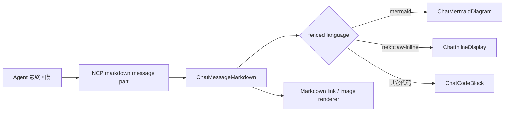

# Agent 输出展示合同设计

## 背景

当前聊天 UI 在一次 Agent 消息完成后，会把最后一个工具调用及其之前的 reasoning / tool activity 折叠到“已处理”，只把最后一个工具调用之后的内容直接留在消息表面。这条展示事实已经由前端实现，但 Agent 的上下文并不知道，因此可能把结论写在工具调用前、把工具结果当成用户可见正文，最终留下空洞或重复的可见回复。

与此同时，输出提示分散在 `InlineInteractiveSurfaceContextProvider` 与 `ReplyFormatContextProvider`：Markdown 文件链接、图片、`nextclaw-inline`、`show_file` / `show_url` / `show_panel_app` 的边界存在重复。前端 Markdown 已支持 GFM、代码高亮、本地资源与 inline display，但还不能把 `mermaid` fenced block 渲染为图；消息复制动作也只显示在 Agent 消息上。

## 核心判断

- `single-fact-owner`：所有“Agent 最终如何把结果交给用户”的提示统一归 `ReplyFormatContextProvider`，工具 schema 只描述参数，前端只解释输出协议。
- `visible-main-flow`：最后一个工具调用之后必须有一段自包含的最终回复；工具前 narration 只承担简短进度，不承担最终结论。
- `protected-variations`：Markdown 链接、图片、Mermaid、inline display 和 side panel 是不同展示形态，但共享同一输出选择合同。
- `simple-structure-first`：Mermaid 只是共享 Markdown renderer 的一个 fenced-code 变体，不新增业务 manager、registry 或第二套 Markdown 解析链。
- `stable-last-frame`：流式 Markdown 更新期间保留最后一张有效图，昂贵的 Mermaid 解析与 SVG 渲染只在输入短暂停顿或消息完成时执行。
- `interaction-owner`：复制是消息级通用动作，用户与 Agent 消息都复用 `ChatMessageActionCopy`。

## 推荐方案

### 统一 Agent 输出 Context Provider

删除独立的 `createInlineInteractiveSurfaceContextProvider`，把以下内容统一写进 `ReplyFormatContextProvider`：

1. UI 折叠事实：最后一个工具调用及其之前的过程会进入“已处理”，之后的内容直接可见。
2. 最终回复组织：工具调用完成后输出自包含结论，不依赖已折叠 narration 或原始工具输出。
3. Markdown 选择：标题、列表、表格、代码块只在提升可读性时使用；文件与图片遵守现有资源链接合同。
4. Mermaid：关系、流程、时序或状态变化用 fenced `mermaid`；简单结论仍用短文本或列表。
5. 展示边界：`nextclaw-inline` 是消息内声明；`show_file` / `show_url` / `show_panel_app` 是立即打开 side panel 的工具动作。
6. Panel Card 的紧凑布局合同继续保留，但不再由第二个 provider 重复注入。

`ContextProviderManager` 仍只负责有序聚合，不理解输出策略。

这里以 Agent 当前实际可调用的三个窄工具作为提示合同，不重新暴露历史 `show_content` 宽工具。三个窄工具在 kernel 内部仍归一化为既有 `showContent` request / event，并继续由原有 UI owner 承接；本轮只统一“Agent 何时选择哪种展示方式”的上下文，不建立第二条内容展示链路。

## Markdown 与 Mermaid 数据流

`ChatMermaidDiagram` 是模块级稳定 React 组件。它动态加载 Mermaid，使用 `securityLevel: "strict"`、`startOnLoad: false` 与 `suppressErrorRendering: true` 渲染 SVG；图语法无效时回退到原始 Mermaid 代码块，不吞掉用户内容。主题只读取宿主根节点的公开 appearance 状态，不读取业务 store。

Mermaid 渲染属于外部库/DOM 同步，因此允许组件内使用 effect；它不承担业务状态、消息状态或工具行为。组件 identity、消息 key 与父级结构保持不变，流式文本更新只改变 `source` props。

`ChatMessage` 只把“当前消息仍在进行且 Mermaid 所在 Markdown 是最后一个 part”传为 `isStreaming`。流式阶段采用 300ms trailing debounce 合并 token 更新；新源码进入解析或渲染时，上一张成功 SVG 继续留在原 DOM 位置，不切回骨架屏。若还没有成功图，则展示正在生成的可复制源码。半截 Mermaid 语法导致的解析失败不进入错误态；消息完成后取消 debounce、立即渲染最终源码，此时最终语法无效才显示错误说明和源码回退。

这条合同解决的是流式外部 renderer 的生命周期：输入可以频繁变化，已提交的展示帧必须稳定，只有新的完整结果成功后才原子替换。Mermaid 已开始的异步工作无法强制中止，因此 effect cleanup 同时取消尚未开始的 timer，并忽略已经失效的异步结果。

## 消息复制交互

消息 footer 对任何包含 Markdown/unknown 文本的已完成消息渲染同一个 `ChatMessageActionCopy`。图标按钮继续提供 `aria-label`，并使用共享 Tooltip primitive 提供可见解释；复制成功沿用既有反馈文案和图标。

复制内容仍只包含用户可读文本 part，不把 reasoning、工具参数或工具结果混入用户消息复制结果。

## 目录与改动边界

- `packages/nextclaw-kernel/.../reply-format-context.provider.ts`：唯一输出提示 owner。
- `packages/nextclaw-kernel/.../native-static-context.provider.ts`：删除重复 inline surface provider。
- `packages/nextclaw-agent-chat-ui/.../mermaid/chat-mermaid-diagram.tsx`：纯展示组件与独立测试边界。
- `packages/nextclaw-agent-chat-ui/.../chat-message-markdown.tsx`：只做 fenced language 分发。
- `packages/nextclaw-agent-chat-ui/.../chat-message-list.tsx`：让用户消息复用已有复制动作。
- `packages/nextclaw-ui` i18n：提供 Mermaid 可访问名称与失败文案。

不改 `show_*` 工具 schema，不新增消息协议字段，不改变 `nextclaw-inline` target，不改“已处理”的前端切分算法。

## 验收标准

1. Context provider 合同测试证明只剩一个输出提示 provider，并包含最后工具调用后的可见区规则、Markdown、Mermaid、inline 与 side panel 边界。
2. `mermaid` fenced block 渲染为 SVG，使用严格安全配置；无效语法回退到可复制源码。
3. 主题 appearance 改变后图表重新渲染；多个图表复用 Mermaid `render` 自带的串行队列，不新增平行调度器。
4. 流式 Mermaid 更新被合并；上一张有效 SVG 在新图完成前保持同一 DOM 实例，瞬时语法错误不闪出错误态，最终内容立即收敛。
5. 用户消息出现复制按钮，点击后 clipboard 收到用户消息正文；Agent 消息行为保持不变。
6. 受影响 package 的定向 Vitest、`tsc`、ESLint 与 UI production build 通过。
7. React renderer 组件类型保持模块级稳定，不因 callback、流式更新或主题切换替换消息 subtree。

## 非目标

- 不把 Mermaid 变成可编辑画布，不支持图内脚本、点击回调或外部链接动作。
- 不改变 reasoning / tool activity 的折叠视觉与分组算法。
- 不让 Agent 为简单回答强制作图，也不把所有输出改造成卡片。
- 不在本轮统一 Panel App inline / side-panel iframe host；那是独立 runtime 结构问题。

## 落地与验证状态

截至 2026-07-15，方案已按上述边界实现：输出提示收敛到单一 `ReplyFormatContextProvider`；Markdown renderer 支持严格模式 Mermaid、流式稳定帧、主题变化和失败源码回退；用户消息复用既有消息复制动作。实现没有修改 `showContent` 内部事件、消息协议或“已处理”切分算法。

定向组件测试共 60 项通过，覆盖流式更新合并、稳定上一帧、瞬时错误抑制与最终立即收敛；上下文合同测试 2 项通过。`@nextclaw/agent-chat-ui`、`@nextclaw/kernel`、`@nextclaw/ui` 的 TypeScript 检查通过，三个包的 ESLint 为 0 error，UI production build 通过。另用真实 Chromium 执行 Mermaid `parse` / `render` 冒烟，确认严格模式下生成 1 个 SVG 与 2 个节点。可维护性 guard 为 0 error；预算 warning 均为未增长的既有目录或接近预算文件。
