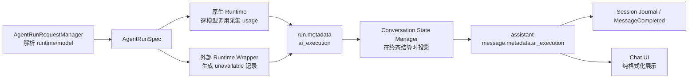

# AI 运行元数据与消息展示设计

## 1. 背景与目标

NextClaw 目前能在一次会话运行开始前解析实际使用的 runtime、model、max tokens 与 thinking 配置，也能从原生模型提供商响应中拿到 token usage，但这些事实没有形成一条贯通运行、事件、消息持久化与 UI 的标准主链路。因此，用户无法从每条 assistant 消息判断它由哪个模型生成，也无法查看该次运行实际报告的 token 消耗。

本次目标是：每次 AI 运行都生成一份版本化的运行元数据记录，并把它稳定投影到本次运行产生的 assistant 消息上，使消息历史可以展示模型与 token 用量。实现必须覆盖成功、失败与取消，兼容不报告 usage 的 provider 和外部 runtime，并保证旧消息可以无迁移读取。

## 2. 设计依据与关键原则

- `single-fact-owner`：运行元数据只有一个事实源，禁止同时维护“运行记录”和“消息账本”两套可独立变化的真相。
- `fact-source-ownership`：model 与 runtime 由 kernel 的 run spec 决定；token usage 由实际执行模型调用的 runtime 采集；UI 不推断、不补算不存在的事实。
- `protocol-event-purity`：运行事实通过既有 `run.metadata` 事件传递，不让 UI 或持久化层了解 provider 私有响应。
- `data-flow-locality`：运行级聚合紧贴模型调用，消息投影紧贴 conversation state settlement，展示格式紧贴 chat feature。
- `existing-owner-before-new-owner`：复用 `AgentRunRequestManager`、原生 runtime、`NcpAgentRuntimeWrapper`、conversation state manager 与现有消息 journal，不新增平行 service 或数据库。
- `predictable-behavior-first`：usage 缺失必须显式标记为 `unavailable`；部分调用上报 usage 必须标记为 `partial`；禁止用 `0` 冒充未知值。

## 3. 已验证的现状

1. `AgentRunRequestManager` 是运行选择 owner，会按 request → session → default 的顺序解析 model，并选定 session 的 `agentRuntimeId`。
2. 原生 `DefaultNcpAgentRuntime` 的一次 run 可能包含多轮模型调用与流重试；`runModelRoundWithRecovery` 是观察每次实际模型调用的最窄公共边界。
3. kernel 只有两类运行入口：原生 runtime，以及统一包装 NARP/HTTP/stdio 等外部 runtime 的 `NcpAgentRuntimeWrapper`。
4. `DefaultNcpAgentConversationStateManager` 在 `run.finished`、`run.error`、`message.abort` 到达时将 streaming assistant 消息结算为历史消息。
5. session journal 已持久化 NCP 事件；结算后的 assistant 消息又会作为 `message.completed` 发布。因此，只要在结算前完成投影，实时 UI、历史恢复与持久化可以共享同一结果。
6. 现有 `LlmUsageManager` 是全局聚合侧账本，缺少 run/session/message 关联，而且没有接入当前生产运行主链路，不适合作为消息级事实源。

## 4. 协议合同

新增 NCP 合同 `NcpAiExecutionMetadata`，通过 `run.metadata.payload.metadata.ai_execution` 传输：

```ts
type NcpAiExecutionMetadata = {
  version: 1;
  runId: string;
  runtimeId: string;
  model: string;
  requestedModel: string | null;
  outcome: "completed" | "failed" | "aborted";
  usage: {
    inputTokens: number | null;
    outputTokens: number | null;
    cachedInputTokens: number | null;
    totalTokens: number | null;
    modelCallCount: number | null;
    reportedModelCallCount: number | null;
    status: "reported" | "partial" | "unavailable";
  };
};
```

字段语义：

- `model` 是本次运行最终解析后的模型，不是 UI 当前选择或会话默认值。
- `requestedModel` 仅记录本次请求显式覆盖的模型；没有覆盖时为 `null`。
- `runtimeId` 是实际运行 owner，例如 `native`、`codex`、`claude-code`。
- `modelCallCount` 统计原生 runtime 实际发起的模型调用，包含流重试；外部 runtime 无法提供时为 `null`。
- `reportedModelCallCount` 表示其中多少次调用返回了 usage。
- token 字段为所有已报告模型调用的和；没有任何可靠报告时为 `null`，不是 `0`。

assistant 消息的 `metadata.ai_execution` 是上述运行事实的稳定投影，字段和值保持不变。运行事件是生成时事实源，消息元数据是面向历史读取的物化视图。

## 5. Owner 与数据流



成功路径在 `run.finished` 之前发布 `run.metadata`；失败路径在 `run.error` 之前发布；取消路径在 `message.abort` 之前发布。conversation state manager 暂存当前 run 的执行元数据，只在匹配的终态事件到达时写入 assistant 消息并清空，避免跨 run 污染。

## 6. 代码组织

- `@nextclaw/ncp/types/ai-execution.types.ts`：版本化协议类型、metadata key 与安全读取函数。
- `@nextclaw/ncp-agent-runtime-next/runtime/agent-run-execution.manager.ts`：原生 run 内部的调用计数、usage 规范化与聚合 owner；实例生命周期严格等于单次 run。
- `DefaultNcpAgentRuntime`：在每个终态事件之前发布聚合后的 `run.metadata`。
- `NcpAgentRuntimeWrapper`：为外部 runtime 补齐同一合同；外部事件若已提供合规记录则保留，否则明确生成 `unavailable`。
- `AgentRunExecutionMetadataManager`：在 conversation state 的单次活动 run 生命周期内暂存、匹配和消费执行元数据。
- `DefaultNcpAgentConversationStateManager`：在成功、失败或取消结算时，把匹配的运行元数据投影到最终 assistant 消息。
- `chat-message-execution-summary.utils.ts`：只读取合同并生成本地化摘要，同时把完整合同投影成数据化的 message more-action view model；它包含调试弹窗的字段行，但不参与事实计算，也不持有弹窗状态。
- `@nextclaw/agent-chat-ui`：view model 增加可选展示标签与通用 more actions；message action 组件负责可访问菜单和对话框，footer 只负责高频摘要。

没有新增 repository、store、adapter 或全局 manager；新增 manager 都是与单次 run 或单个 conversation state 同生命周期的局部 owner。现有全局 usage 统计不再参与本链路，后续若要做成本分析，应从标准运行元数据派生，而不是反向成为消息事实源。

## 7. usage 聚合规则

1. 每次调用 `llmApi.generate` 时调用数加一。
2. 一次流可能多次携带累计 usage，只取该调用最后一个有效 usage，避免重复相加。
3. 输入兼容 `prompt_tokens` / `input_tokens`，输出兼容 `completion_tokens` / `output_tokens`。
4. cached input 从所有以 `cached_tokens` 结尾的计数中取最大值，兼容 provider 扁平化字段。
5. `total_tokens` 缺失且 input/output 都存在时才做确定性相加；否则保持 `null`。
6. 所有调用都报告 usage 为 `reported`；部分报告为 `partial`；全部未报告为 `unavailable`。
7. 重试失败但未报告 usage 仍计入模型调用数，因此不会把部分可观测运行误标为完整。

## 8. UI 与交互

assistant 消息 footer 直接显示一行弱化信息，不增加必须点击的 tooltip 或 popover：

- 完整：`gpt-5 · 12.4k 输入 / 1.1k 输出`
- 仅 total：`gpt-5 · 13.5k tokens`
- 部分：`gpt-5 · 12.4k 输入 / 1.1k 输出 · 部分用量`
- 不可用：`codex-model · Token 用量不可用`

旧消息没有 `ai_execution` 时不显示任何占位，避免伪造历史事实。footer 允许换行，窄屏下不会挤压正文或依赖 hover 才能理解。

token 数量使用跨语言一致的小写工程单位：`k` 表示千、`m` 表示百万、`b` 表示十亿；不足 `1k` 保持整数。这里不跟随 locale 输出“万/亿”，避免同一个运行记录在不同语言下出现不同计量体系。

缓存 token、总 token、模型调用次数、usage 状态与 run ID 属于低频调试信息，默认不加入 footer。含运行元数据的 assistant 消息在“更多操作”中提供“查看运行元数据”，点击后用 modal 展示完整字段；token 行同时显示统一工程单位和原始整数，例如 `128k (128000)`，兼顾日常扫读与精确排查。菜单、弹窗、关闭按钮和焦点恢复都使用可访问 primitive，不依赖 hover 才能操作。

## 9. 兼容、错误与迁移

- 合同为 additive；旧 NCP consumer 忽略未知 `run.metadata` 内容即可。
- 历史消息无需迁移；metadata 缺失表示该历史记录未采集。
- 原生 provider 不报告 usage、流在 usage 前失败、外部 runtime 无 usage 协议时，都生成显式 `unavailable`/`partial`，运行本身仍按原终态结束。
- metadata 采集不得改变模型流、重试、工具执行或终态选择；它是观察行为，不是控制行为。
- 外部 runtime 将来若通过相同 `run.metadata` 合同报告真实 usage，wrapper 应透传，不再覆盖为 unavailable。

## 10. 非目标

- 本次不计算价格、美元成本、额度或账单。
- 本次不展示每个 retry/tool round 的明细列表。
- 本次不补写旧消息，也不从文本、上下文窗口或全局累计值反推 token。
- 本次不重构历史 NCP 文件命名与目录豁免。

## 11. 验收与验证

1. 合同读取测试覆盖合法、缺失与畸形 metadata。
2. 原生 runtime 测试覆盖单调用、多轮、重试部分上报、无上报，以及成功/失败/取消终态顺序。
3. wrapper 测试覆盖外部 runtime 的 unavailable 记录与已有标准记录透传。
4. conversation state 测试证明 metadata 在成功、失败、取消结算后进入 assistant 消息。
5. UI 纯函数测试覆盖中英文、`k/m/b`、partial/unavailable 与缓存精确值；组件测试证明 footer、更多菜单、metadata modal、关闭与焦点路径可用。
6. 执行所有受影响 package 的定向测试、TypeScript 编译、lint、治理检查与前端 build。
7. 用隔离的源码运行链路做一次真实 NCP chat smoke，验证持久化后的 assistant 消息含 model 与 usage 状态；不重启用户当前运行实例。
