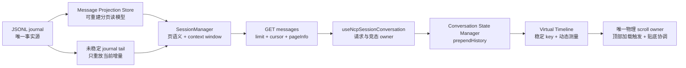

# 会话消息分页与动态高度虚拟时间线设计

## 1. 背景与目标

NextClaw 当前会话消息界面一次读取并渲染固定数量的历史消息。真实代码链路中，前端默认请求 `300` 条，kernel 对完整 JSONL journal 做全量重放后截取最早的消息，服务端又把当前返回条数误当成 `total`。这既不是懒加载，也不是真正的虚拟列表：长会话仍需全量读取和重放，DOM 数量随消息数增长，动态 HTML、Panel App、折叠推理和工具卡片还会持续改变行高。

本次目标是建立一条完整、可扩展的长会话主链路：

1. 首屏只读取最新一页，并能使用游标持续向上加载更早消息；
2. JSONL journal 继续作为唯一事实源，派生索引只负责高效分页且可随时重建；
3. 前端 conversation state 通过语义化 prepend 合并历史页，不覆盖实时流状态；
4. 消息时间线只挂载视口附近的行，并实时测量折叠、展开、HTML 和 Panel App 引起的动态高度；
5. 加载更早消息时保持用户当前阅读锚点，流式追加时继续遵守既有“贴底或保持阅读位置”语义；
6. 设计不依赖估算时间，以行为合同、验证证据和可维护性作为完成标准。

## 2. 设计依据与关键原则

- `source-of-truth / projection`：JSONL journal 是事实源；分页索引是可删除、可重建的物化读模型，绝不成为第二份真相。
- `single-owner`：journal store 负责持久化与投影同步，session manager 负责会话语义和上下文窗口，conversation state manager 负责消息合并，scroll container 负责物理滚动表面和顶部触发，virtualizer 负责可见范围、测量与 prepend 锚定。
- `latest-first page contract`：首次读取必须返回最新消息，历史游标只表达“当前最早行之前”，避免 offset 在实时追加时漂移。
- `dynamic-measurement`：不假设固定消息高度；行根节点由 `ResizeObserver` 持续测量，所有子内容高度变化自然汇总到同一行。
- `stable-identity`：虚拟行 key 使用消息 ID 或稳定分隔符 ID；prepend、streaming 和高度变化不得改变同一消息的 React 身份。
- `bounded lifecycle`：DOM 数量必须有界。视口附近、正在流式更新和当前聚焦的交互行保持挂载；已远离视口且未聚焦的历史 iframe/折叠本地状态允许在再次进入视口时重建。
- `predictable recovery`：投影缺失、版本不匹配、长度不一致或 journal 被重写时明确重建；不静默返回不完整分页。
- `runtime compatibility`：仓库仍声明支持 Node 20，因此核心会话读取不强依赖 `node:sqlite`。使用 Node 标准文件 API 实现随机分页读模型，避免新增原生数据库兼容分支。
- `simple main path`：不复制消息 JSX，不建立第二套 timeline；现有 `ChatMessageList` 继续负责单条消息展示，业务容器只把分组时间线扁平化为稳定虚拟行。

## 3. 已验证的现状与根因

1. `useNcpSessionConversation` 默认请求 `300` 条消息。
2. `SessionManager.listSessionMessages` 先从 journal store 取得完整消息，再使用 `slice(0, limit)`；因此返回的是最早一页，不是最新一页。
3. `NcpSessionRoutesController` 返回 `total: messages.length`，不能表达真实总数，也没有上一页游标。
4. `NcpAgentSessionJournalStore.loadSession` 使用 `readFile` 读取整份 JSONL，并通过 conversation state manager 重放全部事件。
5. `ChatMessageListContainer` 和 `ChatMessageList` 最终会 map 全部已加载消息，DOM 数量无限增长。
6. inline HTML 通过 iframe document/body 的 `ResizeObserver` 回报高度；Panel App 注入脚本同样通过 `ResizeObserver + postMessage` 同步高度；折叠推理和工具卡片也会改变消息行高。
7. 当前只有一个真实纵向滚动表面：`ChatConversationContent` 的 `overflow-y-auto` 容器；virtualizer 必须直接绑定它，并在 prepend 提交期间同步可见范围与滚动锚点，不能再造内层滚动区域或外层延迟补偿。
8. `DefaultNcpAgentConversationStateManager.hydrate` 会替换全部历史消息，不适合作为历史增量加载入口；需要新增保持现有实时对象身份的 prepend 语义。

根因不是单个组件缺少 `IntersectionObserver`，而是读模型、API 合同、conversation state 与 DOM 渲染都没有长列表边界。只改前端会保留全量 journal 重放，只改接口会保留无限 DOM，两者必须同批闭合。

## 4. 总体数据流



## 5. 存储读模型

### 5.1 文件结构

每个 session 在 journal 内部派生目录拥有三个文件：

```text
.message-projections/<safe-session-id>/
  meta.json
  messages.jsonl
  offsets.idx
```

- `messages.jsonl`：追加写入完整消息快照；同一消息更新时追加新快照，不原地移动大文件内容。
- `offsets.idx`：按消息 ordinal 保存固定宽度的 `offset:length` 记录。分页时可直接 seek 到所需 ordinal 范围，再随机读取消息快照。
- `meta.json`：保存版本、稳定消息总数、最后消息 ID、已投影 journal byte offset、数据文件长度、offset 记录数和最近的 context window。

投影不会进入 session list，也不会被模型输入直接读取。删除投影不会丢失会话；下一次分页读取会从 journal 重建。

### 5.2 写入与崩溃恢复

1. journal 先追加事件，保持事实源优先。
2. 对 `message.sent`、`message.completed`、`run.finished`、`run.error`、`message.abort` 等稳定边界，只重放上次稳定 offset 之后的事件。
3. 新消息在 data 与 offset 文件末尾追加；对最后一条消息的最终快照更新只覆盖它的 offset 记录并在 data 末尾追加新版本。
4. 最后原子替换 `meta.json`。若进程在前面任一步崩溃，文件长度与 meta 不一致，下一次读取会从 journal 重建。
5. 运行中的流式尾部不强制写入稳定索引；首屏读取时只从稳定 offset 重放这段短 tail，并与最新稳定页按消息 ID 合并。
6. `importSessionSnapshot` 重建投影；`deleteSession` 同步删除派生目录。

该结构让正常首屏和历史页读取都只与 page size 成正比。旧会话首次访问需要一次全量迁移，但迁移后不再为每次打开重复全量重放。

### 5.3 游标合同

游标是版本化、不透明的 ordinal 边界，不暴露文件路径或 byte offset：

```ts
type NcpSessionMessagePageInfo = {
  startCursor: string | null;
  hasPreviousPage: boolean;
};
```

- 无 cursor：返回最新 `limit` 条，仍按时间正序排列。
- 有 cursor：返回该 cursor 代表的最早消息之前的一页。
- `startCursor` 指向当前页最早的稳定 ordinal；只有运行中 tail 而没有稳定消息时，使用稳定尾部之后的边界游标。
- cursor 版本错误、格式错误或越界时返回明确的 `INVALID_CURSOR`，不退回第一页。
- `total` 是稳定投影与当前未稳定 tail 去重后的真实消息总数。
- 服务端统一约束默认页大小和最大页大小，客户端不能通过超大 limit 绕过分页。

## 6. Conversation state 增量合并

在 NCP conversation state contract 增加：

```ts
prependHistory(messages: ReadonlyArray<NcpMessage>): void;
```

实现规则：

1. 只规范化新进入的历史消息；
2. 以 message ID 去重，当前 state 中的对象优先，避免旧页覆盖 streaming/live 更新；
3. 使用现有 timeline 排序 owner 合并，不手写第二套时间比较；
4. 只在确有新增消息时更新 state version 和通知订阅者；
5. tool-call hydration 在合并后由同一 state manager 重新建立索引；
6. `useHydratedNcpAgent` 只暴露稳定 action，不把 manager 实例泄漏给业务 UI。

`useNcpSessionConversation` 负责 pageInfo、请求 AbortController、重复请求保护和错误状态。session 切换时取消旧请求并清空分页状态，避免旧页注入新会话。

## 7. 虚拟时间线与动态高度

### 7.1 行模型

现有按消息段分组的 timeline 改为扁平稳定行：

- `message:<messageId>`：一条消息；
- `compaction:<checkpointMessageId>`：上下文压缩分隔符；
- `context-inheritance:<sourceSessionId>`：上下文继承分隔符；
- `typing`：没有 assistant draft 时的发送中占位。

每个消息行继续调用共享 `ChatMessageList` 展示单条消息，不复制 card/flat、footer、tool、HTML 或 Panel App JSX。

### 7.2 测量与挂载

- 使用 `@tanstack/react-virtual` 的 element virtualizer。
- `getItemKey` 返回稳定 timeline key。
- `measureElement` 绑定每个绝对定位行根节点；row 的 `ResizeObserver` 会覆盖折叠、展开、Markdown、图片、inline HTML 与 Panel App 高度变化。
- 顶部历史加载反馈必须脱离消息文档流；反馈的显示与消失不得改变消息容器的几何起点。
- virtualizer 使用 `anchorTo: "end"`，在 prepend 触发的 key/index 迁移期间先按稳定业务 key 重算可见范围，再在布局提交阶段同步真实滚动位置；不允许外层下一帧直接改 `scrollTop`。
- 已测量行的起点在视口上方且发生二次高度变化时，virtualizer 必须补偿完整高度差且不受当前滚动方向影响；起点位于视口内或视口下方时不补偿，让可见内容自然展开。该合同统一覆盖 Mermaid、图片、inline HTML、Panel App 与折叠内容，不在各 renderer 内建立专用滚动分支。
- 首次挂载从估算尾部开始，滚动中的容器尺寸与行位置由 virtualizer 直接写入 DOM；调整滚动位置前必须先同步最新虚拟总高度，避免浏览器按旧 scroll range 截断写入后再补偿一帧。
- iframe 只上报自然内容高度，不把当前 iframe 视口的 `clientHeight / scrollHeight` 当作内容事实；否则外层增高后会形成无法回缩的反馈环。工作区 HTML 与 Panel App 注入脚本共同复用 `readInlineContentHeight`，只保留一套高度计算合同。
- 合理 overscan 吸收快速滚动和高度估算误差。
- range extractor 额外保留正在流式更新的行与当前聚焦行，避免活动 iframe/交互控件在滚动边缘被卸载。
- 不建立嵌套滚动容器；virtualizer 的 `getScrollElement` 永远指向 `ChatConversationContent` 的现有 scroll element。

### 7.3 生命周期取舍

无限消息与“所有历史 iframe 永不卸载”不能同时成立。明确采用以下有界策略：

- 当前可见、overscan 范围、正在流式更新、当前聚焦的行保持挂载和 DOM 身份；
- 用户正在操作的 iframe/Panel App 不因轻微滚动立即卸载；
- 已远离视口且未聚焦的历史 HTML/Panel App、推理折叠和工具本地展开状态可以被回收，再次进入视口时按持久化消息事实重建；
- 若未来产品要求跨任意距离永久保留某类交互状态，应把该状态提升到 message UI state owner，而不是破坏虚拟列表的有界 DOM 合同。

## 8. 滚动语义

### 8.1 向上加载

scroll owner 在接近顶部阈值时只负责触发 `loadPreviousMessages`。prepend 后的锚定由 virtualizer 根据当前首个可见业务 key 与其视口内偏移完成，并在 React 布局提交前同步虚拟范围和真实滚动位置；动态测量产生的后续高度校正继续由同一 virtualizer 处理。禁止在外层 `requestAnimationFrame` 中根据 `scrollHeight` 差值补写 `scrollTop`，否则浏览器可能先绘制一次新滚动位置、虚拟范围仍停留在旧位置的空白帧。

### 8.2 流式追加与贴底

保留既有 `useStickyBottomScroll` 语义：

- 用户在底部时，新 token、消息追加和动态高度变化继续贴底；
- 用户已向上阅读时，不强制拉回底部；
- 内容高度观察归 `useStickyBottomScroll` 唯一 owner，并读取同步 sticky ref；外层组件不得再用滞后的 React state 建立第二条 ResizeObserver 贴底路径。
- prepend 不改变最后消息的对象引用，因此不会被误判为新内容并触发贴底；
- 浏览器原生 scroll anchoring 被关闭，prepend 只保留 virtualizer 这一条锚定路径。

## 9. API 与错误处理

消息响应扩展为：

```ts
type UiNcpSessionMessagesView = {
  sessionId: string;
  status: NcpSessionStatus;
  messages: NcpMessage[];
  contextWindow?: NcpSessionSummary["contextWindow"];
  total: number;
  pageInfo: NcpSessionMessagePageInfo;
};
```

客户端 SDK 使用对象参数 `{ limit, cursor, signal }`，保留数值 limit 兼容只限于公开 SDK 边界，内部统一对象合同。历史分页 hook 以当前请求的 `AbortController.signal.aborted` 作为取消事实；即使底层请求层统一包装错误，也不得把已取消请求展示成 timeout 或普通历史加载错误。

## 10. 代码组织

- `NcpAgentSessionMessageProjectionStore`：派生文件、游标、随机页读取、完整重建与尾部同步 owner。
- `NcpAgentSessionJournalStore`：journal 追加、稳定边界识别、tail 重放和投影协调。
- `SessionManager`：消息页业务合同、会话存在性、context window 计算与投影缓存。
- `NcpSessionRoutesController`：HTTP 参数约束与错误映射。
- `DefaultNcpAgentConversationStateManager`：历史 prepend 的唯一状态 owner。
- `useNcpSessionConversation`：分页请求生命周期和 pageInfo owner。
- `useChatMessageVirtualizer`：纯 DOM/virtualizer 生命周期、可见范围、动态测量与 prepend 锚定，不读取业务 store。
- `ChatMessageListContainer`：消息 view model 与扁平 timeline 组合。
- `ChatConversationContent`：唯一物理 scroll owner、顶部加载触发和贴底协调，不再实现第二套 prepend 高度补偿。

不新增 repository/facade/registry，不把 manager 或 store 作为普通 helper 参数层层传递。

## 11. 兼容、迁移与非目标

### 兼容与迁移

- API 字段为 additive；旧 consumer 可忽略 `pageInfo`。
- 旧 journal 不做破坏性迁移，首次分页读取惰性生成投影。
- 现有 session 全量读取 API 继续服务模型上下文、搜索和导出，不被 UI 分页语义替换。
- 投影版本升级采用删除后重建，不维护多版本兼容分支。
- 旧前端数值 limit 调用在 SDK 公共边界仍可工作。

### 非目标

- 本次不虚拟化 composer、右侧边栏或 session list。
- 本次不改变消息内容、Markdown、HTML、Panel App 的业务展示。
- 本次不承诺远离视口的历史 iframe 进程或未持久化展开状态永久存活。
- 本次不把模型上下文读取改成分页；模型运行仍可按其独立 owner 获取完整/压缩后的上下文。
- 本次不重启用户当前运行实例，也不发布、部署或提交代码。

## 12. 验收与验证

### 存储与 API

1. 旧 journal 首次读取生成投影，首屏返回最新一页且正序排列。
2. 连续 cursor 请求无重复、无遗漏，`total` 与真实消息数一致。
3. 流式未完成 tail 能与稳定页合并，终态后不会重复消息。
4. MessageCompleted 更新最新快照而不是增加 total。
5. import、delete、投影损坏和长度不一致分别覆盖重建/清理路径。
6. malformed、version mismatch、out-of-range cursor 返回 400 `INVALID_CURSOR`。

### 状态与竞态

1. prepend 去重且不覆盖已有 live message 对象。
2. session 切换会取消旧页请求，旧响应不能写入新会话。
3. 快速连续顶部触发只产生一个在途请求。
4. missing session 仍按既有 draft seed 语义处理。

### UI 与运行行为

1. 大量消息时挂载行数保持在视口 + overscan 的有界范围。
2. prepend 后原首条可见消息保持原屏幕位置。
3. reasoning/tool 折叠展开会触发重新测量且无重叠、跳行。
4. inline HTML 与 Panel App 连续高度同步会更新虚拟总高度。
5. inline HTML / Panel App 在已经增高后收起，iframe 与虚拟行必须回到自然内容高度，不能保留旧视口造成的空白。
6. streaming 行保持稳定 key；位于底部时持续贴底，用户向上阅读时不抢滚动。
7. 聚焦交互行在虚拟范围边缘保持挂载，离开焦点并远离视口后可回收。
8. 触顶分页的连续关键帧不得出现没有任何消息行覆盖视口的空白帧，历史加载反馈也不得推移可见锚点。
9. reload、普通滚动、大跨度滚动、分页前插和可见动态高度展开/收起必须分别做连续帧验收；首次真实内容出现后不得再绘制错误范围，用户离开底部后高度变化不得抢回滚动位置。
10. 向上滚动期间，视口上方的已测量行从加载态切换到真实高度时，当前可见消息的屏幕位置必须保持不变；验收至少包含 Mermaid、一个通用高度探针和顶部局部可见行。

### 工程验证

1. 运行受影响 package 的定向 Vitest。
2. TypeScript 源码边界触达的所有 package 必跑 `tsc`。
3. 前端运行 build，验证 virtualizer 生产构建和 tree-shaking。
4. 运行 `lint:new-code:governance`、backlog ratchet 与 maintainability guard/review。
5. 使用隔离数据目录生成长会话做 API 分页 smoke；使用源码前端做真实浏览器验收，不重启当前用户实例。
6. 收尾披露生产/测试代码增减、非功能语义净增豁免依据、已偿还的既有债务和剩余明确非目标。

### 真实本地验收夹具

- 会话 ID：`chat-virtualization-mixed-smoke-20260718`，写入真实 `~/.nextclaw` session journal，共 `1200` 条消息。
- 内容覆盖短/长 Markdown、表格、代码、Mermaid、reasoning、tool、图片与 Markdown 附件、引用、错误状态、上下文压缩/继承分隔符、inline HTML 和真实 Panel App。
- 工作区 HTML：`~/.nextclaw/workspace/virtual-list-dynamic-height-smoke.html`，支持动态注入和反复展开/收起；`hidden` 必须真正移除布局，避免 fixture 自身污染高度结论。
- API 验收必须连续读取到 `hasPreviousPage=false`；浏览器验收必须实际滚到第 1 条消息，并同时记录挂载行数、动态高度 A/B 和错误状态。
