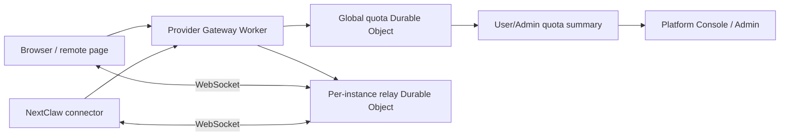

# NextClaw Remote Cloudflare 配额统一设计

## 文档状态

- 日期：2026-07-18
- 状态：已实现并完成生产部署
- 范围：NextClaw Remote 的 Cloudflare 用量计量、平台/用户每日额度、极端失控保护、用户与管理员用量展示
- 已发布：Provider Gateway Worker、Platform Console、Platform Admin
- 不包含：付费套餐设计、跨 Cloudflare 账户总账系统、在没有足够生产样本时硬启用短窗口 runaway 拒绝

## 结论先行

当前 remote quota 需要整体重做，不能只把 `180/min` 调大。

推荐方案是：

1. 用与 Cloudflare 官方计费规则一致的资源向量记账，分别记录 Worker 请求、Durable Object 请求及相关平台资源，不能把不同池子随意相加。
2. 正常用户只受“用户每日额度 + 平台每日总容量”约束，删除当前 `session 每分钟 180 次` 这一正常流量硬限制。
3. 短窗口只保留可选的极端失控保护，并且必须先影子观测，用真实峰值和“多久会耗尽全天额度”推导阈值；它不再叫普通限流，也不能按逻辑请求数拍一个固定 RPM。
4. 用户首页展示一条可理解的每日额度进度条、已用/剩余/重置时间，并提供最近 30 分钟、1 小时统计；管理员页面额外展示平台总池、模型差异、观测新鲜度和保护状态。
5. Cloudflare GraphQL/控制台指标只用于异步审计，不能伪装成计费账单真值。准入主链路必须由 NextClaw 按官方规则逐事件精确记账。

这套方案服务 NextClaw 的统一入口愿景：远程能力应该是稳定、连续、可解释的基础能力，而不是用户随便操作几次就突然失效的孤立限制点。

## 问题背景

用户实际收到：

```json
{
  "ok": false,
  "degraded": true,
  "error": {
    "code": "REMOTE_SESSION_RATE_LIMITED",
    "message": "Remote access is temporarily degraded because this session is sending requests too quickly.",
    "retryAfterSeconds": 9
  }
}
```

这条错误只说明当前 session 的固定一分钟窗口已满，`retryAfterSeconds: 9` 是距离该窗口重置约 9 秒。它不代表用户的 Cloudflare 每日额度耗尽，也不代表 Cloudflare 自己触发了限流。

此前已经修复了 WebSocket 租约在 Durable Object hibernation 后重复预租、并发消息重复预租的问题。该修复让 `session` 逻辑请求计数恢复正确，也减少了额外 quota DO 调用；但它没有解决更上层的产品与计量问题：

- `180/min` 仍然是独立于 Cloudflare 每日计费池的产品限制。
- 当前每日账本没有覆盖 remote 链路产生的全部 Cloudflare 用量。
- 当前用户页面展示的是内部估算值，却没有清楚说明口径和数据新鲜度。
- 当前 `20000/day` 与 `20% reserve` 没有生产数据推导过程，不能证明它们既安全又不误伤。

## 目标与成功标准

### 产品目标

- 在 Cloudflare 免费额度可支持的范围内，让正常 remote 使用尽可能连续、顺滑。
- 用户在使用前和使用中都能知道：今日额度多少、已经用了多少、还剩多少、何时重置、最近是否出现异常用量。
- 只有真正耗尽每日额度或出现极端失控流量时才阻止请求；正常短时密集操作不能被独立分钟桶误伤。
- 平台能解释任何一次拒绝究竟来自用户每日额度、平台总池、极端失控保护，还是 quota owner 不可用。

### 工程成功标准

- 同一个 Cloudflare 事件只有一个成本定义和一个账本 owner。
- 逐事件合成测试中的 Worker/DO 计费单位与官方规则完全一致。
- 所有 remote ingress、relay DO 调用、双向 WebSocket 入站消息和 quota DO 自身调用都有明确归属；不再存在“知道会计费但没有进入成本表”的路径。
- 用户每日进度使用真实 `actual`，准入使用 `actual + reserved`，不再把预租额度直接伪装成已消费。
- 30 分钟/1 小时统计来自同一个账本事件，不另建一套平行计数逻辑。
- 启动数值必须有可复核的容量等式并标记为 bootstrap contract；在满足真实流量校准门槛前，不把它宣传成统计意义上的最终最优值。

## 已验证的现状

### 实施后配置

`workers/nextclaw-provider-gateway-api/wrangler.toml` 当前配置为：

| 维度 | 当前值 | 当前含义 |
| --- | ---: | --- |
| Cloudflare plan profile | `workers-free` | 显式绑定官方 Free plan 日额度与 `00:00Z` 重置边界 |
| session 每分钟请求数 | 已删除 | 正常流量不再受短窗口硬限制 |
| 单实例浏览器连接数 | 10,000 | relay 热点保护 |
| 平台 Worker 日预算 | 100,000 | 按 Free plan 假设配置 |
| 平台 DO 日预算 | 100,000 | 按 Free plan 假设配置 |
| 平台固定 reserve | 20% | 实际只放量 80,000 |
| 用户 Worker 日额度 | 20,000 | 用户公平上限，不是预留份额 |
| 用户 DO 日额度 | 20,000 | 用户公平上限，不是预留份额 |
| WebSocket 消息租约 | 10 | 每批预留 10 条 browser command |

因此，一个用户的 `20,000` 不是独占预留，而是共享池上的公平上限。平台 remote 包络为每种资源 `80,000`，在最保守的“用户都触达满额”条件下支持四个 heavy user；剩余 `20,000` 明确保留给同账户非 remote 流量、观测差异和处置窗口。这个等式是可审计的启动容量合同，不冒充已经从长期生产分布学出的最终值。

### 当前 owner 与数据流



- `NextclawRemoteQuotaDurableObject` 是平台/用户每日 `actual + reserved` 账本 owner，不再维护 session 分钟窗口。
- `NextclawRemoteRelayDurableObject` 是连接、WebSocket attachment、消息转发和本地租约余量 owner。
- `/platform/remote/quota/v2` 与 `/platform/admin/remote/quota/v2` 读取 quota DO 汇总；旧路由已在前端滚动发布完成后删除。
- `user-dashboard-page.tsx` 直接承载了 quota query 和卡片 JSX；页面已有 620 行，后续继续扩展会混入独立变化原因。

### 当前计量缺口

现有成本表覆盖了部分主路径，但还不是 Cloudflare 全量：

| Cloudflare 事件 | 当前账本 | 问题 |
| --- | --- | --- |
| remote runtime Worker ingress | 已计 1 Worker | 主路径正确 |
| runtime 调 quota DO | 已计 1 DO | 主路径正确 |
| proxy Worker ingress | 已计 1 Worker | 主路径正确 |
| proxy 调 quota DO + relay DO | 已计 2 DO | 主路径正确 |
| browser WebSocket upgrade | 已计 1 Worker + 2 DO | 包含 quota acquire 与 relay upgrade |
| connector WebSocket upgrade/reconnect | 未计 | 实际有 Worker ingress 与 relay DO connection request |
| browser -> relay 的 `request/stream.open` | 按 20:1 预租 | 预留被当成已用；租约调用自身的 1 DO 未计 |
| browser -> relay 的 `stream.cancel` | 未计 | 进入 DO 的 WebSocket 消息仍属于入站消息 |
| browser 发来的无效 JSON/无效 frame | 未计 | Cloudflare 已经接收消息，业务解析失败不取消计费事实 |
| connector -> relay 的 response/event/chunk | 未计 | 这是另一方向的 DO 入站 WebSocket 消息 |
| quota release / summary /失败请求 | 未完整计 | 请求已经抵达 quota DO，不能只记录成功业务动作 |
| 非 remote 的同账户 Worker 流量 | 未计 | Cloudflare Free Worker 限额是账户级事实，不只属于 remote 路由 |
| DO duration / SQLite storage 行读写 | 未作为平台容量维度 | 它们也可能成为 Free plan 的真实瓶颈 |

以 10 条 browser command 的稳定满租约为例：

- relay 入站消息：`10 / 20 = 0.5 DO request unit`
- 申请该租约调用 quota DO：`1 DO request unit`
- 实际合计至少：`1.5 DO request unit`
- 当前账本只增加：`0.5 DO request unit`

也就是说，当前这条稳定路径会低估约 3 倍；同时，用户提前关闭连接时又可能把未使用的预租消息算成已用。它既可能低估真实成本，也可能高估用户真实消费。

## Cloudflare 官方口径

以下口径于 2026-07-18 复核：

1. Workers Free 为账户每日 100,000 个请求，00:00 UTC 重置；Cloudflare 明确说明 Workers 没有通用的每秒请求限制。Workers Paid 则没有相同的每日请求硬上限。来源：[Workers Limits](https://developers.cloudflare.com/workers/platform/limits/)。
2. Worker WebSocket 只在初次 Upgrade 时按一个 Worker inbound request 计费；之后经 Worker 路由的 WebSocket 消息不再算 Worker request。Worker 发出的 subrequest 也不按 Worker inbound request 计费。来源：[Workers Pricing](https://developers.cloudflare.com/workers/platform/pricing/)。
3. Durable Objects Free 的 request 限额为每日 100,000；WebSocket connection request 按一个 request 计费，入站 WebSocket 消息按 20:1 折算，出站消息不计 request，00:00 UTC 重置。来源：[Durable Objects Pricing](https://developers.cloudflare.com/durable-objects/platform/pricing/)。
4. Durable Objects 还有 duration 与 SQLite storage 行读写等独立资源。Hibernation 能避免空闲连接持续产生 duration，但消息处理期间仍会产生 duration。来源同上。
5. Durable Object GraphQL/控制台中的 WebSocket metrics 展示实际消息，不应用 20:1 计费折算；hibernation 与非 hibernation 的消息还可能进入不同数据集。来源：[Durable Objects Metrics and Analytics](https://developers.cloudflare.com/durable-objects/observability/metrics-and-analytics/)。
6. Cloudflare 明确说明 GraphQL Analytics 是使用量分析，不应当作 Cloudflare 计费账单度量。来源：[GraphQL Analytics API](https://developers.cloudflare.com/analytics/graphql-api/)。

因此，“和 Cloudflare 精确对齐”应定义为：

- 计费单位、事件边界、重置边界与官方规则一致。
- NextClaw 对自己产生的 remote 事件逐项精确记账。
- Cloudflare Analytics 用于覆盖审计和趋势核对，不把它称为同步账单真值。
- 账户套餐必须显式配置并经过部署检查，不能继续在代码里默认为 Free 后假装已经验证。

## 分层根因

### 表层症状

普通使用触发 `REMOTE_SESSION_RATE_LIMITED`，用户只能等待分钟窗口重置。

### 直接触发

同一 access session 在固定一分钟窗口中被记到 180 条逻辑请求。该窗口与用户每日 Worker/DO 额度相互独立。

### 结构性根因

1. 把三类不同问题混成了同一个 quota 概念：
   - Cloudflare 计费容量；
   - 用户间每日公平分配；
   - 极端 bug/失控保护。
2. 成本表是按几个业务入口手工估算，没有从所有 Cloudflare 计费事件反向审计覆盖面。
3. `used` 同时承担“真实已用”和“未来预留”，事实含义不单一。
4. 固定 20% reserve、20,000 用户额度、180 RPM 没有共同的容量模型和数据推导过程。
5. 用户端虽然已有数字卡片，但缺少总体进度、近期趋势、限制原因和数据质量说明。

### 长期风险

- 继续单独调高 RPM 只能暂时减少误伤，无法修正每日账本。
- 继续按不完整账本放量，可能在 UI 还显示“有余额”时先撞上 Cloudflare 硬上限。
- 继续堆更多 user/session/window 限制，会制造更多难以解释的 surprise failure。
- 在同一个 Cloudflare 账户还有其他 Worker 时，remote 即使自身没有超预算，也可能被账户其他流量共同耗尽。

## 方案比较

### 方案 A：只把 180/min 调高

- 收益：改动最小，能短期降低一部分误伤。
- 问题：仍然使用与 Cloudflare 不同的逻辑计数单位；每日账本缺口、用户展示和数值依据都没有解决。
- 定位：只能算事故止血，且新数字仍会是拍脑袋。
- 结论：不采用。

### 方案 B：删除分钟限制，但沿用当前每日账本

- 收益：用户短时操作立刻更顺滑。
- 问题：当前账本漏计 quota DO 自身调用、connector 方向消息等成本，也混淆 actual 与 reserved；放开后平台可能比账本更早耗尽。
- 定位：产品方向对，但工程前提不成立。
- 结论：不能独立上线；必须与 v2 成本账本同批完成。

### 方案 C：用 Cloudflare GraphQL 直接作为实时 quota 真值

- 收益：看起来最接近 Cloudflare 外部数据。
- 问题：官方明确说 GraphQL 不是计费度量；数据有聚合延迟，DO WebSocket 展示原始消息而非 20:1 计费单位，也没有 NextClaw user/session 归属。
- 定位：适合外部审计，不适合请求热路径准入。
- 结论：不采用为主账本。

### 方案 D：v2 精确事件账本 + 每日公平额度 + 外部异步审计

- 收益：正常用户只面对每日额度；热路径无外部指标依赖；Cloudflare 单位、用户归属和展示都可解释；极端保护可以用真实数据校准。
- 代价：需要完整审计 relay 双向事件、迁移 v1 state、改 API/UI，并经过一个数据采集周期后才能定稿最终数值。
- 定位：结构性修复，也是长期可演进方案。
- 结论：采用。

## 设计原则与 owner 判断

本方案落实以下原则：

- `single-fact-owner` / `single-domain-owner`：Cloudflare remote 成本表只保留一个 owner；每日账本只保留 quota DO 一个 owner。
- `information-expert`：relay DO 最知道实际收到多少双向 WebSocket 消息和租约消费情况；quota DO 最知道平台/用户总账与准入不变量。
- `cqs-pure-read`：额度 summary/history 是纯读，查看额度不能反过来消耗用户个人额度或暗中改变准入状态。
- `simplest-shape-first`：前端使用 React Query 读取服务端事实，不为这张卡新增 Zustand store、presenter 或 manager；只按独立变化原因拆业务卡片。
- `predictable-behavior-first`：Cloudflare 审计数据过期时明确标记 stale，不自动切换成另一套隐藏计数；quota owner 不可用时准入明确失败，不静默放行。
- `deletion-first`：删除普通流量的 session RPM、删除 `used=actual+reserved` 的混合语义、删除用户页面中与每日额度无关的技术阈值展示。

## 推荐架构

### 1. 显式套餐与官方规则档案

新增一个版本化的 `RemoteCloudflarePlanProfile`，至少包含：

```ts
type RemoteCloudflarePlanProfile = {
  id: "workers-free" | "workers-paid";
  costModelVersion: number;
  verifiedAt: string;
  resetsAt: "00:00Z" | null;
  workerRequestsPerDay: number | null;
  durableObjectRequestsPerDay: number | null;
  durableObjectDurationGbSecondsPerDay: number | null;
  durableObjectStorageRowsReadPerDay: number | null;
  durableObjectStorageRowsWrittenPerDay: number | null;
};
```

约束：

- 套餐 profile 是部署必填事实，不允许生产环境静默使用默认套餐。
- `verifiedAt` 和官方来源属于成本模型版本，Cloudflare 改规则时要显式升级。
- Paid plan 没有 Free plan 同样的 Worker daily hard cap，不能继续套 `100000/day`。
- 用户每日产品额度与 Cloudflare 套餐容量分开建模，不能把套餐名直接当用户权益。

### 2. 统一成本事件

用户每日准入与结算使用同一个可同步归因的请求资源向量：

```ts
type RemoteBillableRequestUsage = {
  workerRequestUnits: number;
  durableObjectRequestMilliUnits: number;
};

type RemotePlatformCloudflareUsage = RemoteBillableRequestUsage & {
  durableObjectDurationGbSeconds: number | null;
  durableObjectStorageRowsRead: number;
  durableObjectStorageRowsWritten: number;
};
```

其中 `1000 milli-units = 1 DO request`，一条 DO 入站 WebSocket 消息为 `50 milli-units`。

DO duration 不适合在请求到达前按用户精确预测，SQLite 行读写也主要由共享 quota/relay owner 产生。第一版把 duration 与 storage 放在平台容量观测中，不扣用户个人额度；如果真实数据证明它们成为最紧张资源，再为它们设计可靠归因和准入。不能为了表面“全都量化”而把共享基础设施成本随机分摊给用户。

成本目录按 Cloudflare 事件命名，而不是按 UI 动作猜测：

- Worker inbound HTTP/Upgrade
- quota DO fetch/RPC
- relay DO fetch/Upgrade
- browser -> relay incoming WS message
- connector -> relay incoming WS message
- quota state storage read
- quota state storage write

业务动作只是这些事件的组合。无效 JSON、被拒绝请求、cancel、release 仍然可能已经产生 Cloudflare 成本，不能因为业务没有成功就从账本消失。

### 3. 账本拆分 `actual` 与 `reserved`

```ts
type RemoteDailyLedger = {
  dayKey: string;
  actual: RemoteBillableRequestUsage;
  reserved: RemoteBillableRequestUsage;
};
```

- `actual`：已经真实发生的 Cloudflare 事件。
- `reserved`：已经准入、但 relay 尚未结算的最大成本。
- 用户展示的“已用”只取 `actual`。
- 进度条可以用较浅的第二段显示 `reserved`，文案为“处理中/已预留”。
- 准入判定使用 `actual + reserved + nextMaximumCost <= limit`。
- 租约续租或连接关闭时，relay 提交上一批实际消费，把对应值从 `reserved` 转入 `actual`，未使用部分释放。
- 账本结算即使会让 `actual` 略超过 limit 也必须记录；真实成本不能为了让数字好看而截断。超额只能通过缩小未结算债务上界来控制。

### 4. relay 本地结算与有界债务

不能为每条 WebSocket 消息再调用一次 quota DO，否则“计量动作本身”会放大 DO 成本。

推荐继续使用小批量 lease，但修改语义：

1. quota DO 发放的是可消费 Cloudflare 成本，不是直接把 10 条消息写成已用。
2. relay attachment 持久化 `reserved/remaining/actualSinceLastSettlement`，hibernation 后仍可恢复。
3. browser 和 connector 两个方向的入站消息都先在 relay 本地累计。
4. 续租请求同时结算上一批，quota DO 在一次调用里完成“记录自身调用成本、结算旧批次、检查每日额度、发放新批次”。
5. stream 下行消息达到未结算上界时必须先结算；若没有剩余额度，relay 取消对应 stream 并返回明确的每日额度错误，避免一个已打开 stream 无限透支。
6. connector frame 通过 `clientId/sessionId` 归属到用户；无明确 client 的实例级事件归实例 owner。真正无法归属的事件进入 `platformOverhead`，不能随机摊给最近用户。

这样既保持全局公平，又把 quota DO 的额外请求数限制在可控批次内。

### 5. 三层容量模型

#### 平台官方上限

来自显式 plan profile，例如 Free plan 的 Worker/DO 日上限。

#### remote 可用包络

同一个 Cloudflare 账户可能还有其他 Worker、DO、D1 与运维请求，因此 remote 不能默认独占全部上限。

对每个资源 `r`：

```text
remoteEnvelope[r]
  = officialAccountLimit[r]
  - p99(nonRemoteAccountDailyUsage[r])
  - safetyReserve[r]
```

长期目标是让 `safetyReserve` 由以下真实量的较大者决定：

- 成本模型与 Cloudflare Analytics 经官方计费折算后的 p99 差异；
- Cloudflare 指标聚合延迟期间可能新增的 p99 用量；
- 已验证的部署/回滚缓冲。

若账户内其他流量无法被可靠观测，最干净的长期方案是把 remote 放到独立 Cloudflare 账户或独立可计量容量边界；否则任何“remote 精确占满 100% 免费池”的承诺都不真实。

2026-07-18 首次部署没有足够的 v2 历史样本，因此采用显式 bootstrap capacity contract，而不是伪造统计结论：

```text
officialFreeLimit = 100,000 / resource / UTC day
sharedPlatformReserve = 20,000 / resource / UTC day
remoteEnvelope = 80,000 / resource / UTC day
userFairLimit = 20,000 / resource / UTC day
supportedFullQuotaHeavyUsers = floor(80,000 / 20,000) = 4
```

`20%` 在这一阶段是可见、可复核、可替换的共享平台容量合同。管理员页面明确展示 `bootstrap_capacity_contract`、reserve 和 supported heavy users；代码不把它命名成 learned p99。v2 精确账本从本次部署开始生成后续校准数据，达到样本门槛时再按本节公式调整，而不是用新的短窗口限制补容量缺口。

#### 用户每日公平上限

用户额度仍然需要，因为平台总池是共享的；但数值必须从容量和真实分布推导：

```text
desiredUserLimit[r] = P99.9(activeUserDailyUsage[r])
targetHeavyUsers = max(P95(dailyHeavyUserCount), explicitlyPromisedCapacity)
capacityLimit[r] = floor(remoteEnvelope[r] / targetHeavyUsers)
```

上线条件：

```text
capacityLimit[r] >= desiredUserLimit[r]
```

满足时，用户日额度取能覆盖 `P99.9` 正常用户日的最小值，并定期滚动复核；不满足时，说明免费池无法同时支持当前体验目标和目标用户数，正确决策是升级 Cloudflare 套餐、隔离账户或调整明确的产品承诺，而不是再造一个更小的分钟限流掩盖容量不足。

### 6. 删除普通 session RPM

`REMOTE_QUOTA_SESSION_REQUESTS_PER_MINUTE=180` 从正常准入模型删除，原因是：

- Cloudflare Workers 没有通用每秒请求限制。
- 它按逻辑 command 计数，与 Worker/DO 计费单位不同。
- 用户在每日额度还有大量剩余时仍可能被它拒绝。
- 页面加载、并发数据请求、stream 生命周期会让正常峰值远高于平均值。

删除后，正常使用只受用户日额度与平台总容量约束。

### 7. 可选的极端失控保护

极端保护不是普通 quota，也不在没有数据时直接启用硬拒绝。

推荐流程：

1. v2 账本先以 shadow 模式记录每个 session 的 rolling 60 秒 Cloudflare 成本，不拒绝。
2. 至少收集 7 个完整 UTC 日，且样本量达到约定的 active user-day 门槛。
3. 根据正常流量上界和预计耗尽时间启用双条件判断：

```text
runaway = rolling60sUsage > learnedExtremeNormalUpperBound
       AND remainingDailyQuota / rolling60sUsage < emergencyResponseHorizon
```

- `learnedExtremeNormalUpperBound` 用正常样本的极高分位数及置信上界得到。
- `emergencyResponseHorizon` 是“若保持当前速度，多久会烧完今日余额”的明确产品安全目标，不是另一个 RPM 魔法数。
- 只有两个条件同时成立才触发，确保短时正常 burst 不会被误伤。
- 上线前必须用历史回放证明正常流量 false positive 为 0，并保留 shadow 对照。

错误码改为 `REMOTE_RUNAWAY_GUARD_TRIGGERED`，文案说明“检测到异常快速消耗，已短暂暂停以保护今日额度”。它与 `REMOTE_DAILY_QUOTA_EXHAUSTED` 必须是两个不同状态。

如果样本量不足，就不启用该短窗口硬拒绝；平台/用户每日硬上限仍然是最后保护。不能因为担心未知 bug 而长期保留一个已经误伤正常用户的固定 180。

## 用户展示设计

### 信息层级

用户首页 quota 卡片按以下顺序展示：

1. **今日 Remote 额度**
   - 一条主进度条；
   - “已用 x% · 剩余 y%”；
   - “每天 00:00 UTC 重置”，同时按本地时区显示具体时间；
   - 正常、接近上限、已用尽、数据暂不可用四种明确状态。
2. **资源明细（可展开）**
   - Worker 请求：实际已用 / 上限 / 剩余；
   - Durable Object 请求单位：实际已用 / 上限 / 剩余；
   - 如有未结算租约，单独显示“处理中”，不并入“已用”。
3. **最近使用**
   - 最近 30 分钟实际用量；
   - 最近 1 小时实际用量；
   - 12 个 5 分钟 bucket 的小型趋势图或柱条；
   - 显示最近更新时间。
4. **必要提示**
   - 若某个资源是瓶颈，显示“当前额度由 Durable Object 请求决定”一类结果化文案；
   - 若触发极端失控保护，说明恢复条件；
   - 若数据为 partial/stale，明确标记，不继续展示成精确实时值。

### 为什么主进度条不能简单相加

Worker 与 Durable Object 是两个独立 Cloudflare 资源池。若 Worker 用了 10%、DO 用了 95%，相加后取平均会把危险状态错误展示成 52.5%。

主进度使用最紧张资源：

```text
utilization = max(
  worker(actual + reserved) / workerLimit,
  durableObject(actual + reserved) / durableObjectLimit
)
```

这样用户只看一条进度也不会被误导；展开后仍能看到两项真实数字。主标题建议使用“今日 Remote 额度”，不要把内部的 Worker/DO 术语放在第一视觉层。

### 从用户卡片移出的信息

以下内容不属于用户每日额度，应从 quota 卡片移到管理员诊断或实例状态区域：

- session 每分钟上限（本方案删除）；
- 单实例 10,000 连接技术上限；
- quota lease size；
- Cloudflare reserve 计算细节。

用户可以看到当前活跃连接，但它不应与“还剩多少每日额度”混排。

### 前端 owner

- 新建 feature 业务组件 `features/dashboard/components/remote-quota-card.tsx`，它直接连接 React Query 和 i18n。
- 纯展示的进度条、资源明细、近期趋势可在确有复用或独立变化原因时拆出 UI 子组件。
- `user-dashboard-page.tsx` 只负责区域组合，不继续承载 quota query、数据派生和完整卡片 JSX。
- 不新增 Zustand store、presenter 或 manager：额度是服务端只读事实，React Query 已经是合适 owner。
- 样式归 quota 卡片组件本身，使用现有 design token/基础组件；验证正常、窄、极窄三类容器。

## 管理员展示设计

管理员 Remote 容量面板需要比用户页面多展示：

- 当前 Cloudflare plan profile、成本模型版本和官方规则复核日期；
- Worker/DO configured limit、remote envelope、actual、reserved、remaining；
- non-remote baseline、safety reserve 的来源与样本区间；
- 用户默认额度及其 P99.9/容量推导结果；
- 最近 30 分钟、1 小时、今日平台用量；
- Cloudflare Analytics 最近观测时间、是否 stale；
- 模型值与 Analytics 折算值的差异，以及 `unattributedPlatformOverhead`；
- runaway guard 当前是 shadow、enabled 还是 disabled；
- DO duration/storage 是否接近 Free plan 资源上限。

管理员看到的是容量治理事实，用户看到的是自己的可用结果，两者不能用同一组字段硬拼成两张卡。

## API 合同

### 用户 summary

建议新增版本化只读路由：

```text
GET /platform/remote/quota/v2
```

响应骨架：

```ts
type RemoteQuotaV2Summary = {
  costModel: {
    version: number;
    verifiedAt: string;
    observedThrough: string;
    partialDay: boolean;
    stale: boolean;
  };
  day: {
    startsAt: string;
    resetsAt: string;
    status: "normal" | "near_limit" | "exhausted" | "unavailable";
    utilization: number;
    limitingResource: "worker_requests" | "durable_object_requests";
    workerRequests: RemoteQuotaResourceSummary;
    durableObjectRequests: RemoteQuotaResourceSummary;
  };
  recent: {
    bucketSeconds: 300;
    last30Minutes: RemoteBillableRequestUsage;
    lastHour: RemoteBillableRequestUsage;
    buckets: RemoteUsageBucket[];
  };
  protection: {
    runawayGuard: "shadow" | "enabled" | "disabled";
    activeUntil: string | null;
  };
};

type RemoteQuotaResourceSummary = {
  limit: number;
  actualUsed: number;
  reserved: number;
  remaining: number;
};
```

### 管理员 summary

```text
GET /platform/admin/remote/quota/v2
```

在用户合同基础上增加 plan、platform envelope、reserve 组成、外部观测、差异与用户额度推导信息。

### 读取行为

- 两个 GET 都必须是纯读、重复安全。
- 页面 focus refetch/polling 不能触发结算、注册或配额消耗。
- 查看 quota 所产生的 Worker/DO 系统开销进入平台 overhead/reserve，不扣用户个人额度。
- history 与 summary 同源；若近期 bucket 不可用，返回明确的 `recent.available=false`，不从另一套估算静默补值。

## 近期统计数据结构

第一版只保留用户明确需要的 30 分钟与 1 小时，不立即建设 30 天历史系统：

- 每个 active user 保留最多 12 个 5 分钟稀疏 bucket；
- 平台保留同样 12 个 bucket；
- 每次账本实际结算同时更新当前 bucket；
- 每日状态重置时清理旧用户和 bucket；
- 30 分钟/1 小时都是对这 12 个 bucket 的纯派生读取；
- bucket 只记成本、逻辑 command 数和时间，不记录 payload、URL、prompt 或响应内容。

这能复用 quota DO 的单一事实链路，不为近期统计引入 D1/Analytics Engine 额外免费额度消耗。实现前必须用目标 active user 数做 state serialization/storage benchmark；如果固定 12-bucket 状态超过单对象预算，再把历史投影迁到 Analytics Engine，但准入账本仍不得迁走或双写成两个真值。

## 错误与降级合同

建议用户可理解的顶层错误：

| 场景 | 错误码 | 用户含义 | 恢复条件 |
| --- | --- | --- | --- |
| 用户日额度耗尽 | `REMOTE_DAILY_QUOTA_EXHAUSTED` | 今日额度已用完 | `resetsAt` |
| 平台免费池耗尽 | `REMOTE_PLATFORM_DAILY_CAPACITY_EXHAUSTED` | 今日平台容量已满 | `resetsAt` |
| 极端失控保护 | `REMOTE_RUNAWAY_GUARD_TRIGGERED` | 异常快速消耗被短暂暂停 | `activeUntil` |
| quota owner 不可用 | `REMOTE_QUOTA_GUARD_UNAVAILABLE` | 平台暂时无法安全确认额度 | 短时重试 |

内部仍可保留 `limitingResource` 诊断 Worker/DO，但不要让普通用户面对两套近似错误文案。

可预测行为：

- quota admission owner 不可用：fail closed，明确 503；不能隐藏放行后把 Cloudflare 池打穿。
- Cloudflare Analytics stale：不影响内部精确账本准入；管理员看到 stale，系统继续使用最近验证的 envelope 与 reserve。
- history 失败：只让近期图表显示不可用，不影响 remote 本身和每日 summary。
- 不根据环境、错误文本或临时事故自动切换旧计数器。

## 数值校准方法

### 所需数据

在选择最终用户额度和 runaway 阈值前，收集：

- 每用户每日 Worker/DO actual usage；
- 每 session rolling 60 秒资源向量；
- 每日 active remote users 与 heavy users；
- 账户 non-remote Worker/DO 基线；
- quota ledger 与 Cloudflare Analytics 按官方规则折算后的差异；
- Cloudflare 指标聚合延迟分布；
- 发生 429、Cloudflare 1027、DO overload 或 storage limit 的记录。

只记录计量元数据，不记录远程内容。

### 样本门槛

- 至少 7 个完整 UTC 日；
- 覆盖工作日、周末和一次版本发布；
- active user-day 样本必须让 `P99.9` 的 95% 置信区间达到实现阶段事先声明的误差目标；样本不够时延长观察期，不能用“已经看了 7 天”替代统计充分性；
- 未达门槛时，数字只能标为 provisional，不能声称“已证明合理”。

### 额度选择准则

- 正常用户日误伤目标：历史回放中至少 99.9% active user-day 不触达用户额度。
- 正常短时误伤目标：runaway shadow 回放 false positive 为 0 后才允许硬启用。
- 平台安全目标：在目标 heavy user 数下，资源向量每一维都不超过 remote envelope。
- 若三个目标无法同时满足，结论必须是免费容量不足，而不是继续压低用户体验来让报表好看。

## 状态迁移与发布顺序

当前 v1 账本不完整，不能把它无损转换成 v2 `actual`。

本次已按以下顺序完成发布：

1. 新对象名使用 `remote-platform-budget-v2`，不读取 v1 状态，不保留内部双计数 owner。
2. 优先在 00:00 UTC 后发布 v2 账本，从完整新日开始；若必须日中发布，管理员显式录入当日平台 baseline，并将用户 UI 标记 `partialDay=true`。
3. v2 首日删除普通 session RPM；runaway guard 先 shadow，用户/平台每日硬上限继续生效。
4. Worker 先发布 `/quota/v2`，旧 `/quota` 仅作为一次受控前端滚动发布桥；它只读取 v2 state 做旧响应投影，不维护旧账本。
5. Platform Console/Admin 切换到 v2 并完成线上 smoke 后，在下一次紧邻清理提交中删除 v1 route、旧字段和 `REMOTE_SESSION_RATE_LIMITED`。
6. v2 首日为日中部署，用户与管理员 summary 明确返回 `partialDay=true`；下一次 `00:00Z` 自动进入完整 UTC 日。
7. 后续持续收集达到门槛的真实数据，复核 bootstrap envelope 与用户日额度；runaway 继续保持 shadow，满足零误伤验收前不启用硬拒绝。

临时 v1 读取桥的 owner 是 provider gateway，存在理由是 Worker 与 Pages 无法原子发布。本次两个前端均切到 v2、正式域名资源完成线上验收后，桥接路由与旧字段已经在同一发布批次的最终 Worker 版本中删除；代码库和线上都没有长期 v1/v2 双轨。

## 实现落点

### Worker / Durable Objects

- `src/configs/remote-quota.config.ts`
  - 改为显式 plan profile、统一成本事件、v2 状态/错误类型；
  - 删除普通 session RPM 配置与类型。
- `src/controllers/remote-quota-durable-object.controller.ts`
  - 继续作为唯一日账本 owner；
  - mutation 自动记录 quota DO 自身成本；
  - summary/recent 保持纯读。
- `src/controllers/remote-relay-durable-object.controller.ts`
  - 在业务解析前记录双向入站 WS 消息；
  - 维护本地实际消费、预留和批量结算；
  - connector message 建立用户/session 归属。
- `src/repositories/remote-quota.repository.ts`
  - 只负责 quota DO transport，不复制成本判断。
- `src/utils/remote-quota-budget.utils.ts`
  - 删除按 logical message 直接写 used 的旧租约成本；
  - 只保留资源向量预算计算，或在职责已足够小时合并回 quota owner，避免空心 helper。

### API / Platform Console

- `features/dashboard/types/remote-quota.types.ts` 与 `utils/remote-quota-api.utils.ts`
  - 在 dashboard feature 内维护 v2 summary 合同与查询入口，避免扩大旧全局 API 模块。
- `features/dashboard/components/remote-quota-card.tsx`
  - 业务卡片，直接连接 query/i18n；
  - 管理进度、明细、近期窗口、状态反馈。
- `features/dashboard/pages/user-dashboard-page.tsx`
  - 删除现有 quota query 与内联卡片，只组合业务组件。
- `apps/platform-admin/src/features/admin-overview/`
  - 由 feature 自己维护 v2 API service、合同类型和容量总览；若容量治理继续增长，再在该 feature 内拆独立 section。

## 验证方案

### A. 官方口径合同测试

- 固定成本模型版本与官方验证日期。
- 断言：
  - Worker Upgrade 只算 1 Worker request；
  - 后续 Worker WebSocket message 不算 Worker request；
  - relay DO connection request 算 1 DO request；
  - 每 20 条 DO 入站 WebSocket message 算 1 DO request；
  - DO 出站 WebSocket message 不算 request；
  - quota DO 每次 fetch/RPC 自身算 1 DO request。

### B. 全事件覆盖测试

逐项覆盖：

- runtime HTTP success/reject；
- proxy HTTP buffered/streamed/error；
- browser WS connect/reject/release；
- connector WS connect/reconnect；
- browser request/stream.open/stream.cancel/invalid frame；
- connector response/start/chunk/end/error/client.event；
- lease refill、partial lease、disconnect settlement；
- hibernation reactivation 与并发消息；
- quota summary/history 纯读。

测试不只断言“调用了 quota”，必须断言 exact resource vector、actual、reserved 与 remaining。

### C. 账本不变量测试

- `actual` 单调增加，日重置除外。
- `reserved >= 0`，结算后未消费部分准确释放。
- `actual + reserved` 不因重复 frame/重试被双计。
- 同一消息在 hibernation/并发下仍只结算一次。
- 被拒绝的准入不会预留未来成本，但已经发生的 quota DO 调用仍进入 actual。
- 日切换严格使用 UTC。

### D. 历史回放与数值验收

- 用脱敏生产事件回放用户日分布和 rolling 60 秒峰值。
- 证明最终用户额度覆盖目标分位数。
- 证明删除 180 RPM 后，用户样本不再被短窗口误伤。
- runaway guard 启用前，在全部正常样本上 false positive 为 0。
- 人工注入无限重试/stream 风暴，证明极端流量会在烧完整日额度前被停止。

### E. Cloudflare 隔离 canary

在独立测试实例执行已知事件序列，记录 trace/correlation id：

- 对照 NextClaw ledger 的 Worker ingress、DO request、原始 WS message 数；
- 等待 Cloudflare 指标完成聚合；
- 对 GraphQL 原始 WS messages 手工应用 20:1 后比较；
- 将 Cloudflare internal error、非 remote 请求和指标延迟列为明确差异项；
- GraphQL 结果只能叫“外部观测核对”，不能叫账单验证。

### F. API 与 UI 验收

- assembled route test 覆盖真实 Hono route -> auth -> quota DO stub -> response shape。
- Platform Console：真实登录页检查进度条、展开明细、30m/1h、partial/stale、额度耗尽与 runaway 状态。
- Admin：检查 plan、envelope、reserve、差异、新鲜度和 shadow 状态。
- 可访问性：进度条有 `aria-valuenow/min/max` 与可见文本；不能只靠颜色表达告警。
- 响应式：正常、窄、极窄容器都保留已用、剩余和重置时间。
- 真实 smoke 使用当前源码 Worker 与前端构建，不以组件单测或旧部署截图代替。

### G. 容量与可维护性验收

- 用目标 active user 数和每用户 12 个 bucket 做 quota DO state/storage benchmark。
- 统计 quota lease/report 自身新增的 DO 请求，证明计量开销在 remote envelope 内。
- TypeScript 变更必须运行 provider、console、admin 的 `tsc`。
- 源码变更必须运行对应 lint、quota 定向测试、remote relay smoke、maintainability guard 与 governance ratchet。
- 收尾披露生产语义代码增减；优先删除 v1 窗口、旧字段和重复 UI，而不是长期双轨。

## 验收判定表

| 目标 | 可观察判定 |
| --- | --- |
| 计量准确 | 合成事件逐项与成本表完全一致；无未归属的 remote 计费事件 |
| 用户顺滑 | 真实正常样本不再触发独立分钟硬限流 |
| 每日公平 | 用户只在自己的日额度或平台日容量耗尽时被拒绝 |
| 防极端 bug | runaway 历史回放零误伤，注入风暴能提前停止 |
| 展示可信 | 已用只含 actual，reserved 独立显示，stale/partial 不被隐藏 |
| Cloud 对齐 | 官方规则版本化；Analytics 差异有归因，不把 GraphQL 称为账单 |
| 免费池可持续 | 每个受保护资源都满足 target heavy users 的容量不等式 |

## 非目标

- 本设计不定义付费套餐、充值价格或按量收费。
- 不把所有 Cloudflare 产品的账号账单做成 NextClaw 财务系统。
- 第一版不提供 30 天/月度历史报表；当前只解决每日额度、30 分钟与 1 小时近期统计。
- 不把 DO duration 强行分摊到个人，除非真实数据证明它是主要瓶颈且存在可靠归因方案。
- 不为了平滑发布长期保留 v1/v2 双账本。

## 最终推荐

这次不应该继续讨论“180 改成 300 还是 600”。正确的设计边界是：

- Cloudflare 成本按官方资源单位逐事件记账；
- 每日额度负责容量与公平；
- 正常短时 burst 不再单独受限；
- 极端保护只在真实数据证明不会误伤后启用；
- 用户始终能看到今日额度、真实已用、剩余、近期用量和恢复时间；
- 免费池容量不够时，明确做套餐/账户/承诺决策，不用隐藏的小窗口限制把问题转嫁给用户。

这能同时满足 `single-fact-owner`、`information-expert`、`cqs-pure-read` 与 `predictable-behavior-first`：计量事实只有一个 owner，relay 只上报自己真正知道的事件，读取不会暗中改变状态，任何限制都有明确原因和恢复条件。
