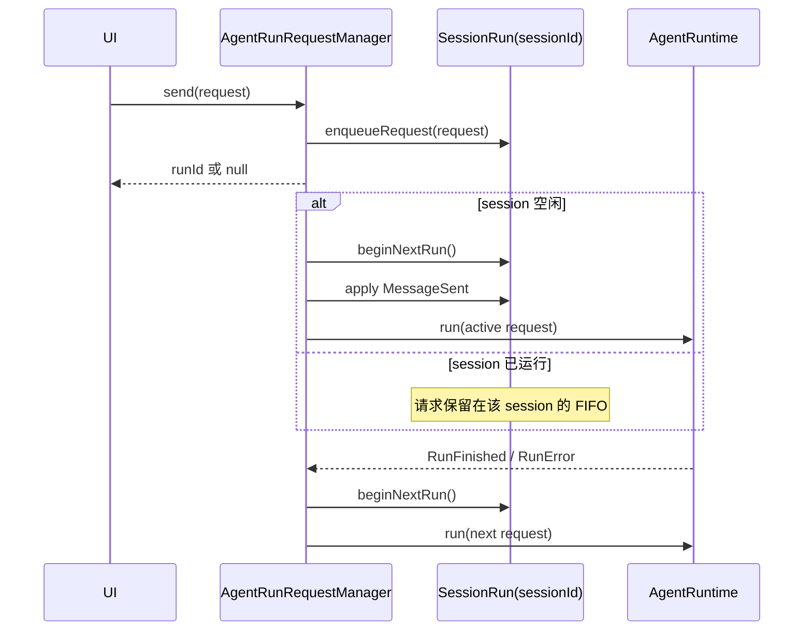

# Session 级消息排队后端化设计

## 背景与目标

当前会话输入框在 agent 正在运行时，把待发送消息保存在前端 `useState` 中，并由前端 effect 在运行结束后自动发送。这个实现把调度事实交给了某个页面实例，导致队列没有稳定的 session owner：切换会话、刷新页面或多个客户端同时连接时，队列的可见性和执行行为都不可靠。

本次改动把待发送消息定义为 `SessionRun` 的运行时数据，由 kernel 按 session 隔离并串行调度。前端只负责提交意图、查询后端队列和发起编辑或删除，不再持有权威队列，也不负责决定下一条何时执行。

可观察验收标准：

- 同一 session 的第二条消息在首条运行时进入后端队列，首条结束后按 FIFO 自动开始。
- 不同 session 的消息互不阻塞，可以各自同时运行。
- 切换会话或刷新页面后，前端仍可从后端读取该 session 的待发消息。
- 编辑或删除只作用于指定 session 的指定队列项。
- 待发消息在真正开始执行前不进入 transcript；开始执行时只产生一次标准 `MessageSent` 事件。

## 现状证据

- `use-session-conversation-controller.ts` 使用本地 `queuedInputs` state，并用监听 `agent.isRunning` 的 effect 自动发送队首。
- `AgentRunRequestManager.send` 当前在已有 active run 时直接由 `SessionRun.beginRun` 抛错，因此后端没有待执行请求语义。
- `SessionRunManager` 已按 `sessionId` 保存 `SessionRun`，是现有的 session 运行生命周期 owner。
- `NcpAgentRuntimeWrapper` 当前在 runtime 启动时从 `SessionRun.inbox` 取本次输入，因此 active run 输入与待执行请求仍可保持两个不同概念。

## Owner 与数据合同

### Kernel

`SessionRun` 是单个 session 的运行态 owner，拥有：

- 当前 active run；
- 当前 active run 的 message inbox；
- 等待执行的 `AgentRunRequest` FIFO；
- `idle/running` 状态，其中队列未清空时 session 仍视为 running，避免相邻任务之间出现错误的 idle 闪烁。

每个待执行项包含后端生成的队列 ID、预留 run ID、入队时间和完整请求快照。完整请求只在 kernel 内部存在；HTTP 只返回 UI 所需的队列 ID、session ID、入队时间、消息与输入元数据。输入元数据用于在编辑待发项时无损还原技能 token 等组合器语义，不包含后端解析后的 runtime 配置。

`AgentRunRequestManager` 是调度 owner：

1. materialize 或取得目标 session；
2. 把规范化请求加入对应 `SessionRun`；
3. 若 session 没有 active run，同步取出队首并开始执行；
4. terminal event 或失败清理完成后，继续取下一项；
5. 每次队列改变发出只携带 `sessionKey` 的失效事件，由读取方重新查询权威状态。

### Server 与 SDK

队列以 session 子资源暴露：

- `GET /api/ncp/sessions/:sessionId/queued-inputs`
- `DELETE /api/ncp/sessions/:sessionId/queued-inputs/:queuedInputId`

删除 session 时同时释放对应 `SessionRun`，保证 active run 与待执行队列不会成为孤儿运行态。

### Frontend

conversation feature 内的 query hook 按 `sessionKey` 查询队列，并监听 `session.run-queue.updated` 进行精确失效。输入 controller 无条件调用 agent send：后端返回非空 `runId` 表示立即开始，返回空 `runId` 表示已排队。编辑操作先从后端删除队列项，再把消息还原到当前输入框；删除操作只调用后端删除。

## 消息与事件时序

`MessageSent` 在请求真正成为 active run 时由调度 owner 写入会话状态并发布。外部 runtime wrapper 不再主动制造该事件；同时，`AgentRunRequestManager` 在所有 runtime 的统一出口过滤 runtime 自报的 `MessageSent`，因此 native 与外部 runtime 都只能通过同一条消息进入链路。

## 持久性边界

本次队列是后端 `SessionRun` 的 session 级运行时数据：它不依赖某个浏览器页面，支持页面刷新、切换会话和多个前端读取同一事实；服务进程重启会丢弃尚未执行的队列。把待执行请求持久化到 journal 涉及附件有效期、请求配置快照和崩溃恢复语义，作为独立的 durable queue 设计处理，不在本次用 transcript 消息冒充持久队列。

## 关键取舍

- 选择 session owner，而不是给前端队列补 `sessionKey`：后者仍然无法解决刷新、多客户端与调度竞争。
- 返回 `runId: null` 表示已接受但尚未开始，复用现有 `NcpRunHandle` 合同，不新增第二套发送协议。
- 队列更新事件只做失效通知，不复制完整待发请求，避免 event bus 成为第二份状态源。
- 不把 queued message 提前写进 transcript，保证 transcript 仍表示已经开始处理的对话事实。
- 不引入独立 queue service/factory；队列生命周期与 `SessionRun` 完全一致，放在现有 owner 上更直接。

## 验证方案

- Kernel 定向测试：同 session FIFO、跨 session 并行、队列删除、terminal 后自动续跑、状态连续性。
- Server/SDK 定向测试：按 session 查询和删除，404/不存在项语义。
- React 定向测试：running 时仍提交到后端；队列展示来自 session query；编辑和删除调用后端 owner。
- TypeScript 编译覆盖所有触达 package。
- 真实链路冒烟：在非仓库目录启动隔离服务，连续发送两条到同一 session，同时向另一 session 发送，观察执行和查询结果。
