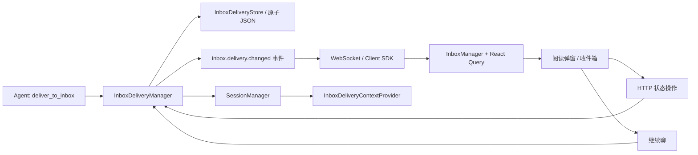

# AI 主动送达与收件箱设计

日期：2026-08-06

## 背景与目标

NextClaw 已有 `show_file`、`show_url` 和全局轻通知，但它们解决的是“当前会话、当前时刻立即展示”的问题。AI 在后台完成一份报告、推荐或长文后，仍缺少一种可持久、可回看、可继续讨论的交付形态。

本设计引入“收件箱（Inbox）”作为统一的主动送达表面。AI 可以通过一个稳定工具把 Markdown 正文或本地文本文件快照送入收件箱；用户在线时立即看到单一阅读弹窗，离线时在下次进入界面时看到；所有内容均可在收件箱中管理，并可一键创建后续会话。

这项能力服务于 NextClaw 的个人操作层定位：AI 不只在用户发起对话后回答，也能把异步工作结果可靠地送回统一入口，并保持结果、状态与后续行动的连续性。

## 核心判断

### 为什么需要新工具

需要新增 `deliver_to_inbox` 工具，而不是复用 `show_file`：

- `show_file` 是瞬时 UI 指令，没有持久化、未读状态或历史记录。
- 主动送达需要在用户不在线时仍然成立，工具执行成功必须先代表内容已持久化，而不是浏览器恰好收到了事件。
- 工具同时支持 `content` 与 `filePath`。文件模式在执行时读取并保存正文快照，原文件以后移动或删除不会破坏历史内容。
- 工具只负责创建送达项，生命周期变化统一由同一个内核 owner 处理。

### 为什么不能只存一个文件

正文可以来自一个文件，但一个裸文件无法可靠表达 `已呈现但未读`、`已读`、`归档`、`删除`、`来源会话` 和 `后续会话` 等状态。实现采用一个原子 JSON 存储保存记录与正文；这是当前规模下最简单、可迁移且无需新数据库依赖的方案。

当数据量或检索需求显著增长时，可在不改变上层合同的前提下将 Store 替换为数据库实现。

## 用户体验

### 自动阅读

1. 新送达项持久化后发出轻量实时事件。
2. 界面可见时，打开全局阅读弹窗；界面不可见时，等恢复可见后再检查。
3. 同时存在多项时只展示一个弹窗，顶部提供上一项、下一项和当前位置，不堆叠多个窗口。
4. 自动弹出只写入 `presentedAt`，不写入 `readAt`。
5. 用户关闭弹窗后，该项仍保持未读，但因为已经呈现，不再自动弹出。这是明确的产品合同。
6. 用户主动从收件箱打开、点击“标记已读”或点击“继续聊”时才进入已读状态。

### 收件箱

桌面端采用列表与阅读详情双栏布局，移动端采用列表到详情的路由切换。一级导航显示未读数量。收件箱提供：

- 未读、全部、已归档三种视图；
- Markdown 安全渲染；
- 标记已读/未读；
- 归档/恢复；
- 删除；
- 继续聊。

### 继续聊

“继续聊”创建一个真实的新会话，而不是把整篇正文塞进输入框。会话元数据保存 `inbox_delivery_id`，上下文 Provider 在每次 Agent 运行时读取对应送达项并注入上下文。这样正文只有一个事实来源，也不会伪装成用户消息。

同一送达项重复点击“继续聊”时复用仍存在的关联会话；如果关联会话已经被删除，则创建新会话并更新关联。

## 状态模型

每条 `InboxDelivery` 包含：

- 标识与内容：`id`、`title`、`summary`、`content`、`contentType`；
- 来源：Agent、来源会话、工具调用和可选原始文件路径；
- 生命周期：`createdAt`、`updatedAt`、`presentedAt`、`readAt`、`archivedAt`；
- 后续关系：`conversationSessionId`。

状态不压缩为单一枚举，因为呈现、阅读和归档是相互正交的事实。关键不变量如下：

- 已读一定意味着已呈现；
- 归档一定意味着已呈现；
- 标记未读不会清除 `presentedAt`，因此不会重新触发自动弹窗；
- 删除为物理删除；
- 自动弹出的候选必须同时满足未呈现、未读、未归档。

## Owner 与主链路

- `InboxDeliveryManager` 是创建、查询、状态迁移、删除和继续聊的唯一业务 owner。
- `InboxDeliveryStore` 只负责版本化 JSON 的读取与原子写入，不复制业务规则。
- Server controller 只做 HTTP 输入校验和错误映射。
- Client SDK 只提供类型化请求。
- UI 使用 React Query 保存服务端事实，Zustand 仅保存阅读弹窗是否打开和当前项 ID，不复制送达数据。
- 实时事件只携带 ID 与操作类型，界面统一重新获取权威数据，避免把大正文通过事件总线重复广播。

## 接口与工具合同

### Agent 工具

`deliver_to_inbox` 参数：

- `title`：必填，最多 160 个字符；
- `summary`：可选，最多 500 个字符；
- `content` / `filePath`：二选一且只能提供一个；
- 文件必须是绝对路径，执行时限制为 UTF-8 文本并进行大小检查；
- 单项正文上限为 512 KiB。

工具成功返回轻量结果 `{ ok, deliveryId, title }`。

### HTTP

- `GET /api/inbox/deliveries`
- `GET /api/inbox/deliveries/:deliveryId`
- `PATCH /api/inbox/deliveries/:deliveryId`
- `DELETE /api/inbox/deliveries/:deliveryId`
- `POST /api/inbox/deliveries/:deliveryId/continue`

PATCH action 为 `present`、`read`、`mark_unread`、`archive` 或 `restore`。

## 文件组织

- Shared：跨运行时 DTO、状态 action 与事件载荷。
- Kernel：Store、Manager、Agent 工具、工具 Provider、上下文 Provider。
- Server：`features/inbox-deliveries` HTTP 边界。
- Client SDK：`inboxDeliveries` 服务。
- UI：单一 `features/inbox` 根，内部按 managers/stores/hooks/components/pages 折叠。

不新增通用 registry、factory 或平行消息通道。当前规模下，一个 feature root 已足够清晰。

## 兼容性与迁移

这是全新能力，没有历史数据迁移。存储不存在时按空收件箱启动；写入采用临时文件加 rename，避免中途崩溃留下半截 JSON。`show_file/show_url` 的现有行为不变。

## 非目标

- 本期不做富文本编辑器、邮件协议、外部邮件同步或附件系统；
- 不做全文索引、分页和云端多端同步；
- 不允许任意 HTML 直接执行；正文按安全 Markdown 渲染；
- 不在点击“继续聊”后自动发送消息或启动 Agent，避免制造未经用户确认的新回复。

## 验证标准

1. 工具以直接正文和文件快照两种方式创建送达项，并覆盖非法参数与超限输入。
2. 数据跨 Kernel 重建仍可读取，连续写入不会丢更新。
3. `present/read/mark_unread/archive/restore/delete` 状态不变量由定向测试覆盖。
4. HTTP 与 Client SDK 的响应类型和错误状态正确。
5. 新实时事件能使已打开界面刷新；首次进入和恢复可见时能打开最早待呈现项。
6. 关闭阅读弹窗后仍未读但不再次自动弹；多项只在同一弹窗内切换。
7. 继续聊创建或复用会话，并在下一次 Agent 运行中注入对应正文上下文。
8. 中英文 UI、键盘可达性、移动端与桌面端布局通过组件与构建验收。
9. 运行 TypeScript、定向测试、治理检查、生产构建和本地隔离运行链路冒烟。
