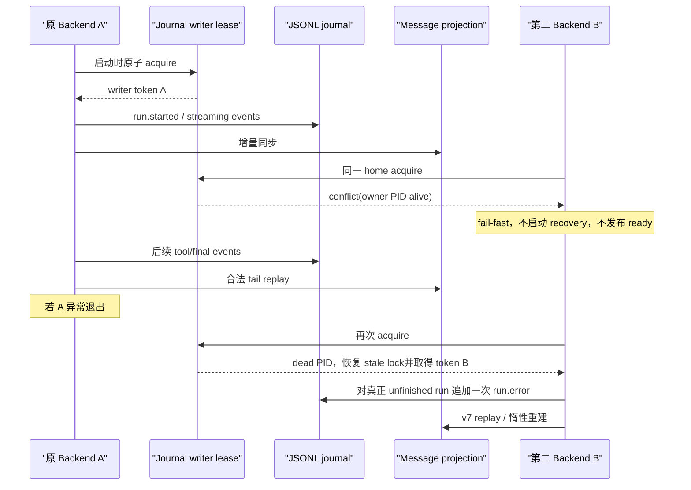

# 会话中断恢复与消息投影完整性设计

## 1. 状态

- 日期：2026-08-22
- 状态：Design Ready
- 风险：L3，涉及 NCP 会话事实写入、进程启动恢复、消息投影、上下文压缩时间线和首屏分页
- 事故会话：`ncp-mt4g15ql-djd2ohpr`
- 事实源：`$NEXTCLAW_HOME/sessions/.ncp-agent-journal/<session-id>.jsonl`
- 主要 owner：`NcpAgentSessionJournalStore`、`SessionEventIngestionService`、消息 projection persistence、context compaction recovery、session history API view
- 关联设计：
  - [会话消息分页与动态高度虚拟时间线设计](./2026-07-18-chat-message-virtual-timeline.design.md)
  - [聊天会话历史读取链路优化设计](./2026-08-13-chat-session-history-read-path-optimization.design.md)
  - [SSE 恢复与会话 Journal 内存治理设计](./2026-08-11-sse-recovery-and-journal-memory.design.md)
  - [会话消息投影写入失败恢复设计](./2026-08-22-session-message-projection-write-recovery.design.md)
  - [Codex 对齐的上下文压缩设计](./2026-08-08-codex-aligned-context-compaction.design.md)

本文是可直接交给实现 AI 的冻结设计。实现必须先添加稳定复现测试，再修改生产逻辑；不得根据表面 UI 现象直接删除启动恢复、上下文压缩或分页性能优化。

## 2. 执行摘要

本次事故不是用户打开同一会话页面导致写入，也不是 JSONL 中的历史被物理删除。真实链路是：

1. 第二个 NextClaw 后端与原后端共享同一个 `NEXTCLAW_HOME`。
2. 第二个后端启动时无条件扫描 unfinished run，把原后端仍在执行的 run 写成 `run.error`。
3. 原后端随后继续写入工具事件，两个进程对同一 journal 形成多写者，并实际产生重复 `seq`。
4. 增量消息投影在 `run.error` 后没有把原 assistant 终态消息作为 replay seed；看到同一 message ID 的晚到 streaming 事件时，把它 bootstrap 成一条新的空 streaming 消息。
5. projection 的 offset 索引随后指向这条只有少量 parts 的新快照，原先包含完整 parts 的 error 快照仍在 `messages.jsonl` 中，但正常分页已经读不到。
6. 首屏 24 KiB 紧凑预算又把包含完整压缩摘要的 service marker 当作普通消息计费，并让 service marker 占用最少 5 条消息名额，最终放大为“只剩两条压缩提示、其它消息消失”。

推荐方案由四个相互独立但必须一起交付的保护组成：

1. **journal 目录进程级单写者租约**：完整 kernel 在执行任何恢复或订阅写入前必须取得租约；共享同一 journal 目录的第二个完整后端 fail-fast，不进入隐式只读或半可写状态。原 owner 确实死亡时，下一实例接管并继续执行现有 unfinished-run 恢复。
2. **增量 replay 边界收紧**：projection tail replay 禁止仅凭未知 message ID 的 delta/tool 事件 bootstrap 新 assistant；只有 full replay 的 legacy 兼容路径允许该救援。权威终态不可被晚到 streaming 事件重新打开；被后续同 run/message 事件明确证伪的 synthetic interrupted terminal 则在历史 full rebuild 中跳过。
3. **旧 projection 惰性修复**：提升 projection version，使可能已被旧语义污染的 projection 在该 session 第一次访问时从 journal 重建；不得在进程启动时批量重建全部历史。
4. **压缩 marker 与 UI payload 收口**：compaction recovery 按 continuation 生命周期而非偶然事件顺序判断；session history API 不下发模型专用的完整 checkpoint summary，并保证首屏最少窗口按 user/assistant 对话锚点计算。

这不是每个 run 的 lease、heartbeat 或分布式锁设计。唯一新增的进程协调事实是“谁拥有这个 journal 目录的写权限”，它只在 kernel 生命周期边界获取和释放。

## 3. 用户语义与成功标准

用户的合理预期是：

- 只打开同一会话页面是读取行为，不能修改会话事实。
- 第二个后端即使被启动，只要没有获得同一数据目录的写权限，就不能替另一个活着的后端判定 run 已中断。
- 原实例真的死亡时，启动恢复仍要把 unfinished run 收敛为明确终态，不能为了修复误判而删除恢复能力。
- 即使发生错误恢复或晚到事件，已有消息正文和工具 parts 也不能从正常读取路径消失。
- JSONL 是事实源，projection 损坏必须能自动重建；用户不应手工编辑 journal。
- 已有分页和长会话性能优化继续生效，正常首屏不能退回全量 journal replay。

完成标准：

1. 两个进程指向同一 journal 目录时，至多一个进程能进入可写 kernel 生命周期。
2. 活跃 owner 存在时，第二进程不会追加 `run.error`、compaction marker、summary 或任何 session event。
3. owner 异常退出后，新实例只追加一次 interrupted `run.error`，保留此前全部消息内容。
4. 对合法事件流，`完整 journal replay` 与 `稳定 projection + 任意合法边界后的 tail replay` 产出相同的消息状态和 parts。
5. 权威 terminal assistant 后的晚到 streaming/tool 事件不能把该 message ID 重新变成 streaming，也不能用更短快照覆盖 offset 指向。
6. 历史 journal 中若 `run.error(interrupted=true)` 后仍有同 run/message 的明确 continuation，v7 full rebuild 必须保留后续真实内容，不能让误恢复终态截断它。
7. 旧 projection 第一次访问可恢复，第二次访问回到 projection 随机分页，不重复全量重建。
8. compaction summary 不进入 UI history payload；首屏至少包含近期 user/assistant 对话锚点，service marker 不能单独满足最少消息数。
9. 性能门槛和真实隔离复现全部通过后，才能声明修复完成。

## 4. 事故证据

### 4.1 页面和 API 现象

事故发生时，同一会话的首屏消息 API 返回 `total=13`、当前页 5 条、`hasPreviousPage=true`。当前页主要包含：

- 前一条 assistant final；
- 当前 user；
- 同一 target assistant 的 streaming 快照，但只有 2 个 parts；
- “较早上下文已自动压缩”；
- “正在压缩较早上下文”。

使用 previous cursor 能读到更早的 8 条逻辑消息，证明历史分页仍存在。浏览器页面没有 console error；页面底部显示“停止”，说明 UI 只是忠实渲染了错误的 server projection/status。

### 4.2 时间线

以下时间使用 Asia/Shanghai：

| 时间 | 事实 |
| --- | --- |
| 22:54:02 | 原后端开始 run `agent-run-bfeee07c-...` |
| 23:03:40 | 第一次 mid-run compaction 写入 `compressing` marker |
| 23:04:36 | 第一次 compaction 完成，92 条 session messages 从约 616,115 tokens 压到约 43,012 tokens |
| 23:15:24 | 第二个 `dev-runner` 启动，未显式设置 `NEXTCLAW_HOME`，因此默认使用同一个 `~/.nextclaw` |
| 23:15:28 | 第二后端的启动恢复生成 interrupted `run.error` |
| 23:15:41—23:15:52 | 原后端仍继续写入同一 assistant 的 tool start/result 等事件 |
| 23:15:50—23:15:51 | journal 出现两个 `seq=17205`：一个是 `run.error`，另一个是 tool result |
| 23:15:52 | 原后端继续写入同 checkpoint 的下一条 compaction marker |

`scripts/dev/dev-runner.mjs` 当前在没有显式环境变量时把 `NEXTCLAW_HOME` 默认到 `~/.nextclaw`。第二个后端虽检测到 remote ownership 冲突，但该冲突只关闭 remote ownership，没有阻止 kernel 初始化和 session recovery。

### 4.3 事实没有被删除，但 projection 指针被替换

事故后 projection 的 append-only `messages.jsonl` 中，同一 assistant message ID 至少保留了以下快照：

| 顺序 | status | parts | 含义 |
| ---: | --- | ---: | --- |
| 早期 | `streaming` | 15 | run 仍在执行 |
| `run.error` 后 | `error` | 87 | 含此前完整文本和工具 parts |
| 晚到事件后 | `streaming` | 2 | 错误 bootstrap 出的新不完整快照 |

projection 的 `offsets.idx` 对每个逻辑 message ordinal 只保留一个最新位置。晚到事件同步后，该 ordinal 被改指向 2-part streaming 快照，因此 87-part error 快照虽仍有物理字节，普通 API 已不可达。这就是“消息仍在，但读不到”的直接原因。

后续原后端继续运行又生成了更多快照，不影响上述事故证据。真实会话仍在变化，不能把当前现场文件直接当成稳定测试夹具，也不能在修复测试中写入它。

## 5. 根因分层

### 5.1 触发根因：共享数据目录存在两个完整写者

`SessionEventIngestionService.start()` 会订阅 runtime event，并遍历 `listUnfinishedRuns()`。对每个 unfinished run，它立即 ingest 一条 interrupted `RunError`。当前没有“本实例是否拥有该 journal 的恢复权”前置条件。

所以用户没有操作第二个会话、甚至不打开页面，也不影响问题发生。写入来自第二个 backend startup，不来自 GET 页面。

### 5.2 生命周期根因：把“本进程没看到终态”误当成“原 runtime 已死亡”

unfinished journal 只能说明事实源里尚无 terminal event，不能单独证明原 producer 已死亡。只有获得该 journal 目录唯一写权限的新 runtime，才有资格把它解释为“上一 runtime 已中断”。

### 5.3 投影根因：增量 replay 把“不在 seed”误当成“从未存在”

`readJournalTailMessages()` 当前只 seed：

- `meta.activeMessageId`；
- `meta.pendingCompactionMessageIds`。

`run.error` 之后，assistant 已是 terminal，`activeMessageId` 变成 `null`。随后 tail 中出现同一 ID 的 `message.tool-call-*` streaming 事件时，`createReplayStreamingBootstrapEvent()` 发现 ID 不在 `knownMessageIds`，便合成空的 `MessageSent(streaming)`。

这里混淆了两个状态：

- message ID 真的是旧 journal/legacy 数据中缺失的未知消息；
- message ID 已经存在于稳定 projection，只是不属于 active/pending seed。

增量 replay 因此不再等价于完整 replay。

### 5.4 压缩恢复放大：恢复逻辑依赖事件先后顺序

`ContextCompactionJournalRecoveryService` 当前只在“先看到 pending marker、后看到 run terminal”时终态化 marker。如果 terminal 先出现、同 continuation 的 `compressing` marker 后出现，它不会利用 continuation lifecycle 判断，可能暂时投影为仍在压缩。

### 5.5 首屏放大：模型摘要进入 UI 消息预算

session history compact view 默认预算为 24 KiB、最少 5 条消息。完整 checkpoint summary 位于 service message metadata 中，UI parser 虽要求该字段存在，却没有展示其正文。该模型上下文数据仍参与序列化字节预算；同时 service marker 也计入最少 5 条消息。

因此两个 marker 加一个错误 streaming assistant 足以挤掉近期对话锚点，形成“消息全没了，只剩压缩提示”的视觉结果。

## 6. 必须保持的不变量

1. JSONL journal 是唯一会话事实源，append-only；projection 是可删除、可重建的派生读模型。
2. 页面 GET、SSE 订阅和 history pagination 本身是只读操作，不得触发 run recovery。
3. 同一 journal 目录同一时刻只有一个完整可写 kernel owner。
4. unfinished-run recovery 只由成功取得 journal writer lease 的新 owner 执行。
5. 权威 terminal 状态对 streaming delta 是吸收态：`final`、非恢复型 `error`、`cancelled/aborted` 不能被晚到 delta 重新打开。`run.error(interrupted=true)` 是启动恢复派生终态；只有 full replay 发现它在 append order 上被同 run/message continuation 明确证伪时才可忽略。
6. projection 更新同一 message ID 时只能保留或增加已确认内容，不能因不完整救援快照丢失已确认 parts。
7. 对合法事件流，full replay 与 incremental replay 必须同构。
8. compaction 的模型摘要继续保存在 journal/checkpoint，并继续供 model input 使用；UI payload 省略它不改变模型上下文。
9. 不删除启动检查、unfinished-run scan、context compaction、cursor pagination、tool payload defer 或 projection 随机读取。
10. 正常读写性能不依赖完整 journal 大小；只有 projection 缺失、版本过旧或损坏时允许一次惰性重建。

## 7. 方案比较

### 7.1 只给 unfinished run 增加短延迟

延迟几秒不能证明另一个 runtime 已死亡，也无法阻止两个进程继续追加其它事件或生成重复 seq。

结论：不采用。

### 7.2 每个 run 增加 heartbeat/lease

它可以表达 run producer liveness，但会新增周期写入、过期时间、休眠/唤醒、时钟漂移和每个 runtime adapter 的续租责任。当前根因首先是整个 journal 目录存在两个写者；按 run 建租约比问题边界更细、更复杂。

结论：本批不采用。只有未来明确需要多个写者并发服务同一 home 时再设计。

### 7.3 允许第二 backend 进入隐式只读模式

完整 backend 包含 automation、session metadata、projection、extension 和其它持久 owner。只屏蔽 session recovery 不能证明它整体只读；真正的只读 secondary kernel 需要独立 capability contract 和 UI 状态，不应在故障修复中临时拼装。

结论：本批不采用。冲突实例 fail-fast，并指向现有 owner 或隔离 `NEXTCLAW_HOME`。

### 7.4 每次 append 获取跨进程文件锁

它只能串行文件写入，不能阻止第二进程基于错误生命周期判断合法地写入 `run.error`。两个 producer 即使轮流写，也仍会生成矛盾事实。

结论：不充分。

### 7.5 journal 目录生命周期单写者 + replay/视图修复

该方案直接关闭多写者触发条件，保留 owner 死亡后的恢复，并在 projection 和 API 两层防止已有/异常事件再次造成可见数据丢失。锁只在启动和退出时操作，热路径没有额外 I/O。

结论：采用。

## 8. 推荐设计

### 8.1 journal writer lease

在 session journal 根目录建立进程生命周期租约，例如：

```text
$NEXTCLAW_HOME/sessions/.ncp-agent-journal/.writer.lock
```

metadata 至少包含：

```ts
type JournalWriterLeaseMetadata = {
  token: string;
  pid: number;
  createdAt: string;
};
```

获取语义：

1. 使用同目录 `open(path, "wx")` 原子创建。
2. 创建成功后写入完整 metadata 并 `sync`，返回持有 token 的 lease handle。
3. 文件已存在时读取 metadata：
   - PID 存活或检查返回 `EPERM`：判定已有 owner，立即抛出明确的 writer conflict；
   - PID 不存在：通过独占 recovery lock 删除 stale lock 并重试获取；
   - metadata 损坏：只有超过有限 grace 后才允许 recovery，避免读取创建中的半成品。
4. 正常 dispose 时只允许 token 匹配的 owner 删除 lock。
5. 异常退出留下的 lock 由下一实例按 dead PID 恢复。

版本升级还必须覆盖“不知道 writer lock 的旧 runtime”：首次部署 v7 时，正在运行的旧版本不会持有 `.writer.lock`。因此创建一个原本不存在的 writer lock 前，要复用当前 local UI/managed service state 的 PID liveness 事实做一次 legacy-owner guard；发现同一 home 下其它 live PID 时同样 fail-fast。当前已经能发现 remote/local ownership conflict 的启动链路必须从“只关闭 remote ownership”升级为“阻止 writable kernel 启动”。该 guard 是迁移期兼容保护，不替代新版本之间的原子 writer lock。

优先复用 `@nextclaw/app-runtime` 已有 `FileLockService` 的 token、PID liveness、recovery lock 和 owner-safe release 算法，为它增加显式生命周期 lease handle；不要在 kernel 再复制一套近似文件锁。该能力仍是本地文件系统锁，不引入 daemon、数据库或网络协调。

租约 owner 应落在 `NcpAgentSessionJournalStore` 或其直接持久化 owner，并由 kernel 生命周期调用。不要放进 server controller、UI、dev runner 或 `SessionEventIngestionService` 内部，因为这些都不是 journal 写权限 owner。

### 8.2 启动与退出顺序

冻结后的启动顺序：

```text
resolve NEXTCLAW_HOME / journal path
  -> acquire journal writer lease
  -> initialize writable kernel managers
  -> subscribe runtime events
  -> scan unfinished runs
  -> append interrupted terminal events when needed
  -> publish readiness
```

关键约束：

- writer lease 获取失败时，不得执行 `SessionEventIngestionService.start()`，不得发布 backend ready，不得继续启动一个“只有 remote ownership 被禁用”的半可写 kernel。
- 错误信息必须包含冲突 home、owner PID（可用时）和两个安全动作：打开现有实例，或显式设置隔离的 `NEXTCLAW_HOME`。
- 不自动终止、重启或抢占活 owner。
- kernel dispose 时先停止新事件入口并 flush 本进程 ingestion chain，再释放 writer lease。
- 若 acquire 后的后续初始化失败，必须在异常清理中释放 lease。

这样保留了原始启动恢复：旧 owner 真正死亡后，stale lease 被接管，新 owner 才运行 unfinished scan。启动恢复不是被关闭，而是增加了正确的授权前提。

### 8.3 增量 projection replay

`replayNcpAgentSessionEvents` 需要显式区分两个入口：

- `full/legacy replay`：从 journal 起点重放；可保留未知 streaming ID bootstrap，兼容旧 journal 缺少初始 `MessageSent` 的历史救援语义。
- `projection tail replay`：从一个已提交 projection boundary 后重放；禁止未知 streaming ID bootstrap。

tail replay 的合法 message 来源只有两类：

1. boundary 时仍 active 的 assistant，由 `meta.activeMessageId` 对应 snapshot seed；
2. tail 内先出现明确 `MessageSent` 的新 message，随后 delta 自然更新它。

为保持既有 legacy journal 的可读性，再保留一个受限兼容窗口：若 tail 内先出现
`RunStarted`，但历史 producer 没有写入 `MessageSent`，则在该 run 尚未观察到
`RunFinished`/`RunError`/`MessageAbort` 前允许 conversation state manager 接收未知
streaming 事件；这个窗口不创建 projection bootstrap snapshot，且一旦观察到 terminal
就关闭。这样不会恢复事故中的 terminal-after-tool late event，也不会破坏旧 journal
中“RunStarted 后直接 text/tool stream”的既有语义。

除上述兼容窗口外，如果 tail streaming/tool event 引用的 ID 既不在 seed，也没有在 tail 内被明确声明，则它是晚到、乱序或损坏事件。它可以保留在 journal 供诊断，但不能凭空创建新 streaming message，也不能覆盖稳定 ordinal。

replay 还必须维护 authoritative terminal message ID 集合：

- seed 中 status 为 `final`/`error` 的 assistant 进入 terminal set；
- `RunFinished`、非恢复型 `RunError`、`MessageAbort` 使对应 message ID 进入 terminal set；
- 后续 text/reasoning/tool streaming 事件命中 terminal set 时不改变 conversation state；
- 明确、完整的新 `MessageSent` 只有使用新的 message ID 才能开始新生命周期；同 ID 不允许从 terminal 回到 streaming。

#### 历史 synthetic interruption 对账

事故 journal 已经包含一个错误的 `RunError(interrupted=true)`，而原 producer 后来继续写入同一 run/message 并最终产生更多完整内容。若 v7 full rebuild 无条件吸收该终态，会把现有可恢复内容再次截断。因此 full replay 在 dispatch 前需要做一次有界的事件对账：

1. 仅把 `interrupted === true` 的 `RunError` 识别为 synthetic recovery terminal；普通 provider/runtime error 不参与该 fallback。
2. 按 journal append order 查找其后的明确 continuation 证据，不按 `occurredAt` 排序；跨进程事件的发生时间和落盘时间在事故中已经交错。
3. continuation 证据必须能归属到同一 `messageId` 或 `runId`，包括 text/reasoning/tool start/args/execution、message completion/run completion；只有 `toolCallId` 的 result 必须先通过此前 tool start 建立 `toolCallId -> messageId` 归属，不能凭任意 result 猜测。
4. 找到证据时，full replay 跳过该 synthetic `RunError` 的状态投影，但不删除或改写 journal；随后事件继续从 terminal 前状态正常 replay。
5. 没有后续 continuation 证据时，该 interrupted error 仍是有效终态，保持现有真实崩溃恢复语义。
6. 该对账只用于 full rebuild/完整 recovery。新版本取得单写者 lease 后，合法 incremental tail 不应再产生“恢复终态后原 producer 继续写”的矛盾流。

实现优先在 journal replay normalization 中完成该判断，不把“interrupted 可重开”扩散到通用 conversation state manager。这样普通 terminal 仍严格吸收，兼容逻辑也只服务已存在的多写者污染数据。

不要在 projection persistence 里手写 parts merge。消息状态与 parts 仍由 `DefaultNcpAgentConversationStateManager` 唯一投影；persistence 只选择 replay mode 和 seed。

### 8.4 等价性合同

实现测试必须固定以下公式，而不是只测一个事故样例：

```text
fullReplay(allEvents)
===
incrementalReplay(
  projection = fullReplay(eventsBeforeBoundary),
  tail = eventsAfterBoundary
)
```

比较内容至少包含：

- message IDs 与顺序；
- role/status；
- parts 数量和每个 part 的稳定内容；
- tool call state/result；
- compaction marker status/placement；
- active message；
- cursor total/pageInfo。

合法边界要覆盖：message start 后、多个 delta 中间、tool args 中间、tool result 前后、run terminal 前后、compaction marker 前后。普通非法晚到事件场景单独断言“journal 保留、projection 忽略，不重新打开权威终态”。

被 foreign recovery 污染的历史流不属于合法增量流，不要求任意 prefix/tail boundary 都可在不知道未来的前提下撤销 synthetic terminal；它由 v7 的一次 full rebuild 对账。对应测试必须证明 full rebuild 产出后续完整 final，而不是停在错误 recovery 的 error 快照。

### 8.5 projection v7 与既有数据自愈

旧 v6 projection 可能已经把 ordinal 指向终态后的不完整 streaming 快照，单看当前 meta/data 长度仍是结构有效，无法用普通完整性校验识别。

因此把 `NCP_AGENT_SESSION_MESSAGE_PROJECTION_VERSION` 从 6 提升到 7。v7 的语义差异是“incremental tail 不 bootstrap 未知 streaming message、权威 terminal 不可重开、full rebuild 会跳过被后续 continuation 证伪的 synthetic interrupted terminal”。

迁移规则：

- journal 不迁移、不改写；
- 不在 startup 扫描或批量重建所有 session；
- session 第一次读取或 mutation 发现 v6 时，从 journal 惰性重建该 session 的 v7 projection；
- 重建成功后正常随机分页；同一 session 后续读取不得再次全量 replay；
- 重建失败时沿既有 projection recovery/degraded 设计保证完整读取，不返回半页；
- 重建过程记录一次原因 `projection_version_mismatch` 和耗时/字节，不记录消息正文。

事故会话的恢复只能通过 journal -> v7 projection 重建完成。禁止从 `messages.jsonl` 中挑某个历史快照手工覆盖 offset，因为后续事实可能已经继续增长。

### 8.6 compaction recovery 改为 continuation-aware

mid-run compaction checkpoint 已包含：

- `continuationMessageId`；
- `continuationMessageCoveredPartCount`；
- checkpoint ID/status/timestamps。

recovery 应按 continuation message lifecycle 关联，而不只依赖 pending set 的事件先后：

1. 看到 `compressing` marker 时，读取其 `continuationMessageId`。
2. 如果 replay 已知该 continuation 为权威 error/aborted/finished，或为未被后续事件证伪的 interrupted error，且 marker 尚无明确 `compressed` 更新，把 marker 投影为 `failed` 或 `cancelled`。
3. terminal 先出现或 marker 先出现都得到相同结果。
4. unrelated message/run terminal 不能终态化其它 continuation 的 marker。
5. 后续 journal 中若存在同 marker ID 的明确 `compressed` update，它是更具体的事实并获胜；恢复生成的 failed/cancelled 只是缺少明确完成事件时的派生状态。
6. 缺少 `continuationMessageId` 的 legacy/pre-run marker保留现有 pending-set fallback，不删除兼容路径。

recovery 状态只存在于 replay 过程，不向 journal 追加合成事件，避免页面读取变成写操作。

### 8.7 UI history payload 去除模型摘要

模型输入与 UI timeline 使用同一 checkpoint message，但它们需要的字段不同。server 在构造 session history API view 时，应从 context compaction checkpoint metadata 中移除：

- `summary`；
- 只服务模型生成诊断、且 UI 没有展示合同的大体积字段。

保留 UI 所需字段：

- checkpoint ID/status；
- phase；
- continuation message ID 和 covered part count；
- covered counts；
- original/projected token counts；
- created/updated timestamps。

kernel/journal/model input 中的 checkpoint 不变。UI 的 `ContextCompactionTimelineView` 不再把 `summary` 作为解析 marker 的必需字段；当前 UI 没有展示该正文，因此这是 transport view 收窄，不是功能删除。

compact initial payload 的“最少 5 条”改为至少 5 条近期 **conversation anchors**：

- `role=user`；
- `role=assistant`。

service timeline markers 仍按时间顺序包含在所选对话窗口中，但不能单独满足 minimum。字节预算仍适用，超大 assistant tool payload 继续走现有 deferred detail cursor；不得把 streaming message 永久排除 defer，若 streaming payload 超预算，需要沿已有 tool payload summary contract 做有界视图，而不是把整页挤空。

### 8.8 可观察性

只添加低频结构化事件，不记录消息正文：

- writer lease acquired/released；
- writer conflict（home fingerprint、owner PID、contender PID）；
- stale lease recovered；
- unfinished recovery count；
- projection version rebuild started/completed/failed（session ID、journal bytes、duration）；
- late streaming event ignored（session ID、message ID、event type，按 run/周期限流）；
- compact UI payload before/after bytes 可作为测试指标，不要求生产逐请求日志。

不要为此新建通用 observation 子系统或每条 delta 日志。

## 9. 端到端状态流



## 10. 故障矩阵

| 场景 | writer lease | startup recovery | projection/UI 结果 |
| --- | --- | --- | --- |
| 单实例正常启动 | acquire | 正常扫描 | 行为不变 |
| 第二实例同 home，owner 存活 | conflict | 不运行 | 原会话不变，第二实例不 ready |
| 第二实例只打开原实例 URL | 不启动新 kernel | 不运行 | 纯读 |
| owner 正常退出 | owner-safe release | 下一实例正常扫描 | unfinished 依事实处理 |
| owner 崩溃留下 lock | dead PID stale recovery | 新 owner 扫描一次 | 追加一次 interrupted terminal |
| 两实例同时首次竞争 | `wx` 只有一个成功 | 只有获胜者运行 | 无重复 seq |
| 权威 terminal 后晚到 delta | owner 内事件仍可进 journal | 不相关 | projection 忽略，不重开 message |
| 旧 synthetic interrupted terminal 后有同 run continuation | v7 前历史污染 | 不追加新事件 | full rebuild 跳过误恢复终态并保留后续内容 |
| v6 projection 已污染 | 不相关 | 不相关 | 首次访问从 journal 重建 v7 |
| terminal 后出现 pending compaction marker | 不相关 | 不追加合成恢复事件 | continuation-aware 派生 failed/cancelled |
| marker 后有明确 compressed update | 不相关 | 不相关 | compressed 明确事实获胜 |
| UI 首屏含巨大 summary | 不相关 | 不相关 | summary 不传输，对话锚点保留 |

## 11. 实现边界与建议批次

### 批次 A：先写失败测试

在任何生产逻辑修改前，先提交到工作树但不 commit 以下 deterministic tests：

1. 同一 message ID 在权威 `run.error` 后收到晚到 tool events，当前 projection 会从 error/full parts 退化到 streaming/short parts。
2. `run.error(interrupted=true)` 后同 run/message 继续执行并最终完成时，旧 full/projection 语义不能稳定表达“误恢复被证伪”。
3. prefix projection + tail replay 与 full replay 在合法 terminal 边界不等价。
4. 两个进程/两个 store owner 指向同一临时 journal 目录时，第二 owner 仍能进入 recovery。
5. terminal-before-compressing marker 不能正确终态化。
6. 两个大 summary marker 会占据 compact initial payload 的 minimum。

测试必须在 `mkdtemp` 隔离目录运行，不使用真实 `~/.nextclaw`。

### 批次 B：writer lease 与 recovery authority

预期触达：

- `packages/nextclaw-app-runtime/src/services/file-lock.service.ts` 及测试：若现有 owner 无法返回生命周期 lease handle，做最小公共能力扩展；
- `packages/nextclaw-kernel/src/stores/ncp-agent-session-journal.store.ts` 及测试：拥有 journal writer lease；
- `packages/nextclaw-kernel/src/app/nextclaw-kernel.ts` 或实际 kernel start/dispose owner：冻结 acquire/start/flush/release 顺序；
- `packages/nextclaw-kernel/src/services/session-event-ingestion.service.ts` 及测试：保留 unfinished recovery 内容，只证明它仅在已获写权限的 kernel 生命周期调用。

不要把 writer check 只放在 `scripts/dev/dev-runner.mjs`；生产、foreground、desktop 和测试宿主都必须经过同一 kernel contract。dev runner 可以改善冲突提示，但不能成为安全 owner。

### 批次 C：projection replay 与 v7

预期触达：

- `packages/nextclaw-kernel/src/utils/ncp-agent-session-journal.utils.ts`；
- `packages/nextclaw-kernel/src/utils/ncp-agent-session-message-projection.utils.ts`；
- `packages/nextclaw-kernel/src/stores/ncp-agent-session-message-projection-persistence.store.ts`；
- `packages/nextclaw-kernel/src/stores/ncp-agent-session-message-projection.store.ts`；
- 对应 projection/journal/recovery tests。

保持 conversation state manager 为唯一事件合并 owner。禁止新增第二套 message reducer。

### 批次 D：compaction 与 transport view

预期触达：

- `packages/nextclaw-kernel/src/features/context-compaction/services/context-compaction-journal-recovery.service.ts` 及 tests；
- `packages/nextclaw-server/src/features/sessions/utils/session-message-history-payload.utils.ts` 及 tests；
- `packages/nextclaw-ui/src/features/chat/features/session/utils/ncp-session-context-metadata.utils.ts` 及 timeline tests。

不改变模型 input builder 的 checkpoint summary 读取。

## 12. 稳定复现规范

### 12.1 projection 最小复现

构造单 session：

1. append user message；
2. append assistant `MessageSent(streaming)`；
3. append至少一个 text part 和三个 tool invocation，使完整内容易于断言；
4. 第一组 append 权威 `RunError(interrupted=false/omitted)`；
5. 强制 projection 同步到该 byte boundary，并断言 assistant 为 `error`、parts 完整；
6. 在 boundary 后 append同 message ID 的 `MessageToolCallStart/ArgsDelta/ExecutionStarted/Result`；
7. 从 projection latest page 读取。

修复前必须稳定观察到至少一个失败断言：status 被重开或 parts 退化。修复后应保持 error 和 terminal 前完整 parts；晚到事件保留在 journal，但不成为新 streaming projection。

第二组使用事故型事件流：`RunError(interrupted=true)` 后追加同 message ID 的明确 continuation，再追加同 run 的完成事件。修复后的 v7 full rebuild 必须跳过 synthetic interrupted terminal，产出包含后续 parts 的完整 final；同时无 continuation 的 interrupted error 仍保持 error。

再把 boundary 参数化到每个关键 event 之后，与一次 full replay 的结构化结果比较。

### 12.2 双进程真实复现

使用子进程和临时 `NEXTCLAW_HOME`，不得复用开发者 home：

1. 进程 A 启动可写 kernel，写入 unfinished run，并通过 IPC 通知已持有 lease。
2. 进程 B 使用同一 home 启动。
3. 修复前基线应证明 B 能产生 interrupted `run.error` 或两个 writer 均可 append。
4. 修复后 B 必须在 recovery 前返回 writer conflict；比较 B 前后的 journal hash/size/event count完全不变。
5. 强制终止 A，不执行 graceful release。
6. 再启动 B，证明 stale lease 被恢复，unfinished run 只得到一次 interrupted terminal。
7. 扫描 journal seq，断言唯一、单调；扫描每个 run，断言 terminal 至多一个。

如果完整 backend harness 太重，先用两个 journal-store lease harness 固定原子竞争，再补一条真实 kernel startup integration。仅有 mock PID 单元测试不足以声称复现完成。

### 12.3 API/UI 复现

构造包含以下尾部的 session：

- 近期 user + assistant；
- 两个 checkpoint summary 各大于 24 KiB；
- 一个多工具 assistant；
- 更早一页消息。

断言：

- initial compact payload 不包含 summary 正文；
- payload 仍包含最近 user/assistant anchors 和其间 marker；
- previous cursor 可读完全部历史，无重复、无遗漏；
- UI timeline marker 正常显示 status/count/token，不因缺少 summary 被过滤；
- 页面不会只剩压缩 marker。

## 13. 性能预算与验证

### 13.1 设计层面的成本

| 路径 | 新成本 | 结论 |
| --- | --- | --- |
| kernel startup | 一次 `wx` create/read + PID liveness | 常数级，仅启动发生 |
| journal append | 无新增跨进程 lock/heartbeat | 热路径不变 |
| warm latest page | v7 projection 随机读取 | 不允许 full journal replay |
| tail replay | 仍只读 projection boundary 后 tail；未知 late event直接忽略 | 不增加历史扫描 |
| UI payload | 少序列化/传输完整 summary | 应降低字节与 parse 成本 |
| 旧 session 首次访问 | 一次 journal -> v7 rebuild | 可见的一次性成本，之后恢复快路径 |

### 13.2 必须执行的基准

在改动前后使用同一机器、同一 fixture、release-like Node 参数测试：

1. 事故规模 fixture：约 8.1 MiB journal、17k+ events、包含 compaction 和工具事件。
2. 大型 fixture：沿现有长会话/259 MiB projection 场景验证，不要求把真实私有会话复制进仓库。
3. 每项至少 5 次冷运行、20 次 warm 运行，记录 median/p95，而不是只报一次。

门槛：

- uncontended writer lease acquire median 应为毫秒级，且不进入 append/page 热路径；
- warm latest page p95 不得比基线回退超过 5%，并通过 fs spy/trace 证明未读取完整 journal；
- warm cursor page p95 不得比基线回退超过 5%；
- append p95 不得比基线回退超过 5%；
- compact history API payload 在大 summary fixture 中应明显小于改动前，summary 字节为 0；
- v7 cold rebuild 单独报告 wall time、peak RSS、journal bytes；第二次访问不得再次 rebuild；
- startup 不得遍历、重建全部 session projections。

如果相对 5% 落在测量噪声内，附原始数据并以多轮 median/p95 和 I/O trace判断；不能用一句“应该没影响”代替证据。

## 14. 验证命令与证据层级

实现 AI 应根据实际文件名调整，但至少运行：

```sh
pnpm --filter @nextclaw/app-runtime test -- src/services/file-lock.service.test.ts
pnpm --filter @nextclaw/kernel test -- \
  src/services/session-event-ingestion.service.test.ts \
  src/stores/ncp-agent-session-message-projection.store.test.ts \
  src/stores/ncp-agent-session-message-projection-recovery.store.test.ts \
  src/stores/ncp-agent-session-compaction-recovery.store.test.ts
pnpm --filter @nextclaw/server test -- \
  src/features/sessions/utils/session-message-history-payload.utils.test.ts
pnpm --filter @nextclaw/ui test -- <实际受影响的 compaction timeline tests>

pnpm --filter @nextclaw/app-runtime tsc
pnpm --filter @nextclaw/kernel tsc
pnpm --filter @nextclaw/server tsc
pnpm --filter @nextclaw/ui tsc
```

此外必须完成：

1. 双进程临时 home integration；
2. full/incremental replay boundary matrix；
3. v6 -> v7 惰性重建；
4. API payload 字节测试；
5. 上述性能基准；
6. targeted lint；
7. `git diff --check`；
8. 源码验证完成后的 diff-only maintainability review。

测试通过只证明对应范围。没有实际运行双进程 harness，不能声称多实例事故已复现或修复；没有基准，不能声称性能无回退。

## 15. 兼容、迁移与发布

- journal schema：不升级。
- HTTP cursor：不改变。
- projection schema：v6 -> v7，按 session 惰性重建。
- compaction checkpoint：journal 中保持完整；只收窄 UI transport view。
- legacy journal：full replay 保留未知 streaming bootstrap 救援；incremental tail 不使用该 fallback。
- startup recovery：保留，增加 writer authority 前置条件。
- read-only secondary backend：非目标；冲突实例 fail-fast。
- 用户配置：不新增。
- 用户文档：实现交付时应补充“同一数据目录只能由一个本地 runtime 写入；开发实例使用隔离 `NEXTCLAW_HOME`”的故障排查说明。
- changeset：这是用户可见的数据可靠性修复，交付时需要按受影响 package 判断 changeset；本文不执行提交或发布。

## 16. 当前工作区实施警告

设计时主工作区存在大量其它任务的 modified/untracked 文件，相关 projection persistence 文件本身也有未提交拆分工作。实现者必须：

1. 先运行 `git status --short` 和相关文件 `git diff`，区分用户 WIP 与本修复。
2. 不覆盖、revert 或格式化无关改动。
3. 当前曾存在 `tsx watch --package-watch` 进程，并且它默认指向真实 `~/.nextclaw`；修改被 watch 的 package source 可能自动拉起第二 backend，再次触发事故。
4. 在实质源码编辑前重新检查 watcher。若仍存在，要么在用户同意后停止，要么在隔离 worktree/副本和临时 `NEXTCLAW_HOME` 中实现验证；不得悄悄重启或停止现有 NextClaw 实例。
5. 不把真实事故 session 当测试目录，不删除其 projection，不写入其 journal。v7 自愈应通过产品路径或用户明确授权的修复动作发生。

## 17. 非目标

- 不建设多写者 journal、分布式 consensus 或数据库事务系统。
- 不给每个 run 增加 heartbeat。
- 不把第二完整 backend 临时伪装成只读 backend。
- 不移除 unfinished-run startup recovery。
- 不移除 context compaction 或压缩检查。
- 不退回每次打开全量 journal replay。
- 不修改模型压缩摘要内容或质量策略。
- 不修复 legacy chat 链路。
- 不顺带重构所有 session persistence owner。

## 18. 最终验收清单

- [ ] 失败测试在旧实现上稳定复现 terminal -> late event -> truncated projection。
- [ ] 双进程隔离 harness 在旧实现上复现 foreign recovery/multiwriter。
- [ ] writer lease 在任何 recovery/write subscription 前获取。
- [ ] live owner 冲突实例零 journal 写入并 fail-fast。
- [ ] dead owner 可接管，startup recovery 仍只执行一次。
- [ ] full replay 与合法边界 incremental replay 等价。
- [ ] 权威 terminal assistant 不会被晚到 streaming/tool 事件重开。
- [ ] 被后续同 run/message continuation 证伪的 synthetic interrupted terminal 在 v7 full rebuild 中被忽略，后续完整内容保留。
- [ ] v6 projection 首次访问重建 v7，第二次走快路径。
- [ ] compaction recovery 对 terminal/marker 顺序不敏感，明确 compressed update 获胜。
- [ ] UI payload 不含 checkpoint summary，近期 user/assistant anchors 不被 marker 挤掉。
- [ ] latest/cursor 分页读完后无重复、无遗漏。
- [ ] app-runtime、kernel、server、UI 定向测试和匹配 `tsc` 通过。
- [ ] 双进程真实链路、API/UI 链路和性能基准均有记录。
- [ ] diff-only maintainability review 无阻断 finding。
- [ ] 未修改真实事故 journal，未破坏工作区其它 WIP，未未经授权重启服务。

## 19. 本次实施与验证记录（2026-08-23）

本方案已在主工作区完成实现，关键落点如下：

- journal 目录新增持久 writer lease；同一 `NEXTCLAW_HOME` 的第二 runtime 在 kernel 启动前 fail-fast，并兼容识别旧版 `service.json` / `ui-runtime.json` 活跃 owner。
- 保留原有 unfinished-run startup recovery；真实 writer 死亡后允许 stale lease 接管，不把第二实例隐式伪装为只读实例。
- full replay 增加 synthetic interruption 的历史证伪、终态消息保护和 late streaming/tool event 边界；incremental tail 仍只扫描 projection tail，并保留 `RunStarted` 后 legacy streaming 兼容窗口。
- projection 版本升至 v7，compaction marker 仅在 API/UI view 层剥离 summary 大字段，journal 原文不改写。
- 为降低维护风险，将 writer 生命周期、replay 编排、replay event 转换和 recovery 回归用例按职责拆开；没有新增 append 热路径锁。

已取得的证据：

- kernel 全量回归：87 个测试文件、414 个测试通过；故障相关 journal/recovery 定向回归 28/28 通过。
- app-runtime、server、service、UI 的匹配 `tsc` 通过；对应定向测试分别为 3、12、3、17 个通过。
- 临时目录双进程 harness 通过：第二 writer 被拒绝、持有进程被强制终止后可接管、旧版活跃 PID 也被拒绝；真实 `~/.nextclaw` 未被用于测试写入。
- targeted ESLint 无 error，diff-only maintainability 无阻断 finding，`git diff --check` 通过。

尚未声称完成的证据：本次没有在真实事故实例上热重启或执行 8.1 MiB / 17k+ 生产规模的 5 次冷、20 次 warm 性能基准；这是出于不触碰现有实例和真实 session 数据的安全边界。后续若要闭合性能门槛，应在复制到隔离 `NEXTCLAW_HOME` 的 fixture 上执行第 13.2 节基准。
