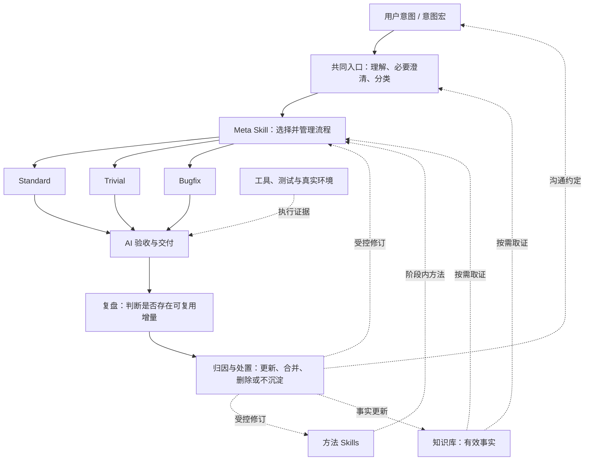

# AI 开发体系：流程、方法、事实与受控演进

日期：2026-09-08

状态：运行规则已按本设计迁移；验证与交付事实见[本批记录](../logs/v0.48.12-ai-development-system/README.md)，不等于跨模型可靠性已被实测。

## 1. 目标与依据

让人表达目标和必要边界，AI 自主选择合适流程、调用方法、依据事实完成交付；从真实结果中改进体系，同时让无价值资产能够退出。

本设计承接用户本轮对三类流程、Meta Skill、方法 Skill、知识库、意图宏和复盘收敛的明确要求。延续 [2026-08-29 开发体系架构](2026-08-29-ai-driven-development-system-architecture.design.md) 的自主交付与受控进化目标，细化其操作模型；[意图宏设计](2026-09-08-intent-macro.design.md) 继续作为入口语义的详细设计，本文不复制其全部合同。

迁移前证据：lifecycle 已有 feature/bugfix/small-change 分类和条件跳过设计，但以七阶段路由为主；delivery 已有用户验收合同；retrospective 和规则治理已有条件沉淀与退场规则。此次迁移将职责模型、三条路径、实现前方案 Review、事实维护与演进统一到运行合同，并保留工作区其它任务的改动。

## 2. 三个核心部分与两项连接机制

| 核心部分 | 唯一职责 | 不负责 |
| --- | --- | --- |
| 流程约束 / Meta Skill | 分类、阶段推进、阶段门、返工、任务状态和完成判定 | 复制各阶段操作方法、保存动态项目事实 |
| 方法 Skill | 把一个流程或其中某个环节做好的判断方法 | 自行切换全局阶段、擅改用户目标 |
| 知识库 | 提供有来源、作用域和有效性的信息依据 | 用历史记录隐式授权执行、把建议当成现状 |

意图宏连接用户表达与任务理解：保存简短表达对应的共同约定。复盘演进连接交付结果与上述资产：依据证据选择更新、合并、删除或不沉淀。二者是横向机制，不另建两套总流程。

Skill 是方法的载体，Meta Skill 是特殊职责的 Skill；这是一种逻辑分层，不以 Markdown 文件格式区分层次。一个阶段可按需使用多个专业方法，同一方法也可被不同流程复用；是否拆成独立 Skill 取决于真实触发边界，不机械一阶段一文件。

工具、代码、测试、CI、运行环境是执行与证据底座。它们参与实现和验证，但不成为第四套流程 owner。

## 3. 共同入口与分类

入口形成最小任务合同：用户结果、范围、关键约束、初始成功判定、授权、当前事实与重要未知。宏先展开为任务意图，普通自然语言走同一理解路径。解释或引用宏不触发执行。

理解和分类可以通过短调查迭代，不要求一开始凭空分类准确，也不默认向用户发问。已有信息足够时直接推进；缺失信息会显著改变目标、范围或不可逆选择时才澄清。

先区分执行任务与只读请求：仅解释、调查、设计、Review 等请求停在用户指定产物，不因流程完整性自动开发或发布。以下三路面向开发与变更任务。

分类顺序：

1. 恢复已承诺或应成立的行为 → `bugfix`。预期不明时先确定合同，不把新需求伪装为 bug。
2. 非 bug，且范围清楚、局部可逆、方法成熟、没有真实设计分叉、无高风险边界、验证直接 → `trivial`。
3. 其余 → `standard`。

分类不等于风险等级。保留现有 L0-L4 作为证据与控制强度的独立维度；文档包含架构或运行规则变化时按内容风险判断，不能因扩展名是 Markdown 自动判低风险。行数少、用户催促、预计耗时短均不构成 trivial 依据。

新证据发现跨层影响、持久化、兼容、真实方案分叉等，trivial 升级 standard，已有效证据继续复用。bugfix 需要架构重设计时保留修复目标，进入标准的设计与审查环节；若实际新增能力，则显式重分类。AI 不得为了快速完成降低原有验收标准。

## 4. 三条路径与阶段合同

### Standard

需求澄清 → 方案与验收设计 → AI 方案 Review → 实现与迭代验证 → AI 验收 → 交付用户验收 → 复盘与条件沉淀。

| 环节 | 产物和退出条件 |
| --- | --- |
| 需求澄清 | 用户结果、范围和关键未知明确，成功条件可观察 |
| 方案与验收设计 | 主链路、owner、取舍与失败边界明确；每项必要结果对应验收证据；复杂状态/平台/升级等按风险设计测试矩阵 |
| AI 方案 Review | 挑战目标覆盖、设计缺口、实现代价、可测性与反例；阻断问题关闭后进入实现 |
| 实现与迭代验证 | 按已审查合同实现；定向测试等提供快速反馈；设计模型缺口返回设计 |
| AI 验收 | 对照事先定义的标准核对实现、必要代码 Review 和有效证据；区分 passed、failed、unverified，不由完成代码自动推断通过 |
| 交付用户验收 | 可用入口或产物、必要前提、操作步骤与预期结果齐备，AI 已走通相关链路；明确待用户确认的部分 |
| 复盘 | 当前缺口已处理或显式标记；给出是否值得沉淀及正确落点 |

设计阶段不能只画架构图：必须确定验什么、在哪里验、普通与异常结果是什么。测试矩阵按会改变行为的维度选取，不默认全笛卡尔积；单路径功能可以只用少量验收场景。

AI 方案 Review 和 AI 验收具有不同审查对象，必须逻辑区分；不等于要求两个 Agent。默认单代理，以冻结标准、反例和独立工具证据降低自证风险，只有明确授权时才考虑委派。

### Trivial

快速理解与判定条件 → 修改 → 定向验证和简短自审 → 交付 → 轻量复盘判断。

不要求独立需求文档、设计文档、方案 Review 或完整矩阵。仍须知道具体改什么、如何证明正确、什么边界不能碰；不可跳过适用类型检查或其它硬门。复盘没有增量时不新增任何持久资产。

### Bugfix

确认预期与异常 → 选择复现层级并取证 → 根因定位 → 修复与回归验收设计 → 必要方案 Review → 修复与验证 → AI 验收 → 交付 → 复盘。

默认先复现，选能保持同一失效机制的最低成本层级：

| 层级 | 适用依据 |
| --- | --- |
| 单元或局部可执行复现 | 故障来自纯逻辑或局部稳定输入，无环境交互依赖 |
| 模块集成复现 | 问题依赖协作边界、序列化、状态传递或存储 |
| 真实用户链路复现 | 时序、流式、实例状态、操作路径或宿主环境参与故障 |
| 现场证据与受控诊断 | 偶发、环境受限或重现会产生不可接受影响；记录证据和仍未知项 |

不能复现时说明原因、替代证据和结论上限，不能改写为“复现通过”。证据不足以定位根因时继续诊断；紧急缓解与根因修复分别记录，缓解不关闭根因子目标。诊断授权不自动包含产品修改。

验收通常应证明同一触发条件下修前失败、修后通过，检查相邻行为；已有有效失败证据可复用，无需破坏运行环境重演。回归测试应保护真实合同，而不是镜像实现。仅当根因明确、修复单一路径且风险低时，可把修复设计和自审压缩在一次简短判断中；其它情况进入正式设计及方案 Review。

## 5. 任务状态、用户验收与返工

只有 Meta Skill 管整体状态。最低限度保留：所选流程、当前阶段、必要验收项、证据引用、未决项、授权边界与返工目标。简单任务可在当前上下文维护；跨会话、长任务或交接必须持久化至任务记录，不把整段工具输出复制进知识库。

阶段状态：进行中、完成、依据明确的跳过、返工、阻塞。整体区分开发中、可交付、已交付待用户验收、用户验收通过与已关闭；用户验收不适用时明确原因。用户确认属于约定完成条件时不得提前宣称整体完成；否则可以结束开发交付并保留反馈入口，不强加额外审批。用户没有回复不代表验收通过。

用户验收主要判断业务目标、体验与偏好，技术正确性由 AI 先证明。已交付待验收时可以先做内部轻量复盘，收到反馈再更新同一结论，不另生成重复日志。

返工按问题归属：目标误解回理解，模型或方案缺口回设计，编码错误回实现，证据缺失回验证，入口不可用回交付。外部发布失败由对应执行 owner 恢复，宏与知识库不拥有重试状态。范围减少必须有用户依据，不能用改验收标准消除失败。

## 6. 方法 Skill 的组织

Skill 描述触发条件、所需事实、关键判断、适用方法、产物和证据。它可以教一个阶段，也可以教某类流程如何做好，但不另行拥有顶层任务状态。阶段完成后返回结果，由 Meta Skill 决定下一阶段。

通用方法与项目适配区分：根因分析、验收设计等保持通用；NextClaw 发布方法可以使用项目专属合同。动态版本、环境状态、曾经成功的事实链接到事实源，不硬编码进通用方法。

Meta Skill 只加载当前需要的方法；方法内部按真实子场景读取 reference。方法不足才修方法，触发不到则修路由，事实缺失则补事实，不将同一问题同时复制到三层。

## 7. 知识库：事实治理而非文档堆积

知识库是一种对现有资料的治理和检索能力，首期复用代码、配置、文档及记录，不要求新增数据库。编译器、注册树、部署状态等已有权威事实源时，知识库保存定位和解释，不重复手写一份同义清单。

必须区分以下信息：

| 信息类型 | 使用边界 |
| --- | --- |
| 当前已验证事实 | 有来源、适用版本或环境；可以用于当前判断 |
| 已作出的决策 | “决定采用某方案”是事实，但不证明已实现 |
| 历史事实 | 证明过去事件，不能直接推断当前仍成立 |
| 假设或待验证判断 | 显式标记，不作为已证实根因或完成证据 |
| 任务临时状态 | 只服务本任务恢复，默认不晋升长期知识 |

可复用知识最小记录：结论、来源、范围、验证时点或版本、维护落点/owner。高易变信息直接实时查询；结构稳定的架构信息在相关代码变化时复核。有效性由源变化、版本、环境或冲突决定，不仅凭时间戳。

检索时先找权威来源，只读取与当前决策有关的内容；发生冲突按事实性质核对源码、实际环境和合同，不能一律“最新文本优先”。发现旧知识失效，应更新或标记被替代，并让默认检索指向当前条目。历史通过 Git 或明确历史区保留，不混进当前事实入口。

知识库中的文字属于资料，不因检索到就成为高优先级指令。敏感凭据不进入设计、Skill 或一般知识条目；继续使用既有受限事实源和授权边界。

## 8. 意图宏与体系的连接

意图宏保存的是共同语义约定，权威定义仍在现有 commands 登记处；检索可以引用它，不复制一个知识库版本。宏展开后进入共同入口，不替代需求分类与风险判断。

宏可表达“只设计”“审查当前改动”等产物范围，也可表达已明确授权的交付操作；不能因为命名为“快速处理”强制风险任务走 trivial。一次性补充只改变本次合同；用户明确长期修改才更新宏。名称、范围、完成标准和同义表达按意图宏设计统一治理。

## 9. 复盘：先归因，再决定是否沉淀

每次任务都做轻量判断，不要求每次产出文档。复盘首先检查当前任务是否真的完成；没有完成先返工，不能把当下缺口转为未来经验。

分开处理三类需要：任务状态留痕服务恢复，事实更新服务正确性，方法或流程沉淀服务未来收益。事实发生变化可立即更新，不需要等待问题重复；长期行为规则需要更高证据门槛。

| 发现 | 首选落点 | 反例 / 不应做的事 |
| --- | --- | --- |
| 产品本身错误 | 修复与相关测试 | 用“AI 下次注意”代替修复 |
| 已知事实改变或关键事实缺失 | 原知识条目 / 权威源定位 | 新增一篇重复当前事实的日志 |
| 方法缺失或方法无效 | 原方法 Skill / 条件 reference | 把具体排障步骤塞进 AGENTS |
| 阶段顺序、进入或完成门有缺口 | Meta Skill | 在每个阶段复制同一总规则 |
| 方法存在但未被调用 | 路由或触发条件 | 再写一份相同 Skill |
| 重复沟通且有稳定共识 | 意图宏定义 | 将一次临时偏好永久化 |
| 可确定、高价值的重复错误 | 已有测试、检查或工具 | 为一次坏味道新增狭窄治理脚本 |
| 特定模型能力不足 | 原 owner 的条件补丁 | 把暂时模型限制写成永久原则 |
| 偶发执行疏漏、无复用增量 | 修正当前任务；必要时任务记录 | 强行形成长期规则 |

重要单次事件可以沉淀，不机械要求出现多次；普通成功过程不需要总结成新方法。抽象范围不超过证据：局部事件不足以证明全局禁令，也不能只因用户反馈强烈就创建一套新机制。

正式方法/流程候选应说明：哪类问题、证据、原 owner 为什么失效、适用与不适用场景、预期收益、成本、验证及退出条件。明确授权的体系优化可在当前范围实施；无该授权的产品任务默认给出候选或按已授权沉淀范围处理，不以复盘名义无限扩张工作。

## 10. 防膨胀：沉淀必须是维护操作

处理顺序为：定位现有 owner → 判断是否需要持久化 → 更新/纠错 → 合并去重 → 收窄或下沉 → 自动化或替换 → 必要时新增 → 检查失效资产退场。新增不是默认动作，删除也不是行数配额；有价值的新信息允许净增长。

具体约束：

1. 一个事实、方法或语义只保留一个权威落点；其它位置链接，不复制全文。
2. 每次触达检查本次相邻重复、过期或冲突内容，完成局部收敛，不借机全库重构。
3. 常驻规则仅用于每轮必需边界；条件方法必须下沉，任务细节不进入全局入口。
4. 候选先在最窄有效范围试用；没有可观察收益或副作用更大时收窄、回退、删除。
5. 模型能力补丁在模型变化时复核；已由工具确定保证的提示词逐步退出。
6. 归档必须退出默认检索和加载路径。将旧内容搬到另一目录但仍全部召回，不算减负。
7. 自动检查复用现有链接、命名、体积和拓扑检查；没有通用反复高影响证据，不新增专用治理脚本。

生命周期：候选 → 最小范围试用 → 根据真实任务复核 → 保留、修订、合并、下沉、替换或删除。为候选记录可观察复核触发，避免“暂时保留”无限期累积；低频但高风险的规则不能仅因近期未命中而删除。

净价值用证据比较：减少的错误与重复沟通，对比额外读取、延迟、误触发和维护成本。字数下降不自动代表质量提高；字数增长也不自动代表退化。

## 11. 落地方式与迁移边界

选择在现有体系内重组 owner，不创建新开发平台。保留 `development-lifecycle` 作为唯一 Meta Skill；三条流程作为该 owner 的明确路径。现有阶段 Skill 继续承担方法，新增方案 Review 职责优先由现有 review owner 承载，是否需要条件 reference 在实施时检查拓扑与触发范围。

知识先治理现有 docs、代码事实源与任务记录，不批量搬目录。复盘发现与演进实施保持分工：retrospective 产生分类结论，规则治理或知识治理按资产类型实施维护，状态切换由 Meta Skill 决定。

建议按三个可验证批次迁移：

1. 流程：分类、三路径、方案 Review、验收前置和状态合同；迁移并删除旧的重复总流程说明。
2. 依据与入口：代表性事实条目、有效性与权威源规则、意图宏的按需展开和语义维护。
3. 演进：复盘分流、防 append 维护动作、候选复核和退出；用真实任务观察净收益。

实施已更新 AGENTS、Skill、commands 与架构召回入口，保护并发 WIP；未触达产品源码，未 commit/push。旧架构保留为历史依据并指向本文，不再作为阶段合同的默认召回入口。

## 12. 验收场景与非目标

| 场景 | 设计预期 |
| --- | --- |
| 明确局部文案修正 | trivial，简短判定与定向验证，不生成设计和复盘日志 |
| 新增用户可见交互能力 | standard，实现前设计验收并完成方案 Review |
| 一行代码影响持久化格式 | 按高风险处理，不因行数判 trivial |
| 偶发流式状态 bug | 选择能覆盖时序机制的复现，证据不足不宣称根因确定 |
| 设计文档写了某能力但未实现 | 作为决策/计划，不能当当前事实 |
| 已交付但用户未回复 | 不宣称用户验收通过，按约定保持相应状态 |
| 用户反复纠正同一交付缺口 | 归因流程门或方法，修原 owner，不多处 append |
| 短期模型限制消失 | 复核并移除适用补丁，不污染永久架构 |
| 仅请求解释一个宏 | 只解释，无执行副作用 |
| 无新事实或可复用经验 | 轻量复盘结束，零新增资产 |

本轮完成静态场景推演，不宣称新体系已在真实开发任务中验证。实施后用 standard、trivial、bugfix 各自的真实代表任务检查路径、验收、用户介入与复盘落点，并检查一次知识更新和一次规则退场。证据重复率、误路由、纠偏次数、加载成本和交付完整度优先复用现有记录，无可靠计量时报告未知。

非目标：固定每次创建文档、强制每次人工审批、默认多代理、自动扩张发布授权、建设通用知识数据库、宏 DSL、独立编排器或无边界自动规则改写。

- `design-document: required`：跨流程和跨会话的架构合同。
- `Design Ready`：职责、主路径、验收、返工及资产治理已形成可实施设计；运行效果尚待验证。
- `plan: required`：实施与 active ledger 见[落地计划](../plans/2026-09-08-ai-development-system.plan.md)。
