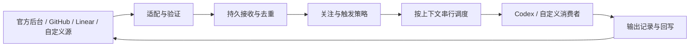

# 外部事件与持续协作协议设计（2026-09-13，设计冻结与交付验收）

## 1. 先确认用户会得到什么

任何系统通过公开规范或适配器接入后，都可以把外部事件交给消费者处理，并围绕同一个外部对象持续协作。消费者可以是 Codex，也可以是普通脚本。官方后台、GitHub Issue、Linear 是正式接入实例；自定义事件源是验证协议开放性的独立实例。

用户在 GitHub Issue 中首次邀请 Codex，Codex 加入并建立会话；后续补充进入同一会话，无需每次提及。Codex 可以继续工作、询问、回复，或判断无需介入并保持安静。用户仍在原平台看到需要知道的结果。机器和监听进程重启后，绑定、待处理输入与输出恢复。

第三方开发者无需部署 NextClaw 官方后台，也无需导入完整 NextClaw 产品，只安装独立包，或用其它语言实现公开 JSON/HTTP 合同，即可接入自己的系统。NextClaw 新入口与已迁移监听使用同一公共实现。未迁移的历史自定义 argv 消费者保留兼容代码；本机旧配置已退役，不能与新宿主同时消费。

本次产品价值对应 [产品愿景](../VISION.md)：跨入口的长期连续性、按需主动参与和可复用基础设施。

### 已授权的默认行为

| 决策 | 推荐行为 | 对用户的意义 |
| --- | --- | --- |
| 新对象如何加入 | 明确邀请、配置的标签/指派规则，或手动绑定；不扫描到一个对象就自动执行 | 接入仓库不意味着接管所有 Issue |
| 加入后如何关注 | 自动接收新的人类消息和配置的业务变化，不再要求每条消息提及 | 可以自然地连续沟通 |
| 被唤醒是否回复 | 可回复、可行动、可安静完成；默认不发机械“收到” | 不用承受机器人刷屏 |
| 会话如何对应 | 同一连接作用域下，同一外部对象、同一消费者绑定到同一执行会话 | 外部对话与 Codex 上下文连续 |
| 任务做完后 | 本次运行结束，关注关系仍保留；暂停关注是另一个动作 | 几天后补充仍能接着说 |
| 运行中又收到消息 | 普通补充排入该对象队列；明确停止指令立即进入取消路径 | 不并发启动相互冲突的修复 |
| Issue 关闭后 | 暂停普通唤醒，保留绑定；重新打开可恢复；显式停止的订阅不能被自动恢复 | 关闭不等于删除历史 |
| 是否接所有平台 | 接口开放；本次交付三个正式接入和一个自定义示例，不承诺预装每个平台的适配器 | “可接入”有明确可验证含义 |
| 如何部署 | 独立 Node.js 包提供 SDK 和 CLI；笔记本优先轮询，有公网 HTTPS 的部署可用 Webhook | 无需购买或依赖新的官方云服务 |
| 如何登录平台 | 优先直接调用本机已登录的受支持 CLI；已有可用登录不重复索取 Token | 用户选范围即可开始，无需再维护一份凭据 |

用户后续已明确授权 Agent 完成设计、实现、自验和发布，无需再次人工 Review；以 §9A 技术冻结和本 ledger 为当前合同。支持 GitHub 和 Linear 均为整体目标，不把其中之一静默移出交付。

## 1A. 用户链路：从接入到长期协作

本节是用户行为的主合同。后面的协议和包结构必须支持这些链路，不能只证明事件能送达。以下入口、命令和示例文案均为拟议产品设计，尚未实现。

### 1A.1 谁在使用，分别从哪里进入

| 角色 | 开始时有什么 | 使用入口 | 最终得到什么 |
| --- | --- | --- | --- |
| 部署维护者 | 可运行 Codex 的机器、目标项目、平台访问权 | 独立 CLI 或 NextClaw 对象级 CLI；可以委托 AI 配置 | 明确范围内可运行、可查状态的连接 |
| 日常讨论参与者 | 能访问一个 Issue 或官方讨论 | GitHub / Linear / 官方后台原页面 | 在原对象上持续沟通，必要时打开对应 Codex 任务 |
| 第三方接入开发者 | 自建系统的事件与 API | SDK、规范、接入示例、契约检查 | 独立提供适配，无需修改核心或部署官方后台 |
| NextClaw 现有维护者 | 已配置的 discussion listener 与历史会话 | 既有后台和管理命令 | 升级后原讨论、原会话继续工作 |

部署配置只做一次。日常参与者无需安装 SDK、理解事件 ID 或进入终端。部署者与讨论参与者可以是同一个人，但文档和验收不能把两者的操作混在一起。

### 1A.2 链路一：独立用户首次连接 GitHub 或 Linear

故事：小王已经在电脑上用 Codex 开发一个项目，希望以后从项目的 Issue 继续沟通。

| 步骤 | 用户动作 | 系统动作与用户看到的结果 | 失败与返回 |
| --- | --- | --- | --- |
| 1. 安装并进入 | 安装独立包，运行连接命令；也可请现有 AI 执行 | 自动检测受支持的本地 CLI、版本和实际登录身份；展示“检测到 GitHub CLI，已登录”，已有配置也列出 | CLI 缺失或不兼容时指出具体工具；保留输入，不以扫描到二进制就宣称已接入 |
| 2. 选择来源和范围 | 选择 GitHub 仓库或 Linear 工作空间/团队；当前项目只有一个匹配范围时自动带入 | 直接复用本地 CLI 执行只读检查，展示将读取的范围、实际回复账号和已知读写能力，不要求提供 Token | 未登录时引导使用对应 CLI 的登录入口；权限不足单独提示，不把“换填 Token”作为默认修复 |
| 3. 选择执行位置 | 指定本机项目目录和 Codex；确认允许谁发起工作、允许什么执行范围 | 验证目录和 Codex 认证可用，展示“这个仓库的任务在这台机器、这个项目执行” | 登录缺失由用户完成认证；不替换账号或猜另一个目录 |
| 4. 选择加入方式 | 默认选一个专用加入标签，也可选已配置账号的提及规则；指定是否接历史积压 | 展示规则摘要，如“有 agent 标签且由允许的成员发起时加入；之后自动跟进评论；不处理历史积压” | 不支持的规则直接指出；不会要求平台存在未创建的机器人账号 |
| 5. 检查并启动 | 查看配置摘要，启动连接 | 先做只读连接检查，显示“正在监听、30 秒扫描、回复身份、执行机器、当前无关注对象” | 检查失败不显示正在监听；用户可编辑同一连接重试 |
| 6. 开始真实使用 | 给选定 Issue 添加加入标签或通过配置的身份邀请 | 该对象加入队列，创建绑定并进入链路二 | 未满足发起人条件时不执行；维护者状态里可查拒绝原因 |

默认接入复用本地 CLI 已有登录：平台读取和回写直接调用该 CLI，登录材料仍由 CLI 管理。我们的配置只保存工具定位、非敏感的账号/实例标识、项目范围和触发策略，不提取或复制 CLI Token。仅在 CLI 不可用且用户主动选择直接 API 部署时提供凭据引用选项；官方后台已有连接也优先复用原配置。实际平台请求仍需认证，产品承诺是已有登录时无需重复配置认证。

首次体验的推荐摘要：“已使用本机 gh 登录；仓库为当前项目；回复账号为已验证账号；执行位置为当前 Codex 项目；每 30 秒检查一次。”范围明确时直接采用；只有多个可行账号/工作空间会改变实际访问范围时才让用户选择。配置检查不发测试评论、不改标签、不启动模型；写权限无法用只读证据确认时标为待验证，不尝试发帖来探测。

未登录时保留其它配置，引导用户在 CLI 自己的交互登录流程完成认证，回来继续同一连接。不要让用户把 Token 粘贴给 AI。某个第三方 CLI 的登录本身需要 API Key 时如实说明；不能把“复用已有登录”承诺成任何平台首次使用都无需认证。

GitHub 的默认加入标签是本集成的配置约定，不是 GitHub 自带的 Codex 触发功能。没有专属机器人账号也可以使用维护者授权账号，但摘要必须显示真实回复身份；不能让用户以为回复来自独立机器人。标签创建由有权限的部署者按明确配置动作完成。

Linear 初始链路同样落在普通 Issue、标签和评论上；无需用户理解 AgentSession。选择已有代理账号原生委派体验会改变接入与反馈链路，仍是 §1 的待评审范围选择，不用普通评论演示冒充。

独立使用优先 `nextclaw-collaboration`，NextClaw 内使用 `nextclaw collaboration` 调用同一组对象操作。管理动作收敛为：连接的添加/检查/列表；上下文的列表/详情/关注/暂停/恢复/绑定；运行的查询/取消/重试；宿主的启动/状态/停止。参数和最终命令树随方案探针冻结，不让用户直接改 JSON 或数据库。

### 1A.3 链路二：同一个 Issue 内自然地来回沟通

故事：小王邀请 Codex 修复“导出按钮没有响应”，第二天还会补充新的复现信息。

| 时刻 | 原平台上的用户操作 | 预期体验 | 会话与系统状态 |
| --- | --- | --- | --- |
| 首次邀请 | 添加加入标签，留言“帮我定位导出按钮没有响应的问题” | 第一次有实质结果时回复，例如定位结果或一个必要问题；不额外刷一条“收到” | 创建一个 Codex 任务，关联 Issue 原链接，关注 active |
| Agent 缺少信息 | 用户看到“只在 Safari 出现，还是 Chrome 也会？” | 直接在同一 Issue 回答“Safari，附件里有日志”，无需再次提及 | 消息进入原会话；下一轮能看到原问题与新回答 |
| 工作中补充 | 留言“刚确认只影响管理员账号” | 补充进入待处理队列；不会因此新开另一项修复 | 详情显示“运行中，另有 1 条补充待处理”；当前轮完成后继续 |
| 无需介入的讨论 | 其他成员交流约会时间，与问题无关 | 原平台没有机器人插话 | 可记录“已处理，本次未回复”；quiet 不显示为失败 |
| 给出交付结果 | 查看 Agent 发布的结果与证据链接 | 回复说明做了什么、验证范围和仍需决定的事项 | 当次运行 completed，关注仍 active |
| 第二天追加 | 留言“同一问题在移动端还能复现” | Agent 结合之前的修复继续处理 | 恢复原 Codex thread，不新开一段失忆对话 |

首次回复、被问到状态时的回复，以及实质交付回复可附“对应 Codex 任务”的已验证入口；不会在每个评论重复贴链接。本机可通过上下文详情打开对应任务；外部参与者不会因为看到引用就自动获得私有 Codex 历史访问权。跨设备不可用时，原平台讨论与结果仍完整可读，详情明确执行机器，不给一个伪装成公网可访问的链接。

在 Codex 里直接补充的信息属于该本地会话，不默认全文镜像到 GitHub/Linear。需要告知外部参与者的内容由明确回复操作发出。两边同时输入时需检查活动 turn；消费者能力探针必须覆盖桌面用户正在操作同一 thread 的情形。无法安全追加时保留事件并显示等待，不另建会话或争抢执行。

### 1A.4 链路三：用户如何知道状态，如何停止和恢复

“允许不回复”不等于“系统没有可观察反馈”。日常页面用于沟通；维护者管理入口用于查看事实。参与者可主动询问状态，不需要为了确认是否收到而反复提及。

在已接入对象中约定以下单行控制文本，由适配器识别；它们是本方案拟提供的语法，不是平台原生命令。只匹配允许身份新发的独立控制消息，代码块、引用或普通讨论里的同样文本不能触发控制。

| 用户目的 | 原平台动作 | 系统反馈 | 继续路径 |
| --- | --- | --- | --- |
| 查看有没有在处理 | `/agent status` | 主动请求才回复：关注状态、最近处理时间、运行/排队/失败情况 | 查看结果或等待；不启动相关性模型 |
| 暂停后续自动跟进 | `/agent pause` | 一次确认“已暂停跟进；当前任务仍在运行”或“当前没有运行任务” | `/agent resume` 恢复关注 |
| 停止当前任务 | `/agent cancel` | 可用时取消当前执行，并暂停该对象后续派发；无法确认停止则如实说明 | 用户用 `/agent resume` 选择继续；不假报已撤回外部动作 |
| 恢复关注 | `/agent resume` | 一次确认已恢复；展示是否还有取消前未处理输入 | 以最新上下文继续，保留原会话 |
| 永久结束自动跟进 | 管理入口解除关联 | 告知历史仍保留、再次邀请需要重新启用关联 | 显式重新关注或绑定 |
| 临时关闭 Issue | 使用原平台关闭动作 | 普通跟进暂停，映射保留 | 重开恢复“因关闭暂停”，不解除用户明确暂停 |

这些控制由代码处理并验证权限，优先于普通队列；paused 时仍接收状态/恢复命令。控制确认是对用户请求的响应，不属于机械“收到”。自然语言“先别继续了”可以由 Agent 理解，但即时取消保证只覆盖确定控制入口；不能承诺正在阻塞的模型立即理解任意一句话。

管理入口提供两个视图层级：连接列表展示来源范围、回复身份、运行机器、连接健康；上下文列表按来源分组，可按标题/原链接及关注/运行状态筛选。上下文详情展示原对象链接、绑定任务、待处理条数、最近处理/回复时间和可执行恢复动作。空状态分清“未配置连接”和“已连接但尚未关注任何对象”。一次操作失败留在同一对象详情，不要求用户重新添加连接。

| 异常 | 用户看到什么 | 系统先做什么 | 真正需要用户做什么 |
| --- | --- | --- | --- |
| 消费机器离线 | 在线的管理进程可显示消费者离线；机器全离线时原平台可能暂时没有任何反馈 | 恢复后补采可读取消息，续接原绑定 | 要求全天响应时改用常驻机器；本地进程不能在关机时自报状态 |
| 本地 CLI 登录过期/撤销 | 连接“请在原 CLI 重新登录”，不显示 idle 或已完成 | 停止受影响平台读写，保留连接和待处理状态 | 在原 CLI 恢复登录，检查成功后继续，无需重新配置来源 |
| Codex 执行失败 | 对象详情显示失败阶段与重试动作 | 自动重试可证明安全的步骤，避免重复副作用 | 只在确需登录、权限或任务决策时介入 |
| 回复发送失败 | 显示“处理完成，回复待发送/待核实” | 查询是否已发送，避免重复评论 | 仅在结果不可判定时核实或明确重试 |
| 原会话丢失 | 显示“原会话不可用”，保留 Issue 链接与原因 | 不偷偷新建 | 维护者选择已存在任务重新绑定，或明确创建替代任务 |

连接健康不等于端到端运行成功；详情要能区分“还未采集”“已排队”“正在处理”“安静完成”“已回复”。完全离线时提供实时原平台状态需要额外在线服务，本方案不能假装已有这个能力。

### 1A.5 链路四：官方后台已有用户无缝继续

已有维护者继续从官方后台“讨论”进入，打开原 direct 主题并留言。升级准备由 AI 读取旧配置与运行状态，展示“将保留多少条会话绑定、哪些在途任务需要等待”，不让维护者手工搬数据库。

实际切换后，维护者在原主题追加一句话，系统恢复原 Codex 会话，必要回复仍出现在原主题。管理状态显示迁移完成及原绑定；不会要求重新发起一轮邀请。无法完成迁移的连接保留明确原因与恢复入口，不显示完成。

support 反馈继续经过管理员审批：用户补充 → 原后台显示待审核 → 管理员按现有流程批准 → Agent 读取最新输入、恢复原会话并回写。这条来源的审批例外必须在配置摘要中显示，不能用“参与后每条都触发”的通用默认覆盖现有授权。

维护者添加 GitHub 或 Linear 连接时使用新增管理入口；官方后台既有列表、详情和反馈评审不被强制重做为一个全平台工作台。

### 1A.6 链路五：第三方开发者接入自己的系统

故事：小李为自建客服平台 Acme 开发接入，管理员小王安装后，让客服在原工单与 Codex 持续沟通。小李只开发一次适配；小王不需要改代码或理解事件协议。下述模块、能力和操作名都是待实现合同，不表示今天已有这些命令。

**开发者：从一个平台到可交给别人安装的适配。**

1. 先选择平台中的长期对象，例如“一个工单对应一个会话”，确认公司实例、工单、消息及参与者的稳定 ID。工单改标题、换状态、改采集方式都不能改变对象身份。写出真实故事：客服邀请 → 客户补充 → 代理必要时回复 → 暂停与恢复。
2. 选择接入路径。有可用本地 CLI 时，适配器调用它并复用登录；没有 CLI 时实现平台 API 访问或由平台主动提交协议事件。平台主动提交也必须解决上下文与输出能力，不能只发一个通知就宣称双向协作完成。
3. 创建一个普通模块，按 SDK 根公共入口实现下表合同。模块声明稳定适配器 ID、显示名称、合同版本和实际能力。先用本地假数据与命令消费者跑通两条同工单事件，再连接测试实例；开发时不需要改协调器、Codex 消费者或 NextClaw 源码。
4. 运行随包接入检查。失败报告指向具体责任，例如“第二条消息的 subject 变化，导致会话分裂”“回写不可查询，只能进入结果未知”“平台不能接收文本控制，请配置本地控制入口”。检查工具不能用模拟通过替代真实权限与回写证据。
5. 在获准测试工单上验证首次邀请、追加、quiet、暂停/恢复、自回复过滤、重启补采和同一会话续接。记录平台限制、CLI 支持版本及部署条件。若缺少可靠查询能力，明确展示结果未知的恢复路径，不伪造幂等保证。
6. 交付模块或一个可安装的第三方包，附最短安装说明、配置样例、能力清单与测试记录。发布到公开包仓库可选，本地目录或私有包同样可用；不要求申请官方平台白名单或 fork 核心。核心自身仍只维护一个通用包。

| Acme 适配需要提供什么 | 平台负责的差异 | 通用包已经负责什么 |
| --- | --- | --- |
| 描述和连接检查 | 支持的登录方式、CLI/版本、当前真实账号、实例/项目选择、读写能力 | 展示配置步骤、保存非秘密连接信息、检查能力是否满足用户选择 |
| 采集与事件转换 | 轮询分页/增量令牌，或 Webhook 验签与事件解析；映射 actor、事件和工单 ID | 持久接收、去重、调度；落盘后才提交采集进度或接收确认 |
| 上下文 | 读取工单与消息，或提供完整且有界的内联内容；表达删除/无权限 | 将输入和最新事实交给原绑定消费者 |
| 平台交互映射 | 标签/指派/提及如何表示邀请，关闭/重开如何表示生命周期；文本控制或平台按钮如何映射控制意图 | 按本地授权决定加入、暂停与恢复；不由平台字段直接授予执行权限 |
| 输出（可选） | 回复正确工单、返回消息 ID、查询已发送结果；声明查询限制 | quiet、输出队列、重试/未知状态及自身输出过滤 |

**安装者：从拿到适配到首次能用。**

1. 小王安装独立宿主或使用已有 NextClaw，显式添加小李提供的模块路径或固定版本包。安装加载列表显示“Acme、版本、提供者、能力”；只发现已经显式安装/注册的适配，不自动搜索网络或执行事件正文给出的模块。加载失败显示缺依赖或合同版本不兼容及修复入口。
2. 在“添加连接”选择 Acme。宿主调用适配的连接检查；若本机 Acme CLI 已登录，展示实际账号并直接复用；否则指向该 CLI 登录，或由用户明确选择该适配支持的 API 模式。无需先配置 NextClaw 官方后台账号。
3. 选择 Acme 实例和项目、消费者与工作目录、允许参与者、首次加入规则。一个适配可以建立多个连接；例如测试公司和正式公司不能共享身份或串工单。宿主展示读取范围、回复身份及控制入口，能力不足就在此说明，不能直到第一次回复才发现无法回写。
4. 检查通过后显式启动。宿主显示“连接正常，尚未关注工单”，给出该平台实际邀请方式，例如添加已配置的标签。默认不把项目所有历史工单当新任务。
5. 客服在测试工单邀请，看到必要回复；客户后续补充自动进入同一个 Codex 任务。管理员能从原工单链接在本地查看绑定、队列和处理状态。接入完成的标准是这次真实往返，不是安装成功或收到 HTTP 200。

**运行期间：新增平台走同一条主链路。**

`Acme 变化 → 适配采集/验签并转换 → 通用持久接收 → 加入与授权判断 → 按工单绑定排队 → 原 Codex 会话 → quiet 或输出队列 → Acme 原工单`

首次合格邀请建立绑定；后续事件查找已有绑定，不重复新建。平台产生的新回复按返回的消息 ID/操作标识过滤，用户共用账号的正常留言仍可进入。轮询与推送重复到达同一变化时必须使用一致的事件身份，或由适配明确采用单一采集方式；不能仅因传输不同就运行两次。

**维护期间：修复连接不丢对话。** 登录过期回原 CLI 重新登录，恢复原连接；适配升级先检查合同版本与身份映射兼容，保留连接、游标、绑定与未处理状态。升级需要改变身份或存储时必须显式迁移，不能悄悄当成新平台。停用/卸载前先停止该适配连接并处理在途任务；保留历史绑定供查询与恢复，不继续调用已卸载模块。重新安装兼容版本后由管理员显式恢复监听。

对于告警等单向来源，同样走安装、检查、绑定与运行流程，但声明“无回写”，结果在消费者/本地管理入口查看；暂停恢复通过本地入口完成。配置必须接受这一模式，否则拒绝启用。没有对话或文本入口的平台不必伪造帖子或支持 `/agent` 文本命令；平台按钮可映射相同控制意图，通用本地控制入口始终存在。

### 1A.7 用户故事检查与本次范围

| 故事 | 实现完成必须可展示的证据 |
| --- | --- |
| 我能在自己的机器首次配置，然后从原平台开始 | 从安装/添加连接到真实邀请的记录，包含检查失败的返回路径 |
| 我能持续沟通，不需要每次重新解释 | 首次问题、Agent 追问、用户回答、次日补充全部续接同一真实 thread |
| 我能知道它有没有工作，并叫停或恢复 | 原平台状态/暂停/取消/恢复控制，以及对应管理状态 |
| 它不该插话时能够安静 | 已处理记录与原平台未新增评论的联合证据 |
| 换版本不会把原来的对话弄丢 | 旧配置迁移后从原主题进入并恢复原 thread |
| 我的自建系统也能用，且不用 fork 核心 | 独立安装的自定义适配和非论坛来源、契约检查与实际双向/单向结果 |

本次管理入口以 CLI 及可由 AI 调用的对象操作交付；日常沟通和控制保留在原平台。暂不新增一个可视化连接管理网页。若用户期望“完全不借助 CLI/AI、全程图形化完成首次接入”，这是需要明确选择的用户链路变化，不能把当前方案称为已经提供该体验。

### 1A.8 交付给用户的黄金验收

唯一结果锚点：**用户在原平台邀请一次，之后能持续与同一个 Codex 任务沟通；代理该做事时做事、该安静时安静，用户能控制它；换成符合合同的新平台也成立。** 包数量、接口数量、测试数量不作为替代完成指标。

验收分为用户短体验和 AI 交付门。短体验证明行为符合期待；可靠性、三个正式来源、第三方扩展和迁移不能靠一次短演示证明，由 AI 提前提供实际证据。用户不承担搭环境、寻找测试对象、阅读日志或排障。

**交付现场。** AI 提前准备可安装的固定版本、获准使用的真实测试对象、已检查的连接，以及一页验收卡。卡片只列版本、原平台链接、绑定的 Codex 任务入口、当前结果与必要限制；真实入口在交付时填写，不交付占位符。需要用户本人登录时仅由用户完成认证，其余配置与核验由 AI 完成。新用户首次安装另由 AI 在干净用户配置中验证，不能用预配置演示代替。

| 用户最短操作 | 现场应该看到什么 | 判失败的条件 |
| --- | --- | --- |
| 1. 在准备好的工单/Issue 邀请代理，提出一个可核对的小任务 | 原平台收到有用结果；验收卡可打开对应 Codex 任务 | 只收到机械回执、结果没有回原对象或找不到任务 |
| 2. 在同一对象补充一个依赖前文的要求，不再邀请 | 继续原任务并利用前文，必要回复在原对象 | 需要重新解释、另开任务、遗漏补充或重复回复 |
| 3. 暂停，补充一句，再恢复 | 暂停期间不启动新执行；恢复时说明待处理输入并按既定策略续接原任务 | 暂停无效、输入丢失、恢复后新建任务 |

这三条是用户时间有限时的优先抽验，GitHub 和 Linear 各可沿相同链路体验；不要求用户重复完整测试矩阵。quiet 仍由 AI 必验：状态显示输入已安静处理且原平台无新增评论，不能以等几秒没回复作为通过。用户有时间时可继续抽验该行为及其它完整验收项。

用户主动操作目标控制在约 5 分钟，模型执行与平台采集等待另计并显示阶段；不承诺固定总耗时。状态与任务入口由 AI 预先整理，用户可以核对原始记录，无需自行拼日志。步骤失败即返回 AI 修复，不让用户重装或换测试场景以绕过失败。

**AI 必须在交付前关闭的门。** 以下沿用 ledger 的唯一状态，不维护另一份全绿清单：

- COL-002/004/006/011/012/013：官方后台、GitHub、Linear 分别真实往返；本地登录复用、授权、安静和控制行为成立。缺一个正式来源就不能称整体完成。
- COL-005/008：重复事件、重启、接受后丢响应、输出失败按合同恢复；官方旧会话迁移后仍能继续。记录事件 ID → 绑定 → 执行 → 输出的对应证据，不把普通成功路径当故障恢复证明。
- COL-003/007/014：在干净配置环境安装交付包及外部示例适配，仅用公共合同完成新平台链路；提供新增平台修改文件范围，证明不改核心。再证明单向来源与非 Codex 消费者可运行。
- COL-009/010：实际命令、用户文档、版本化安装产物、适用类型检查、测试与实现 Review 完成；证据关联同一交付版本，相关修改后重新验证受影响项目。

**交付物保持简单。** 用户收到“一页验收卡 + 可安装版本 + 使用/接入说明”；卡片链接 ledger 和详细证据，默认不要求用户阅读它们。每项证据写明版本、环境、操作、预期、实际和原始入口。模拟测试、真实平台试验、代码审查分开标注；受阻项目保持未完成，不以视频或截图替代可运行交付。

**推进与返工责任。** 先按上述结果确认用户意图，再做技术探针；随后优先完成一个来源从入口到输出的真实纵向链路，再验证自定义来源能够复用，最后补齐正式来源、迁移及故障证据。中间演示是发现偏差的检查点，不是缩减总范围。AI 负责实现和修复，只把改变用户体验或范围的真实取舍交给用户。不能保证绝无缺陷或零返工；可以约束为：发现失败不称完成，返工尽量发生在交付前，不把未验证风险移交给用户。

## 2. 当前阶段、授权与完成条件

- `task-type: feature`；`flow: standard`；风险 L3（跨包协议、持久化、外部输入和执行生命周期）。
- `design-document: required`；`plan: required`，实施计划在用户确认后按实际实现切片建立。
- 当前阶段：需求整理与方案 Review。本文集中保存设计和 active acceptance ledger，避免同一事实散落多份文档。
- 当前授权：只读调查、设计产物和评审；用户明确要求先判断是否符合意图，再实现。未执行创建远程资源、发评论、修改产品代码或重启现有监听器。
- 后续交付目标：可独立安装的包、开放规范、SDK/CLI、平台适配、NextClaw 接入、迁移、文档和真实链路证据。
- “交付”本身不推定为稳定发布授权；提交、推送、发布、生产迁移按用户后续明确授权办理。先完成可做的打包与验证，准备可审阅结果。

## 3. 现状与证据

### 已确认的源码链路

`discussion listen worker` 创建官方 `DiscussionClient`，按事件游标拉取主题，写投递 journal，再运行配置 argv。Codex 预设启动独立 runner，以 discussion ID 保存 thread/turn 映射，调用 App Server 创建或恢复会话；Agent 使用 discussion CLI 读取与回写官方后台。

| 证据 | 已确认事实 | 本次处理 |
| --- | --- | --- |
| [监听命令](../../packages/nextclaw/src/cli/app/commands/discussion-listener-command-registration.utils.ts) | 官方客户端直接装配；短握手依据绑定文件判断接受；runner 独立运行 | 抽出公共宿主逻辑，NextClaw CLI 只装配 |
| [监听 worker](../../packages/nextclaw/src/cli/app/services/discussion/discussion-listener-worker.service.ts) | 数字游标、journal、argv 投递；提示要求确认收到；按固定 actor ID 过滤自身 | 复用事件到投递的经验，消除官方来源和强制回复假设 |
| [Codex 消费端](../../packages/nextclaw/src/cli/app/services/discussion/codex-desktop-discussion-consumer.service.ts) | discussion → thread、event → turn；任意 resume 错误均可能进入新建；多个进程读写同一绑定文件 | 保留官方 App Server 路线；明确错误恢复与唯一状态 owner |
| [状态存储](../../packages/nextclaw/src/cli/app/stores/discussion/discussion-listener-state.store.ts) | 原子替换 JSON 文件，但映射、journal、配置与运行记录耦合 | 迁移到事务状态和同对象串行调度，不复制多写者模型 |
| [官方客户端](../../packages/nextclaw/src/cli/app/services/discussion/discussion-client.service.ts) | 写死 `/api/discussions/participant` 的读写路由 | 作为官方平台适配，不成为通用接口要求 |
| [现有讨论类型](../../packages/nextclaw-shared/src/types/discussion.types.ts) | thread、post、actor、数字 cursor 和 audienceRole 是官方论坛事实 | 保持官方服务合同；通用事件不强迫其它系统采用这些字段 |
| [Extension SDK](../../packages/nextclaw-extension-sdk/src/index.ts) | 现有渠道入口服务 NextClaw extension 宿主 | 不强迫独立 Codex 用户运行 NextClaw extension 宿主；接入时复用公共边界 |
| [GitHub Issue Watcher](../../packages/nextclaw/resources/apps/nextclaw-github-issue-watcher/README.md) | 参考应用同步和展示 Issue | 不把同步列表误报为已实现会话协作 |

上述为源码与文档调查，不是本轮实机运行证明。旧设计 [通用私密讨论](2026-09-10-feedback-conversation-identity.design.md) 是复用背景；不能把它或历史发布记录当作本次新合同已通过验证。

### 上游事实影响的设计

- GitHub 建议按投递 ID 去重、异步处理，且失败 Webhook 不会自动重投。因此接收成功必须先持久化，漏投恢复不能只靠等下一次事件。[最佳实践](https://docs.github.com/en/webhooks/using-webhooks/best-practices-for-using-webhooks)、[失败投递](https://docs.github.com/en/webhooks/using-webhooks/handling-failed-webhook-deliveries)。
- Linear 数据 Webhook 提供 Issue/Comment 变化、签名和有限次数重试。来源验证与后台处理分开。[Webhook 文档](https://linear.app/developers/webhooks)。
- Linear 原生 AgentSession 有自己的状态与响应时限。它不是 Codex 的持久 thread ID。本次推荐先交付 Issue/Comment 协作；若用户需要 Linear 原生代理体验，再明确纳入 AgentSession/Activity 生命周期，不能仅订阅它却不处理状态。[Agent Interaction](https://linear.app/developers/agent-interaction)。
- CloudEvents 已定义跨系统事件的 `source`、`id`、`type` 等属性。推荐使用其 1.0 JSON 表达承载事件，协作规范补充上下文和交付语义，避免另造一份等价事件信封。[固定版本规范](https://github.com/cloudevents/spec/blob/v1.0.2/cloudevents/spec.md)。
- Codex 使用公开 App Server 的 thread/turn 合同；本机现有实现即沿此路径。实现阶段验证当前安装版本的 schema 和真实行为，不把本机 `queue` 帮助里的接口存在视为完整唤醒证据。[App Server](https://learn.chatgpt.com/docs/app-server)。
- 本机验证（2026-09-13）：`gh` 位于 `/opt/homebrew/bin/gh`，版本 2.86.0；仅输出非敏感账号字段的 `gh auth status` 和 `gh api --hostname github.com user` 均成功。证明可经已登录 CLI 认证读取，没有验证评论写入、目标权限或后台运行环境。当前 PATH 未发现 `linear`、`lin`、`linearis`，不推断其它目录没有安装。
- GitHub CLI 的 `gh api` 可直接执行已认证 API 请求，支持 JSON 输入和分页；环境变量可能覆盖已保存身份，因此检查的是实际生效身份。[API 命令](https://cli.github.com/manual/gh_api)、[环境变量](https://cli.github.com/manual/gh_help_environment)。
- Linear CLI 适配候选 `schpet/linear-cli` 支持已有工作空间登录，但具体实现和版本需探针验证；不得把所有名为 linear 的程序当作同一接口。[该 CLI 的认证合同](https://github.com/schpet/linear-cli/blob/main/docs/authentication.md)。

## 4. 最小完整主链路与职责



这是职责分工，不代表必须创建七个类、七个包或七个服务。初始实现使用一个协调 owner 管理本地状态转换，并通过少量端口调用平台和消费者。

| 权威 owner | 拥有的事实 | 不应转移给它的事实 |
| --- | --- | --- |
| 外部平台 | 原始对象、消息、成员、业务状态、平台权限 | Codex 会话、模型运行状态 |
| 来源适配 | 通过本地 CLI 或显式 API 连接执行认证请求、原生字段转换、读取与回写恢复 | 是否已获得本地代码执行或发布权限；提取 CLI 持有的登录材料 |
| 协作协调器 | 关注关系、事件接收、调度、绑定、输入和输出操作记录 | Issue 的业务状态、平台成员真相 |
| 消费者适配 | 具体执行协议、执行句柄查询与取消；解释处理结果 | 自行维护另一份跨平台绑定数据库 |
| 宿主 | 进程、凭据引用、监听地址、存储初始化 | 复制通用触发策略或业务审批规则 |
| NextClaw kernel | NextClaw 用户对这项能力的管理和授权 | 重写独立包的队列、绑定和平台协议 |

独立库拥有可复用协作语义；NextClaw 的对象级管理接入 kernel 公共入口，service 保持宿主外壳，CLI 调用同一 owner。源码编辑前进一步核对 kernel 装配落点，不通过 import alias 绕过包边界。

## 5. 协议：稳定语义与最小接口

### 5.1 两个标识，不能混用

- 事件身份：`source + id`，用于识别同一次变化的重复投递。
- 上下文身份：`source + subject`，用于定位一件持续协作的事情。

`source` 是稳定实例作用域，包含平台实例和组织/仓库身份；不是易变显示名，也不是轮询或 Webhook 的名字。`subject` 是来源内稳定对象 ID。评论自己的 ID 在事件数据中，subject 仍可指向所属 Issue。官方来源以 endpoint 对应的实例身份区分，自定义源同样提供稳定作用域。

凭据轮换不得改变身份。同平台重命名不应重建会话。两个连接访问同一对象时必须验证身份一致后去重；两个独立安装默认存储隔离，不自动合并私密上下文。远端 payload 不能冒认另一个已配置 source。

会话绑定键还包含可信配置中的消费者标识。一个对象默认只配置一个消费者；不建设多 Agent 编队。将已有 Codex 会话手动绑定时验证目标可用和作用域，已经存在的绑定不能被新邀请覆盖。

### 5.2 事件表达

采用 CloudEvents 1.0 的 JSON structured 表达；本协作 profile 要求 `subject`，使用 `dataschema` 声明版本化 data schema。事件 type 保持开放字符串，核心不维护 `github | linear | ...` 闭集。

示意（字段示例不是当前已安装 API）：

```json
{
  "specversion": "1.0",
  "source": "urn:example:tracker:workspace:42",
  "id": "event-901",
  "type": "com.example.comment.created",
  "subject": "ticket-123",
  "datacontenttype": "application/json",
  "dataschema": "urn:nextclaw:collaboration:event-data:v1",
  "data": {
    "actor": { "id": "person-7" },
    "change": "message",
    "resourceId": "comment-55",
    "revision": "r9"
  }
}
```

事件中的 actor 身份必须由适配器根据已验证来源填充。身份可信不代表指令有权执行；认证依据和本地授权作为可信调用上下文传入，不接受正文自报 `admin=true`。actor 不可识别时保留未知身份，不能猜测。

`change` 只表达用于默认策略的少量共同变化：消息、上下文更新、生命周期变化；未知 type 可保存和交给显式配置的处理器，但默认不因未知字段唤醒。平台原始信息可作为有界附加数据保留，不成为执行指令、任意 fetch URL 或自动加载模块路径。

规范说明字段版本、未知字段保留与校验规则。新增兼容字段不要求所有消费者升级；未知主版本显式拒绝，不跳过校验。规范和 JSON Schema 随包发布，独立实现不依赖 TypeScript。

### 5.3 外部系统最低接入条件

1. 提供事件身份和上下文身份，说明事件是否可重放、如何恢复。
2. 通过事件携带足够内容，或实现按上下文读取的能力。
3. 双向协作实现回复及回复结果查询；单向来源显式声明没有回复能力。

只读来源可以唤醒消费者，但不能被配置成“必须回原平台回复”的链路。能力不足应在配置检查时指出，不能静默丢弃输出。

SDK 公开的边界按行为组织：

| 接口边界 | 最小职责 |
| --- | --- |
| 适配描述与 `checkConnection` | 稳定适配 ID、合同版本、能力、配置字段描述；返回真实账号、可选范围与可修复诊断，不返回凭据 |
| 来源采集绑定 | 轮询从已提交 checkpoint 读取批次并返回候选 checkpoint；推送验证来源并转换事件。宿主负责在持久接收后提交进度/确认；明确重放、分页和身份规则 |
| `ingest(event, verifiedContext)` | 校验、持久化并返回接收回执；不等待模型 |
| 来源 `readContext(subject, page)` | 返回最新事实、稳定消息 ID/版本、分页信息和删除/无权限等明确结果 |
| 来源 `reply(operation)` / `findReply(operationId)` | 同一输出操作的发送、查询和丢响应恢复；无回复来源省略 |
| 消费者 `submit(request)` | 接受稳定 request ID、绑定句柄、事件批次和上下文，返回执行句柄 |
| 消费者 `inspect(handle)` / `cancel(handle)` | 区分仍在运行、已完成、失败、结果未知与可取消性 |
| 管理入口 | 添加连接、检查连接、关注/暂停/恢复、绑定、查询状态、重试、运行/停止宿主 |

这是拟冻结的语义边界，最终 TypeScript 签名和 JSON Schema 在实现前用契约样例落实，不为每种平台创建平行工厂和注册服务。普通短脚本由包内命令消费者封装 submit/inspect，以稳定工作目录、argv 和进程记录运行，不要求脚本作者自己实现完整后台调度器。

HTTP 绑定提供经过认证的事件提交端点；跨语言生产者可直接提交相同 JSON。读取/回写接入通过 SDK 适配器或受信任的命令适配器实现。仅发送一个符合 CloudEvents 的 JSON，不等于自动获得任何平台的上下文读取和回复能力。

## 6. 参与策略：默认行为可解释

### 首次接入

用户配置允许的来源范围、消费者/工作目录、可信发起人以及加入规则。标签名和指派条件是平台配置，不是协议关键字。默认只对配置完成后发生的邀请自动加入；已有积压对象由显式启用 backlog 或手动关注接入，避免首次安装启动大量历史任务。

官方后台沿用服务端面向 participant 的事件和反馈审批，不新增审批路径。外部平台身份由各自凭据和 API 核实。GitHub/Linear 的提及与标签只是加入信号，执行权限由接入者配置的策略约束。

### 已经参与

关注状态为 active / paused / detached。暂停保留映射；解除关联是显式动作，也不删除外部或 Codex 历史。暂停原因区分用户要求和对象关闭，重开只能解除“因关闭暂停”。

active 对象的新消息默认唤醒；正文修改和配置的业务变化可唤醒；reaction、重复事件、自身输出默认不唤醒。邀请不因用户写一次普通评论而过期；授权会变化的审批业务继续由平台 owner 判断。

固定规则先过滤已知噪声。需要理解“是否相关”的消息由同一个消费者判断，不额外运行一套隐藏的相关性模型。消费者可以返回 quiet 并记录已处理，不产生平台评论；这仍有执行/模型成本。明确提问不能被默认过滤器当作噪声，处理失败必须在管理状态中可见。

### 回复和其它动作

消费者输出安静完成或明确的回复内容。模型的内部思考、原始工具输出、全部终端日志不自动镜像到外部平台。包的统一输出通道只处理协作回复；改代码、更新工单状态、部署等业务动作继续使用已有工具和授权，事件协议不扩张成通用工具调用协议。

已参与对象上的模型可用输出也走统一发送入口；不能同时由 runner 自动发布终稿、Agent 又直接调平台 API 发布一次。平台原生回复关系作为来源数据由适配器处理；一条运行绑定一个确定 reply target，后来的事件不能改变已在发送中的目标。

自回复过滤首先依据已记录的外部 message ID、输出 operation ID 和专属机器人身份。使用维护者人类账号时不能过滤这个账号的所有评论；NextClaw 的 GitHub 评论遵守 `🤖[墨爪]` 前缀，并联合操作记录识别自己的输出。这个规则不能升级为跨平台可信身份认证。

## 7. 可靠性、状态与部署

### 7.1 状态唯一与处理次序

独立宿主初始使用本地事务存储（SQLite），保存 inbox、关注关系、binding、run 和 outbox。具体驱动在实现阶段按项目 Node 支持范围与打包验证选择；不引入仅靠最新 Node 才可运行的未验证依赖。来源采集、Codex runner 均不能直接读写一份共享 JSON 映射。

Webhook 验证后持久接收，再按平台要求返回成功；数据库失败则不返回成功。轮询必须在该页事件持久接收后才提交来源 checkpoint。模型失败只影响对应上下文，不阻塞其它连接继续收消息。

同一绑定一次只有一个活动执行；新输入排队。可将尚未派发的连续普通变化合成一个批次，但保留全部事件 ID，显式指令不能被折叠消失。跨上下文使用有上限的并发。按本地接收次序调度，不假装拥有所有来源的全局时间顺序；派发时读取最新事实，并保留发生时的事件信息。

队列、分页和上下文读取均有容量边界。处理上下文时记录包含哪些消息/版本和截断范围，可按需读下一页，不能只保留最新一条而漏掉用户指令。队列满不假报已接收；显示背压并让来源重试或执行补采。

### 7.2 四种确认不能混为一谈

1. `received`：系统已持久保存事件。
2. `accepted`：消费者已接收一次执行，并取得可追踪句柄。
3. `completed` / `failed` / `cancelled` / `unknown`：执行状态；quiet 是完成结果之一。
4. 输出 `sent`：指定平台确认或经查询核实输出存在。

消费者接受不等于修复完成，运行完成不等于外部回复已发出。运行异常发生在接受之后，也必须由协调器追踪并展示。

| 情况 | 必须发生 | 不得发生 |
| --- | --- | --- |
| 重复事件 | 同 source+id 命中既有回执；不同载荷冲突单独记录 | 重复执行 |
| 乱序事件 | 保存事件，读取最新版本；停止/撤销优先检查当前策略 | 旧事件覆盖新授权 |
| Codex 正在工作时新消息到达 | 相同绑定排队；在下一轮读到补充 | 多 runner 同时改同一 binding |
| 启动后在保存 turn ID 前崩溃 | 用稳定 request ID 和消费者可查证历史恢复；无法判定则 unknown，等待核实 | 无条件再发一次可能有副作用的任务 |
| resume 暂时失败 | 保留绑定并重试或报告错误 | 任意错误都换新会话 |
| 已确认会话永久不存在 | 显示 session-missing；由显式重新绑定/重建恢复 | 静默声称延续原上下文 |
| 平台接受回复但响应丢失 | outbox operationId 查询原回复后补记 sent | 立即重发形成重复评论 |
| 平台无法判定是否发送 | 保持 output-unknown，显示核实入口 | 承诺任意外部 API 的 exactly-once |
| 进程或机器重启 | 恢复 inbox/outbox、绑定和运行查询；仅重试可证明安全的步骤 | 清空队列或重新创建所有会话 |
| 撤销访问或对象删除 | 停止读取/写入，保留最少诊断与绑定状态；不从旧缓存继续对外发言 | 把 403 当作对象已删除或重建理由 |
| 用户暂停 | 停止新派发，保留在途状态；取消当前运行是明确选项 | 默认杀掉无法恢复的工作 |
| 用户取消当前任务 | 优先传递取消并核实结果；不再发成功完成回复 | 把取消确认假报为外部副作用已撤回 |

GitHub/Linear 不具备相同的原生幂等能力。回复适配器以持久 operation ID 和返回的 message ID 实现查询恢复；需要机器标记时不得影响用户正文阅读。查询仍不能消除不确定性的边界必须显式保留，不能无限自动重发。

### 7.3 本地与 Webhook 两种接入

- 默认本地轮询：官方连接复用原配置；GitHub/Linear 优先通过已登录 CLI 读取消息与对象更新，直接在运行 Codex 的机器上启动。初始建议间隔 30 秒；空闲只运行代码和 CLI/API 请求，不调用模型；限流遵守平台响应并显示退避。
- Webhook：包提供原始请求验证和持久接收入口，同一 inbox/调度器消费。适用于可接收公网 HTTPS 请求的自托管宿主或用户已有隧道；公开入口只接收平台事件，不暴露 Codex 执行接口。
- 不默认替用户搭建官方云中继。机器关机时本地模型无法运行；轮询恢复后补采可读取的变化。需要一直在线的结果，由用户选择常驻机器。隧道也不能让关机电脑继续处理。
- Webhook 漏投恢复按来源实现。GitHub 有权限时检查并重投失败投递，否则通过读取当前事实补采并标出恢复边界；Linear 有限重试后同样要检查来源健康和补采。
- 轮询只能证明“可读取的新增/更新和当前状态”被恢复，无法承诺重放离线期间已删除消息或每个中间状态。每个来源报告 live-events / snapshot-changes 的覆盖和 checkpoint；不能把快照补采包装成完整事件历史。
- 同一 source 使用两种采集方式时，转换层必须对相同语义变化建立稳定去重键。无法证明映射一致的来源只启用一种主采集方式；补采作为明确的 reconciliation 事件，不把快照当原始评论再执行。

### 7.4 本地 CLI 优先的连接合同

连接时自动探测受支持的 CLI：核对可执行文件、版本和所需机器可读命令，再查询实际账号/工作空间；完整读取、分页、评论回写与查询恢复的能力不足时明确说明。一个可执行文件存在不等于该平台已受支持。第三方命令连接继续通过公开适配合同接入，不往核心增加任意命令猜测规则。

- GitHub 默认通过 `gh api` 及结构化输出执行原平台操作；评论内容通过 stdin/结构化 body 传入，不拼 shell，也不把正文中的特殊字符解释为参数。不调用 `gh auth token`、不读取凭据文件、不把认证材料复制进协作数据库。
- Linear 按已验证 CLI 实现调用账号检查、对象读取、分页和评论操作；有明确受支持版本范围。未登录与功能不完整是不同状态；缺少能力时允许使用其它已支持的本地连接或用户显式选择 API 模式，不偷偷提取其 Token 后直连。
- 记录已验证的工具路径、目标 host/工作空间和账号 ID；路径由可信部署环境确定，远端事件不能修改。工具升级后重新检查能力，CLI 切换账号后检查身份，不悄悄换另一个身份发送回复。
- 后台在相同 OS 用户下运行，不使用提权身份。启动检查必须在实际后台子进程环境中执行，覆盖 PATH、CLI 配置位置、系统钥匙串可访问性与当前代理；前台命令成功不能替代后台证据。凭据型环境变量按 CLI 原有机制仅传给对应 CLI 子进程，不落盘、不输出、不传给通用消费者。仅在 CLI 中登录且没有额外认证环境变量的场景也必须验证可用。
- 默认不依赖 shell alias 或交互式 shell 启动脚本；无法直接调用的用户包装命令走显式命令适配，不能假设后台继承了终端里的一切。
- Webhook 是独立部署选择。已登录 CLI 可用于读取/回写，但不能替代 Webhook 来源验证和公网可达条件；默认本地轮询不要求用户创建 Webhook 或配置签名 secret。

认证复用只属于来源适配与宿主装配，通用事件协议不新增 Token/凭据字段。本地 CLI 与直接 API 适配产出的身份、事件、队列和回复仍进入同一个协调器，不增加平行生命周期。

## 8. 包结构、开放性与现有迁移

推荐一个独立包，暂名 `@nextclaw/collaboration`，包含规范、Schema、SDK、独立 CLI、默认持久化与 Codex/命令消费者。官方、GitHub、Linear 适配先作为包内明确模块，不为每个适配器创建独立包。只从根入口导出公共合同，平台名称不进入核心闭集。

初始 SDK/宿主支持项目当前兼容的 Node.js 范围；协议是语言无关的，不把“其它语言可实现”声称为已提供所有语言 SDK，也不承诺 Node 宿主直接运行于浏览器、Workers 或 WASI。构造和导入不启动监听或模型，启动是显式动作。

第三方用自己的源适配器加配置即可接入；提供一个不含 Issue/论坛字段的自定义事件示例和契约测试工具。还要用一个普通进程消费者验证“消费者不必是 Codex”。示例不能 import 产品私有模块，不能修改核心 switch，不能要求改官方后台数据库。

扩展装配采用宿主显式注册的适配列表：嵌入式 SDK 由调用者传入适配对象；独立 CLI 与 NextClaw 从维护者显式安装的模块入口加载同一公共对象。适配模块只能由本地可信配置选择，作为宿主代码运行，不是沙箱插件。包版本由安装配置锁定，事件不能触发自动安装或升级。内置三个来源也通过相同注册合同装配；这不是额外的注册中心服务或插件市场。

区分适配类型、连接实例与事件来源身份：适配 ID 用于选择实现，连接 ID 用于管理一组账号/范围配置，`source + subject` 用于识别平台实际对象。同一对象被重叠连接采集时复用既有上下文与去重规则；不能靠随机连接 ID 制造两个会话。连接检查拒绝重复活动采集范围，或要求用户先收窄/停止已有连接。具体安装与管理命令树待实现前冻结，交付文档必须给出实际可执行命令，不能只提供接口图。

独立 CLI 拟以 `nextclaw-collaboration` 提供 §1A.2 定义的连接、上下文、运行与宿主管理操作，最终命令树在实现前收敛；NextClaw 的 `nextclaw collaboration` 调用同一公开 owner。既有 `nextclaw discussion list/get/post` 继续表达官方论坛，不把它们强行改成任意平台 API。

已有监听迁移必须保留真实用户入口：

1. 只读检查旧配置、活跃 runner、journal、discussion bindings，确认 endpoint 对应的来源身份。
2. 用户确认实现后在隔离分支完成迁移代码；实际切换前说明影响，等待或明确取消旧在途工作。
3. 事务导入映射、已接收/已处理事件和 checkpoint，记录迁移版本；旧文件保留为只读恢复材料，不继续双写。
4. 既有 `discussion listen` 管理入口薄接入新 owner，维持外部可用命令；删除旧 worker、runner 与 JSON 绑定写入主链路，不能两个监听器同时消费。
5. 安装升级和回滚都检查运行所有权。若新版本已产生新事件，不能直接启动旧监听器重放；提供明确恢复路径，不覆盖活跃状态。

用户文档包含独立安装、自定义接入、真实平台配置、触发/安静策略、状态查询、迁移与故障恢复。CLI 能力全集、两份 USAGE 和 discussion-participant 资源随实现同步；新增 CLI 不以内部设计文档替代用户说明。

## 9. 候选取舍与抽象审计

| 候选 | 优点 | 代价 | 结论 |
| --- | --- | --- | --- |
| 给现有官方 listener 增加平台 switch | 起步快 | 官方路由、cursor 和 token 假设继续扩散，第三方接入要改核心 | 不采用 |
| 独立协议 profile + 单包参考实现 | 输入、执行、输出共同语义稳定，外部可独立使用 | 必须处理真正的持久化和平台差异 | 推荐 |
| 统一全平台工作流引擎、插件市场和通用动作 DSL | 能承载更多自动化 | 远超当前三个来源与会话沟通需要，授权和维护面扩大 | 不纳入当前设计 |

保留：稳定上下文、开放事件来源、关注/调度、唯一绑定、读写接口、恢复、独立安装。删除：官方来源硬编码、强制回执、多进程共享绑定写入、无差别 resume fallback、平行监听链路。

不预建：可视化工作流编辑器、任意平台业务动作全集、多 Agent 编队、全球多租户托管服务、跨平台自动合并会话、所有语言 SDK。它们不是完成当前连续沟通链路的必要步骤。原生 Linear Agent UI 作为明确评审选择，不把普通 Issue/Comment 支持等同于原生代理集成。

欠设计会造成事件丢失、重复运行、绑错会话和平台耦合；过度设计会造成无消费者的引擎、配置 DSL 和大量包。平衡点是把三种来源共同需要的连续协作机制完整做好，用独立自定义示例证明扩展能力。

## 9A. 实施技术冻结（2026-09-13）

用户已授权完整实现、测试对象读写、合入与发布，桌面发布暂缓；不再等待产品方向确认。周额度起点剩余 90%，阶段复查，剩余 80% 时禁止展开新工作面，接近 78% 停止模型消耗并记录真实未完成项；百分比存在采样延迟，不将其换算成虚假的 token 精确预算。不调用额外代理。

### 运行与持久化

独立包采用 TypeScript、Node 22.13+ 原生 SQLite，避免 native addon 编译和第二个服务依赖。本机 Node 22.23.2 的 WAL/事务已实测。NextClaw 其它功能保留原 Node 兼容范围，collaboration 命令低版本报明确升级要求。一个常驻进程持有有期限租约，SQLite 事务统一写入；管理命令可提交控制请求但不另起执行者。无管理网页、中央服务、消息代理或插件市场。

数据库保存 connections（非秘密设置及扫描游标）、contexts（来源对象、agent、consumer、thread、关注状态）、events（稳定 ID、输入摘要、处理状态）、runs（请求/turn ID 与结果）、outbox（操作 ID、目标、状态）、自身输出 ID。业务数据不做全平台镜像，每次任务按需读取上下文，限制分页和输入大小。默认保留近期 30 天已完成输入/运行详情；绑定、未完成工作及维持采集去重所需的水位不被清理。日志轮换且不写凭据。

采集按来源串行提交批次；每个上下文一次执行，跨上下文并发有小的固定上限。采集与执行解耦，长任务不阻塞后续输入及控制。接收批次和游标同事务；模型启动前先落 requestId。恢复时分页查询已有 turn 的 userMessage.clientId，发现即续查结果，不重复 start；查询无证据但请求可能已接受时标记 unknown，禁止猜测重跑。未 materialize 的空会话保留显式待修复状态，不将所有 resume 错误降级为新建。

### 来源、扩展与输出

GitHub 使用 gh api，Linear 固定支持 schpet linear-cli 1.11.1 的 api/variables-json；本机可执行路径在另一 Node 环境中，已用原登录成功读取 NC 团队。平台调用使用 argv/标准输入，不拼 shell，不读取 CLI 密钥。官方适配复用已有 token 文件及 API，support 保留审批门。所有来源使用同一公开 SourceAdapter 合同；自定义模块显式注册，普通进程消费者使用 JSON 标准输入/输出合同。HTTP 事件入口使用显式宿主认证，CloudEvents 字段校验后进入同一 ingest；原生平台 Webhook 验证属于来源适配，默认交付本地轮询。

输出有唯一 owner；模型只返回内容或 quiet，宿主回写。发送前保存操作 ID；回写带可查询标记，丢响应后查找原平台结果；不可证明未发送时保留 unknown。原平台分页读取有上限，超出时明确失败，不静默截断历史或推进游标。

### 开始处理可见

原对象为每个 Agent 维护一条状态回执，GitHub/Linear 原位更新，显示已接收/排队、已开始、完成/安静、暂停、失败/待核实；开始只在消费者接受执行后显示。重复扫描不发新评论，状态消息不唤醒任何 Agent。官方 API 不支持编辑时以独立状态事件/本地状态入口呈现，必要首次开始回执只发送一次。状态同步失败不虚报已显示，也不阻断已持久接收的任务。用户在第一条黄金验收就核对“结果完成前已看到开始”。这借鉴 Raft 的原对话可观察协作原则，不引入其团队工作台（来源 https://raft.build/）。

### 共享账号的 Agent 身份与可控性

平台认证账号和 Agent 参与者分离。每个安装实例生成独立 Ed25519 身份密钥，公开 agentId/公钥；信任配置将对端公钥绑定到允许的来源/平台账号。回写携带签名信封：agentId、operationId、source、subject、purpose、正文摘要及因果链/往返深度。验签和账号匹配后才识别对端 Agent；未知/无效标记不授予 Agent 权限，也不当成可信真人指令。

自身输出按本地消息 ID 和自己的有效签名过滤；不得按平台账号或通用 AI 前缀排除全部消息。GitHub 仍以 `🤖[墨爪]` 表明 AI 发言，前缀只作展示/未知自动化噪声识别，不覆盖精确身份。状态 purpose 不启动任务，其他受信 Agent 的有效消息允许在同账号下交互。签名仅证明配置认可的发布者，不意味着更高执行权限；共享平台账号本身不能提供密码学上的真人身份隔离。

每个上下文配置 maxAgentHops（默认 4）和每小时启动上限；达到上限暂停自动往返并显示原因，用户显式恢复才继续。限制由协调器执行，不依赖提示词劝止；一条事件最多消费一次，对端不能自行提高本地上限。不构建多 Agent 调度平台。

### 探针证据与阶段边界

本机 Codex 0.153.4：thread/start 与 turn/start 已接受；thread/turns/list 返回 completed、clientId 与 PROBE_OK，thread/items/list 可分页关联 turn；旧 thread/read includeTurns 报 list_turns unsupported。测试任务 01a098e6-ad15-74a1-aaef-98181c15c879 已归档。空 thread 的 resume 可能报 no rollout，不能承诺未开始的 thread 可恢复。实际取消、进程重启后恢复、平台输出丢响应及官方迁移仍需实现批次验证，未通过不得交付。

技术方案 Review：公共边界、单 owner、权限、故障状态及三条黄金验收已可实现，`design-review: passed` 仅覆盖本节冻结的设计；不表示运行验收通过。对未知执行/输出保守停止的行为替代“全部故障自动重试”的不可证承诺。后续新证据改变合同先更新此节。

## 10. 重点方案 Review

本节为单代理静态方案审查，不是独立子代理审查，也不是运行测试结论。

### 已发现并在本文修正的方案问题

| 严重度 | 问题 | 后果 | 本文修正位置 |
| --- | --- | --- | --- |
| P1 | 只统一 Webhook JSON，没有统一生命周期 | 表面收到事件，但重复执行或重启丢输入 | §7 持久接收、执行查询、outbox |
| P1 | 可信来源等同于可信执行命令 | 公开评论可能借用本地权限 | §5/§6 身份与本地授权分离 |
| P1 | 用任意 resume 失败触发新建 | 短暂断线导致同一对象丢失上下文 | §7 显式 session-missing 与恢复 |
| P1 | 将来源游标、长期对象和本次运行当同一 ID | 新事件串错会话，Linear 生命周期混淆 | §5 身份模型与 §7 独立执行句柄 |
| P1 | 让消费者和宿主都发送结果 | 双评论、自回复循环 | §6 单一输出通道与身份过滤 |
| P1 | 没有从首次接入到恢复的用户链路，只列机制和接口 | 用户无法判断如何使用；缺凭据、暂停后无法恢复等断点可能被漏验 | §1A 补齐五条角色链路，加入 COL-011/012 |
| P1 | 第三方只描述事件/读写，没有安装、注册、连接检查与采集入口 | 适配写完仍不能被用户启用，新增平台最终需要改核心 | §1A.6 开发、安装、运行、维护完整链路；§5.3/§8 显式装配合同 |
| P2 | 宣称支持任何来源，却强制 thread/post/全局数字 cursor | 告警、快照或其它语言接入必须伪造论坛 | §5 开放 type 与单向来源，§7 覆盖边界 |
| P2 | 强制每次确认收到 | 与用户明确要求的选择性发言冲突 | §6 quiet 与机械回执退出 |
| P2 | 只做包提取，不迁移已运行的官方实例 | 官方后台仍跑旧代码，复用目标未达成 | §8 保留绑定的迁移与单 owner |

### 实现前需要关闭的技术证据门

这些是实现阶段首先完成的契约探针，不要求用户替 AI 调试。失败时先修订受影响方案，不带着缺口展开全面实现。

- 当前 Codex App Server 的请求关联、历史查询、活动 turn 和取消能力；特别是接受后丢响应的查证方式。不能仅凭 `clientUserMessageId` 字段就承诺服务端幂等。
- GitHub/Linear 实际账号权限下的分页、评论写入与查询恢复；用真实 operation ID 验证响应丢失边界。
- 已登录 CLI 在真实后台环境中可读取与回写，且不提取 Token；Linear 的具体受支持 CLI/版本、无 CLI 和登录过期后的恢复体验。
- Node 兼容范围内 SQLite 安装、事务与重启恢复；确定依赖后再冻结完整包布局。
- NextClaw kernel 的最窄装配入口和已运行监听状态迁移探针。

`design-review: passed`：§9A 已完成 Codex 接受/历史查询、SQLite、三来源身份与平台写入探针。实现 Review 的实际发现、修复和验证见本批迭代记录；授权不替代技术证据。

## 11. Active acceptance ledger

- `contract-id: external-collaboration-2026-09-13`
- `parent-goal`：交付第三方可独立接入、NextClaw 自用同一公开实现的持续协作方案，正式支持官方后台、GitHub Issue、Linear 和 Codex；任意符合规范的来源可接入。
- `scope-revision: 2`；`scope-confirmation: user-authorized-full-delivery`。
- 当前阶段门：实现、AI 验收、稳定发布与本机正式安装闭环完成；用户可按三条黄金验收抽验。

| ID | Required | 可观察合同 | Status | 当前证据 / 失效原因 |
| --- | --- | --- | --- | --- |
| COL-001 | true | 用户确认 §1/§1A 行为、用户入口、平台范围和部署方式 | passed | 用户明确委托完整设计、实现、自验、发布；最新要求保持轻量 |
| COL-002 | true | 三个正式来源分别完成首次加入、后续补充、相同 Codex 会话续接和回原平台 | passed | GitHub #62/#63、Linear NC-179 同任务多轮；官方原任务 01a08c21…迁移续接并回写 |
| COL-003 | true | 第三方自定义非论坛来源和普通命令消费者仅用公共合同运行，无核心改动 | passed | 干净安装公开包 + 外部 local-alert 模块 + 普通命令：同一绑定三次执行，认证 ingress 去重通过 |
| COL-004 | true | 未加入不乱触发、加入后持续关注、quiet 无评论、自身输出不循环；空闲无模型调用 | passed | GitHub #63 READY_BLUE_93 后 quiet；自身状态/回复未再执行；16 项定向测试 |
| COL-005 | true | 重复/乱序、同对象并发、重启、执行接受后丢响应和输出丢响应均按 §7 处理 | passed | 接收事务/租约、丢接受响应、丢输出响应定向测试；实际宿主重启保留绑定、暂停消息恢复 |
| COL-006 | true | 身份、作用域、执行授权、撤销访问有效；不串账号/对象/回复目标 | passed | 真实 CLI 账号与项目核验；签名/同账号/伪造/跨主题/账号变化阻断测试；未撤销用户真实凭据 |
| COL-007 | true | 独立打包安装、SDK/CLI、规范、Schema 和接入验证用例可用，无完整 NextClaw 依赖 | passed | 独立 tarball 在 /tmp/collaboration-clean-install 安装，命令/SDK/Schema/适配器实际运行 |
| COL-008 | true | NextClaw 通过公共入口使用同一实现；现有配置/绑定迁移后连续，旧消费者退出 | passed | 官方两条原绑定导入；旧进程停止、配置备份退役；nextclaw collaboration 与旧 status alias 均显示同一三连接状态 |
| COL-009 | true | 用户能从 CLI 查询连接、关注、队列/运行/输出失败并恢复；文档与资源完整同步 | passed | CLI status/show/reconcile/resolve-output/bind/retry-run 与文档站中英文、USAGE 两份和 skills 同步；命令目录测试通过 |
| COL-010 | true | 真实端到端证据、适用类型检查、实现 Review、打包与交接完成，未验证项不冒充通过 | passed | 发布 34743043117 成功；collaboration 0.1.1 与 NextClaw 0.54.0 正式安装，GitHub #63 发布后同任务返回 BLUE-93；三个连接、五个绑定保留 |
| COL-011 | true | 按 §1A 从独立安装/配置检查、原平台邀请走到持续沟通；空状态和认证失败可返回同一配置继续 | passed | GitHub #63 新建带标签自动建立任务，原平台提前状态后回复；独立安装入口修复 symlink 检测后重验 |
| COL-012 | true | 日常参与者在原平台查询状态、暂停/取消/恢复；quiet 可核实，离线边界和维护者恢复入口如实呈现 | passed | GitHub #62、Linear NC-179 原平台暂停/待处理/恢复；#63 quiet；真实 Codex running→cancelled 探针 |
| COL-013 | true | 已安装并登录的受支持 CLI 可直接接入，无额外 Token 配置；后台同身份运行，工具/登录失效可在原 CLI 修复，事件与回复共用原协调链路 | passed | 后台复用 gh Peiiii 与 Linear 已登录 UUID，无复制 Token；实际读写与同账号签名 peer 通过 |
| COL-014 | true | 新平台适配在独立用户环境中显式安装、被列出、检查连接、邀请与续接、回写或声明单向、升级恢复；独立宿主与 NextClaw 均无需修改核心源码 | passed | 公开 tarball 的非论坛模块 install-adapter/connect/start；普通 Consumer、三次同绑定执行和认证入口证明，不改宿主源码 |

阶段顺序：授权与需求冻结 → 契约探针和方案 Review → 独立通用链路 → 三个平台与官方迁移 → 安装/真实验证 → 交付。每个阶段完成不代表 parent-goal 完成。

真实验收由 AI 在授权测试对象上执行：邀请、追加、安静处理、重启续接、输出回写和失败恢复，并提供线程 ID 与平台链接证据。用户只判断行为是不是想要的，不承担测试操作或排障责任。缺少平台凭据或写入测试对象授权时，只阻塞对应真实试验；先完成其余可独立完成的工作，不把平台支持降为可选。

用户验收最短体验：在一个获准测试的 Issue 邀请代理，在同一 Issue 补充一次；看到同一 Codex 任务延续及必要回复。普通补充目标在一个配置扫描周期加实际执行时间内被处理；不承诺模型固定完成时长。另用状态记录展示不相关消息已处理但未发帖。

契约 Review：删除“每个平台所有 API 都支持”和“每条事件都必须回复”这类不属于用户结果且造成过度范围的标准；保留两种外部平台与官方实际接入、独立使用、恢复和迁移，避免只交付协议文档或单个演示就声称完成。

### 2026-09-13 用户链路纠偏

用户指出缺少用户链路。原稿只提供默认行为表和技术主链路，不足以让用户判断如何开始、从哪里看到结果和如何恢复。本次在同一设计 owner 补齐 §1A，增加首次配置、原平台来回沟通、控制与恢复、官方迁移、第三方接入，以及对应验收 COL-011/012。新增链路仍待用户 Review，不把纠偏视为批准实现。

最初复盘仅修正本设计；用户随后明确要求检查并优化需求梳理/设计 Skill。核对发现：现有方法已有用户任务要求，但条件措辞和功能地图偏界面，Review 没有明确规定“读者无需补写交互即可走通故事”。本次属于执行不足叠加方法表达不够具体，不能归因为没有该阶段或没有加载 Skill。

在原 owner 局部替换：任务理解补现状用户链路与未知；设计入口明确 CLI/SDK/后台集成适用；原功能设计 reference 用用户故事和必要分支替换页面中心模板；Review 增加逐步走查判定。未新增 Skill、AGENTS 规则、阶段调用边或治理脚本。

规则资产处于试用：用本方案旧稿作为应退回的反例、§1A 作为可讨论的用户行为稿、纯内部不变行为重构作为不应触发完整旅程的反例做静态检查。后续同类设计或模型变化时复核；若仍漏链路，先查实际执行证据，不继续堆提醒；若产生无关旅程文档，则收窄相应触发。静态规则检查不证明后续模型一定执行到位。长期方法的唯一 owner 仍是原阶段 Skill/reference，本段仅记录本次纠偏与验证边界。

### 2026-09-13 本地登录复用纠偏

用户明确要求优先使用本地已配置的 GitHub/Linear CLI，减少重复凭据配置。更新 §1A.2 的首次接入链路和 §7.4 的连接合同，加入 COL-013；该偏好已确认，但整体设计仍待 Review。凭据引用从首次必填退到显式 API 模式，已有官方连接复用原配置。此次经验沉淀在当前设计 owner，不追加全局 Skill 规则。

### 2026-09-13 新平台接入链路纠偏

用户要求说明 GitHub/Linear 以外新增平台的完整过程。原第三方章节只概述实现接口与示例，缺少“开发成果如何成为用户能选择的来源”。本次在同一 owner 展开开发、分发安装、连接、运行和维护链路，补齐描述/检查/采集及显式装配合同，增加 COL-014。经验落在当前方案，不增加泛化 Skill 规则；整体设计仍待用户 Review。

### 2026-09-13 黄金验收方法补齐

用户明确要求后续设计均提供不超过三条优先验收链路。原设计 Skill 已要求完整验收和最短操作，但没有区分时间有限时的优先抽验，本文也曾列四条。现将方法合并到 development-design 原验收段，本文收敛为三条，完整 ledger 与 AI 验证范围不变。没有新增发现入口、阶段或脚本。规则先试用：本案例应输出三条真实链路；单一功能一条即可，纯内部不变行为只给证据、不编造用户操作。后续若出现把长测试清单藏进三条标题，或误将抽验当全部验收，应修正原段；若增加无关人工操作则收窄或回退。静态检查不证明未来执行效果。

`open-required: none`；`parent_status: completed`。实现、AI 验收、稳定发布、正式安装与实际持续运行已闭合，完整证据见迭代记录。桌面安装包按授权暂缓；可选 X 宣传未执行，内容传播状态不冒充 CONTENT_READY，不影响本合同的可用交付。

## 13. 当前交付证据与边界

- COL-015（提前可见）：Linear 状态 comment 53b53811… 在 04:18:55Z 创建，结果 c4cb83a1… 在 04:20:07Z 创建；GitHub #63 状态 5651344336 先于结果。每个 Agent/主题一条可编辑状态，不用模型写“收到”。
- COL-016（同账号 Agent）：GitHub/Linear 使用同一平台账号的 acceptance 与 mozhao 独立签名身份完成续接；官方旧事件流对角色分流，适配器在已关注主题补采签名帖子。Agent 状态和自己的签名不触发，控制需单独授权。
- 轻量边界：一个新包、一个本地宿主、一份 SQLite；无 broker、面板、平台数据库或浏览器自动化依赖。默认轮询 30 秒、全局两项执行、每主题每小时十二次、Agent 四跳。保留小型绑定/去重记录，启动压缩 30 天前已处理正文；不是无限保存所有全文。
- `start` 是 detached 进程，不安装开机服务；用户本机需在线/唤醒。现有 OS 服务可托管 `run`。原生 GitHub/Linear webhook 验签属于新增适配器，当前可选入口接受已标准化且经过认证的协议事件。
- 兼容保留仅服务尚未迁移的历史自定义 argv 配置；本次实际配置已迁移，无双进程消费。本批不发布 desktop。
- 当前源码、失效路径与回归证据统一见 [交付记录](../logs/v0.54.0-external-collaboration/README.md)。旧 §12 的“待 Review”措辞记录当时状态，不再是当前阶段门。
