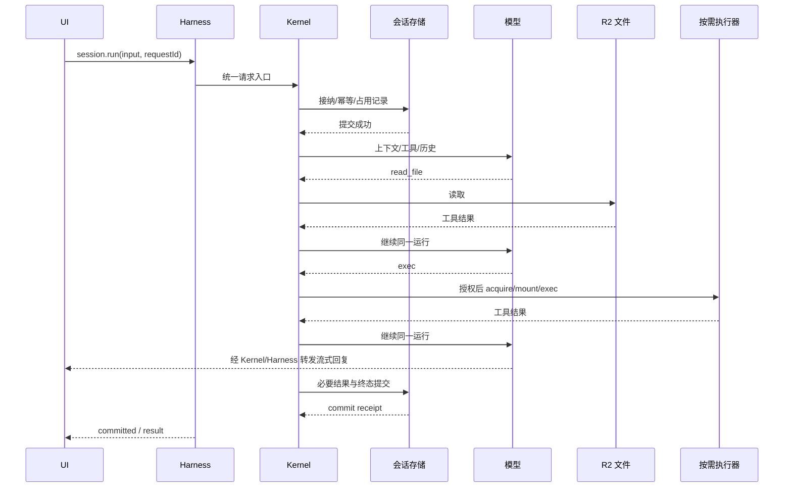

# NextClaw Harness、通用 Kernel 与双平台适配技术方案

修订日期：2026-09-30。状态：完整方案供 Review；不是实现完成或上线证明。

本文是本次公共 API、包依赖、平台接缝及迁移的唯一设计入口。整体用户结果见[统一能力设计](2026-09-29-nextclaw-unified-capability-hosting.design.md)，全部交付门见[BE-01～14 验收合同](../work/2026-09-29-bibo-edge-conversation/acceptance-contract.md)。执行证据见[当前状态](../work/2026-09-29-bibo-edge-conversation/current-state.md)。

**设计结论：Harness 是最终 SDK 入口，依赖通用 Kernel；Kernel 拥有已经验证的 Agent 与产品逻辑，通过环境合同消费平台资源。Node 和 Cloudflare 提供不同平台实现。不得让 Kernel 反向依赖 Harness，不得把整个 Kernel 定义为 Node 专属。**

本次改写撤回此前“把核心搬入 Harness，Kernel 反向依赖 Harness”“Node host 留在通用 Kernel 根入口”的讨论草稿。旧段落不再作为实现依据。没有撤销用户结果、真实数据保护、性能成本门槛或上线要求。

### 2026-09-30 核心范围的生产资源证据

BE-01 尚缺最终生产请求关联的 Sandbox 获取计数。由现有 `BiboExecutionService` 在唯一 `getSandbox` 接缝记录本轮首次获取的 handle 数，缓存复用不重复计数；由现有 app 在本轮执行清理后发出 `run.resources` 标量诊断，关联 runId/sessionId。计数是获取尝试，不冒充实际容器启动或计费时长；零获取足以证明该请求未通过执行器触达 OS。无需新计数服务、全局状态或公共 SDK 类型，日志不含路径、命令、正文、账号凭据。

方案 Review（当前局部）：通过。只扩充已有诊断 owner 和资源 owner 的观察值，不改变工具路由、保存或生命周期。验证用现有懒获取/复用测试断言零与一，并在同源码隔离主链路及生产无 OS/有 OS 请求中关联日志；源码修改后运行 Bibo 三份 tsc、定向测试和 diff-only 检查。

## 1. 用户目标、依据和非目标

| 原始要求 | 设计位置 | 证明方式 |
| --- | --- | --- |
| Harness 是最终公开入口；底层不感知 Bibo | §3～6 | 实际发布依赖图、双宿主公共入口调用 |
| 完整本地版的用户任务尽量无损；旧安装不坏 | §11～13 | 能力矩阵、旧 home 升级、工具/扩展/运行时任务 |
| 普通聊天和无需 OS 的工具不启动容器 | §8 | 真实请求关联 Sandbox 获取/启动次数为零 |
| OS 由 Agent 按需取得，可选择多个环境 | §7～9 | 同会话命令、目录挂载、多环境与回收 |
| 官方 R2 挂载，不自造文件同步，无保存工具 | §7、9 | 官方 SDK 生产路径、写后直达回读 |
| 降低延迟、成本和日常发布时间 | §12、14 | 同负载生产分段数据、账单用量、发布计时 |
| 不兼容无人使用的 SDK/开发版本，不积累 legacy | §11、14 | 内部消费者迁移及旧正常运行分支删除 |
| 设计纠偏必须落盘，不能上下文压缩后漂移 | 本文及当前状态 | 主文唯一，旧方案标为撤回 |

目标不是移动文件数量或工具注册数量，而是持续上下文中的完整任务、用户可见体验和可靠状态。允许环境专属工具实现不同，不允许因移植困难静默减少能力。不得以“适配接口已预留”冒充能力实现。

非目标：将 R2 伪装为完整本地 POSIX 文件系统；自动持久化整个 OS；每用户常驻 Node 主机；本轮重写 NCP 协议或已验证的 Agent 算法；为尚无消费者的能力创建大量细分包。

## 2. 当前代码证据与问题

以下是工作区事实，不代表最终实现已完成：

- 公共 Harness 根入口有 Node/workerd 条件产物；Node 另提供完整产品工厂，已删除临时 `./node` 导出。
- `nextclaw-kernel.ts` 现消费 Harness 创建的 AgentKernel 和 NodePlatform 打开的原本地资源；原 App、扩展、技能与观测逻辑继续由产品 owner 维护，不再创建另一个引擎。
- `local-agent-resources.factory.ts` 装配原本地 execution claim、模型和资源合同；NodePlatform 打开原 journal、配置、项目与搜索资源。平台不返回 Agent/session/run 图。
- Harness 已有 prepare/start 与受信产品模块生命周期；host union 和 createNodeAgentHost 已删除，CLI/server/一次性任务由公共包工厂接入。
- `AgentRunRequestManager`、`SessionRunManager`、`AgentRuntimeManager`、模型输入/预算/压缩已有实现，应继续保留为唯一 owner。
- `AgentRunSessionHost` 等使用 `Pick<KernelManager,...>`；可以辅助迁移，但不能作为长期向外泄漏具体 manager 的平台 API。
- `BiboEdgeConversationService` 已删除；BiboConversationService 使用公共 Harness，保留业务工具和 UI 投影。云端能力与持久运行恢复仍不完整。
- 实际 workerd 假模型、局部类型检查及历史生产数据证明了一些接缝可行；不证明新完整架构或全部能力已达标。

## 3. 三张关系图

### 3.1 包依赖（编译时）

```mermaid
flowchart TD
  App[本地入口 / Bibo] --> Harness[@nextclaw/harness]
  Harness --> Kernel[@nextclaw/kernel 通用核心]
  App --> Node[Node 平台包]
  App --> CF[Cloudflare 平台模块]
  Node --> Contracts[Kernel 公开平台合同]
  CF --> Contracts
  Kernel --> Base[现有通用协议 / runtime / shared]
```

平台合同由 Kernel 定义。Node 平台仅类型依赖时使用 `import type`；需要的可移植辅助实现使用明确公共入口。Kernel 不导入具体平台，Harness 不静态导入 Node 平台。必须检查打包后 JS 和 `.d.ts`，不能仅检查源文件 import。

构建依赖审查（design-review: passed，限定 Core 的纯导出）：Core 当前根产物把路由/思考级别等纯函数和 sharp、渠道 SDK、本地文件实现打成同一模块，公共 Harness 即使只消费纯函数仍触发原生依赖解析。为同一个根公共入口提供 `workerd` 条件产物，直接导出既有纯实现及类型，不复制算法、不提供空实现，也不通过消费者 alias 绕过边界。Node 产物保持原导出；Worker 缺少的原生能力必须通过平台资源接入，不能补同名伪实现。验收是实际条件打包的 import 闭包与 Node 类型/相关行为回归；此项不等于整套 Kernel 已可在 Worker 运行。

保留现有 Harness 和 Kernel 包。NodePlatform 先放在 Kernel 的 Node 可达模块，由根入口导出；workerd 根产物不包含该实现。独立包的判断依据是实际原生依赖迁移收益，不新增一个只转发类的空包。Cloudflare 平台暂留 Bibo 内部模块，通用平台合同不出现 Bibo 业务。独立消费者出现后再判断 Cloudflare 包。具体新增目录须在实现前通过项目路径检查。

### 3.2 运行时装配（谁创建谁）

```text
应用创建 Platform → 应用将它交给 Harness
Harness 创建一个 Kernel，并管理该实例生命周期
Kernel 创建既有 session/run/context/runtime/tool manager
这些 manager 消费同一 Platform 的相关资源
```

外部默认不创建 Kernel，不拼装几十个 manager；Kernel 不创建 Harness。普通产品任务经 Harness 公共入口进入。CLI/server 的管理功能可使用 Kernel 已有管理合同，不为每个管理命令制造一层同名转发。

### 3.3 状态归属（谁决定什么）

| 事实 | 唯一语义 owner | 持久化/环境执行者 |
| --- | --- | --- |
| Agent 定义、权限、产品配置、技能/记忆选择 | Kernel 产品 manager | 平台 repository |
| 接纳、排队、steering、取消、运行终态 | Kernel 现有运行 manager | 平台持久化及运行占用合同 |
| 运行中的消息与工具结果 | SessionRun | 会话事件存储 |
| 模型输入、上下文预算、压缩检查点含义 | Kernel 现有模型输入/压缩模块 | 模型网关、会话存储 |
| 持久文件字节 | 文件平台 | Node FS / R2 |
| OS 实例、进程、挂载是否真实存活 | 执行平台 | 本机 / Sandbox |
| UI 展示 | 事件/持久状态的投影 | Bibo UI 或本地 UI |

平台不决定提示词、压缩时机或对话规则；Kernel 不猜测 OS 是否仍存活。UI 不维护另一份权威 running 布尔值。

局部能力入口审查（design-review: passed，限定删除重复 facade）：本地 NextclawKernel 已消费 AgentKernel，但旧 Node host 又创建 NextclawKernelFacade，重复注册 tools/context/runtime 的入口映射。删除该 facade，本地把原 LlmProviderManager/McpManager 的公共合同注入 AgentKernel，直接暴露 AgentKernel.capabilities。McpManager 只依赖已初始化配置，可前移构造，不提前启动网络预热。模型流必须保持原 provider 的 this 绑定。验证使用真实本地 Kernel 的 capabilities 做工具注册/撤销、上下文注册/撤销、模型流绑定和 MCP owner 同一性；原启动测试同时回归。该变更仅统一能力入口，Node platform/host 的最终替换仍未完成。

本地资源装配边界（design-review: passed，限定资源提取）：将 Node 专有的 LocalAgentProfileStore、LocalExecutionClaimService、ProviderManagerNcpLLMApi 和路径 resolver 装配放到 `local-agent-resources.factory.ts`，返回同一个 AgentKernelResources 合同；它不创建或返回 Kernel/session/run manager。调用方传已有资源 owner 及会话存储、删除回调，保留原 profile reload、活动记录、title 和事件关联。这样后续 NodePlatform 可以复用资源装配，不再从宿主拿已组装引擎。禁止把这一步称为 NodePlatform 生命周期已实现。验收仍为真实本地启动、能力 owner 和类型检查；提取不得变更资源路径。

模型网关合同核对（design-review: passed，限定纠正静默替换）：现有 Bibo 试用网关只配置 DeepSeek 凭据和固定模型成本策略，不能把任意持久 model 字段悄悄替换成 deepseek-flash。共享运行时的 model 必须传到生成及压缩请求；网关只接受其当前已配置模型及明确同义前缀，未配置模型返回可识别错误且不预扣调用次数、不发上游请求。默认模型从同一常量消费。保留原试用输出预算与 thinking 策略，不在此局部修复扩大产品模型/费用范围；完整多模型 registry 仍是未完成项。验证模型字段跨边界传递、别名解析、拒绝不扣额度以及生成/压缩一致性。

## 4. 对外 API：同一个 Harness

以下 TypeScript 是拟议合同；引用的 NCP 消息、事件、工具等继续使用现有类型，不重新定义协议。示例不是当前可直接执行的已发布 API。

```ts
interface NextclawHarnessOptions {
  platform: AgentPlatform;
}

interface HarnessApi {
  readonly agents: AgentRegistry;
  readonly sessions: SessionRegistry;
  readonly contributions: ContributionRegistry;
  start(): Promise<void>;
  dispose(): Promise<void>;
  runTask(input: {
    sessionId: string;
    input: string;
    requestId?: string;
    signal?: AbortSignal;
    onEvent?: (event: NcpEndpointEvent) => void;
  }): Promise<RunResult>;
}

interface SessionRegistry {
  create(input: { agentId: string; title?: string }): Promise<AgentSession>;
  resume(sessionId: string): Promise<AgentSession>;
}
interface AgentSession {
  readonly sessionId: string;
  run(input: {
    input: string;
    requestId?: string;
    signal?: AbortSignal;
  }): Promise<AgentRun>;
}
interface AgentRun {
  readonly runId: string;
  events(): AsyncIterable<NcpEndpointEvent>;
  cancel(): Promise<void>;
  result(): Promise<RunResult>;
}
```

复用现有 agents/sessions/contributions 与 runTask，签名按实际现有接口迁移。requestId 是请求幂等键，与生成的 runId 不混用。结果区分成功、取消、失败；持久提交失败不得返回成功。公开错误保留可分类 code 和可恢复信息，不泄漏账号凭据。

本地调用：

```ts
const harness = new NextclawHarness({
  platform: new NodePlatform({ homeDir }),
});
await harness.start();
const session = await harness.sessions.resume(sessionId);
const run = await session.run({ input: message, requestId });
for await (const event of run.events()) render(event);
await run.result();
```

Cloudflare 调用：

```ts
const harness = new NextclawHarness({
  platform: new CloudflarePlatform({
    storage: ctx.storage,
    bucket: env.FILES,
    sandbox: env.SANDBOX,
    accountId: authenticatedAccountId,
    // 模型凭据由服务端认证/网关注入，不信任消息正文。
    modelAccess,
  }),
});
harness.contributions.register(new BiboPersonalSpaceContribution());
await harness.start();
await harness.runTask({ sessionId, input: message, requestId, onEvent });
```

生产中不为每条消息重复创建完整 Harness：账号 DO 实例持有一个延迟初始化的 Harness，重入 start 共享同一 Promise；DO 重建后从持久状态恢复。不同会话可并行，同一会话服从同一运行队列。模型网络等待不能放在全账号存储事务或全账号排他初始化锁中。

## 5. 内部装配与生命周期

长期结构约束（用户补充）：抽象应隔离真实环境变化点，不能把内部管理器装配推给 SDK 使用者。平台不得返回已组装的 Agent/session/run manager 或整套 Kernel；返回的 AgentKernelResources 只能包含资源合同。不得为 Node、Cloudflare 分别维护 Agent 编排。资源 owner 直接注入，避免同名转发层。重构中的 host facade、Bibo 手工装配及临时公共子入口必须在最终路径中退出，不能以兼容过渡代码为由留下第二套架构。

```ts
class NextclawHarness {
  private kernel?: AgentKernel;
  constructor(private readonly options: NextclawHarnessOptions) {}
  async start() {
    const resources = await this.options.platform.start();
    this.kernel = new AgentKernel(resources);
    await this.kernel.start();
  }
  // 实际实现还管理 start promise、贡献、运行排空和失败清理。
}

class AgentKernel {
  constructor(resources: AgentKernelResources) {
    // 同步建立对象关系，不访问网络或启动执行器。
    // SessionManager 消费 resources.sessions 等资源。
    // 继续装配现有 context/runtime/request manager。
    // native runtime 的模型输入与压缩装配只存在于此公共核心。
  }
}
```

该段只说明对象关系。具体类可拆构造参数，但不删除其已验证语义。原 NextclawKernelFacade 类已删除，稳定扩展合同由 AgentKernel.capabilities 提供；扩展不能通过该合同获得未经授权的原始 R2 binding 或账号密钥。

生命周期：constructor 建立公共 registry → start 打开平台资源/加载必要配置 → Kernel 建图/注册贡献 → ready 接受任务 → draining 拒绝新任务并等待或取消已有任务 → flush 必要状态 → dispose 释放句柄。初始化失败按已完成的步骤逆序释放，保留根错误。重复 start/dispose 幂等。

实例拥有平台打开的句柄，不拥有用户的持久文件或整个 Cloudflare namespace；dispose 不删除用户数据，也不等于销毁全部长任务执行器。运行中的长期进程有独立所有权与生命周期记录。

## 6. 平台合同：明确资源，不传入整套 Kernel

```ts
interface AgentPlatform {
  start(): Promise<AgentKernelResources>;
  dispose(): Promise<void>;
}
interface AgentKernelResources {
  readonly profiles: AgentProfilePersistence;
  readonly sessions: SessionPersistence;
  readonly models: NcpLLMApi;
  readonly summaries: CompactionSummaryProvider;
  readonly projects: SessionManagerOptions["projectManager"];
  readonly resolveProjectContext: SessionProjectContextResolver["resolve"];
  readonly sessionSearch: SessionManagerOptions["sessionSearch"];
  readonly contextFiles?: { readText: BootstrapContextInput["readText"] };
  readonly runtimeInfo?: ContextRuntimeInfo;
  readonly modelRegistry?: IModelRegistry;
  readonly mcp?: IMcpRegistry & {
    listToolsForRun(input: { agentId: string }): readonly NcpTool[];
  };
  readonly executionClaims?: SessionExecutionClaims;
  // assets、事件、诊断和删除回调等其余资源见唯一类型源。
}
```

此段与当前资源合同保持同名，完整定义以 [`agent-platform.types.ts`](../../packages/nextclaw-kernel/src/types/agent-platform.types.ts) 为唯一源。它不意味着完整本地版已覆盖：按 §11 对文件/执行工具、MCP、技能加载、后台调度、设备、资产读取等消费者继续接入；必要的环境扩展必须明确支持状态，不能返回空数组/成功占位。不用一个 `services: Record<string, unknown>` 绕过类型与能力审计。

资源打开时机裁决（design-review: passed）：采用 `AgentPlatform.start(): Promise<AgentKernelResources>`，返回存储/模型/路径等资源，严禁返回已装配的 Agent/session/run manager。与“平台对象上二十多个延迟 getter”相比，返回一次已就绪的资源快照能避免未初始化状态和转发样板；与原 host.start 返回运行图相比，创建引擎仍唯一归公共 Harness→AgentKernel。Harness 先打开资源，再创建引擎、启动贡献；失败逆序释放，保留根错误。Cloudflare 返回其已初始化资源，Node 每次有效启动打开原 journal/项目/搜索/模型/MCP 资源，重复 start 共享一个 promise，dispose 只关闭句柄、不删除数据。

NodePlatform 局部落地（design-review: passed，BE-04 的必要组成而非全门通过）：实现放在 Kernel 的 Node 条件可达模块，通过根公共入口导出；workerd 入口不导出/导入 Node 实现。先不新增仅转发类的空平台包。复用原 LocalConfigStore、LocalAgentProfileStore、journal、ProjectManager、SessionSearchService、LlmProviderManager、McpManager、执行占用和共享上下文文件资源；不另建 agent engine。Node SDK 验证公共 Harness 执行、真实本地文件工具、磁盘会话恢复、模型输入及启动失败清理；模型网络可用可观察的本地 HTTP 夹具。完整本地产品附加工具/后台服务装配仍需从旧 host 接回，未接齐前不得删除唯一可用链路或宣称 BE-04/09 完成；最终 host 分支仍须删除。

会话委派 owner 迁移（design-review: passed，限定共享装配）：SessionRequestManager 及其原 dispatcher/notifier 只依赖共享会话、Ingress 和 EventBus，不属于 Node 平台资源。将其唯一构造移入 AgentKernel，完整本地产品直接引用该实例，保留原请求记录、通知与子会话语义；不复制 Bibo 委派器。工具运行上下文改由调用者注入项目路径 resolver，与已完成的 context provider 采用同一边界。原 Node 工具仍注入现有 resolver；Core workerd 根只补导出原纯请求记录算法。验证原委派/工具合同、本地启动、Node Harness 和 workerd 打包。此步骤不能自动把带会话认证 scope 的云端子任务开放；开放前必须接通子任务授权继承、取消和后台持久生命周期，不能用空 scope 执行。

MCP 与结构化结果注册归属（design-review: passed）：结构化结果工具由共享 Kernel 根据原 metadata 合同注册；MCP 平台资源提供原 `listToolsForRun({agentId})`，共享 Kernel 使用原 McpToolProvider 和注入路径 resolver 的运行上下文注册它。Node 产品 contribution 删除重复注册，NodePlatform 自动继承已配置 MCP 工具。原 MCP adapter 继续执行 Agent 可访问性过滤，不能把管理目录 listTools 直接当作运行工具目录。未提供 MCP 资源的环境仍需补齐其传输实现，不能把此次共享注册视为云端 MCP 已支持。验证真实本地装配中注册唯一、Agent 身份传递、非结构化请求不暴露提交工具，并复验原 MCP adapter 权限合同。

### 6.1 会话提交与运行占用

```ts
interface SessionRepository {
  load(sessionId: string): Promise<PersistedSession | null>;
  commit(change: SessionCommit): Promise<CommitReceipt>;
}
interface SessionCommit {
  sessionId: string;
  operationId: string;
  expectedRevision: string | null;
  events: readonly PersistedSessionEvent[];
}
interface CommitReceipt { revision: string }
```

此为语义合同，`PersistedSessionEvent` 必须映射当前 journal 中的持久事件，不将所有 token delta 强加为磁盘写。现有创建/列表/回退等方法按真实 session 消费者补齐，同一 repository 服务公共查询与运行，不能另设 Bibo 专用权威历史。

- operationId：同请求重试去重；同 ID 不同内容拒绝。revision：乐观并发控制，不是用户文件版本功能。
- 共享幂等 owner 的内容校验局部裁决（design-review: passed）：`AgentRunRequestIdempotencyService` 原来只比较 message.id；同 ID、不同 parts 会被误判为重试。保留原请求接纳/重放路径，比较 ID、role 与 parts 的规范 JSON 内容；忽略时间戳和系统追加 metadata，避免合法重试因运输时间或持久化补充字段被拒绝。对象键排序、数组顺序保留，并发副本在接纳前复制，持久/排队/运行中三处全部复用同一判定。验证同内容不同对象键顺序可重试，正文/工具/附件差异拒绝，跨会话不互斥。此修复不等于完成持久 admission、请求语义字段 fingerprint、崩溃恢复或 Harness 的最终 requestId API。
- 事件顺序和去重在持久层完成。Node 复用现有 journal/协调器，先核实其真实原子性和崩溃语义，不凭接口名称承诺事务；DO 使用匹配当前 backend 的官方事务。
- 持久层只保证自身提交，不保证 DO、R2 和外部工具跨系统原子事务。
- 同会话运行占用由 Kernel 请求 manager 管理；平台提供持久占用原语。记录 runId、owner generation、到期/心跳和终态，不只有 running=true。恢复需验证存活并使用 fencing，过期后新 owner 取得占用，旧 owner 不得再提交。
- 租约过期不能证明外部命令停止。恢复前检查执行器，未知副作用不能自动重跑。
- 先可靠记录接纳，再开始不可逆工具；记录工具调用意图/结果并关联 operationId。外部工具不支持幂等时，崩溃窗口标记结果未知并检查实际状态，不声称 exactly-once。
- EventBus 普通 emit 不等待异步持久化。保留现有事件协调器并给出 awaitable flush/commit 路径；`run.result()` 成功及 UI committed 必须在必要状态提交之后。

### 6.2 文件接口

```ts
interface WorkspaceFiles {
  list(input: { path: string; cursor?: string; limit?: number }): Promise<FilePage>;
  read(input: { path: string; range?: ByteRange }): Promise<FileRead>;
  write(input: {
    path: string;
    body: ReadableStream<Uint8Array>;
    byteLength?: number;
    condition?: FileWriteCondition;
  }): Promise<FileInfo>;
  remove(input: { path: string; condition?: FileWriteCondition }): Promise<void>;
}
```

Node 映射本地 FS，Cloudflare 映射 R2 对象和目录前缀。对外不暴露用户可伪造的 bucket/账号前缀。字节流、范围读取、分页和有限预览进入合同，不能一次 `.text()` 读取整个 100 MiB 文件。工具输出分页上限不是存储大小上限。目录对象前缀不是 POSIX 目录事务；重命名/递归操作如需产品入口，必须说明非原子性、失败恢复与批次进度。

条件写用于防止静默覆盖，不建立用户可见版本历史。已知长度源使用官方流式写能力；未知长度需要 multipart 时明确暂存、失败清理和费用，不引入额外用户保存操作。UI 未保存编辑草稿仍属于 UI，不能混同 R2 持久文件。

文件页面有界读取（design-review: passed）：`file.get` 对可编辑文本最多读取 1 MiB；更大对象只取 64 KiB 预览，二进制不转成可编辑字符串。返回明确 preview 元数据（总字节数、已读字节数、截断/二进制），前端与 store 都禁止将非完整预览作为整文件保存。正常小文本的编辑与版本冲突合同不变。新增当前账号认证的原文件流式下载入口；预览限制不限制存储、挂载、下载或 Agent 字节工具。读取结果使用同一次 R2 get 的版本/元数据，避免 stat 与 get 之间更新导致内容和版本错配。验收包含逻辑 100 MiB 对象只请求有限 range、二进制、UTF-8 边界、实际版本更新、下载保持原始字节、预览保存被阻止及正常小文件编辑；不能以 API 测试替代界面验证。全量目录 collect 仍是另一未闭合的规模项。

### 6.3 模型和产品策略

ModelAccess 负责已授权 provider/网关调用及必要元数据，复用现有模型调用合同。默认模型、Agent 模型选择、上下文预算、重试策略、输入投影和压缩属于 Kernel。不能在 Bibo adapter 中硬编码一套独立的 profile、默认模型和压缩装配。

密钥只由平台持有；日志记录 request/run/工具关联 ID、时长和用量，不记录凭据或不必要的正文。Node 继续支持已有配置与模型 provider，Cloudflare 采用其可用认证方式；不偷偷降级模型或强制 native 替代用户已选择的 runtime。

## 7. OS 环境、挂载与长进程

```ts
interface ExecutionProvider {
  acquire(input: {
    environmentId?: string;
    mounts?: readonly WorkspaceMount[];
  }): Promise<ExecutionEnvironment>;
  inspect(environmentId: string): Promise<EnvironmentStatus>;
  release(environmentId: string): Promise<void>;
}
interface WorkspaceMount {
  sourcePath: string;
  targetPath: string;
  readOnly: boolean;
}
interface ExecutionEnvironment {
  readonly id: string;
  exec(input: {
    command: string;
    cwd?: string;
    signal?: AbortSignal;
  }): Promise<ExecutionResult>;
  mountWorkspace(input: WorkspaceMount): Promise<void>;
  unmountWorkspace(targetPath: string): Promise<void>;
  startProcess(input: ProcessInput): Promise<ProcessHandle>;
  getProcess(processId: string): Promise<ProcessStatus>;
  stopProcess(processId: string): Promise<void>;
}
```

公开给 Agent 的工具支持 environmentId、授权目录和命令一次提交，避免普通命令被迫经历创建→挂载→运行三个模型往返；也支持显式 acquire/mount/inspect/release，便于多步、多 OS 或并行环境。新环境默认没有挂载持久盘。

文件系统规则：OS 根文件系统临时；选中的挂载目录持久。Git、node_modules、安装依赖和构建缓存默认在临时 `/workspace`，不自动同步。环境复用期间软件可继续使用，回收后通过基础镜像或明确安装步骤恢复，不能承诺安装永不丢失。Agent 的上下文必须告知实际挂载和临时性。

长期进程由 ProcessHandle 管理，不把一条 HTTP 请求一直挂住。后台运行记录环境/进程 ID、状态和期限；重新进入会话可查询。HTTP 服务如需暴露端口，必须经过平台授权与访问控制，不自动公开端口。进程需要运行多久，就计算多久驻留成本；默认不预热，不等于强制回收用户明确启动的服务。回收、平台上限、崩溃会中断进程，UI/Agent 必须看到失败或需要恢复的状态。完整本地版已有后台任务必须有等价链路，不能把本轮必需项仅列为未来扩展。

执行器落地审查（design-review: passed，限定 §7 生命周期）：账号 DO 保存具名环境与随机执行器 ID，聊天轮次仅持有可取消的调用句柄，结束时不销毁环境。默认使用官方 5 分钟闲置回收；后台进程显式申请有上限的驻留期限，先记录到期时间并设置 DO alarm，再开启 keepAlive。到期销毁失败保留记录并重试。环境查询不调用 Sandbox；命令和进程查询才访问实际执行器，不把注册记录视为存活证明。销毁成功才删除记录。测试覆盖零聊天启动、跨轮复用、多环境隔离、取消、到期清理和失败重试。

官方 SDK 0.12.10 的 R2 binding 挂载约束：同一 Sandbox 内同一 binding 不允许不同 prefix；选择一个目录挂载，多目录需要选择共同父目录或分别使用环境，不引入自制同步文件系统。此限制来自安装版本的 mountBucketR2Egress 校验，必须在工具调用前明确反馈，不能让模型反复尝试注定失败的挂载。

执行传输修正（2026-09-30，局部 design-review: passed）：真实 Cloudflare 验证发现 `exec({signal})` 在 Worker → Sandbox RPC 边界报 `AbortSignal serialization is not enabled`。前台命令使用官方 `startProcess`、`waitForExit`、`getProcessLogs`，超时或本轮取消调用官方 `killProcess(id)`，信号只留在调用方；不销毁整个环境影响后台任务。覆盖启动前/启动过程中/运行中的取消，以及超时停止；发布前必须在隔离 Cloudflare 环境跑通聊天、文件写读展示、挂载命令改写与同会话续聊，不能以工具事件 committed 当执行成功。挂载恢复只卸载已证明存在的 FUSE mount，非空普通目录不得清除。

挂载授权修正：SDK 0.12.10 的重复路径错误会删除 activeMounts 记录及 egress 授权；不能把“already in use”视为幂等成功。单个限时聊天调用内缓存成功挂载，避免 mount_directory→exec 再次挂载；下轮重建调用句柄遇到此错误时只卸载活 FUSE 并重新调用官方 mountBucket 恢复授权。真实验收须覆盖下一轮直接命令读回，模型输出、退出码 0 均不能证明 R2 写入成功。

## 8. 请求完整时序



无 read_file/exec 时省略对应工具调用；没有 OS 工具就不 acquire。工具返回后继续同一个 SessionRun，不切换 Agent 或重建上下文。流式消息可早于最终提交显示，但界面明确区分生成中、保存中、已保存和失败。

## 9. Cloudflare 落地与官方能力边界

- Worker HTTP 路由负责认证和传输，账号 DO 提供实例生命周期与账号内状态协调；模型循环在 DO 所在 Worker runtime 执行，不经过常驻 Node 服务器。
- 会话元数据/事件存 DO；文件字节在 R2；Sandbox 只在工具需要 OS 时使用。绑定名、前缀与租户映射在 Cloudflare adapter 内部。
- 官方 `mountBucket(bindingName, targetPath, { prefix })` 支持目录前缀；生产 binding mount 需要相应 R2 binding 及 `ContainerProxy` 导出。不要向 Sandbox 写入整桶长期密钥。依据：[Cloudflare mount buckets](https://developers.cloudflare.com/sandbox/guides/mount-buckets/)。
- 挂载是对象存储文件视图，不承诺完整 POSIX/本地磁盘性能。以安装的 SDK 锁定版本复验；开发模式与生产挂载行为不能互相代替。
- R2 binding 的流式、范围读取、分页和条件写按[官方 Workers API](https://developers.cloudflare.com/r2/api/workers/workers-api-reference/)落地。DO 提交按实际 backend 的[官方存储合同](https://developers.cloudflare.com/durable-objects/api/sqlite-storage-api/)验证，不能把 SQLite 文档直接套到未迁移的旧存储。

挂载并发：共享目录写挂载期间，以账号 DO 的授权租约阻止重叠目录的其他写入；父子路径算重叠。释放租约前确认写进程停止、文件关闭并完成适用的挂载同步/卸载，以及 R2 直达可见性检查。不能仅凭过期时间释放写权后放任旧 Sandbox 继续写。若官方挂载无法证明失效写者被隔离，必须先销毁/隔离旧环境，未确认前拒绝新写，而不是无条件放行。

Worker 可读已提交对象，不能假定正在写的大文件是完整结果。工具完成前检查对应结果可见；崩溃留下半成品时如实报告。官方挂载不能提供跨文件事务，产品不能伪装为原子目录快照。账号路径授权、路径规范化和前缀约束必须同时作用于 API 与挂载代理；仅限制挂载显示路径不能代替租户隔离验证。

## 10. 失败与恢复矩阵

| 场景 | 处理与用户结果 | 验证 |
| --- | --- | --- |
| 重复发送/断线重试 | 同 requestId 返回原接纳/结果，不重跑工具 | 双请求、超时后重试 |
| 一小时前运行已结束但状态残留 | 核验终态/存活，恢复占用；不永久假忙 | 过期记录注入及真实旧会话 |
| 两会话同时运行 | 独立队列，不被全账号网络等待阻塞 | 并发请求与空间读取 |
| 取消 | 传播模型/工具 abort，保存取消状态；检查命令是否实际停止 | 流式中、命令中、提交前取消 |
| 模型完成后存储失败 | 不发 committed，结果可恢复；不自动重复有副作用工具 | commit 注入失败/重启 |
| DO 重建 | 从已提交事件恢复，不信任旧内存状态 | 运行各阶段重建 |
| OS 冷启动/挂载失败 | 错误进入同一运行，清理已取得资源，允许有界重试 | 部分创建失败 |
| 工具执行后结果丢失 | 标记未知并查询副作用，不盲重跑 | 执行完成后中断 |
| 两账号/两个环境 | 权限隔离；一个环境释放不影响另一环境 | 路径越权、并行挂载、撤权 |
| 长期服务重启/回收 | 明确中断和恢复策略，不谎称进程仍运行 | 服务查询与停止 |
| 文件写冲突 | 条件写或互斥挂载，禁止静默覆盖 | UI/工具/挂载交错写 |

## 11. 现有代码迁移和能力对账

**2026-09-30 当前范围修订**：用户选择核心交付，先解决“必须成立”。本次以 [验收合同 revision 6](../work/2026-09-29-bibo-edge-conversation/acceptance-contract.md#2026-09-30-核心交付范围用户已确认revision-6) 为准：统一 Harness、本地原用法保护、连续上下文、文件/网页/提问、按需 OS、保存/隔离、速度/成本及上线是完成门。技能/记忆检索/MCP、多模型、复杂子任务、多 OS 并行、后台托管、完整项目/应用管理与设备配对按实际需求另行评估，不在本次为追求本地模块全量映射继续扩建。以下完整能力列表保留作对账来源，不代表全部都须开放到 Bibo；禁止把未开放能力说成已等价。

| 现有模块 | 处理 | 不得丢失 |
| --- | --- | --- |
| Harness manager/registry | 移到 Harness 包或保持唯一公共实现，移除反向耦合 | agents/sessions/contributions、取消与生命周期 |
| NextclawKernel / factory | 分离平台创建，保留产品装配 | 原有配置、扩展与管理能力 |
| AgentRunRequestManager / SessionRun | 留在 Kernel，同一实现 | 排队、steering、去重、终态 |
| AgentRuntimeManager / native contribution | 留在 Kernel；环境加载移至平台 | native 及已有其他 runtime |
| 模型输入、预算、压缩 | 留在 Kernel，移除原生依赖泄漏 | 提示词顺序、保护上下文、检查点 |
| 本地 journal/配置/文件/执行 claim | Node 平台适配原格式和实现 | 已发布真实数据和恢复行为 |
| BiboEdgeConversationService | 删除平行装配，保留必要产品贡献/结果展示 | 搜索、空间、展示、问题回复 |
| Kernel/Core 根入口原生依赖 | 将环境实现隔离到 Node 构建依赖图 | 不用大量临时 subpath 掩盖边界 |

按用户任务对账：模型/记忆/Skill、文件/网页、命令/安装、会话/项目/子任务、MCP/应用/外部服务、后台调度/长期服务、设备访问。每项列本地真实入口、Cloudflare 等价入口、平台实现、测试和例外依据。设备能力需要配对授权，不伪造云端可直接控制本机。远程 HTTP MCP 与 stdio MCP 分别走直接网络和 OS 执行资源，协议语义/授权仍归核心。

不能把 Kernel manager 全部搬到 Node 包，也不能要求 Bibo 全部装配桌面功能。Kernel 模块按声明的产品能力注册，所需平台能力缺失时明确不可用及原因；选择性装配必须通过能力对账，不得成为静默删功能开关。

## 12. 验证和数值门槛

本节引用并细化 BE 合同，不降低任何 Required 项。所有结果绑定提交 SHA、环境、模型、样本量、时间窗口和分位算法。

### 黄金链路

1. 本地旧安装升级：旧 home/长历史/压缩/扩展夹具 → 新版启动 → 原会话续聊、文件与命令、扩展/runtime → 重启再续聊；内容与状态校验一致，旧数据未损坏。
2. Bibo 闲置旧会话：超过一小时后发送 → 立即接纳与流式 → 正确引用历史 → 刷新后仍保存；零 Sandbox 获取/唤醒，失败可重试而不假忙。
3. 同一会话文件与 OS：直接读持久文件 → Agent 取得 OS/挂载目录 → 临时目录运行 Git/依赖任务 → 结果写挂载目录 → Worker 和 UI 回读 → 环境回收后结果仍在；未挂载文件不被承诺持久。

### 分层证据

- 公共入口和构建：Node/Worker 都从 Harness 根入口运行；Kernel 不反向导入 Harness，便携产物没有原生加载；匹配范围 tsc、实际 workerd 运行，不以 bundler 成功代替。
- 同行为合同：多轮、压缩、工具、用户问题、取消、排队、失败恢复、非 native runtime；同输入关键事件序列对照，允许时钟/随机 ID 差异。
- 存储故障：接纳后、工具前后、提交前后故障；重复请求、旧 owner fencing、写挂载故障释放。
- 文件：小文件、跨 1 MiB、100 MiB 文本/二进制、范围读取、分页、条件写、真实官方挂载写后回读；记录峰值内存和延迟。
- 生产真实模型和 UI：覆盖原 Bibo 能力、旧用户数据、桌面/移动端；fake LLM 只证明可控协议，不算真实性能。

### 性能与成本

- BE-02：同地区/模型/内容/冷热对照，无工具首字 p95 下降至少 50%，模型请求前平台耗时 p95 下降至少 70%；目标首字 p95 <5 秒、p99 <10 秒。模型长尾单独报告，继续处理可控瓶颈。
- BE-13 的工具/冷启动门按原合同执行；冷启动 1～3 秒不是承诺。分别测 acquire、挂载、首条命令、工具回传、模型恢复及总时间，不用平均数掩盖长尾。
- 记录 accepted、context ready、model request、first token、tool start/end、storage committed；失败和超时进入分母。新/旧会话、冷/热、挂载/无挂载分别分组，公开样本数，小样本 p99 不作稳定 SLA。
- 按 300/900/1800 消息/人/月、100/1000 活跃用户及 10 倍峰值比较原每用户容器、共享常驻备选和 Worker+按需执行器。900 条档平台增量成本目标至少下降 50%。
- 模型、搜索费用独立列出；平台列 Worker/DO CPU 与驻留、R2 存储/操作、Sandbox CPU/内存/驻留、失败重试和后台服务。以每用户/月、每百条消息、每次 OS 任务三个数字展示。
- 成本计算：固定平台费/活跃人数 + 实测每消息资源×消息量 + OS 任务次数×平均驻留资源 + 存储/文件操作 + 外部模型/搜索。OS 占比按 0%、10%、30% 作敏感性分析，并另列长服务驻留；输入/输出 token 按实测分布，不假设全是短聊天。
- 本文不填未经核实单价或虚构最终报价；正式报告需按计价日期核验官方价格并保留用量证据。

## 13. 设计自审与实现前必须关闭的具体项

已修正：依赖倒置误判、Harness 变空壳、Bibo 自装核心、文件与会话版本概念混淆、平台 dispose 销毁长任务的歧义、DO/R2 跨系统事务误解。

仍需以源码/纵向实验关闭，不能冒充已经通过 Review：

1. 本地 journal 对 operationId/revision/flush 的精确映射；确认不引入第二份事件权威，不改变真实数据格式而没有迁移。
   - 已核实：现有 journal 以每会话 Promise 队列串行 append JSONL，随后更新消息投影、摘要索引和恢复检查点；不是一个带 operationId/revision 的跨文件事务。新平台合同不能直接把它当原子 CAS 实现。应复用事件协调器并明确故障重放边界后再冻结 commit 的精确存储映射。
   - 已复现：单会话 flush 未检查 failedWrites，写入失败后仍 resolve；新增回归先失败，修复使单会话 flush 抛出原错误且不影响其他会话。该修复只闭合错误传播，不代表 journal 幂等或完整迁移已经通过。
2. Kernel/Core 便携依赖闭包：哪些原生依赖来自根导出，哪些来自真实模型资产/MCP/插件功能；逐个映射到平台资源，不用空实现切掉。
3. 非 native runtime、技能/MCP、后台调度和设备合同的完整消费者矩阵，平台接口的最终必要扩展。
4. R2 写挂载失效写者的隔离与释放证据；官方目录挂载不自动证明并发写安全。
5. Worker 长运行在断线、DO 重建和平台时限下的恢复方式；不能以持有 Promise 代替持久执行。按实际平台合同决定 checkpoint/后台触发承载，并验证现有任务结果。

这些是有明确验证对象的设计门，不是缩减目标的借口。当前 `design-review: pending`；通过受影响范围 Review 后才扩大实现。没有用户新偏好依赖的项由执行者调查解决。

## 14. 实施、迁移与发布顺序

### 当前装配落地约束（2026-09-30）

空间操作提交裁决（局部 design-review: passed）：当前 R2/挂载/OS 修改在工具完成时已经生效，结构化空间却缓存到模型回复末尾；且共享 SessionManager 先持久化工具成功与回答，再保存空间。故障时会出现“会话称已保存、实际空间未保存”，全账号锁只是遮盖并发问题。统一复用一个 BiboSpaceService owner：每个对象操作返回成功前完成既有 store.save；UI 和 Agent 消费同一个 owner 的队列。普通聊天不加载或复制整个空间，模型等待不占空间锁。文件仍直接走既有 R2 owner，不声称跨对象/模型/OS 原子事务。后续模型失败不能撤销已经完成的工具副作用；工具文案改为已持久化，不再承诺随回复一起保存。UI show-content/committed 仍以回复提交成功为门。验证 UI 与两个会话交错操作不丢写、工具保存失败不报成功、工具成功后模型失败/取消仍可读取该操作结果。此修正实现无额外保存操作、不同会话不全局阻塞和可恢复副作用的已定要求，不增加另一套空间业务算法。

持久 Harness 的请求资源隔离（局部 design-review: passed）：账号 DO 持有一个延迟创建的 Bibo 产品贡献与 Harness；每次聊天只登记该 session 的上下文、工具与已认证模型访问，结束后删除登记。普通模型接口和压缩接口已有 sessionId，直接据此选本次访问，不使用全局 currentUser/currentModel。工具公开注册增加既有 ToolProvider 合同入口，按请求返回工具，不复制 Kernel 工具组装。贡献只在 Harness.start 前注册一次。会话存储 checkpoint 保留递增序号，以免持久缓存与已清空的事件尾不一致。删除/重命名/reset 等直接改持久状态的管理操作，在无运行时释放实例；随后按需重建，不能在普通回复后 dispose。验证连续两轮、取消后重用、不同会话工具隔离、模型/压缩访问按 session 定位、提交后重建不重复消息。此项不放行仍存在的全账号排他门，也不代替持久租约与最终并发改造。

`AgentKernel` 是通用 Kernel 内的 Agent 对象图 owner，并非新的 Agent 算法或第二个运行引擎。它创建既有 AgentManager、SessionManager、SessionRunManager、ContextProviderManager、ToolProviderManager、上下文窗口/压缩/原生 runtime 与 AgentRunRequestManager。完整本地 NextclawKernel 组合这个 owner 并保留应用、渠道、项目、观测等外围产品模块；Cloudflare 由公共 Harness 创建同一个 owner。禁止两边各复制一份构造顺序。

资源合同以实际消费者为准：SessionPersistence、AgentProfilePersistence、模型/摘要调用、资产读取、项目目录解析、搜索更新、执行占用及事件总线。Profile 的本地目录/头像操作保留原 Core 规则，纯创建/删除字段规则同时由本地和云端消费。平台不得返回现成 runtime/session/request managers。配置 schema 的值校验从版本/路径/文档生成操作中分离，workerd 消费同一个值校验；不把飞书 Node 网络 SDK 放进 Worker 依赖图。

此对象图替换必须核对：本地 activity sink、title provider、beforeDeleteSession 观测清理、context tail、资产、运行时配置、诊断与占用全部接回同一个 owner。公共问题回复与普通 run 一样等待该会话持久化，失败不得返回成功。现有本地完整回归、Worker 入口及历史工具/压缩/问题回复合同是结构替换的验收；不新增另一套 Bibo 会话或模型输入算法。

目前 `host` 参数只存在于尚未完成迁移的开发现场，最终删除；Cloudflare 缺失能力和 Node SDK 完整贡献的迁移仍受 §11～13 与 BE 合同约束。不能把可编译的最低资源集当最终平台实现。

上下文接缝局部裁决（design-review: passed，仅已有提示词与 bootstrap 算法复用）：安全及执行纪律文本保持原文，由共享 Kernel 输出；bootstrap 文件选择、压缩后跳过、单文件/总字符预算、项目与主工作区去重及 SOUL 规则保留原算法。平台只提供 `readText(root, filename)`，Node 包装仍读取原目录，Cloudflare 读取已有 R2 owner 并保留 Bibo 缺省身份。根入口导出纯渲染函数，不让 Worker 导入 fs 或本地 context resolver。Node 原 provider 调用同一个 renderer，删除 Bibo 的复制循环。验证原本地 bootstrap/context 合同、云端身份/记忆/压缩与预算、两边 tsc 和 workerd 打包；本项不声称技能、记忆搜索等其余能力已闭合。

运行上下文的路径解析接缝（design-review: passed，仅环境边界抽取）：现有 `buildNextclawNcpRunContext` 内部直接调用本地路径展开，阻止 Cloudflare 复用同一 Agent/model/channel/工具策略解析。改为接收已有项目路径 resolver 的最窄 `resolve` 合同，Node 两个实际消费者继续传原 `SessionProjectContextResolver`；不改变配置、模型、thinking、handoff、权限与会话 metadata 的计算。`ContextProviderRunContextService` 只依赖实际使用的 owner，并由调用方提供路径 resolver；它不再自行创建 Node resolver。验证真实本地 context/tool provider 合同及 Kernel tsc，随后 Cloudflare 只能复用该解析，不能复制 Bibo 版本。

资源驱动的 bootstrap 接入（design-review: passed，限定本节）：平台提供可选 `contextFiles.readText(root, filename)` 和原 `resolveProjectContext` 的完整返回值。AgentKernel 使用自己的 Agent/session/tool owner 建立同一个 ContextProviderRunContextService，并注册原 bootstrap、执行纪律与安全 provider；Bibo 删除对应的提示词装配。Node 现有完整 ContextProviderContribution 继续使用同一个 provider，将 fs reader 在本地装配处传入，保留原完整 provider 集与顺序。Bibo 的缺省身份文本仍由产品层提供给文件 reader，Kernel 不感知 Bibo 或搜索密钥。可选资源不存在时不会添加这组 provider，防止 Node 尚未迁完的完整 contribution 被重复注册；这是显式贡献装配差异，不产生另一条 Agent 执行链。必须用真实公共 Harness 模型输入证明 Cloudflare 的 profile/config/压缩状态进入共享 provider，并确认原本地上下文合同不退化。

记忆与当前会话接入延续同一裁决：MemoryStore 的三个文本分区格式抽成原 owner 的纯函数，WorkspaceMemoryContextProvider 通过同一文本 reader 读取并遵守已有 enabled/maxChars 配置；Node reader 保留原 memory 目录初始化。CurrentSessionContextProvider 只向宿主查询 host/distribution/installationKind 的事实，身份、模型、thinking、会话及渠道仍取同一个 runContext。Node 在 contribution 装配处提供原 runtime snapshot 查询，Cloudflare 提供其真实宿主标识。删除 Bibo 的平行 memory/current-self 字符串及 buildContext 回调；产品层只留默认身份文件资源。验证实际模型输入包含自定义配置、记忆与准确模型字段，配置禁用记忆后不加载；原本地完整 prompt 合同必须继续通过。

原生运行时装配接缝：将 AgentRunRuntimeContribution 的 modelInputBuilder、native registration、自动/手动压缩接线原样收敛到 Kernel 的 NativeAgentRuntime 服务；输入为模型、Agent 配置、session、compaction、资产和 context-tail owner，不接整个 Kernel。Node contribution 继续负责注册及 Narp 装配，默认 runtime reuse/context 注入语义不变。该局部 design-review: passed；需验证自动压缩读取最新会话 metadata、手动压缩默认模型/Agent、context 注入开关、nextStepInput 能力，并运行现有预算/压缩测试。Bibo 最终经 Harness→Kernel 使用它，局部抽取本身不算统一入口完成。

Harness 完成门局部裁决：在现有 SessionManager 暴露单会话 flush，NextclawRun 的成功结果等待该 flush；不等待全账号其它会话，不改变原事件生成顺序。失败要返回错误且不标记 completed。该局部 design-review: passed，验证延迟提交不提前完成、提交失败不成功、另一会话故障不串扰。它不替代 Kernel 运行租约、工具副作用幂等和失败终态持久化的其余门槛。

终态提交扩展（局部 design-review: passed）：Agent 执行拒绝或取消后同样等待该会话 flush 再释放 Harness ownership；运行错误与持久错误并存时保留两者。持久错误优先标记 runtime_failure，不能因为同时收到 abort 就伪装成正常取消。验证运行拒绝后的延迟 flush、双错误保留、取消与持久失败竞争；不新增事件、不改底层终态协议，也不声称解决进程崩溃恢复。

### 会话存储接缝的局部实施裁决

Cloudflare 会话落地裁决（局部 design-review: passed）：沿用现有逐消息快照的物理存储，在同一账号 DO 增加有序事件尾和会话头；事件、递增序号和 activeRun 原子提交。事件解释与中断恢复仅调用 Kernel 现有 replay/lifecycle/SessionManager，不在 Bibo 重写。实例内缓存增量 replayer，终态 flush 后原子合并快照并清理事件尾；写失败清掉缓存，禁止内存成功冒充持久成功。metadata 的 expectedMetadata 比较在事务内执行。失败请求保留输入及错误终态，不伪造成功回答；UI 提交是投影，不再回写另一套会话事实。验证包含断电式重建、失败写重读、分页、metadata 竞争、压缩和工具跨轮、成功与失败终态，以及 Worker 无原生依赖构建。此裁决不放行整体上线。

会话资源类型按实际消费收窄：SessionManager 只读取 Agent 的 resolveAgentProfile、项目的 normalizeSessionProjectContext、搜索的 handleSessionUpdated、上下文的 previewSession/forgetSession。通过 Pick 传递原 owner，不拆成转发回调；平台适配无需实例化带本地私有成员的完整类。该类型收窄不改变运行逻辑，沿用会话接缝的结构 Review；tsc 必须证明原本地装配继续满足合同。

执行占用类型接缝（局部 design-review: passed）：AgentRunRequestManager 实际只需要 tryAcquire(key) 的 acquired 判定与成功句柄 release()，不读取 pid、文件路径或 completion payload。因此以 Kernel 的 SessionExecutionClaims 合同表达该行为，本地 LocalExecutionClaimService 直接满足结构类型，无 adapter。保持当前同步接纳/释放顺序；Cloudflare SQLite 适配可用同步 SQL 事务，不能假造 PID。此步不新增租约/心跳保证；代际 fencing 与崩溃恢复仍须由持久平台实现并验证。

已核对 SessionManager、SessionEventCoordinatorService 和 SessionSummaryProjectionService 的实际调用：先在 `types/session.types.ts` 定义 `SessionPersistence`，逐项保留既有 append、snapshot、metadata、分页、投影与恢复查询合同。本地 journal 直接 implements，不增加转发 adapter、不改变磁盘格式；三个消费者依赖接口而非带私有成员的本地类。此步骤不引入草图 commit/CAS，也不宣称已有原子事务。该接口是 §6 持久层的真实接缝，最终 Cloudflare 必须完整实现，不能空置分页或恢复查询。

本项 design-review: passed（仅结构抽取范围）：语义 owner 仍是原 Kernel 会话服务，唯一持久权威仍是原 journal；无新增状态、存储格式或产品行为。验证要求为 Kernel tsc、session manager/ingestion/journal 的既有定向测试。整体 §13 的其他设计门保持 pending。

Agent 配置读取接缝：`agent-profiles.utils.ts` 的配置解析同时触发隐式目录存在性检查。将纯配置投影抽入 `agent-profile-resolution.utils.ts`，缺省目录由调用方提供 resolver；原本地入口仍传入现有 `resolveImplicitAgentHomePath`。不改变 ID、main 默认值、模型/runtime 字段或旧目录选择，也不复制投影算法。该局部 design-review: passed；验证原 Agent profile 测试、显式目录不调用 resolver、隐式目录使用宿主 resolver 及 Core/Kernel tsc。Agent 创建/更新/头像的环境写入仍待后续接缝，不宣称本模块已全部便携。

Agent 修改规则抽取（局部 design-review: passed）：将输入类型、ID 验证、显示名生成、更新字段验证与文本/model/runtime/contextTokens 修改规则移入纯 agent-profile-mutation 模块，原 Node 操作直接调用。头像 materialize、目录安全检查、配置保存仍留原环境边界；保持原调用顺序，尤其更新头像失败不保存其它字段。禁止在 Cloudflare 重写这些业务规则。以既有 Agent 创建/更新/删除回归与 Core/Kernel 类型检查证明此次抽取；尚未完成的平台装配不因此放行。

Agent 异步操作的新增设计门：直接将现有同步 `load → home/avatar → save` 改为 async 会产生快照竞争，两次修改可能覆盖彼此；仅给每个新建 service 加队列也不能覆盖 Core/server 的其它入口。下一步必须先确定以配置存储 owner 为边界的并发更新合同，再迁移 Agent CRUD。应共享配置修改的串行化或明确 CAS 失败；不得在会重试的数据库事务内直接重复执行头像/目录副作用。已定位实际消费者为 Core Node 操作、Kernel AgentManager、本地 CLI 与 server agents.store。纯修改规则抽取可保留，未经并发验证的异步改造未写入正式调用链。

配置并发局部裁决（design-review: passed）：ConfigManager 的 applyRaw/patchRaw/applyConfig 共用实例写队列，raw baseHash 校验必须在队列获得执行权后读取，保存与 reload 都结束后才推进下一项，失败不毒化后续队列。此项关闭已引入异步 save 的同 owner 竞争；不声称覆盖其它进程或绕过 ConfigManager 的写者。后续 Agent 写入必须进入该 owner 或持久层 CAS，不能为每个调用创建独立队列。验证同 hash 两次并发 patch 仅首项成功、第二项明确冲突，以及保存失败后的后续操作可执行。

配置存储接缝：ConfigManager 的 schema、redaction、diff/reload 仍归核心；`load/readRaw/save` 交给显式 `ConfigPersistence`。Node 的 LocalConfigStore 原样调用已有配置加载、密钥解析、保存函数；不新增磁盘格式。read 为已就绪资源的同步读取合同，异步平台须在 start 加载快照并在写入成功后更新；save 可异步且必须先 await 保存再 reload。原 configPath 对外诊断字段暂从 storage.location 获取。此局部 design-review: passed，范围不包括整个 ConfigManager 的便携构建完成；其 crypto 和 Core 根依赖仍需后续审查。验证已有配置/应用管理测试、类型检查和保存失败不得 reload。

1. 固定旧版行为和数据夹具；记录工作区归属，保留无关 WIP。先完成 §13 接缝与设计 Review。
2. 提取平台合同与 Node 实现；保持 Harness→Kernel，首先让原本地入口通过新装配运行，定向回归后做真实旧安装升级。
3. Cloudflare adapter 接入同一 Kernel；Bibo 从公共 Harness 进入，删除手工 runtime/compaction 装配。先假模型合同，再真实 workerd/DO/R2，再 Sandbox。
4. 闭合能力矩阵、故障恢复与 BE-01～14；更新用户文档、受影响 SDK 示例、适用 changeset。内部已发布无人使用的 SDK API 可直接迁移，不维护旧签名 facade。
5. 生产数据只做必要的可重入一次性迁移：备份、计数/摘要校验、失败恢复；不为开发中的九个版本做九层兼容。切换前确认旧活跃写者停止或隔离。
6. 冻结主干产物发布、小流量真实账号冒烟、量化测量；失败时使用明确的一次性恢复方案，不能用过时备份覆盖切换后的新数据。若新格式不能旧版读取，恢复程序必须先保留增量。
7. 删除最终正常路径中的 legacy runner、整包快照写入和临时 Kernel/Harness 转导出；有限备份不是在线第二路径。遵守仓库主干交付和 reconcile 合同。

发布分层：聊天核心、提示词、工具编排、UI 更新发布 Worker/前端与适用包，不重建 Sandbox 镜像。镜像包含官方 Sandbox 运行基础和选定系统依赖；系统库、安全补丁、预装二进制或 Sandbox 基础版本变化才重建。运行时安装软件与镜像更新是不同动作。记录构建、上传、切换、冒烟各阶段，测试与发布复用冻结产物。

整体交付仅在 BE 全部 Required 有充分证据后成立。本文完成是方案交付，不是整个任务完成。

### 启动接纳顺序（2026-09-30，局部设计审查通过）

真实 NodePlatform 回归已复现：Contribution.setup 尚未完成，消息 ingress 已注册。共享 AgentKernel.start 增加可等待的初始化回调，顺序固定为会话资源就绪、Harness 扩展就绪、消息接纳开放。回调失败时不开放接纳，由现有 Harness 失败清理释放资源。原本地无回调启动行为保持；此项不表示旧 host 迁移完成。验证复用真实 HTTP 模型、文件工具和磁盘会话恢复测试，加入初始化期间 ingress 不可接纳断言，并运行 Kernel 类型检查。

### 完整本地产品装配裁决（2026-09-30，设计审查通过，实施中）

当前阻塞不是另一个 Agent 算法，而是本地入口在启动前同步取得配置、会话和后台 owner，旧 host 因而绕过了 Harness 的引擎创建。采用两段生命周期而非保留 host：`Harness.prepare()` 打开平台资源、创建唯一 AgentKernel、装配产品模块，但不接纳消息；`start()` 启动模块、工具贡献与消息接纳，最后启动主动后台服务。常规 SDK/Bibo 只调用 start，内部自动 prepare。本地服务工厂先 prepare，连接原 gateway/config/channel 外壳，再 start。

平台始终只返回 AgentKernelResources。NodePlatform 复用原本地资源工厂，并持有原配置、模型、项目/搜索、journal 等 owner；原 NextclawKernel 改为消费已创建 AgentKernel 与 NodePlatform 本地资源，保留原 App、扩展、技能、观测、渠道等产品管理实现，不再构造第二个 AgentKernel。产品模块生命周期合同为 attach(kernel)、start()、可选 ready()、dispose()；只有受信产品装配使用它，普通扩展仍使用受限 Contribution。ready 用于原本就在接纳之后启动的观测，不能提前发起运行。

公共 Harness 的 Node 根条件导出提供异步 createNextclawApplication，返回同一个 harness 与完整 kernel 管理入口；workerd 根不包含 Node 工厂。Kernel 不导入或构造 Harness。删除 host union、createNodeAgentHost、临时 ./node 导出，迁移 CLI、server、嵌入任务及测试消费者；不以未发布 SDK 兼容保留分支。

失败清理顺序为停止接纳/排空任务、贡献、模块 stop、AgentKernel、模块 dispose、平台；任一步失败仍尝试后续清理。stop 是关闭主动生产者和扩展，dispose 是释放执行器已不再使用的服务资源；该分段保留原本地“观测/扩展先停、Agent 执行器结束、App 服务最后释放”的顺序，覆盖经 gateway ingress 发起而不在 Harness facade 集合中的运行。prepare/start 并发各共享 Promise；dispose 等待正在执行的初始化，失败后保留根错误。本地产品模块必须保留原扩展加载、工具限制与会话磁盘格式，不把裸 NodePlatform 当完整产品。

验证矩阵：真实 Node 模型/文件/持久恢复；完整本地启动、原工具/上下文/扩展/项目和服务 gateway 回归；Node 与 workerd 实际包入口；启动失败/重试/释放、初始化不接纳、模块 ready 后可运行；Kernel/Harness/Service/Bibo tsc。仅这些通过后才能宣布 host 退出；生产能力/成本/迁移仍由 BE 合同单独验证。
