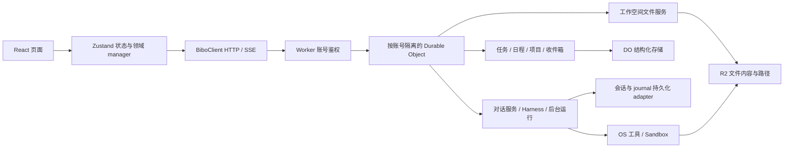

# Bibo 文件目录稳定性与现状架构

## 用户问题和直接证据

2026-09-30 用户报告 app.bibo.bot 文件目录中笔记闪现后消失，要求定位根因并掌握架构。附件为文件页目录树，显示 `.config`、`.gh-log`、`.local`。

线上 R2 只读核对：对应工作空间有 150 个条目，按服务端 `zh-CN` 路径排序，前 100 项只属于上述三个隐藏目录；正在编辑的 `笔记/功能演示 - 清单.md` 位于第 142 项，185 字节，仍存在。未读取或记录正文与凭据。

当前链路：`BiboWorkspaceStore.listDescendants → BiboWorkspaceFileService.collect/list → file.list → readSpaceLists → BiboSpaceOwner.files → FileTree`。打开文件另经 `file.get + ancestorOf → openedFileState` 把文件及祖先合并进 files；load(files/notes) 再用全空间第一页替换 files。请求版本按 view 分开，files/notes 却写相同 files。聊天 committed 及后台恢复重放 committed 会调用 refreshAfterChat，因而刷新可在用户未主动刷新目录时发生。

已证实的根因是把全空间分页窗口当作目录树的完整真相，打开文件的补充结果与列表替换没有一致合同。隐藏工具目录会放大此问题。文件被删除、R2 与旧容器轮流成为事实源没有得到证据支持；现有文件 API 直接使用 R2。

## 现状架构与归属

目录修复发生在 State 和 Files 两端：服务端提供目录直接子项，前端维护每个目录的投影。R2 仍保存文件事实；没有增加第二套文件内容存储。

- React 页面消费 Zustand。BiboSpaceOwner 拥有目录、笔记、打开文件与草稿状态，BiboChatOwner 拥有对话状态；BiboClient 拥有 HTTP/SSE。
- Worker 验证共享平台账号，按已验证用户 ID 路由到账号 Durable Object。
- Durable Object 的 BiboSpaceActionService 编排领域操作；任务/项目/日程/收件箱由 BiboSpaceService 和 DO 结构化存储持久化。
- 文件内容和路径的唯一事实源是账号隔离的 R2 workspace keys；BiboWorkspaceFileService 提供产品文件动作。笔记是这些文件的分类，不是另一套存储。
- 对话执行经 DO 中的 BiboConversationService/NextclawHarness，会话与 journal 由 Cloudflare platform adapter 保存。BiboRunService 持有后台运行和订阅。
- 只有 OS 工具使用 Cloudflare Sandbox；显式挂载的目录映射同一 R2。临时 /workspace 不持久化。截图中的隐藏目录来自持久工作空间，具体生成工具尚未逐一归因。

服务端有明确 owner；本问题是 UI 投影合同失配，不能据此断言整个架构都失控。另一个可核查风险是原全空间列表每一页重新扫描整个空间，不适合作为目录浏览主链路。

## 使用链路和选择

用户登录进入文件页，系统加载根目录直接子项，显示笔记目录与根文件；用户展开文件夹，加载它的直接子项，在该文件夹内翻页。打开笔记、切到笔记列表再返回、聊天完成刷新，已加载目录和已打开文件保持稳定。读取失败保留已有内容并在对应目录显示重试。面包屑目录浏览使用同一动作与状态。

选按目录懒加载，复用 workspace.list 的 R2 delimiter 和 opaque cursor。拒绝前端加载全部 150/更多条目的方案，因为工具目录会持续增长；拒绝仅把打开文件强行留在第一页的补丁，因为其他未打开笔记仍不可发现。

## 实现合同

1. file.list 的 parentPath（空字符串表示根）选择直接子项模式，不与全空间 query/kind/ancestorOf/sort 混用；游标透传 R2。已有检索和笔记动作保留。
2. BiboSpaceOwner 的 Zustand store 保存目录状态；FileDirectoryManager 是目录读取、展开、搜索与分页的唯一动作 owner，按 parentPath 管理分页、加载、错误和请求版本。files 是加载过的目录节点集合，不是全空间第一页。files/notes 不再分别替换同一集合。树与面包屑直接调用 manager，不新增同名转发。
3. 每次目录刷新重读已加载页数，完成后原子替换对应目录的子项；保留其它目录。完整目录响应可删除已消失的子项与其子树；分页未完成时保留未覆盖的已知节点，避免把未返回误当删除。迟到响应不覆盖新请求/账号。
4. 展开文件夹、面包屑浏览、恢复展开目录调用同一目录动作。目录分页按钮位于对应文件夹；根分页留在根。全空间搜索和笔记分页仍由原动作消费。
5. 文件写入后刷新相关已加载目录；移走/删除的旧路径不得因缓存继续可见。打开文件仍保存独立详情/草稿，但不承担整棵树的读取事实。

本轮不改数据存储、账号权限、模型工具执行或已有文件，不隐藏/清理用户工具目录，不增加资源服务或轮询。无需数据迁移。

## 验收与交付

- 修前回放：150 项、前页隐藏工具文件、笔记位于后页；打开笔记后刷新导致树中笔记消失。
- Worker/R2 集成：根只返回直接子项，深层 100+ 文件不吞根笔记；目录游标、空目录、非法路径、已有全空间搜索/最近笔记保持有效。
- Store：根/子目录刷新、迟到响应、files/notes 并发、已加载多页、真实删除、账号切换和失败重试。
- 浏览器：桌面与手机文件页，展开/翻页/笔记切换/刷新/面包屑与保存恢复；线上只读复验实际账号目录和受保护测试账号的相关路径。
- 匹配三份 tsc、Vite 构建、维护性与提交治理检查。按 Bibo 默认授权精确提交、合入远程 master，从冻结远程 master 部署 Worker（不更换 Sandbox 镜像），线上复验后主线回流。

design-document: required；plan: not-required（单批）。方案 Review 核对了目录完整性、分页删除边界、并发 owner 和面包屑消费者，无开放 findings；通过范围为上述合同。

实施审查修订：现有 space store 的 415 行已超出 400 行预算，目录实现不继续扩大该 owner。目录请求和已有搜索收敛到 FileDirectoryManager；局部搜索同样验证账号和请求版本。重新审查后这一边界有树与面包屑两个真实消费者，维护真实目录生命周期，优于仅迁移无状态 helper。存储事实源和验收范围不变。
