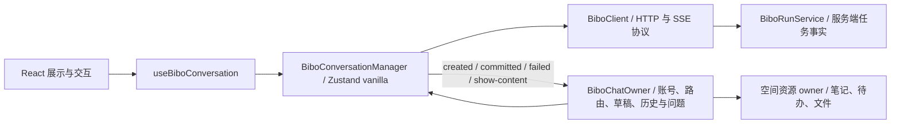

# Bibo 会话任务状态职责设计

日期：2026-10-01。状态：Design Ready。风险：L3（前端状态、异步订阅、刷新持久化）。
工作记录与验收进度：[current-state](../work/2026-10-01-bibo-conversation-state/current-state.md)。
前置合同：[产品愿景](../VISION.md)、[原任务生命周期设计](2026-09-30-bibo-run-recovery.design.md)。

## 用户目标与范围

来源是本次会话的截图及持续纠偏：运行中刷新后错误显示“上次生成中断”；用户要求解释真实原因、一个清晰简单的业务状态封装、薄 hook、完善的设计文档、落地及充分验证，并特别重视可维护性。Bibo client 必须保留接口层职责。笔记、待办等只核对相邻功能没有回归，不扩大为统一业务 SDK，也不迁移运行协议。

这次交付包括方案、前端实现、回归验证和 Bibo 已授权的上线闭环。`design-document: required`；一个批次可闭环，`plan: not-required`。

## 已确认的根因与证据边界

旧 `BiboChatOwner.bootstrap()` 读到本地 pending 后，先用最后两条消息的文字和时间猜测任务是否保存；未猜中就还原输入并显示 interrupted，之后才调用 recovery.sync 查询服务端。所以“尚未查到”被提前解释成“已经失败”。用真实 store、延迟 runState 响应复现了 interrupted → generating → committed；线上已部署 JS 存在同一顺序。

同一会话 `8867b6dc-8035-4fb3-ae43-afe775a4dad9` 的日志证实任务 `98e473d5-b163-47fd-b440-e794c5dc8741` 在 2026-09-30 23:21:54—23:24:35（北京时间）运行并持久化成功，约 161 秒。采样日志不能证明截图具体刷新时刻或所有历史运行均正常。前端错误判定已被独立复现，无需靠历史日志猜测。

服务端已有事实源：用户 Durable Object 内的 BiboRunService 接收、执行、保存任务状态；GET runs 读取，events 首帧 snapshot 后持续推送，终态重放 committed/error。浏览器断开只关闭订阅，显式 cancel 才停止任务。继续复用该主链路。

## 采用的架构与 owner



| Owner | 唯一职责 | 不持有的职责 |
|---|---|---|
| BiboRunService | 任务事实、运行和终态；接收幂等；订阅快照 | 页面草稿、展示 |
| BiboClient | HTTP 请求、SSE 解析和协议类型 | 业务状态、重试决策、React |
| BiboConversationManager | 任务投影、发送锁、待确认请求关联、状态查询/订阅/重连、取消、本地发送凭据生命周期 | 登录、路由、笔记/待办业务、React/DOM 事件 |
| BiboChatOwner | 用户/会话列表/选中会话、历史稳定标识、草稿与失败输入、问题交互；消费业务结果刷新空间 | runId、partial、phase、恢复推断、SSE 事件分发 |
| useBiboConversation | 连接稳定 manager 的 Zustand store；提供只读任务视图 | 网络编排、第二套状态、业务 effect |
| BiboApp | 浏览器可见性/pageshow/online 等外部系统同步 | 任务失败判断、重发策略 |

本地 manager 使用 Zustand vanilla store 存业务状态；app store 装配一个稳定 manager 实例，组件通过薄 hook 订阅。无需新增包、factory、proxy 或转发 presenter。未来有真实第二个消费者时才评估拆包。

选择该边界，优于仅改 bootstrap 的先后顺序（保留 task 状态分散在两处），也优于强制接入通用 agent 协议（改变服务端协议、迁移和验证面远超本问题）。保留现有历史/账号/空间 owner，删除旧 recovery store 与所有 app task 字段和文本匹配 runWasSaved 路径。

## 核心 API 与状态

文件位于 `apps/bibo-hosted/src/features/chat/`：

```text
managers/bibo-conversation.manager.ts       # 状态 + 任务业务意图 + 连接生命周期
managers/bibo-conversation.manager.test.ts  # 外部行为和异步竞态
hooks/use-bibo-conversation.ts             # React 接入
stores/bibo-chat.store.ts                  # 应用业务 owner
components/...                            # 只消费视图和意图
```

Manager 公开只读 `store`（getState/getInitialState/subscribe）、`bindAccount(userId)`、`connect(selectedSessionId?)`、`reconnect()`、`send({sessionId,message,question?,previousLastAt?})`、`stop()`、`dispose({discardInput?})`，并提供纯展示投影 `displayMessages(history, selectedSessionId)`。调用方只能订阅和表达业务意图，不能 setState。`send` 同步占用发送锁且保存输入凭据后才进行任何 await；空会话的创建也归它编排，通过 created 业务结果交回 app 更新导航。重复点击不能创建两次。账号显式清空使用 discardInput；普通卸载保留凭据，方便刷新查询确认。

内部状态只保留 `run: BiboRunSnapshot | null`、`submission`（尚未接收或本地问题上下文）、`connection: checking | ready | reconnecting`、`starting`、`stopping`、稳定的 pending 展示 IDs。run 的 phase/id/partial/activity 不再复制到 app store；busy、phase、可停止、任务会话 ID 都由一次纯投影导出。starting 只是请求前的本地发送锁，stopping 只是取消意图，不推断服务端已经取消。

集成到 4099f573a 主干时保留既有消息分块和时间合同：delta 继续调用 client 公共 `appendBiboTextBlock`，partialBlocks 存在 canonical run 内；展示投影生成已有 content 卡片，不把分块状态留回 app。未确认输入的 submittedAt 是本地提交时间，权威快照返回后使用 startedAt；历史 ID 继续复用原 `chat-message.utils` owner。界面保留已上线的紧凑状态图标，checking 只有中性的可访问名称/提示，不能回退成多条状态栏。原问题、空间能力及底层 client 业务边界不变，受影响方案复审通过。

本地 `bibo-pending-{userId}` 只保存请求凭据及失败时可返还的输入，不能证明运行/失败/已保存。新凭据保留 `clientRequestId`、会话、消息及 question 完整引用；复用原键，逐字段安全解析，缺少完整问题引用时以既有 questionId 定位问题。没有请求 ID 的无效凭据不作失败判断。凭据生命周期归 manager，app 不再自行读写或比较文字判断保存。

业务结果通知只有 created、confirmed、committed、failed、show-content；token 和连接事件不透出 app。confirmed 仅在先前未确认请求后来被权威确认时，交回 app 清除该输入的旧提示与返还草稿（保留后来编辑的草稿）。committed 附任务会话与 pending IDs，app 更新正确历史、问题、会话列表，刷新空间；后台会话不能污染当前会话。历史 owner 使用会话结果版本拒绝覆盖晚到的旧 history 响应。failed 携带真实失败或未确认输入上下文，app 只还原该输入，不覆盖用户后来编辑的草稿。

## 主链路、不变量与恢复

1. 刷新：确认账号 → 读取列表/选中历史 → manager 读本地请求凭据 → GET 服务端状态 → 订阅对应 run，snapshot 替换部分文本 → committed 完整替换历史。查询前是 checking，没有失败文案，没有自动重发。
2. 发送：同步加锁 → 必要时创建会话 → 保存请求凭据 → 一次 POST chat → accepted/snapshot 确认身份 → delta/saving → committed → 清凭据并更新 app 历史。网络错误先 GET 确认，绝不自动再 POST。
3. 重连：保留已知 run/partial，连接状态变为 reconnecting → GET → 接回同一 run 或取得终态。服务端不可达持续保持未知和 busy，退避自动重试；浏览器 online/pageshow 提供主动重查入口。
4. 取消：只有可取消的已确认 generating run 才 POST cancel；成功请求不当作终态，等服务端 failed/committed 确认；保存期不允许取消。取消请求异常先重新查询并将操作错误交回 app 的交互反馈，不能因此还原失败输入或认定任务结束。

所有异步请求、订阅回调、取消响应均使用同一个连接代次校验；账号切换、dispose、新订阅替换后旧结果不能写入。退避定时器归 manager，dispose 必须清理。manager 不读取 DOM/网络在线变量；重试本身用网络调用确认，浏览器事件在 app 层接入。重复 reconnect 合并同一个在途查询；显式切换连接上下文时旧查询作废。

接收关联使用 clientRequestId，而不是消息文字或旧终态。丢失 accepted 时匹配的服务端 run 继续接回；不匹配则保留输入并说明“未得到接收确认”，不能消费旧 completed 作为本次成功。查询得到真实 failed 才显示服务端的错误原因。明确 failed 的用户主动重试使用新 ID；接收仍不确定时保留原凭据，用户重发相同会话/输入/问题/历史位置复用该 ID，利用服务端 active-run admission 与已保存 receipt 避免晚到接收导致重复执行。没有自动 POST 重试。

历史读取与任务快照可能交错：有活动任务时投影视图隐藏本次 startedAt 之后的历史，并用稳定 pending 行显示；订阅终态 committed 提供完整权威结果一次替换，防止 delta 累加重复。已完成任务也通过既有终态重放获得 committed。同一 run 终态在同一实例只消费一次；切换历史仍由 history API 提供结果。查询—订阅窗口内结束由服务端同步注册 snapshot/终态重放覆盖，不新增第二个恢复接口。

旧 pending 结构只作输入凭据读取，不再保留 runWasSaved 兼容路径；无法解析的本地记录丢弃且不解释为任务失败。既有 questions、空间内容打开、账号隔离都沿原 owner，只有任务结果通知的入口改变。

show-content 归本次任务的结果：manager 在单次订阅内按 event ID 暂存去重，只有 committed 后交给空间 owner。错误/断流时丢弃该订阅的暂存内容，重连由权威终态重放提供结果。这样不会提前展示未保存产物，也不会对重复事件读取两次文件；不修改资源打开/文件 owner。

## 验收合同与黄金使用链路

| ID | 必需行为 | AI 证据 |
|---|---|---|
| BCS-01 | 运行中刷新，保留 pending，延迟查询仍无 interrupted/失败草稿；随后展示当前任务和最终结果，无重复 POST | manager 回归 + 桌面/移动浏览器 |
| BCS-02 | 无本地记录新开页面也能接回活动任务；完成后刷新不重复结果 | 同一浏览器脚本 |
| BCS-03 | 断网/查询失败保持未知且禁止重复发送，恢复后继续同一任务 | manager + 浏览器断线/online |
| BCS-04 | accepted 丢失匹配 ID 能取得保存结果；旧任务不能冒充新请求成功 | manager 真实 BiboClient/fetch fixture |
| BCS-05 | 真实 failed 显示原错误并保留输入；刷新后取消只发一次 cancel，不把断线当停止 | manager + 浏览器 |
| BCS-06 | 账号/dispose/连接切换和迟到取消响应不串状态；新会话双击只创建/发送一次 | manager 异步门控 |
| BCS-07 | 草稿不被覆盖、问题答案失败可重试、committed 更新正确会话；show-content 和空间刷新仍工作 | app/browser 相邻回归 |
| BCS-08 | 业务 run 状态只有 manager owner；client 无 React/业务恢复；hook 无状态编排；旧路径删除 | tsc、diff-only 自动检查、主观职责审查 |
| BCS-09 | 构建、上线及授权合入主干闭环 | package 测试/tsc/build、部署和线上 smoke |

黄金链路 A：在合成测试账号发送任务 → 运行时刷新（保留本地记录并延迟 GET）→ 只能见中性查询/已有运行状态，无中断提示和自动返还输入 → 状态返回后能见进度并等待完成 → 历史只有一对结果；再次刷新仍一致。fixture 秒级确定性完成，线上模型链路允许最多 10 分钟。

黄金链路 B：运行中断开连接 → 页面保留已知进度并禁止重复发送 → online 事件触发 GET/订阅 → 获得完成结果；另一次运行在刷新后点停止 → 等待服务端确认 → 显示真实停止原因并保留输入，主动发送可开始新的任务。

黄金链路 C：回答已有问题 → 失败时重新打开同一问题并保留答案，不覆盖新草稿 → 主动重试成功，问题状态及任务结果更新 → Bibo 发出 show-content 时仍打开正确空间文件。该链路复用既有问题/展示 smoke；不在用户真实会话发送测试消息。

技术正确性由 AI 验证；用户不承担安装、测试或排障。没有必须等待用户确认的审美项。移动验证以浏览器设备模拟为准，不能宣称物理 iPhone/原生网络验证。

线上黄金链路脚本为 `apps/bibo-hosted/scripts/chat/bibo-run-recovery-live.smoke.ts`：使用专门测试账号，一次真实 Agent 请求创建合成文件，在确认 generating 后刷新并延迟真实 GET；新开 390px 页面、同 runId 完成、history 不重复、show-content 打开、终态刷新及单次 POST 均检查。只清理本脚本创建的会话/文件。定向 fixture 继续覆盖确定性的断线、真实 failed、取消与竞态，不用线上模型人为制造这些故障。

集成回归定位了原主干 `BiboWorkspace` 漏接 FileEditor 的受控 preview 属性，导致已提交的 source 请求仍显示 HTML 预览。只补回原空间 owner → FileEditor 的 preview/onPreviewChange 连接，不增加文件业务状态；展示 smoke 的源码/预览切换和提交门因此均通过。全产品 smoke 另在文件树键盘导航即时焦点断言失败，该代码不属于本次修改，不能据此宣称全量产品测试通过。

## 剩余风险与非目标

服务端部署/实例重启、历史提交与任务终态分开持久化的崩溃窗口属于已有服务端合同，不是本次已复现前端误判的原因；不虚构已消除。继续显示权威失败，未来若有真实提交一致性故障按服务端 owner 修复。

不新增全局 SDK 包、通用重试框架、状态枚举平台、notes/todos manager、后端任务重启或统一 snapshot 接口。整个抽象只覆盖现在有消费者的聊天任务边界。新文件必要性是移走现有 owner 混杂，旧 recovery 被删除，没有平行恢复主链路。

## 方案 Review

mode=design：已从原截图、用户关于 client/业务层的纠偏和 BCS 合同独立走查。明确关闭了三项易漏反例：新会话 await 前加锁、明确失败重试必须新 request ID 而未确认请求保留 ID、completed 查询仍需要终态重放；覆盖账号/迟到回调与相邻问题、内容打开。实现期间补充检查了 GET 先于晚到 POST 接收的窗口，保留未确认凭据，复审受影响的 BCS-04/05 通过。相邻展示 smoke 暴露了旧入口缺少事件去重/提交门，按既有“未保存不展示”标准补充单订阅结果缓冲，BCS-07 受影响方案复审通过。没有开放的范围决定。`design-review: passed`，仅适用于本文前端任务边界，后端持久化一致性不在结论内。
