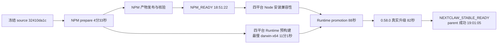

# NextClaw 0.59.0 正式发布

## 迭代完成说明

- 状态：核心正式发布完成（`NPM_READY`、`NEXTCLAW_STABLE_READY`），`CONTENT_PENDING`。用户授权发布正式版，采用常规产品范围 `target=product`，不含桌面安装包。
- 源基线：`c5449fc070d0ee7c7a4e6a8ad5736b58e0b5927e`；发布冻结提交：`045b319053ec366434cd14ced8371fd5f37a66f6`。
- 修复后冻结提交：`32410da1cc063b17de1b3c62ed76d9ec9b8e3871`；NPM release commit/tag：`f9d001a3adf76211f63b03bdc89ec85b8a69d2a2` / `nextclaw@0.59.0`，均已进入远程 master。
- 根因：此前 exact-commit prepare 因 Changesets 仍处于 beta pre 模式失败；父 workflow 在读取 stable 计划前又要求当前包版本已为 stable，阻断 beta 晋升。
- 证据：prepare run `37197760516` 的失败日志、退出 pre 后的真实 Changesets 计划（`0.59.0-beta.2 -> 0.59.0`）、执行 workflow 原始身份脚本的定向测试。
- 修正：使用 Changesets 原生 `pre exit`；身份 owner 允许正式版本计划承接 prerelease 源版本，仍拒绝活跃 pre 模式，并保持已发布 Desktop Draft 的恢复优先级。
- 主工作区的既存想法与设计草稿完全排除；本任务改动仅在隔离 worktree 中完成。

## 测试/验证/验收方式

- `actionlint .github/workflows/release.yml` 通过。
- `node --test scripts/release/release-action-environment.test.mjs scripts/release/release-stable.test.mjs`：41 项通过。
- 正式 dry-run：`0.58.0 -> 0.59.0`；34 个版本变更、28 个 NPM 发布包、42 个验证依赖包（14 个仅构建支持包）。
- 新代码治理与 backlog ratchet 通过。
- Prepare 随后暴露 kernel 的 39 个 lint 错误，集中在类型导入和测试字符串转义。已修复 4 个相关文件，并把已有 NodePlatform 深层导入改为 feature 公共入口；kernel 全 lint 错误清零（16 个既有警告）、依赖闭包构建、kernel `tsc` 和日志维护 5 项测试通过。
- 双语文档 VitePress 构建及 i18n 检查通过（170 对镜像页面）。
- Registry/payload/Git 验证、四平台 Node 20.19/22.19/24/26 真实安装与 SQLite 检查、Node 18 拒绝检查、四平台 Runtime、公开 manifest、从 `0.58.0` 检查/下载/应用更新及新进程版本核对：父 workflow 全部成功。
- `NPM_READY` 已于 2026-10-07 18:51:22（Asia/Shanghai）成立，registry 回读 `nextclaw@latest=0.59.0`；安装兼容矩阵、Runtime 与旧版升级仍等待终态。
- 文档部署 [37608882146](https://github.com/Peiiii/nextclaw/actions/runs/37608882146) 成功；国际/国内站均验证 source `32410da1c`、同一 tree `d9ba1f51f5b4b0043ffec57a0257c02f574c3e38ed26c9711f5f94031e8ae8d1`。公开 JSON 为 `version=0.59.0/channel=stable`、5 个 sections、CORS `*`。
- 公网 Linux manifest 独立回读：`latestVersion=0.59.0`、`minimumLauncherVersion=0.18.11`、`hostKind=npm-runtime-bundle`；更新说明指向本次英文笔记。父 workflow 验证覆盖全部四平台。
- GitHub Release `nextclaw@0.59.0` 为公开正式状态（非 Draft、非 prerelease），四个 `nextclaw-runtime-{darwin-arm64,darwin-x64,linux-x64,win32-x64}-0.59.0.zip` 齐全，双语正文由同一结构化 JSON 生成。
- parent 的最终 proof artifact：`feedback-release-0.59.0-f9d001a3adf76211f63b03bdc89ec85b8a69d2a2-product`；内容为 version `0.59.0`、sha `f9d001a3a`、target `product`、runId `37608949651`。

## 发布/部署方式

- `release.yml target=product expected_head=045b319053ec366434cd14ced8371fd5f37a66f6`，仅 dispatch 一次。
- Prepare：[37607717476](https://github.com/Peiiii/nextclaw/actions/runs/37607717476)。
- Parent：[37607749843](https://github.com/Peiiii/nextclaw/actions/runs/37607749843)。
- 首轮 prepare 在任何 NPM 上传前因 lint 失败，父运行取消；registry 确认 `latest=0.58.0`。修复后冻结新 source 并从原 owning entry 恢复，不重发已发布身份。
- 恢复后的 Prepare：[37608882772](https://github.com/Peiiii/nextclaw/actions/runs/37608882772)；Parent：[37608949651](https://github.com/Peiiii/nextclaw/actions/runs/37608949651)。
- NPM gate 耗时：从恢复 dispatch 18:40:24 到 18:51:22 为 10 分 58 秒，`time budget: missed`。NPM job 9 分 54 秒，prepared artifact 等待/下载/publish/registry/payload/Git 综合步骤 9 分 6 秒；NPM prepare 于 18:44:26 完成，不能把之后的全部等待归因于冷构建。当前 job 元数据未细分该综合步骤，不编造子阶段耗时。发布前 source 状态及类型导入已修正，后续 push 可按既有 prewarm owner 提前准备；本次不宣称已达到 60 秒目标。
- 恢复 parent 总耗时：18:40:24 至 19:01:05 为 20 分 41 秒；Runtime job 3 分 45 秒，其中发布/通道核验 88 秒（120 秒预算达标），真实旧版升级 82 秒。最慢 prepare cell 为 darwin-x64，18:44:30 至 18:55:31 共 11 分 1 秒；prepare 与 NPM/兼容验证重叠，无人工再跑成功平台。
- 主工作区因既存 tracked 草稿进入 `LOCAL_WORKTREE_RETRYING`；初始发布 worktree worker 为 PID `91470`，收尾在常驻主工作区调用同一 reconcile owner，复用其已有 worker PID `48757`，避免后台重试依赖临时 checkout。远程主线已包含源修复、NPM metadata 和发布记录；主工作区仍为 `master`，既存草稿保持原状。
- 内容补充在首轮 dispatch 后进行，不阻塞 NPM/Runtime；双语笔记与 JSON 已部署并公开核验。官网和 X 未发布，release surface review 未全闭合，保持 `CONTENT_PENDING`，不把核心发布成功写成全内容完成。
- `AUTOMATION_INTERVENTIONS: 1`：发布前退出 beta 模式并修复晋升判定属于准备；owner 运行后因 kernel lint 根因修复并更换 source，计 1 次。修复落在原 kernel 文件，晋升保护落在原身份 owner 和执行真实 workflow 脚本的回归测试中，无第二发布路径。

## 用户/产品视角的验收步骤

1. 安装 `nextclaw@latest` 并确认版本 `0.59.0`。
2. 打开会话列表：置顶会话跨刷新保留，定时任务会话可在独立视图查看。
3. 从上一 stable 检查、下载、应用 Runtime 更新并核对新进程版本；此步骤由发布验证 owner 在隔离环境执行。

## 可维护性总结汇总

- 沿用 Changesets、既有发布身份解析和父 workflow，不增加第二套发布入口。
- 自动维护性检查：无 errors/warnings；修改仅涉及身份判断、回归测试与发布元信息，不改变 package/owner 边界。
- kernel 修复的检查为 0 errors、1 warning：既有 kernel app 文件接近预算（327/400 行）。主观复核确认只新增命名类型导入，未增加职责、抽象或平行 owner，不为这次发布扩大拆分范围。
- planned-path preflight 用于双语更新笔记、结构化 JSON 和本记录。
- 复盘决定：发布晋升的系统性错误通过原身份 owner 与回归测试沉淀；lint 问题修回原产品文件，不新增提示词、规则或治理脚本。NPM 综合步骤超预算保留实际计时与证据限制，不以关闭验证门换取数字达标。

## NPM 包发布记录

需要发布：把既有 beta 能力晋升到 stable。父 workflow 的 NPM job 已完成 registry/payload/Git 验证；批次 28 个 public package，27 个包的版本元信息在 release commit 中发生变化，`@nextclaw/ncp-toolkit@0.6.28` 复用既有 stable 身份（单独 registry 回读 `latest=0.6.28`）。以下状态均为 stable 身份已发布/核验，Runtime 产品完成点另行记录。

| 包 | 正式版本 |
| --- | --- |
| nextclaw | 0.59.0 |
| @nextclaw/kernel | 0.19.2 |
| @nextclaw/ui | 0.27.5 |
| @nextclaw/core | 0.18.6 |
| @nextclaw/feishu-core | 0.3.14 |
| @nextclaw/harness | 0.2.28 |
| @nextclaw/ncp-agent-runtime | 0.4.28 |
| @nextclaw/server | 0.23.14 |
| @nextclaw/service | 0.7.8 |
| @nextclaw/client-sdk | 0.12.14 |
| @nextclaw/agent-chat-ui | 0.12.4 |
| @nextclaw/remote | 0.3.71 |
| @nextclaw/channel-extension-dingtalk | 0.2.55 |
| @nextclaw/channel-extension-discord | 0.2.55 |
| @nextclaw/channel-extension-email | 0.2.55 |
| @nextclaw/channel-extension-slack | 0.2.55 |
| @nextclaw/channel-extension-telegram | 0.2.55 |
| @nextclaw/channel-extension-wecom | 0.2.55 |
| @nextclaw/channel-extension-whatsapp | 0.2.55 |
| @nextclaw/mcp | 0.3.56 |
| @nextclaw/nextclaw-ncp-runtime-stdio-client | 0.3.56 |
| @nextclaw/runtime | 0.4.55 |
| @nextclaw/ncp-agent-runtime-next | 0.1.30 |
| @nextclaw/ncp-toolkit | 0.6.28（既有身份） |
| @nextclaw/nextclaw-ncp-runtime-adapter-hermes-http | 0.3.31 |
| @nextclaw/companion | 0.2.71 |
| @nextclaw/ncp-mcp | 0.2.56 |
| @nextclaw/nextclaw-narp-runtime-opencode | 0.2.56 |
