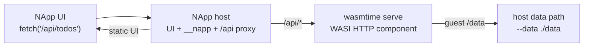

# NApp WASI Component TS HTTP 方案计划

## 背景

`@nextclaw/app-runtime` 已经具备 `napp create / inspect / run / pack / install / publish` 等独立 runtime/CLI 闭环，但旧的 `main` 模型主要是固定导出函数的 core Wasm demo。它更像 action bridge，不像普通前后端应用，也无法自然表达 Todo List 这类“前端调用后端 API，后端持久化数据”的基础应用。

新的方向不是推倒现有目录合同，也不是自研一套应用协议，而是在现有 `manifest.json + main/ + ui/ + assets/` 结构上，把 `main/app.wasm` 的主流后端语义升级为官方 WASI HTTP component。

## 方案判断

当前推荐并已落地的主路径是：

- 前端仍是普通 Web 前端，通过同源 `fetch("/api/...")` 调后端。
- 后端是 TypeScript/Hono 编写的 WASI HTTP component。
- TS 到 WASM 使用官方 Bytecode Alliance 路线：`wkg` + `jco` + `componentize-js`。
- 运行时使用 `wasmtime serve` 启动 component，再由 NApp host 把 `/api/*` 代理给 WASM 后端。
- 后端数据路径由运行时显式传入，host path 通过 `--data <path>` 挂到 guest `/data`。

这个方案最接近用户希望的轻量 Docker 心智：应用里仍然是“前端 + 后端”，后端运行在沙箱中，文件能力由启动参数决定，前端调用后端不需要学习新的业务桥接协议。

## 产品原则

NApp 应该尽量接近轻量 Docker app 的使用心智：

- 前端是普通 Web 前端，正常 `fetch("/api/...")` 调用后端。
- 后端是受 Wasmtime 沙箱约束的 WASI HTTP component。
- 出站网络默认允许，不引入默认域名白名单。
- 本阶段只实现运行时数据目录：`--data <host-path>` 挂载到 guest `/data`。
- `__napp/*` 只保留给 runtime 元信息、调试和宿主能力，不作为业务 API 主协议。
- 失败要显式暴露，例如缺少 `--data` 就直接报错，不通过隐藏 fallback 猜路径。

## 当前实现范围

本阶段已经完成最小可运行闭环：

- 保持现有目录结构不变。
- `manifest.main.kind` 新增 `wasi-http-component`。
- `napp create --template ts-http` 生成 TypeScript/Hono 后端模板。
- 模板使用官方 `wkg wit fetch`、`jco guest-types`、`jco componentize` 产出 `main/app.wasm`。
- runtime 使用 Wasmtime 启动 WASI HTTP component。
- NApp host 把 `/api/*` 请求代理给 WASM 后端，其它路径继续服务 UI 和 `__napp/*`。
- `napp run . --data <path>` 把指定 host path 挂载到 guest `/data`。
- Todo 示例已验证：后端写入 `/data/todos.json`，实际落在 `--data` 指定目录。

本阶段刻意不做泛化 `--mount`、`--publish`、数据库抽象、权限中心或更多 host capability。先把“普通 TS 全栈应用跑在 WASM 沙箱里”这条主链路跑通。

## 开发流程

```bash
napp create ./todo-app --template ts-http
cd ./todo-app/main
npm install
npm run build
cd ..
napp inspect .
napp run . --data ./data
```

前端代码保持普通 Web 心智：

```js
const todos = await fetch("/api/todos").then((response) => response.json());

await fetch("/api/todos", {
  method: "POST",
  headers: { "content-type": "application/json" },
  body: JSON.stringify({ title: "Buy milk" })
});
```

后端代码保持普通 HTTP handler 心智：

```ts
app.get("/api/todos", (context) => context.json(loadTodos()));

app.post("/api/todos", async (context) => {
  const input = await context.req.json();
  const todos = loadTodos();
  todos.push({ id: crypto.randomUUID(), title: input.title, completed: false });
  saveTodos(todos);
  return context.json(todos);
});
```

## 运行原理



NApp host 仍然是用户打开应用的入口。它负责服务 `ui/index.html`、保留 `__napp/*` runtime API，并把业务 API 请求转发给 Wasmtime 内部端口。Wasmtime 端口不作为应用对外主入口，开发者只需要面向同源 `/api/*` 编写前后端。

## 后续顺序

1. 把当前 `--data` 能力沉淀为稳定文档和发布包。
2. 增加通用 `--mount host:guest[:ro|rw]`，用于 Docker-like 文件暴露。
3. 增加对外端口暴露语义，例如 `--publish 127.0.0.1:8080` 或等价 manifest/CLI 合同。
4. 补齐安装态默认 app data 的开发体验，让已安装 app 不必每次手写 `--data`。
5. 在 Todo 示例之外增加一个需要出站网络的最小样例，验证网络默认可用。

## 非目标

- 不改现有 `main/ + ui/ + assets/` 目录合同。
- 不把 Rust 作为唯一后端语言。
- 不自研替代 WASI HTTP / WIT 的业务协议。
- 不默认限制出站网络。
- 不在本阶段实现 LLM、host UI、数据库服务抽象或复杂权限中心。
