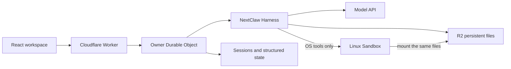

# Bibo

**Your personal AI workspace, with a real Linux sandbox and low infrastructure overhead.**

[中文](README.zh-CN.md) · [Try hosted Bibo](https://app.bibo.bot) · [Website](https://bibo.bot) · [Releases](https://github.com/Peiiii/bibo/releases)

Bibo brings conversations, notes, tasks, a calendar, files and an attention inbox into one workspace. Ask your agent to do something, inspect the result, edit it yourself, and continue working together.

The agent runs on Cloudflare's edge. A real, isolated Linux sandbox starts **when OS tools are used**: execute Python or shell commands, work with tools, and generate files. Ordinary chat, tasks and file operations do not need a container. Persistent files live in R2 and can be mounted into the sandbox; the temporary Linux environment can sleep without taking your personal files with it.


## Get started locally

Use Node.js 22.23.2 or newer and pnpm 9.15.1.

```sh
git clone https://github.com/Peiiii/bibo.git
cd bibo
corepack enable
pnpm install --frozen-lockfile
pnpm dev
```

Open `http://127.0.0.1:5188`. This is a credential-free UI preview with simulated chat, not a Linux sandbox or a real model. Use the Cloudflare deployment below for the complete product. The current interface is Chinese; model replies follow the user's language.

## Deploy your private Bibo

You need your own Cloudflare account with Workers Paid, Containers/Sandbox access and R2, plus a DeepSeek API key. Deployment is performed from your machine with Wrangler; no credentials are sent to the Bibo maintainers.

1. Edit `apps/bibo-hosted/wrangler.toml`: choose unique Worker/bucket names and set `BIBO_OWNER_EMAIL` to your login email. This edition is a **single-owner private workspace**; public registration is disabled.
2. Authenticate and create the R2 bucket using the same name as your configuration:

   ```sh
   pnpm -C apps/bibo-hosted exec wrangler login
   pnpm -C apps/bibo-hosted exec wrangler r2 bucket create bibo-personal-data
   ```

3. Set secrets interactively. Use a unique random owner password of at least 16 characters (32 or more recommended). Never put passwords or API keys in `wrangler.toml` or a `VITE_` variable.

   ```sh
   pnpm -C apps/bibo-hosted exec wrangler secret put BIBO_OWNER_PASSWORD
   pnpm -C apps/bibo-hosted exec wrangler secret put BIBO_DEEPSEEK_API_KEY
   # Optional web search:
   pnpm -C apps/bibo-hosted exec wrangler secret put BIBO_EXA_API_KEY
   ```

4. Run `pnpm deploy`, open the HTTPS `workers.dev` URL printed by Wrangler, and sign in with the configured email/password. To update, pull a release, install with the frozen lockfile and deploy again. Keep the Worker name, bucket name and Durable Object migrations when updating: those identify your saved data. Rotate `BIBO_OWNER_PASSWORD` to invalidate existing login sessions.

For local Worker development, put those secrets in gitignored `apps/bibo-hosted/.dev.vars`, then run `pnpm build`, `pnpm dev:worker` and `pnpm dev:proxy` in separate terminals. Local sandbox execution also requires Docker. `pnpm dev` remains a simulated UI preview.

## Try the full execution loop

- Ask Bibo to create a task, then find and edit it in Tasks.
- Ask: “Create a Markdown note summarizing our discussion, save it and open it.” Refresh and reopen the same file.
- Ask: “Use Python in your Linux sandbox to calculate the first 20 Fibonacci numbers. Mount my workspace and save the result as `fibonacci.txt`, then open that file.” Bibo uses `exec` and `mount_directory`; the saved file belongs to the same R2 workspace the UI reads.
- Refresh or leave the page while a task runs, then return to its conversation. The page subscribes to the server-owned run; leaving the page does not cancel it. Single runs are bounded to 10 minutes, and an interrupted server run is reported rather than silently replayed.

## Architecture



The web UI and agent share one domain action owner. Client transport/SSE parsing is provided by `@nextclaw/bibo-client`; agent execution uses the public [NextClaw Harness](https://github.com/Peiiii/nextclaw). No second agent loop is implemented here. `SOURCE.json` identifies the upstream source snapshot. This repository contains the Bibo app and its UI/client packages; public NextClaw packages are pinned NPM dependencies.

## Costs and limits

Bibo is designed for low overhead: no always-running container for ordinary work, on-demand OS execution, and a default five-minute sandbox idle timeout. **Low infrastructure overhead does not mean free hosting or free inference.** Pay Cloudflare for the plan, Worker/DO/storage usage and sandbox resources, and your model/search providers for their APIs. Check [Workers pricing](https://developers.cloudflare.com/workers/platform/pricing/) and [Containers pricing](https://developers.cloudflare.com/containers/pricing/).

This release uses `deepseek-flash`, up to 2,048 output tokens per model call; agent tasks can make multiple calls. It retains safeguards of 250 model calls per owner and 2,000 deployment-wide per UTC day, plus 100 chat runs per hour. Optional Exa search has separate limits. The sandbox is temporary: installed software, Git repositories and `/workspace` are reclaimed; only explicitly mounted R2 files persist. No universal monthly cost or production SLA is claimed.

## Development and contributing

```sh
pnpm typecheck
pnpm test
pnpm build
pnpm -C apps/bibo-hosted exec wrangler deploy --dry-run
```

See [CONTRIBUTING.md](CONTRIBUTING.md) and [SECURITY.md](SECURITY.md). Bug reports, deployment feedback and real use cases are welcome in [Issues](https://github.com/Peiiii/bibo/issues). Bibo is early-stage software; keep your own backups of important files. The hosted service and your self-deployment use separate accounts and storage.

## License

[MIT](LICENSE). Built on NextClaw; its copyright and license are preserved.
